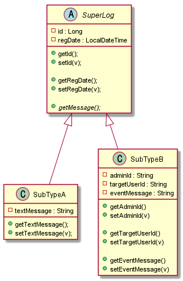
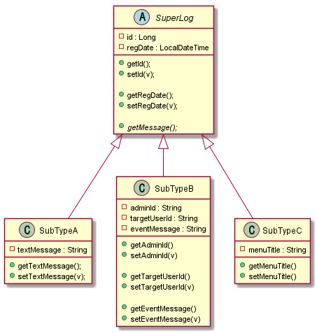
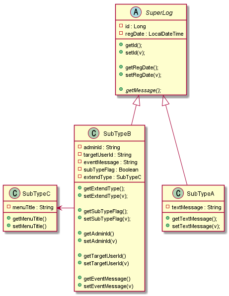
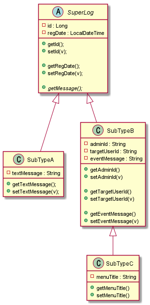
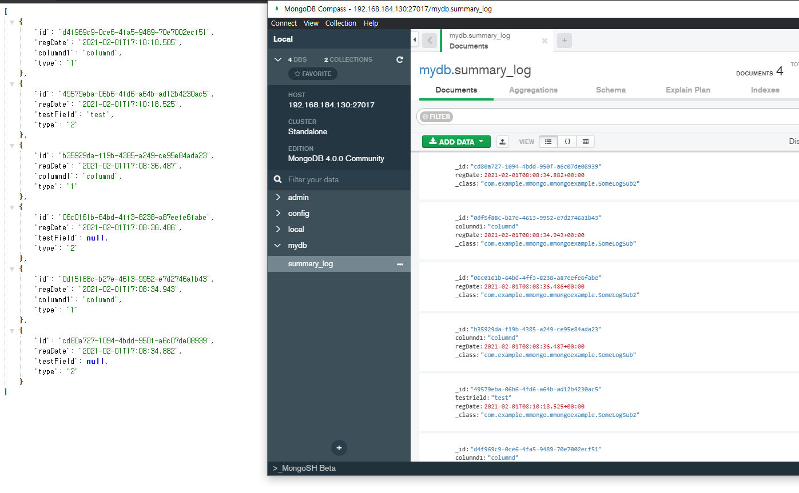
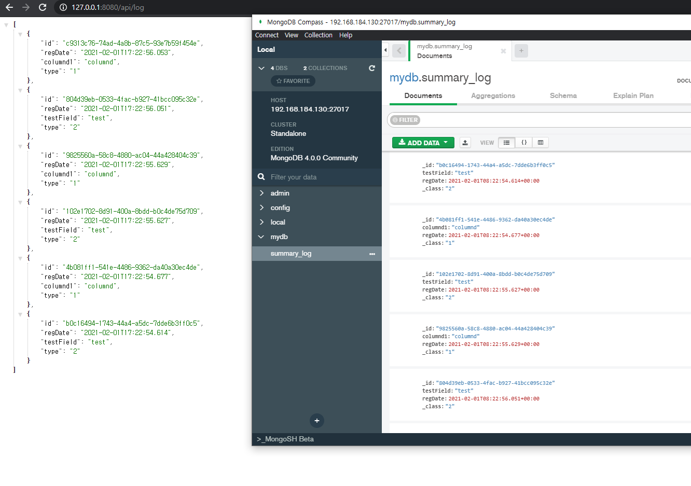
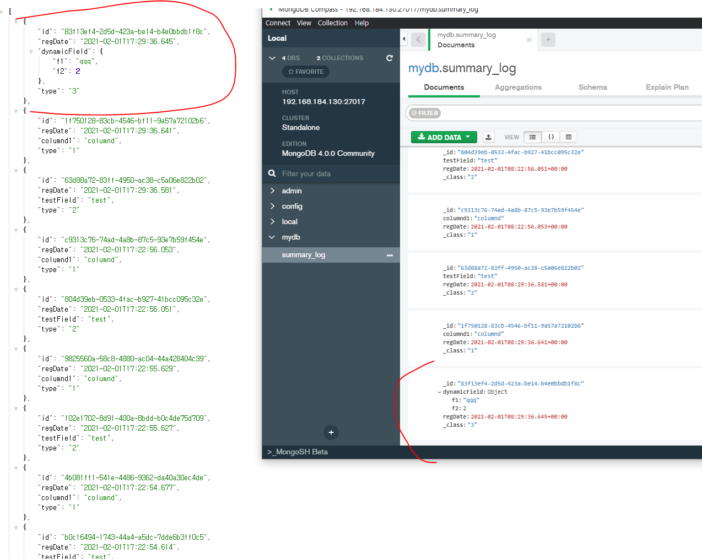
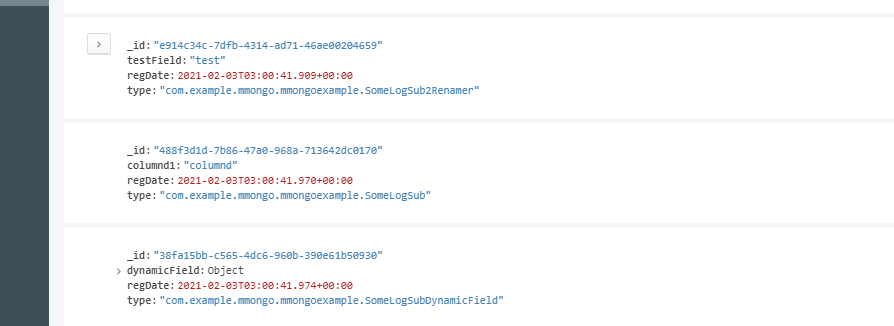
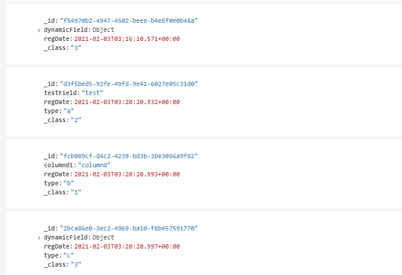

# 몽고DB 도입기

## 들어가며

몽고 DB는 신입 시절 때부터 들어봤던 친구이다. 당시에는 MEAN (몽고DB, 엘라스틱서치, 앵귤러, NODEJS) 스택이라는 이름이 유행한 적이 있었는데 이게 무엇인지는 자세히 몰랐고, 단순하게 이직을 희망하는 대기업의 채용공고 우대사항에 적혀 있는 단어더라 이 정도로만 관심을 갖고 있었다. 지금은 과거처럼 유행보다는 NOSQL 의 니즈를 느끼면서, 왜 이제서야 관심을 두게됬는지 회의감이 들 정도로 매우 관심을 두고 있는 친구이다.

현재 재직 중인 곳에서는 웹서비스에 개발에 영속성 메카니즘을 RDB 기반으로만 처리를 하고 있다. 사실 RDB 외에도 NOSQL 기반의 별도의 중앙 집중 로그 저장소 인프라가 준비 되어 있지만, 관제 용도나 사업 지표 통계  용도로만 사용중이고, 실제 서비스에서는 NOSQL 을 사용하고 있지 않다. 

RDB 를 사용하는 것은 아래의 이점이 있기 때문에 사용 중에 있다.

- 관계 구조를 가지는 정형화 데이터의 저장
- 복잡한 트랜잭션 지원
    - 로컬 DB기준으로 권한만 허락한다면 어떠한 스키마끼리도 트랜잭션을 걸 수 있고, 같은 벤더의 DB라면 원격 트랜잭션(DB 링크 등)이나 분산 트랜잭션(2PC 등)도 가능하다.

서비스 간의 복잡한 트랜잭션을 처리하기 위한 용도로 사용 되고 있다. 예를 들어서 어떤 게임 쿠폰은 사용하면 어떤 아이템 1개를 지급하고, 유저 재화 1000 게임머니가 지급된다는 비지니스 정책이 있다면, 이를 구현하기 위해 게임쿠폰 스키마와 유저 재화 스키마 그리고 아이템 스키마에 작업을 하고, 별도의 로그 테이블에도 유저의 이벤트를 기록해야한다. 복잡한 트랜잭션이란 이러한 여러 엔티티들이 얽힌 트랜잭션 처리를 말한다. 몇몇 서비스는 이러한 트랜잭션의 용이함을 위해서 여러가지 서비스의 각 도메인 DB를 하나의 통합된 DB에 셋업하고, 논리적으로만 나누어서 사용하기도 한다. 

최근에는 이와 같은 방법은 복잡한 도메인 정책을 풀어내기에는 한계가 명확한 방법을 하고 있다는 것을 피부로 느끼고 있다. MSA 와 DDD 를 알게 되면서 더욱, 이는 도메인 컨텍스트 간의 경계를 지어서 복잡성과 커플링을 제거하고자 함을 뜻하는 건데, 자세하게 연구해보고 다른 아티클에서 다루려고 한다.

### RDB 에서의 상속이란

RDB는 자료 구조를 확장하는 데에 제약 사항이 많다. 제약 사항에는 벤더나 환경에 따라서 달라질 수 있지만,   이 챕터에서는 구조화된 데이터 확장(상속)에 대해서 얘기하려 한다. 상속에는 추상화를 통한 확장을 빼놓을 수 없는 데, RDB 에서는 추상화란 개념이 없기 때문에 표현이 아니라 유사하게 흉내만 낼 수 있다.

예를 들어서 아래처럼 어떠한 상속 관계를 가지는 모델이 있다고 가정을 해보자.



RDB 에서는 위 상속 관계를 표현하기 위해서는 별도의 기능은 없다. 특히 #getMessage()와 같은 추상 메소드를 표현할 턱이 없다. 
위 다이어그렘에는 표현이 안되지만, 아래와 같은 추상 메소드 구현 로직을 RDB에서는 어떻게 표현할까?

```java

@Override
public String getMessage(){
    return super.getMessage() + "!!!!";
}

```

다만 객체 속성이 상속되는 점은 디자인 패턴을 통해 흉내를 낼 수가 있다. SuperLog 의 id 라는 속성과 regDate 라는 속성이 SubTypeA 와 SubTypeB 에 확장 되는 점 말이다. 

아래는 RDB에서 객체 속성의 확장의 표현 예시이다.

case 1) 싱글 테이블에서의 패턴

super_log_table

|id|regDate|type|textMessage|adminId|targetUserId|eventMessage|
|---|---|---|---|---|---|---|
|2 | 2018-01-01... | a| hello| null | null | null| 
|1 | 2018-01-02... | b| null| admin| userabc | submit message |

SuperLog 의 모든 집합을 쿼리
```sql
select * from super_log_table as t;
```

case 2) 정규화에서의 패턴

super_log_table

|id|regDate|type|
|---|---|---|
|2|2018-01-01...|a|
|1|2018-01-02...|b|

sub_type_a_table

|id|textMessage|
|---|---|
|2|hello|


sub_type_b_table

|id|adminId|targetUserId|eventMessage|
|---|---|---|---|
|1|admin|userabc|submit message|

SuperLog 의 모든 집합을 쿼리
```sql
select * from super_log_table as t 
    join sub_type_a_table as t2 on t.id == t2.id 
    join sub_type_b_table as t3 on t.id == t3.id;
```

RDB 에서 일반적으로 데이터나 행이라고 불리는 레코드들은 객체(클래스의 인스턴스)와 같다고 볼수있고, 레코드들은 테이블의 데이터 집합이니 테이블은 클래스에 빗대어 생각 해볼 수가 있다. 각 컬럼은 클래스의 속성(멤버변수 또는 필드)에 매핑해보면 개념 상 얼추 맞아 떨어진다.

자바나 자바스크립트에서는 객체가 어떠한 타입의 자료형(클래스 또는 함수)인지를 판단하는 원형 정보가 객체 안에 내장하고 있어서, instance of 와 같은 키워드로 객체의 원형정보를 유추할수가 있다.

다만 RDB 에서는 이러한 객체 원형 타입정보를 나타내는 것은 알 수 없기 때문에, 해당 레코드가 어떠한 자료형의 인스턴스(레코드) 인지를 나타내는 데이터 필드(컬럼)이 필요하다. 이에 해당하는 것이 ```type``` 이라는 이름의 컬럼이다. 

위 패턴에서 제시 된 예제에서는 type = a 는 SuperTypeA 의 인스턴스임을 나타내고, type = b 는 SuperTypeB 라는 자료형의 인스턴스임을 나타낸다. 사람에 따라서 type 필드 없이 필드들이 있는지 없는지로 판단하면 되지 않냐? 라고 생각할수 있다. 이런 경우 발생할수 있는 문제가 의도치 않은 실수나 정확한 타입의 속성정보를 알지 못하는 상황이 발생할수 있다. 예를 들면 위 사례에서 type 필드 없이, textMessage 가 null 이거나 "anotherType"이라는 값이라면 SubTypeB 일 것이다로 기준을 잡자고 보자, 어떠한 SubTypeA의 인스턴스는 textMessage 가 null 이거나 예상되지 않는 자료 값이라면, 이를 SubTypeB 라고 볼 것인가? 의 문제에 마주친다. 필드에 데이터가 없는 상황이 다른 자료형이라니? SOLID 의 SRP 관점에서도 생각이 들수도 있다. 그렇기 때문에 명시적으로 타입을 의미하는 구분 필드가 필요해진다. 

다만 어디까지나 이는 패턴을 통해 객체 상속을 RDB 상에서의 흉내를 한 것일 뿐이다.
싱글 테이블에서의 패턴에서는 모든 자료형을 하나의 테이블에 담으려고 하다보니, 마치 하나의 클래스에 다 넣은 모양새와 유사해지면서(객체지향 SOLID 에서 SRP 에 위배되는) null 이 도배되어 있는 모습을 볼수가 있다. 

만약 아래처럼 중첩 상속의 경우는 어떠할까?


자, SubTypeB <|-- SubTypeC 관계를 어떻게 표현해야할까?

만약 단순하게 생각해서 아래처럼 서브타입을 구분하는 Type 필드에 SubTypeC를 구분하는 c 라는 값을 넣어서 처리해보도록 해보자.

(정규화 케이스는 작성할 내용이 많아서, 편의상 싱글 테이블 기반으로 설명하겠다. 결과는 똑같다.)

super_log_table

|id|regDate|type|textMessage|adminId|targetUserId|eventMessage|menuTitle|
|---|---|---|---|---|---|---|---|
|3 | 2018-01-03... | c| null| admin| userabc2| submit message 2|  menu001|
|2 | 2018-01-01... | a| hello| null | null | null|  null|
|1 | 2018-01-02... | b| null| admin| userabc | submit message | null|

그러면 위처럼 표현이 가능해진다. 다만 여기서 SubTypeB의 자료형(확장 된 서브타입 포함)인 레코드만 추려내고자 한다면 어떻게 해야할까?

```sql
select * from super_log_table as t where t.type == 'b' and t.type='c';
select * from super_log_table as t where t.type != 'a';

```

이렇게 하면 될 것 같다.. 그런데 여기에 또 다른 SuperLog를 상속(확장)한 D..E..F 다른 클래스들이 나타난다면? 문제가 발생하거나 손이 번거로워질 것이다. 
즉 위 쿼리처럼 하드코딩을 하듯이 특정 타입을 짚어서 처리하게 되면 문제가 발생한다.

결국 위 테이블을 모델링으로 표현해보면 아래와 같음을 알수있다.



그럼 다른 방안은 없을까? 아래처럼 type 을 더 쪼개는 type 필드를 만들고 이는 type =='b' 인 경우에만 사용하는 식으로 한번 접근을 해보자.
이 경우 SubTypeB 인지 SubTypeC 인지에 대한 확장 타입을 구분하기 위해서 별도의 타입 구분을 나타내는 필드를 추가로 만들어야 한다. 아래에서는 subTypeFlag 라는 컬럼이 해당 필드이다.

아래는 2가지 방식으로 이를 표현해보았다, case 1 은 중첩 상속을 표현한 것이고, case 2 는 집약관계를 표현한 것이다.

#### case1


super_log_table

|id|regDate|type|textMessage|adminId|targetUserId|eventMessage|subTypeFlag|menuTitle|
|---|---|---|---|---|---|---|---|---|
|3 | 2018-01-03... | c| null| admin| userabc2| submit message 2| true | menu001|
|2 | 2018-01-01... | a| hello| null | null | null|  null|null|
|1 | 2018-01-02... | b| null| admin| userabc | submit message |false | null|


#### case 2




super_log_table

|id|regDate|type|textMessage|adminId|targetUserId|eventMessage|subTypeFlag|sub_type_c_id|
|---|---|---|---|---|---|---|---|---|
|3 | 2018-01-03... | c| null| admin| userabc2| submit message 2| true | 1|
|2 | 2018-01-01... | a| hello| null | null | null|  null|null|
|1 | 2018-01-02... | b| null| admin| userabc | submit message |false | null|

sub_type_c_table

|id|menuTitle|
|---|---|
|1 | menu001|


계속 이러한 작업을 하면서 느껴지는 게 있을까? 어떠한 자료 타입이 확장이 필요할 때, RDB의 컬럼을 게속 정의해나가야 하는 문제가 발생한다. 또한 복잡하게 얽힌 참조의 참조 구성은 성능적 오버헤드도 발생한다. 자바의 ORM 스펙인 JPA(On Hibernate) 에서는 이를 N+1 이라는 문제로 다루고 있다. 

반면 몽고DB와 같은 문서형 NOSQL 에서는 자유롭게 확장이 가능하다.

ps

혹시나 union 으로 풀수있지 않냐고 생각하는 사람이 있을 수도 있다. union 은 전혀 다른 타입의 지합들의 쿼리 결과를 단순하게 결합하는 개념이다.
SuperLog 의 하위 타입들의 모든 집합을 쿼리하고 싶다라고 한다면 불가능하다.  왜냐면 정규화처럼 하위타입이 슈퍼타입의 PK를 참조하지 않기 때문이다. 슈퍼타입의 PK를 참조 하지 않으면 union 으로 했을 때 각 엔티티의 고유성을 보장하지 못한다는 이야기이다. PK 가 같은 게 나올수 있기 때문!
예를 들어서 하위타입을 모두 포함한 SuperLog 의 엔티티들에 대해 PAGING 과 같은 쿼리를 날리려고 한다면 어떻게 해야될까?를 생각해보면 이해가 되리라 본다.


### RDB 와 NOSQL 의 다형성에 대하여

예를 들어 아래의 제네릭이 사용된 자료형이 있다고 가정을 해보자.
아래 자료형은 value 라는 속성을 추상화했다. value 속성의 타입은 제네릭으로 선언되어 런타임 시점에 값의 타입이 결정이 될수있음을 이해하여야 한다.

```java

public class SuperType<T>{
    private Long identity;
    private T value;
    
    public Long getIdentity(){
        return identity;
    }
   
    public T getValue(){
        return value;
    }
    
}

```

이를 RDB에서는 어떻게 표현할수있을까? 절대로 불가능하다. 이유는 RDB에의 필드에 해당하는 컬럼은 특정 자료형 단 하나만 고정이 되어야하며, 제네릭이라는 개념이 없다.
아래와 같은 경우 과연 RDB에서 에러 없이 가능할까? 

|identity|value|
|---|---|
|1|"String"|
|2|1|

이를 RDB에서 저장하기 위해서는 2진 바이너리로 저장을 하던지, 각 타입에 맞는 컬럼을 각기 선언하고, 어떠한 컬럼에 접근해서 데이터를 얻어야할지 추상화 하여야 한다. 

즉, 이를 자바 클래스로 표현하면 아래와 같다.

 
```java

public class SuperType<T>{
    private Long identity;
    private T value;
    
    public Long getIdentity(){
        return identity;
    }
   
    public T getValue(){
        return value;
    }
    
}

public class TextType extends SuperType<String>{
    private String textValue;
    private Integer type;
    
    @Orderride
    public String getValue(){
        return textValue;
    }
    
}

public class NumberType extends SuperType<Long>{
    private Long numberValue;
    private Integer type;
        
    @Orderride
    public String getValue(){
        return numberValue;
    }
    
}

```

|identity|type|textValue|numberValue|
|---|---|---|---|
|1|1|"String"|null|
|2|2|null|1|

RDB 는 이러한 객체 타입의 다형성을 표현할수가 없다. 반면 nosql 은 아래처럼 저장이 가능하다.

```javascript

[
    {
        identity : 1,
        type : 1,
        value : "string"
    },
    {
        indentity : 2,
        type : 2,
        value : 1
    }
]

```

이러한 다형성을 표현할수 있는 점에서 매우 강력하고 유연하다. 예시로 한 제네릭 개념으로 보아도, 기존 rdb 에서는 런타임 시점에 사용될 수 있는 모든 경우의 자료형에 대해 미리 테이블 구조를 만들어야 한다면, nosql 에서는 자료형 자체를 런타임 시점에 결정해도 저장할수 있는 강력한 다형성을 표현할수 있다.

위 예시에서 아래와 같이 배열 구조의 데이터나, 객체의 객체가 꼬리에 꼬리를 무는 데이터들이 생긴다면 어떨까?

```javascript


[
    {
        identity : 1,
        type : 1,
        value : "Stirng"
    },
    {
        indentity : 2,
        type : 2,
        value : 1
    },
    {
        identity : 3,
        type : 3,
        value : [
            {
                ...
            }
        ]
    }
]

```  

이러한 이유 등으로 대형 SNS 빅테크들에서 빠르게 확장할수 있는 유연한 구조와 대량의 데이터들을 샤딩 하기 위해 nosql 을 종종 쓰기도 한다.

심지어 이러한 다형성을 가지는 필드에 인덱스도 걸수 있다. 인덱스가 동작하는 원리에 대해서는 MongoDb 공식 문서[https://docs.mongodb.com/manual/reference/bson-type-comparison-order/](https://docs.mongodb.com/manual/reference/bson-type-comparison-order/) 를 참조하자.


RDB 와 NOSQL 은 각기 장단점이 있다.

RDB (관계형 데이터베이스)라는 이름 그대로 객체와 객체 간의 관계 정의와 관계의 원자성이 중요하다면 RDB 를 사용해 볼 수 있다. 다만 이 경우는 객체와 객체 간의 갖는 커플링 때문에 샤딩과 같은 분활 작업의 복잡도가 높아진다. 또한 정적인 구조에 따른 유연성이 부족해서 제약사항이 많다.

만약 객체와 객체 간의 연관 관계가 크게 중요하지 않다면 NOSQL이 더 적합할수 있다. NOSQL은 기본적으로 외부 문서의 id를 참조만 하는 식은 가능하지만, 단일 문서에서의 원자성만 보장하기 때문에 다른 문서 간의 복잡 트랜잭션은 불가능하다. 여담이지만 재직 중인 게임회사에서는 RDB 를 NOSQL 처럼 종종 쓰곤 했다. NOSQL 처럼 쓴다는 것은 FK 정의를 하지 않고 사용 하는 것을 말하는 데, 왜 이렇게 쓰냐고 물었더니 cascade 제약 조건 때문에 운영하기 까다롭다는 대답을 들었다. 정말 황당했는데, 관계에 따른 커플링이 부담스럽다면 NOSQL 을 쓰는 것이 맞다. 개인적으로 NOSQL 의 NO 는 NO Releation 의 의미를 가장 크게 두고 있다. RDB에서 정규화를 하고 보면 관계 에 놓여있는 집합이 서로 커플링에 놓이게 되고 이러한 부분이 RDB 를 정적으로 만드는 이유이기 떄문이다.

원자성이 매우 엄격하고, 다른 객체와의 참조구성이 중요한 메타데이터 성격의 데이터는 RDB에 저장하고, 그 외의 서비스에 소모되는 데이터는 NOSQL에 저장하는 것이 매우 좋다. RDB의 대표적인 예시가 포인트라는 개념이 적절하다.

유저의 총 보유 포인트라는 개념을 가지는 테이블과, 유저의 실제 보유 포인트 꾸러미를 의미하는 데이터의 집합이 있다면..

유저가 어떠한 포인트를 소비했을 때에는, 실제 보유 포인트 꾸러미에서 사용할수 있는 포인트를 삭감하고, 삭감된 기반으로 포인트를 다시 계산해서 총 보유 포인트에  최신 상태를 저장해야한다. 이런 경우는 유저의 상태 테이블과 유저 보유 꾸러미 2곳에서 원자성이 보장이 되어야 한다.  사실 이건 nosql 에서도 유저 포인트라는 문서를 만들고 그 안에 유저 총 포인트와 유저의 실제 포인트라는 필드를 나누어서 한 문서 안에서 표현을 해볼 수도 있다. 그런데 만약 유저A와 유저B가 같이 묶여서 계산되어야 하는 그룹 포인트(또는 가족 포인트) 라는 개념이 있다면 어떻게 될까? 이 경우 몽고DB는 4.0 이상 버전부터 다중 문서 트랜잭션을 지원하기 때문에 최신 버전이 아니면 불가능하다(https://docs.mongodb.com/master/core/transactions/#transactions-and-atomicity) 또한 다중 문서 트랜잭션이란, 같은 콜레이션 내에서의 트랜잭션을 의미한다. 즉, 다른 테이블 간의 트랜잭션을 지원하는 RDB와 달리 몽고DB에서 테이블을 의미하는 콜레이션에서는 다른 콜레이션 간의 트랜잭션이 되지 않는다. 

즉 이러한 이유로 몽고db 에서는 유저A와 유저B 가 같은 원자성으로 처리가 되어야하는 다중 복잡 트랜잭션의 경우에는 약한 모습을 가진다고 볼수있다. 일반적으로 이러한 경우는 rdb 에서 주요 비지니스 처리를 하고, nosql 에는 이벤트 소싱(이벤트가 발생할 당시의 데이터를 스냅샷)하는 아키텍처로 접근해 볼수도 있다.

```javascript
[
    {
        _id : "ASD1-DDK222K-3Q2Q2",
        timestamp : 10231923123,
        eventId : "201112323123-QWEASDD",
        event : [
            {version : 2, updateUsers : [ ... ]},
            {version : 1, updateUsers : [ ... ]}
        ]
    }    
]
```

### 그렇다면 이 문제를 nosql 로 한다면 어떻게 될까?


문서 기반의 NOSQL 인 몽고 DB를 처리하면 아래처럼 자유롭게 풍부하게 표현 할 수 있다.
다만 문서는 JSON 포맷을 띄고 있는데, 이 역시 자바의 타입을 구분하는 개념을 표현하려면 어떠한 서브타입인지를 구분하기 위한 타입 필드가 있어야 하는 것은 동일하다.
참고로 자바는 기본적으로 객체(클래스가 인스턴스화 될 떄) 가 생성될 때, 타입 원형 정보(클래스 정보)를 같이 가지고 있기 때문에 불필요하지만, JSON 에서는 이러한 타입 데이터가 없기 때문에 필요하다. 이는 RDB 에서도 NOSQL 에서도 데이터의 값으로 타입을 판단하기 위해서는 필요하다. 



```
[
  {
    "id": 1,
    "textMessage": "hello",
    "message": "hello",
    "type": "a",
    "regDate": "2021-02-03 17:59:07"
  },
  {
    "id": 2,
    "adminId": "admin",
    "targetUserId": "userabc",
    "eventMessage": "submit message",
    "message": "admin 가 userabc 에게 submit message .",
    "type": "b",
    "subTypeFlag": false,
    "regDate": "2021-02-03 17:59:07"
  },
  {
    "id": 3,
    "adminId": "admin",
    "targetUserId": "usbabc2",
    "eventMessage": "submit message2",
    "menutitle": "menu001",
    "message": "admin 가 usbabc2 에게 submit message2 ., 연관된 메뉴 타이틀은 menu001",
    "subTypeFlag": true,
    "type": "b",
    "regDate": "2021-02-03 17:59:07"
  }
]
```

만들어진 값으로의 데이터 만을 놓고 보면 몽고DB의 문서나 RDB의 레코드나 큰 차이가 없어 보인다. 다만 앞서 본 것처럼 RDB는 정의된 데이터만을 넣을 수 있기 때문에 컬럼을 꼭 생성해서 필드를 정의해주어야 값을 넣을수 있다. 싱글 테이블 패턴으로 할 경우 타입이 달라 null 값이 들어갈수 밖에 없으며, 이를 보완하고자 정규화를 하는 식으로 보완한다면 관리 포인트가 늘어나고 조회 비용이 증가하게 된다. 이는 RDB 가 관계형 데이터베이스라는 이름 그 뜻처럼 참조 구성으로 데이터를 저장하는 것을 권장하기 때문에 일어난다.

반면 문서기반 NOSQL 에서는 문서를 담는 하나의 콜레이션(RDB로 치면 테이블) 안에서는 문서의 필드를 자유롭게 필드 확장이 가능하다. 이는 관계를 맺는 방식이 아닌 하나의 문서 안에서 이미 관계 표현을 다 표현 하고자하는 컨셉이기에 가능하다. 이러한 컨셉이기에 파티셔닝에 용이하고, 문서는 외부의 변화에 닫혀있고 본인의 확장에는 열리게 되는 풍부한 자료 구성을할수 있게 된다. 다만 이 경우 콜레이션 간의 같은 개념의 필드가 있다면 값이 중복되거나 불일치하는 값의 관리 영역의 문제가 생길수 있으나, 콜레이션이 다른 콜레이션의 필드를 참조하는 구성도 가능은 하다. 


### 원격 수평 파티셔닝, 샤딩이 가능하다.

게임 서비스 기준이지만 다양한 조직에서 로그데이터란 매우 소중한 존재이다. 사업적 지표를 잡거나, 서비스의 대응이나 관리를 위해서 또는 시스템의 버그를 찾기 위해서 수도없이 만지고 주무르고 처다보는 것이 로그 데이터이다. 아마 다른 웹서비스들도 비슷하리라 생각한다.

사례를 예로 들어보면, 만약 여름맞이 게임 이벤트를 진행을 하고 있다고 가정을 하자.

이벤트 로그는 이벤트란 의미의 성격상, 이벤트가 발생하는 시점을 기준으로 최신 데이터의 접근 빈도 수가 높고 과거 데이터의 경우 대부분 의존도가 낮은 성격을 지닌다.

이렇다 보니 대부분의 로그 데이터 분석에는 최신 일자 기준으로 조회가 되는 특징이 많다. 여름 맞이 이벤트가 6월 부터 시작해서 9월까지 한다고 하면, 이벤트가 끝날 무렵에는 6월 데이터 보다는 9월 데이터를 더 많이 조회하게 된다. 이런 성격 탓에 RDB에서 대부분의 로그를 저장할 때에는 로그생성 시각을 의미하는 정수형 컬럼을 (BigInt 또는 DateTime) 내림차순 클러스터링 인덱스으로 설정하여 로그를 최신일자가 가장 최상위에 적재될수 있도록 구성을 한다. 클러스터링 인덱스는 데이터를 저장하는 정렬 기준을 의미한다. 보통은 오름차순으로 되어있기 때문에 적재한 데이터는 가장 밑바닥에 쌓이고 그 위로 점점 쌓이는 형태가 되고, 반면 내림차순으로 정렬하게 된다면 최신 데이터가 가장 상단에 쌓이는 형태가 된다. 이렇게 되면 쿼리가 실행될때 가장 최초로 접근하게 되는 포인터가 가장 최신 로그 데이터 기준으로 되기 떄문이다.

|로그번호|로그생성시각(클러스터링 인덱스)|데이터필드1|데이터필드2|
|---|---|---|---|
|9999|2020-09-25...|abc|def|
|9998|2020-09-24...|abc|def|
|...|...|...|...

여기까지는 별 문제가 없지만, 특정 유저의 CS 처리나 악용 어뷰징을 찾기 위해 과거 데이터를 조회하는 경우도 있다. 9월 이벤트가 끝나갈 무렵에 6월에 이벤트를 참여했던 유저의 CS 문의가 왔을 때에는 6월 데이터를 조회해야한다.

 
|로그번호(PK)|로그생성시각(클러스터링 인덱스)|데이터필드1|데이터필드2|
|---|---|---|---|
|9999|2020-09-25...|abc|def|
|9998|2020-09-24...|abc|def|
|...|...|...|...
|4501|2020-06-01...|...|...|

이런 경우 6월 데이터를 조회하기 위해서 9월 부터 8월, 7월.. 6월 이런식으로 포인터 커서가 움직이기 때문에 성능에서의 병목이 조금 생긴다. 

이런 경우에 고려해볼 수 있는 것으로 파티션이 있다. 수평 파티션, 수직 파티션 여러가지가 있는데, 위 기준에서는 로그생성시각을 기준으로 월 단위로 수평 파티션을 하면 좋다. 파티션은 물리적으로 파일을 분활하는 걸 말한다. 즉 월 단위로 수평 파티션을 한다는 말은, 테이블의 데이터가 1개의 파일에 저장되어 있다면, 이를 월 별(9월,8월,7월,6월)로 N개로 나누어 저장한다는 것을 말한다.
이렇게 되면 9월 데이터를 조회할때에는 9월 데이터파일에 접근하게 되고, 6월 데이터를 조회해야한다면 6월 데이터파일에 접근을 하면 되니 조회 포인터 커서가 낭비될 이유가 없다.  

자 여기까지 정말 할거 다 한거 같다. 다만 아직 문제가 하나 더 남아있다.

우리가 아무리 열심히 설계하고 개선을 하더라도 물리적인 문제가 발생한다면 막을 방도가 없다. 이 말은 소프트웨어 적으로 튜닝을 하더라도, 하드웨어의 문제는 해결못하는 한계점이 있다는 것이다.
즉 말하고 싶은것은 DB의 데이터가 저장되는 하드디스크라는 저장공간에 대한 이야기이다. 수평 파티션으로 아무리 파일을 작게 만들어서 조회를 용이하게 하더라도, 하드디스크 I/O 성능이 부족하면 병목이 발생한다. DB 사용자가 많아 DB의 하드디스크에 부하가 발생한다면 파티션도 다 의미가 없다는 이야기이다. 
예를 들어 9월 사용자 로그의 I/O 가 높아 대부분의 디스크 성능이 9월 데이터 파일에 쏠려 있는 상황이라면, 6월 데이터 조회를 시도할 경우 디스크 성능이 모두 9월 의 입출력에 모두 할당되어 있기 때문에 병목 상황이 발생하게 된다.

RDB 는 수평 확장(스케일아웃)에는 약하고, 수직 확장(스케일 업) 에 용이하도록 만들어져있다. 이유는 복잡한 트랜잭션의 원자성 보장을 위해서 모든 스키마가 하나의 로컬 PC(또는 서버)에서 관리가 필요하다. 생각해봐라, 테이블A(또는 데이터베이스A)와 테이블 B(또는 데이터베이스B) 간의 트랜잭션 처리를 해야하는 데, 테이블A는 네트워크적으로 떨어진 A서버에 테이블B는 B서버에 존재한다면.. 물리적으로 떨어진 곳의 제어를 위해서는 많은 리소스가 필요해지고 복잡도가 높아진다.

그래서 RDB는 클러스터링과 같은 원격 수평 확장을 지원하지 않고, 단순히 마스터-슬레이브의 미러 구성만 가능하다. 다시 돌아가서 파티셔닝으로도 해결하지 못하는 경우에는 결국 아래의 방안을 고려해야한다.

- 하드디스크를 SSD 로 교체
- 하드디스크를 여러대로 구성하고 각 파티션된 데이터를 각기 다른 하드디스크에 분산 저장

SSD로의 교체가 가장 기술적으로 쉬우나, 비용이 많이 들고 백업에 대한 고려를 많이 해야한다. 하드디스크를 여러대로 구성하는 방향도 적절하지만 기술적 복잡도가 높아진다. 

자 어찌되었던 위 2가지 방법 중 하나를 택하여 디스크 병목을 해결했다고 생각할수 있지만, 남은 것은 CPU 와 메모리 리소스의 부족이라는 마지막 관문이 남았다. 제 아무리 디스크가 좋아지더라도 컴퓨팅의 핵심인 연산기능에 리소스 부족으로 병목이 온다면 문제가 될수가 있다. 앞서서 얘기했지만 RDB 는 원자성을 위해서 스케일업이 용이한 구성으로 설계된 시스템이기 때문에, 이를 해결하려면 CPU 와 메모리를 매우매우 좋은 사양으로 스펙 업해야한다. 다만 이 경우에는 비용이 엄청나게 증가하고, 만약에 메모리가 500GB 나 필요하다는 말도 안되는 비지니스 요구상황이 생긴다면 해결할수도 없어진다.

그렇다면 여러 대의 PC(또는 서버) 를 하나의 DB로 논리적으로 묶어서 할수 있다면 어떨까? 
CPU 라는 머리가 하나 보다는 여러개가 있으면 상황에 따라서 연산을 적절하게 나눌수 있고, 디스크나 메모리 역시 각 개별적으로 자신의 리소스를 사용하면 병목을 최대한 줄일수있다.

NOSQL은 이러한 RDB 의 한계를 극복하고자 나온 RDB의 확장판으로 나온 녀석이다. 즉 위의 원격 수평 확장에 대한 대비책(클러스터링)도 마련이 되어 있다.


### 왜 몽고 DB를 선택했는가?

NOSQL에도 여러가지 타입이 있다. 

#### key value 캐시 스토리지 (redis 나 멤캐시) 

벨류는 어떠한 것도 저장할수 있고, 키를 기준으로 조회할수있다. 단 벨류를 기준으로 조회는 할수 없다. 단순하기 때문에 입/출력 속도가 가장 빠르고 클러스터링 구성하기가 가장 쉽다. 이런 특징으로 캐쉬 개념으로 자주 사용되는데, REDIS 는 백업 기능도 가지고 있다. 

- 문서 기반 NOSQL (몽고DB, 카우치db 등)
- 컬럼-패밀리 (hbase 카산드라 등)

#### 컬럼-패밀리

칼럼-패밀리를 문서로 접근해서 익히려 하면 매우 어렵다. 그런데 사실 우리는 이미 일상에서 유사한 업무를 이미 해본 개념이다.

필자의 경험담을 예시로 설명을 해보겠다.

자바로 치면 클래스라는 정적 기반의 자료형은 컴파일 된 시점이후에는 변경이 불가능한 특징이 있다. 이게 무슨 말이냐면 아래처럼 Board 라는 게시판 개념의 클래스가 있다고 가정을 해보자.  

```java
class Board{
    private String title;
    private String contents;
//    ...
}

```

여기서 사진게시판이라는 개념을 만들려면 아래처럼 Board 를 확장해야한다. 만약 댓글 게시판이라면 댓글게시판을 또 정의해야한다.
```java
class PictureBoard extends Board{
    private String imageLink;
}

class MusicBoard extends Board{
    private String musicLink;
}

```

imageLink 라는 속성과 musicLink 라는 속성이 게시판에 추가만 하면 되는데, 자료형을 설계(클래스 정의)해야한다. 업무 메카니즘이 비효율적인 것 같다는 생각이들지 않을까? 

만약 아래처럼 사진뮤직게시판이 추가된다면 어떻게 될까? 모든 게시판에서 사진 기능이 있는 경우 이를 통합해서 검색하고 싶다는 요구사항이 나오면 어떻게 될까?

그래서 필자가 생각했던 방법은 클래스 속성을 동적으로 핸들링 하기 위해서 속성을 의미하는 어트리뷰트라는 자료형을 만들고 아래처럼 표현하고자 했다.

```java
class DynamicBoard extends Board{
    private List<Attribute<?>> attributes = new ArrayList(); 
   
}

class Attribute<T>{
    private String name;
    private T value;
};

```

자 이런 모델링을 하고, 위의 사진게시판이나 뮤직게시판 사진뮤직게시판을 표현해보자.

```
DynamicBoard musicBoard = new DynmicBoard();
musicBoard .addAttribute("musicLink","http:///");
musicBoard .setTitle("title1");


DynamicBoard pictureBoard = new DynmicBoard();
pictureBoard.addAttribute(new Attribute("imageLink", "http://...."));
pictureBoard.setTitle("title2");
...

DynamicBoard pictureMusicBoard = new DynmicBoard();
pictureMusicBoard.addAttribute(new Attribute("imageLink", "http://...."));
pictureMusicBoard.addAttribute(new Attribute("musicLink", "http://......");
pictureMusicBoard.setTitle("title3");
...
``` 

위처럼 동적으로 표현해볼수있다. 이는 자바스크립트의 객체와 매우 유사한 형태를 가진다. 이렇게 하면 동적으로 굳이 클래스를 정의하지 않고 새로운 개념을 계속 확장해나갈 수 있다. 다만 이 경우에는 모든 게시판에서 사진을 검색하고 싶어요를 표현하기에는 어렵다. 이유는 Attribute 가 사진 인지, 음악 인지에 대해서 구분할 수 없으며 같은 집합의 참조구성으로 되어 있지 않고 파편화 되어있기 때문이다.

아래처럼 변경을 해보자.

```java
class DynamicBoard extends Board{
    private List<AttributeAndValue<?,?>> attributes = new ArrayList(); 
   
}

class AttributeAndValue<V>{
    private Attribute<V> attribute;
    private V value;
}

class Attribute<V>{
    private Integer id;
    private String name;
    private Class<V> valueType;
};

```

```
Attribute<String> imageAttribute = new Arrtibute<>(1,"imageLink",String.class);
Attribute<List> musicAttribute = new Arrtibute<>(2,"music",String.class);
 
 DynamicBoard musicBoard = new DynmicBoard();
 musicBoard.addAttribute(new AttributeAndValue(musicAttribute, "...happy.wav");
 musicBoard.setTitle("title1");

DynamicBoard pictureBoard = new DynmicBoard();
pictureBoard.addAttribute(new AttributeAndValue(imageAttribute, "http://naver.com..."));
pictureBoard.setTitle("title2");
...

DynamicBoard pictureMusicBoard = new DynmicBoard();
pictureMusicBoard.addAttribute(new AttributeAndValue(imageAttribute, "http://kakao.."));
pictureMusicBoard.addAttribute(new AttributeAndValue(musicAttribute, "...powerful.wav" );
pictureMusicBoard.setTitle("title3");
...
``` 

이렇게 되면 게시물 중에 각 게시물들이 같은 속성을 사용하고 있음을 알수 있는 참조관계가 되기 때문에, 모든 댓글을 검색하거나 모아보고 싶을떄에는 어트리뷰트 id가 2인 어트리뷰트를 참조하는 AttributeAndValue 의 집합을 뒤져보면 찾아볼수가 있다. 이것을 RDB 로 표현하면 아래와 같다.

DynamicBoardTable

|게시물번호|타입|제목|내용|AttributeAndValueTabler게시물번호|
|---|---|---|---|---|
|3|musicPicture|title3|...|3|
|2|music|title2|...|2|
|1|picutre|title1|...|1|

AttributeAndValueTable

|식별번호|게시물번호|AttributeTableID|속성의값|
|---|---|---|---|
|10|3|1|http://naver...|
|9|3|2|...happy.wav|
|8|2|2|...powerful.wav|
|..|..|..|.....|

AttributeTable

|id|이름|값타입|
|---|---|---|
|1|imageLink|String|
|2|musicLink|String|


이러한 연관관계에 있는 엔티티 관계 모델이 있다면, 모든 Board의 속성들에 대한 질의나 통합 검색을 쉽게 생각해볼수있다.

참고로 엔터프라이즈 아키텍처 패턴에서는 이를 xxx 패턴이라고 한다 (지금 기억 안남, 로버트 마틴 의 책에 있었던 거로 기억)


이러한 개념을 확장해서 구체화 한 것이 컬럼-패밀리 NOSQL 이다.

컬럼-패밀리는 객체의 속성(멤버변수 또는 필드)이라고 하는 속성에 대해서 주된 관심사를 가진다.
속성은 컬럼이고, 패밀리는 클래스에 대입 해보면 이해하기 쉽다.

즉, 만들고자 하는 자료형을 우리가 먼저 정의하고 속성을 붙이는 것이 아니라, 어떠한 속성들을 모앗더니 이러한 자료형으로 부를수 있지 않을까? 로 생각보는 것으로 접근하면 쉽다.

우리가 사람은 눈도 있고 코도 있고 입도 있고 팔도 있어요 이런식으로 개체를 먼저 생각하고 속성을 떠올리는 데, 칼럼 패밀리로 모델링을 할 때에는, 눈도 있고 코도 있고 팔도 있는 건 사람이라고 하자. 이런 식으로 접근하게 된다. 그래서 별거 아닌데, 어렵게 느껴지는 것이다. 

결국 컬럼-패밀리는 컬럼을 먼저 정의하고 이를 논리적으로 묶어서 패밀리라는 이름의 데이터 형식으로 표현하는 것이다. 


- 그래프 
 
 
#### 왜 몽고 DB인가?
 
- 한 때 MEAN 스택이라고 대유행 했던 만큼 풍부한 레퍼런스가 너무나 많다.
- 문서는 JSON 형식의 데이터 셋을 저장하기 때문에, 데이터 확장이 유연하고 상속 표현도 용이하다.
- 테이블에 대응 되는 콜레이션 안에서 트랜잭션을 지원한다. 단 다른 콜레이션간의 복합 트랜잭션은 지원하지 않는다.
- RDB의 정규식과 유사하게 콜레이션 간의 참조 구성을 할수 있다. (RDB로 치면 FK) 이는 데이터의 파편화를 막기 위한 패턴을 의미한다.
- 각 필드에는 인덱스를 걸수가 있다.
- 복제 클러스터링을 비롯해서, 샤딩 클러스터링 (파티션 클러스터링)을 지원한다.


이 이야기는 몽고DB를 구축하고자 진행하면서 인프라 관리자와 얘기를 하면서 나누었던 내용 중 일부이다.

어플리케이션의 이벤트 로그를 저장하려한다고 설계 방향을 잡았고, 구축하기 위해 인프라 및 데이터베이스 관련 담당자들과 대화를 나누었었는데, 별도의 신규 몽고DB를 구축하지 말고 기존의 통합 로그 저장소에 저장하면 어떻냐고 물어봤다.

통합 로그 저장소는 비표준 데이터를 다 저장해주는 데이터 웨어하우스의 개념과 유사한데, 정형화 되지 않은 단순 텍스트 로그를 저장하면 추후에 별도의 배치 프로세스를 통해 가공하여 조회할수 있게 하는 시스템이다. 

샤딩이나 복제 클러스터링과 같은 기능은 지원하지만, 우리가 원하는 특정 데이터만을 위한 쿼리가 어렵고, 인덱스를 지원하지 않아 조회 성능이 따라주지 않는다.  

NOSQL 은 원격 샤딩에 대해서도 고려를 하고 있다.

물론 모든 타입의 NOSQL 에서 지원하는 것은 아니다. 여기서 타입은 벤더가 아닌 문서기반 or 키벨류 기반 의 타입을 말한다.


## 샘플

https://github.com/glqdlt/example-mongo

샘플 클래스 다이어그램


```
package com.example.mmongo.mmongoexample; 
import org.springframework.data.mongodb.core.mapping.Document; 
import java.time.LocalDateTime;  
@Document(collection = "summary_log") 
public abstract class SomeLog { 
    private String id; 
    private LocalDateTime regDate = LocalDateTime.now(); 
    public abstract String getType(); 
    public String getId() { 
        return id; 
    } 
    public void setId(String id) { 
        this.id = id; 
    } 
    public LocalDateTime getRegDate() { 
        return regDate; 
    } 
    public void setRegDate(LocalDateTime regDate) { 
        this.regDate = regDate; 
    } 
}


package com.example.mmongo.mmongoexample; 
public class SomeLogSub extends SomeLog { 
    private String columnd1; 
    public String getColumnd1() { 
        return columnd1; 
    } 
    public void setColumnd1(String columnd1) { 
        this.columnd1 = columnd1; 
    } 
    @Override 
    public String getType() { 
        return "1"; 
    } 
}


package com.example.mmongo.mmongoexample; 
public class SomeLogSub2 extends SomeLog { 
    @Override 
    public String getType() { 
        return "2"; 
    } 
    private String testField; 
    public String getTestField() { 
        return testField; 
    } 
    public void setTestField(String testField) { 
        this.testField = testField; 
    } 
}
```


REPOSITORY

```
public interface SomeLogRepo extends MongoRepository<SomeLog, String> { 
    List<SomeLog> findAllByRegDateBetween(LocalDateTime from, LocalDateTime to); 
    List<SomeLog> findTop1000ByOrderByRegDateDesc(); 
}
```

저장은 아래처럼 쉽게 처리가 된다.
매핑 정보를 _class 필드에 담아서 저장이 되고, 이를 읽을때에는 묵음 처리한다.




RDB 기반의 JPA 에 비해 상속 구조 표현이 매우 쉬워진다.

다만 예외사항이 있다

- 추상 클래스인 SomeLog  를 저장하고 싶다면 몽고DB에 저장은 되지만, 저장된 것을 다시 자바로 읽어들이게 될 때는 문제가 발생한다. 읽어들이는 과정에서 저장된 문서(mongo document)를 추상클래스를 구현한 익명 클래스의 인스턴스로 매핑을 시도하는 데, 추상클래스의 추상 메소드를 익명클래스에서 어떻게 구현해야 할 지 판단이 안 서기 때문에 매핑 불가능 에러를 내뿜는 걸 볼 수 있다.


- 
- 
- 
```
2021-02-01 17:18:29.382 ERROR 16912 --- [nio-8080-exec-4] o.a.c.c.C.[.[.[/].[dispatcherServlet]    : Servlet.service() for servlet [dispatcherServlet] in context with path [] threw exception [Request processing failed; nested exception is org.springframework.data.mapping.MappingException: No property this$0 found on entity class com.example.mmongo.mmongoexample.SomeController$1 to bind constructor parameter to!] with root cause 
org.springframework.data.mapping.MappingException: No property this$0 found on entity class com.example.mmongo.mmongoexample.SomeController$1 to bind constructor parameter to!
```

- _class 에 저장되는 클래스정보가 실제 컴파일 클래스와 매칭이되지 않는다면(클래스명이 변하는 등) 매핑 에러가 발생한다.
```
2021-02-01 17:16:04.593 ERROR 11728 --- [nio-8080-exec-1] o.a.c.c.C.[.[.[/].[dispatcherServlet]    : Servlet.service() for servlet [dispatcherServlet] in context with path [] threw exception [Handler dispatch failed; nested exception is java.lang.InstantiationError: com.example.mmongo.mmongoexample.SomeLog] with root cause 
java.lang.InstantiationError: com.example.mmongo.mmongoexample.SomeLog 
	at com.example.mmongo.mmongoexample.SomeLog_Instantiator_v611k8.newInstance(Unknown Source) ~[classes/:na] 
	at org.springframework.data.mapping.model.ClassGeneratingEntityInstantiator$EntityInstantiatorAdapter.createInstance(ClassGeneratingEntityInstantiator.java:238) ~[spring-data-commons-2.4.3.jar:2.4.3] 
	at org.springframework.data.mapping.model.ClassGeneratingEntityInstantiator.createInstance(ClassGeneratingEntityInstantiator.java:87) ~[spring-data-commons-2.4.3.jar:2.4.3] 
	at org.springframework.data.mongodb.core.convert.MappingMongoConverter.read(MappingMongoConverter.java:344) ~[spring-data-mongodb-3.1.3.jar:3.1.3] 
	at org.springframework.data.mongodb.core.convert.MappingMongoConverter.read(MappingMongoConverter.java:317) ~[spring-data-mongodb-3.1.3.jar:3.1.3] 
	at org.springframework.data.mongodb.core.convert.MappingMongoConverter.read(MappingMongoConverter.java:250) ~[spring-data-mongodb-3.1.3.jar:3.1.3] 
	at org.springframework.data.mongodb.core.convert.MappingMongoConverter.read(MappingMongoConverter.java:246) ~[spring-data-mongodb-3.1.3.jar:3.1.3] 
	at org.springframework.data.mongodb.core.convert.MappingMongoConverter.read(MappingMongoConverter.java:98) ~[spring-data-mongodb-3.1.3.jar:3.1.3] 
	at org.springframework.data.mongodb.core.MongoTemplate$ProjectingReadCallback.doWith(MongoTemplate.java:3214) ~[spring-data-mongodb-3.1.3.jar:3.1.3] 
	at org.springframework.data.mongodb.core.MongoTemplate.executeFindMultiInternal(MongoTemplate.java:2796) ~[spring-data-mongodb-3.1.3.jar:3.1.3] 
	at org.springframework.data.mongodb.core.MongoTemplate.doFind(MongoTemplate.java:2550) ~[spring-data-mongodb-3.1.3.jar:3.1.3] 
	at org.springframework.data.mongodb.core.ExecutableFindOperationSupport$ExecutableFindSupport.doFind(ExecutableFindOperationSupport.java:220) ~[spring-data-mongodb-3.1.3.jar:3.1.3] 
	at org.springframework.data.mongodb.core.ExecutableFindOperationSupport$ExecutableFindSupport.all(ExecutableFindOperationSupport.java:163) ~[spring-data-mongodb-3.1.3.jar:3.1.3] 
	at org.springframework.data.mongodb.repository.query.AbstractMongoQuery.lambda$getExecution$1(AbstractMongoQuery.java:148) ~[spring-data-mongodb-3.1.3.jar:3.1.3] 
	at org.springframework.data.mongodb.repository.query.AbstractMongoQuery.doExecute(AbstractMongoQuery.java:132) ~[spring-data-mongodb-3.1.3.jar:3.1.3] 
	at org.springframework.data.mongodb.repository.query.AbstractMongoQuery.execute(AbstractMongoQuery.java:107) ~[spring-data-mongodb-3.1.3.jar:3.1.3] 
	at org.springframework.data.repository.core.support.RepositoryMethodInvoker.doInvoke(RepositoryMethodInvoker.java:137) ~[spring-data-commons-2.4.3.jar:2.4.3] 
	at org.springframework.data.repository.core.support.RepositoryMethodInvoker.invoke(RepositoryMethodInvoker.java:121) ~[spring-data-commons-2.4.3.jar:2.4.3] 
	at org.springframework.data.repository.core.support.QueryExecutorMethodInterceptor.doInvoke(QueryExecutorMethodInterceptor.java:152) ~[spring-data-commons-2.4.3.jar:2.4.3] 
	at org.springframework.data.repository.core.support.QueryExecutorMethodInterceptor.invoke(QueryExecutorMethodInterceptor.java:131) ~[spring-data-commons-2.4.3.jar:2.4.3] 
	at org.springframework.aop.framework.ReflectiveMethodInvocation.proceed(ReflectiveMethodInvocation.java:186) ~[spring-aop-5.3.3.jar:5.3.3] 
	at org.springframework.data.projection.DefaultMethodInvokingMethodInterceptor.invoke(DefaultMethodInvokingMethodInterceptor.java:80) ~[spring-data-commons-2.4.3.jar:2.4.3] 
	at org.springframework.aop.framework.ReflectiveMethodInvocation.proceed(ReflectiveMethodInvocation.java:186) ~[spring-aop-5.3.3.jar:5.3.3] 
	at org.springframework.aop.interceptor.ExposeInvocationInterceptor.invoke(ExposeInvocationInterceptor.java:97) ~[spring-aop-5.3.3.jar:5.3.3] 
	at org.springframework.aop.framework.ReflectiveMethodInvocation.proceed(ReflectiveMethodInvocation.java:186) ~[spring-aop-5.3.3.jar:5.3.3] 
	at org.springframework.aop.framework.JdkDynamicAopProxy.invoke(JdkDynamicAopProxy.java:215) ~[spring-aop-5.3.3.jar:5.3.3] 
	at com.sun.proxy.$Proxy59.findTop1000ByOrderByRegDateDesc(Unknown Source) ~[na:na] 
	at com.example.mmongo.mmongoexample.SomeController.aa(SomeController.java:34) ~[classes/:na] 
	at sun.reflect.NativeMethodAccessorImpl.invoke0(Native Method) ~[na:1.8.0_275] 
	at sun.reflect.NativeMethodAccessorImpl.invoke(NativeMethodAccessorImpl.java:62) ~[na:1.8.0_275] 
```


위 이슈를 해결하기 위해서는 타입 매핑 처리를 별도로 해주어야한다. 
https://docs.spring.io/spring-data/data-mongodb/docs/current/reference/html/#mongo-template.type-mapping

@TypeAlias 를 통해 _class 필드에 들어갈 값을 별도로 정의해도 된다.

만약 _class 필드 이름조차 바꾸고 싶다면, DefaultMongoTypeMapper 를 구현해서 특정 필드값에 따른 서브타입을 매핑할수있도록 정의해주어야한다.

아래는 타입알리아스 어노테이션 기반 처리 방법이다. 추상메소드 #getType() 에  @TypeAlias 하고 똑같이 되는 게 아닌 점을 주의하자.

```
@TypeAlias("1") 
public class SomeLogSub extends SomeLog { 
    private String columnd1; 
    public String getColumnd1() { 
        return columnd1; 
    } 
    public void setColumnd1(String columnd1) { 
        this.columnd1 = columnd1; 
    } 
    @Override 
    public String getType() { 
        return "1"; 
    } 
}
```



만약에 동적으로 처리해야하는 경우가 있다면
아래처럼 처리해야한다, id 라는 문서의 식별값이 꼭 있어야 하는 데이터 구조가 mongodb 의 제약사항임으로 Map자체를 저장할수는 없다.
또한 Map의 키는 항상 string 이어야한다. 이는 json 의 규약이다.

```
@TypeAlias("3")
public class SomeLogSubDynamicField extends SomeLog {

    private HashMap dynamicField = new HashMap();

    public HashMap getDynamicField() {
        return dynamicField;
    }

    public void setDynamicField(HashMap dynamicField) {
        this.dynamicField = dynamicField;
    }

    @Override
    public String getType() {
        return "3";
    }
}

```



참고로 캡처 상의 결과에서 regDate 값이 다르다고 느껴질 것이다.  눈치 빠른 독자들은 알겠지만 몽고Db가 설치된 도커 환경에는 UTC로 타임존이 설정되어있다. 반면, 자바 웹앱은 나의 개발 PC 기준으로 KST (+09:00)로 처리가 되기 때문에, 2개의 시간이 다르게 보여지는 것처럼 보일 뿐이다.


타입매핑을 하는 필드이름이 _class 인 것 때문에 마음에 안들 수도 있다.


아래처럼 진행하면 가능은 하되, 이 경우 다른 문제가 생긴다.
```
@Configuration 
public class MongoSetup { 
    @Autowired 
    public void mappingMongoConverter(MappingMongoConverter mongoConverter) { 
        mongoConverter.setTypeMapper(new DefaultMongoTypeMapper("type")); 
    } 
}
```



- @typeAlias 어노테이션으로 타입 매핑이 불가능하게 된다. 위 캡처처럼 기본형인 클래스 네임스페이스가 저장이 된다.

원래 setTypemapper(); 메소드 내용을 보면 힌트를 얻을 수 있다.
```
public void setTypeMapper(@Nullable MongoTypeMapper typeMapper) { 
		this.typeMapper = typeMapper == null 
				? new DefaultMongoTypeMapper(DefaultMongoTypeMapper.DEFAULT_TYPE_KEY, mappingContext) 
				: typeMapper; 
	}
```

포인트는 매퍼가 없다면 new DefaultMongoTypeMapper(DefaultMongoTypeMapper.DEFAULT_TYPE_KEY, mappingContext) 생성자를 호출해서 기본형을 넣는데,  MappingContext 라고 하는 매핑을 어떻게 해야할지가 정의된 컨텍스트를 넣어주지 않았기 때문이다.
아마도 어노테이션 기반의 처리 해석기가 스프링 부트 자동 설정 상에서 등록이 되는 것으로 보여지는데, 만약 내가 커스텀하게 한다면 이를 메뉴얼로 다 연결을 해주어야 한다.

- type 필드는 도메인 상에서의 공통 된 규약 언어이기 때문에,  단순 정수나, 단어 또는 문장이 될수 있으며 자바 언어에서는 이를 처리할수도 없을수 있다.
	- 이를 자바 언어 상에서 해석하려면 해석기를 다 만들어주어야 한다.
	- 이를 곰곰히 생각해보면 결국 맨 처음에 예시안 처럼 type 필드를 별도로 두어서 도메인 공통 언어에 해석할수있도록 별도 저장하고 _class 필드는 자바 언어 해석기를 보유한 시스템만 이를 사용하도록 하게 한다. 다행히 _id 처럼 private 접근이라는 개념의 접두어가 있음으로 이 규약은 한눈에 파악이 된다.





원래는 #getType() 처럼 추상메소드로 +setType()은 없이 처리하고자 했는데, 

type 필드가 저장이안되어서 여러가지 실험을 했다.

- private 멤버 변수는 저장이 된다.
- get set 이 있는 pojo 의 속성은 저장이 된다.

결국은 type 키워드를 강제화 하기 위해서 아래처럼 생성자를 두었다, 참고로 JPA에서는 이게 안되지만 mongodb 는 되더라 (jpa 는 #get() 추상메소드는 되지만 반대의 상황)
```

@Document(collection = "summary_log")
public abstract class SomeLog {
    private String id;
    private LocalDateTime regDate;
    private String type;

    public void setType(String type) {
        this.type = type;
    }

    public SomeLog(String type) {
        this.type = type;
    }

    public String getType() {
        return type;
    }

    public String getId() {
        return id;
    }

    public void setId(String id) {
        this.id = id;
    }

    public LocalDateTime getRegDate() {
        return regDate;
    }

    public void setRegDate(LocalDateTime regDate) {
        this.regDate = regDate;
    }
}

```


## 정렬 쿼리는 INDEX가 있는 키에만 동작을 한다.

조회 쿼리를 날렸을 때, order by 와 같은 정렬 구문을 쓰기도 한다.

몽고DB도 그런지 모르지만, cosmos db에서는 index가 잡혀있지 않으면 order by 가 동작하지 않는 이슈가 있었다.

공식 문서를 찾아보니, 위 이슈와 관련된 내용이 있었다. (https://docs.microsoft.com/ko-kr/azure/cosmos-db/sql-query-order-by#remarks)

> ORDER BY절을 사용 하려면 정렬 중인 필드에 대 한 인덱스를 인덱싱 정책에 포함 해야 합니다. Azure Cosmos DB 쿼리 런타임은 계산 된 속성이 아닌 속성 이름에 대 한 정렬을 지원 합니다. Azure Cosmos DB는 여러 ORDER BY 속성을 지원 합니다. 여러 ORDER BY 속성을 사용 하 여 쿼리를 실행 하려면 정렬할 필드에 복합 인덱스 를 정의 해야 합니다.

