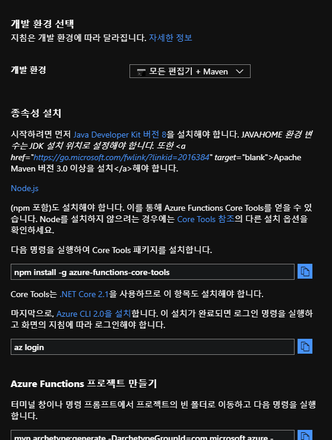
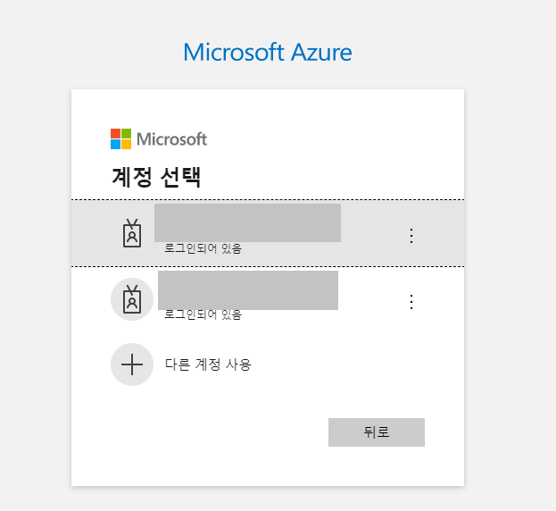
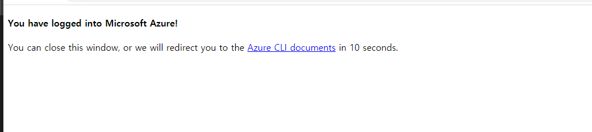
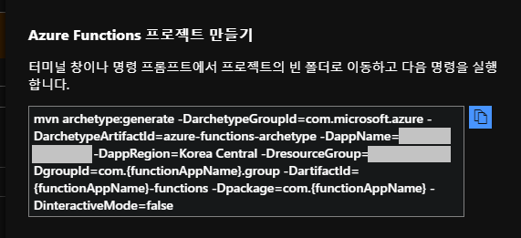
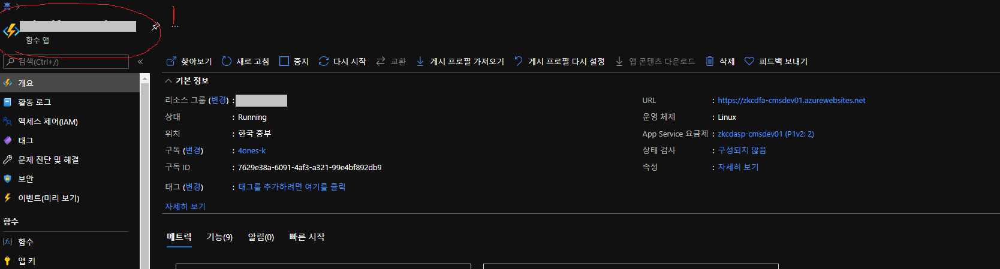
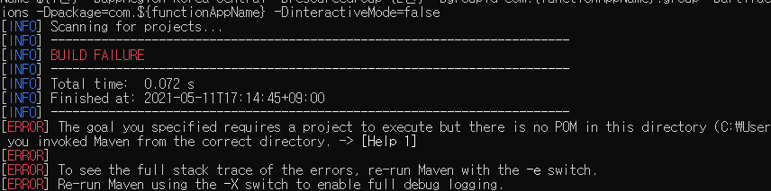
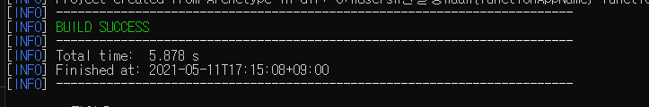
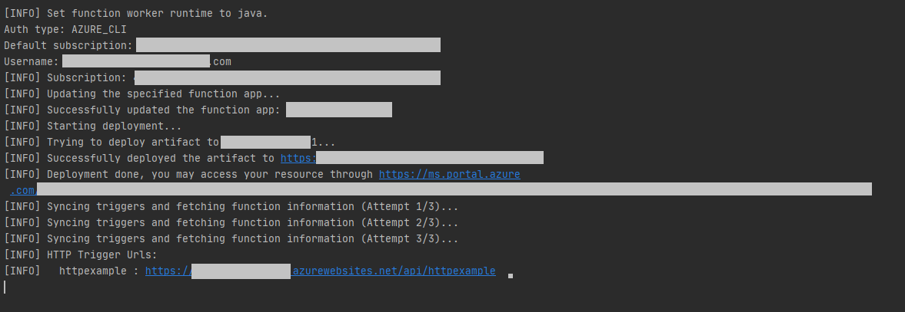

Azure 클라우드에서 서버리스 설계의 경험을 기록한다. 

본 아티클에 나오는 소스 코드 원본은 모두 깃허브(https://github.com/glqdlt/ex-azure-functions.git)에서 확인할수있다.


# Azure 서버리스 솔루션 비교

Azure 에는 서버리스 모델이 굉장히 많다. 개념 잡는 거야 서버리스 컴퓨팅에 대한 것만 이해하면 쉽게 할수있다지만 

다양한 모델을 두고 어떠한 것을 선택해야할지 학습곡선이 높다. 

심지어 문제는 유사한 이름이 많아서 이게 이건가? 저게 저건가? 하면서 고생을 많이 했다.

Azure 에서는 서버리스 컴퓨팅을 Azure Functions 라고 부르는데 여러가지 모델들이 있다. 

정리해보면 아래 도표처럼 정리해볼수있다, 이름이 비슷한것들이 참 많다.


### Azure Functions

|영문|국문|용도|
|---|---|---|
|[Power Authomate](https://flow.microsoft.com/ko-kr/)|PowerMate|MS 에서의 RPA 구현체이다. MS는 OFFICE365 라는 강력한 오피스툴을 갖고 있는데, 이 모든 툴들의 자동화를 처리해주는 서비스이다. RPA 에의해 자동화된 작업을 다른 로직앱이나 함수앱과 연동하는 방식의 파이프라인을 구성할수도 있다.|
|Functions| 함수 앱| 한국어 번역에서 서버리스를 칭할때 Functions 와 이 함수 앱을 칭할때도 Functions 라 한다.|
|Logic Apps|논리 앱| 함수 앱과 같다. 단순히 함수 앱 소스 생성기(탬플릿)로 이해하면 쉽다. 실제로 리소스 타입이 함수앱으로 나온다. 다만 함수앱 대시보드와 달리 함수 생성 템플릿을 선택해서 웹페이지에서 함수를 바로 만들수있다는 장점이 있다.|
|Webjobs|웹앱_일감| 웹앱(웹서비스) 안의 내부 기능이다.| 

https://docs.microsoft.com/ko-kr/azure/azure-functions/functions-compare-logic-apps-ms-flow-webjobs


# 자바 기반의 구성 방법

아래는 자바 환경에서의 Azure 서버리스를 구성해본 경험을 기록한 것이다.

위에서 언급했지만 모든 코드는 아래 깃허브에서 확인할수있다.

https://github.com/glqdlt/ex-azure-functions.git

## 함수앱

함수 앱은 VSCode, IntelliJ 로 할 경우에 쉽게 프로비저닝 할 수 있다.

### 인텔리J에서의 방법

필자는 Intellij 2020.1 버전을 사용중에 있다, 이 버전에서는 Azure Functions 라는 플러그인을 지원하는 걸 경험했다.

같은 버전이거나 그 이상의 버전일 경우 아래 캡처처럼 프로젝트를 시작할 때, 프로젝트 템플릿을 선택해서 쉽게 셋업 할수가 있다. 
Azure-functions_images/69390991.png)

다만 지원되는 것이 서비스 버스 트리거와 같은 것들은 없다, 아마 이 트리거들은 최근에 생긴 모양으로 플러그인 버전업이 되면 지원할듯.

인텔리J 구성에서의 이슈가 발생하거나 좀 더 심도있게 알고 싶으면 아래 수동 구성 방법을 참고하면 도움 될 것이다.

### 수동 구성

Azure 포탈에서는 VS Code 와 Maven 셋업에 관한 내용으로 소개가 되고 있다. 

가이드에서 시키는 데로 하면 되는데, 약간의 버그(2020년 05월 기준)가 있다.

버그는 Azure 클라우드 위치(리전)가 한국인이라면 Korea Central 에 일반적으로 위치할 것인데, 이 클라우드 리전정보를 Maven 에 기입하면 'korea'와 'Central' 사이의 공백 문자 때문에 이슈가 발생한다.

이에 대해서는 필자가 버그 트러블슈팅을 해보았는데, 가장 최근 개발 버전에 패치가 된 것으로 확인했다.
 
현재로서는 꼼수를 써야한다. 이에 대한 가이드는 아래 프로젝트 셋업 에서 설명하겠다. 

가이드는 함수앱 리소스 자체를 새로이 구축하는 것부터 시작한다., Maven 설정에 기존 함수앱이 있는지에 대한 설정을 기입하면 기존 리소스와 연결이 되고
 
이 정보가 없다면 신규로 생성한다.

참고로 Maven은 자바 프로젝트 빌드를 위한 용도일 뿐이고, 플러그인 대부분의 기능은 node js 기반의 툴에 의해 실행된다.

가이드에도 아래 캡처처럼 azure-functions-core-tools 라는 것을 생성 해야함을 명시하고 있다.


 
결론적으로 플러그인의 역활은 node js 아답터의 용도일뿐이다, 단순히 azure-functions-core-tools 를 Maven 이 하위 프로세스로 실행하는 정도의 수준이다. 

### 메이븐으로 프로젝트 수동 구성

앞서 말한 것처럼 NodeJs 는 필수이다.

0. Node Js 설치

1. npm install -g azure-functions-core-tools 를 입력하여 자바스크립트 기반 툴을 OS 전역에 설치한다.

> npm install -g azure-functions-core-tools

2. 프로젝트를 구성할 폴더로 가서 터미널을 열고 아래 명령을 입력해서 Azure 인증 토큰을 획득해야한다. 

> az login

이를 입력하여 아래처럼 로그인 화면이 브라우저에 나올것이다. 나는 멀티 유저 로그인 세션을 이전에 했기 때문에 단순히 선택할수 있는 창이 나온다.



적절한 계정이라면 아래처럼 로그인에 성공했다는 화면이 출력된다.



이제 메이븐 프로젝트를 초기화해야한다. 가이드를 참고하자.



아래 내용을 터미널에서 실행한다.

> mvn archetype:generate -DarchetypeGroupId=com.microsoft.azure -DarchetypeArtifactId=azure-functions-archetype -DappName=${1번} -DappRegion=Korea Central -DresourceGroup={2번} -DgroupId=com.{functionAppName}.group -DartifactId={functionAppName}-functions -Dpackage=com.${functionAppName} -DinteractiveMode=false

특별하게 한글로 1번, 2번이라고 적은 부분은 아래 캡처와 매핑하면 이해하기 쉬울 것이다.



- 1번 : 함수앱 리소스 이름

- 2번 : 함수앱 리소스 그룹

자 여기를 주목해야한다. 저 커맨드를 입력하더라도 버그가 일어날 것이다.



이유는 위에서 잠깐 언급했지만 ```-DappRegion=Korea Central``` 이 구문 때문이다.

Korea Central 에서 가운데에 공백문자가 있기 때문에 이슈가 있다. 그래서 임시방편으로 Korea-Central 로 임시방편으로 기입한다.

만약에 리소스 이름이 myFunctionApp 이고 리소스 그룹이 my-resource-group 이라면 최종적으로는 아래처럼 입력하면 프로젝트 셋업이 가능하다.

> mvn archetype:generate -DarchetypeGroupId=com.microsoft.azure -DarchetypeArtifactId=azure-functions-archetype -DappName=myFunctionApp -DappRegion=Korea-Central -DresourceGroup=my-resource-group -DgroupId=com.{functionAppName}.group -DartifactId={functionAppName}-functions -Dpackage=com.${functionAppName} -DinteractiveMode=false



구성이 완료되었다 생각되지만 아직 단계가 남았다.

아까 Korea Central 과 같은 이슈처리와 pom.xml 에 기존 함수앱 리소스 정보를 기재해야한다. 

아래 한글로 된 부분을 한글 내용에 맞게 수정을 한다.

```
<?xml version="1.0" encoding="UTF-8" ?>
<project xmlns="http://maven.apache.org/POM/4.0.0" xmlns:xsi="http://www.w3.org/2001/XMLSchema-instance" xsi:schemaLocation="http://maven.apache.org/POM/4.0.0 http://maven.apache.org/xsd/maven-4.0.0.xsd">
    <modelVersion>4.0.0</modelVersion>

    <groupId>com.{functionAppName}.group</groupId>
    <artifactId>{functionAppName}-functions</artifactId>
    <version>1.0-SNAPSHOT</version>
    <packaging>jar</packaging>

    <name>Azure Java Functions</name>

    <properties>
        <project.build.sourceEncoding>UTF-8</project.build.sourceEncoding>
        <java.version>1.8</java.version>
        <azure.functions.maven.plugin.version>1.11.0</azure.functions.maven.plugin.version>
        <azure.functions.java.library.version>1.4.2</azure.functions.java.library.version>
        <functionAppName>함수앱 리소스명을 적는다.</functionAppName>
    </properties>

    <dependencies>
        <dependency>
            <groupId>com.microsoft.azure.functions</groupId>
            <artifactId>azure-functions-java-library</artifactId>
            <version>${azure.functions.java.library.version}</version>
        </dependency>

        <!-- Test -->
        <dependency>
            <groupId>org.junit.jupiter</groupId>
            <artifactId>junit-jupiter</artifactId>
            <version>5.4.2</version>
            <scope>test</scope>
        </dependency>

        <dependency>
            <groupId>org.mockito</groupId>
            <artifactId>mockito-core</artifactId>
            <version>2.23.4</version>
            <scope>test</scope>
        </dependency>
    </dependencies>

    <build>
        <plugins>
            <plugin>
                <groupId>org.apache.maven.plugins</groupId>
                <artifactId>maven-compiler-plugin</artifactId>
                <version>3.8.1</version>
                <configuration>
                    <source>${java.version}</source>
                    <target>${java.version}</target>
                    <encoding>${project.build.sourceEncoding}</encoding>
                </configuration>
            </plugin>
            <plugin>
                <groupId>com.microsoft.azure</groupId>
                <artifactId>azure-functions-maven-plugin</artifactId>
                <version>${azure.functions.maven.plugin.version}</version>
                <configuration>
                    <!-- function app name -->
                    <appName>${functionAppName}</appName>
                    <!-- function app resource group -->
                    <resourceGroup>22</resourceGroup>
                    <!-- function app service plan name -->
                    <appServicePlanName>java-functions-app-service-plan</appServicePlanName>
                    <!-- function app region-->
                    <!-- refers https://github.com/microsoft/azure-maven-plugins/wiki/Azure-Functions:-Configuration-Details#supported-regions for all valid values -->
                    <region>이 부분 수정을 해야한다 (원래는 Korea-Central 일것이다, Korea Central 띄어쓰기로 입력한다.)</region>
                   
                    <!-- function pricingTier, default to be consumption if not specified -->
                    <!-- refers https://github.com/microsoft/azure-maven-plugins/wiki/Azure-Functions:-Configuration-Details#supported-pricing-tiers for all valid values -->
                    <!-- <pricingTier></pricingTier> -->
                    <!-- Whether to disable application insights, default is false -->
                    <!-- refers https://github.com/microsoft/azure-maven-plugins/wiki/Azure-Functions:-Configuration-Details for all valid configurations for application insights-->
                    <!-- <disableAppInsights></disableAppInsights> -->
                    <runtime>
                        <!-- runtime os, could be windows, linux or docker-->
                        <os>리소스앱의 플랫폼(Window Or Linux)을 기재한다.</os>
                        <javaVersion>8</javaVersion>
                    </runtime>
                    <appSettings>
                        <property>
                            <name>FUNCTIONS_EXTENSION_VERSION</name>
                            <value>~3</value>
                        </property>
                    </appSettings>
                </configuration>
                <executions>
                    <execution>
                        <id>package-functions</id>
                        <goals>
                            <goal>package</goal>
                        </goals>
                    </execution>
                </executions>
            </plugin>
            <!--Remove obj folder generated by .NET SDK in maven clean-->
            <plugin>
                <artifactId>maven-clean-plugin</artifactId>
                <version>3.1.0</version>
                <configuration>
                    <filesets>
                        <fileset>
                            <directory>obj</directory>
                        </fileset>
                    </filesets>
                </configuration>
            </plugin>
        </plugins>
    </build>
</project>

```

pom.xml 설정이 끝났으면 빌드를 실행해본다. 아마 패키지 명이나 여러가지 다듬을 부분이 있어서 에러가 날수 있다.

이는 직접 수정하길 바란다.

> mvn clean package

빌드가 성공하면 아래 Maven 플러그인을 실행해서 함수앱을 로컬에서 실행시켜볼수있다.

> mvn azure-functions:run

문제 없이 잘 동작하면 이를 배포해야한다.

아래 커맨드로 배포를 한다.

> mvn azure-functions:deploy

성공한다면 터미널에 아래와 같은 성공 메세지가 출력 될것이다.



## Trigger

트리거는 DB 트리거와 같은 개념이다. 

함수앱은 기본적으로 IDLE 상태에 돌입해서 비용절감이 된다. 트리거가 발동될 경우에 IDEL이 깨어나서 런타임상태로 돌아가는 구조.

참고로 유료 계층에서는 (프리미엄 티어) IDLE 타임으로 빠지지 않고 상시 런타임 으로 구성도 가능하다. (https://docs.microsoft.com/ko-kr/azure/azure-functions/functions-premium-plan?tabs=portal)

트리거는 특정 Http Request 에 부합하면 동작하거나, Cron 주기로 런타임되거나, 메세지큐에 메세지를 받거나 큐가 메세지가 입력되면 트리거 될수 있다. 

특정 트리거는 Azure스토리지 계정이라는 것이 필요하다. 이 스토리지 계정은 Azure Blob 이나 메세지 큐에 접근하는 용도로 사용이 된다.

필자가 경험한 것은 HttpTrigger, Scheduler Trigger 빼고는 다 필요한 것으로 경험했다.

### HttpTrigger

Http 요청에 반응 하는 트리거이다. 서비스 중에 대용량 처리 작업을 백그라운드로 돌려야 하는 경우 등에 적합하다.

필자는 CMS 와 같은 업무 툴에서 게임 로그의 여러가지 정보를 집계하고 이를 엑셀로 뱉어주는 기능이 있었는데 여기에 사용했다.

기존에는 CMS 웹페이지에서 기능 사용 Request 시점부터 집계하고 엑셀을 만드는 형태로 1차원적이고 직관적인 방법을 사용했는데

게임의 유저풀이 늘면서 DB 사이즈가 커짐에 따라 요청 처리 시간이 길어지고, DB 부하가 늘면서 이를 해결해야했다.

변경한 것은 웹페이지에서 기능 사용 Request가 발생하면 기능 접수 개념으로 바로 Response 해버리고, 별도의 스레드에서 집계하고 엑셀로 만드는 작업을 처리 시켰다.

택배 접수 개념과 동일하다고 보면 될 것이다.

유저 입장에서는 엑셀을 원했으나, 나중에 언젠간 만들어질 엑셀을 다운로드 할 때 필요한 토큰(자격증명)을 얻게 되는 것이고

언젠가 완료될 시점에 이 토큰을 들고 엑셀로 변환하는 기능에 요청을 해야 한다. 보통은 엑셀이 완성되면 이메일로 전달해주거나

웹소켓으로 이벤트를 알려주는 기능을 생각하는 식으로 확장해볼수도 있다.

여기서 별도의 스레드가 하던 일을 함수앱 HttpTrigger 에게 위임을 시켰다. 

스케일 아웃과 같은 리소스 부하를 줄이기 위한 행위에서는 문제가 있을수 있기 때문이다.

함수앱은 자체적으로 오토 스케일 아웃을 하고 IDLE 상태에서는 비용이 최소한으로 발생되기 때문에 좋은 접근이라 생각했다.

간단한 코드는 아래와 같다.

```java
public class MyHttpTrigger {//

    @FunctionName("MyHttpTrigger2") // 클래스 이름도 메소드 이름이 아닌, 이 어노테이션의 이름으로 함수앱의 함수가 생성이 된다.
    public HttpResponseMessage run(
            @HttpTrigger(
                    name = "req",
                    methods = {HttpMethod.GET, HttpMethod.POST},
                    authLevel = AuthorizationLevel.ANONYMOUS)
                    HttpRequestMessage<Optional<String>> request,
            final ExecutionContext context) {
        context.getLogger().info("Java HTTP trigger processed a request."); // 기본적으로 어플리케이션의 로그는 이 context 에 의해 관리가 되는데, AppInsight 에 로그가 쌓이게 된다.

        // Parse query parameter
        final String query = request.getQueryParameters().get("name");
        final String name = request.getBody().orElse(query);

        if (name == null) {
            return request.createResponseBuilder(HttpStatus.BAD_REQUEST).body("Please pass a name on the query string or in the request body").build();
        } else {
            return request.createResponseBuilder(HttpStatus.OK).body(name).build();
        }
    }
}
```

### TimerTrigger

크론 트리거로 이름을 바꾸어서 생각해도 좋다. Cron 문법으로 스케줄링 돌면서 만족하는 시간이 되면 IDLE 에서 깨어나 일을 하게 된다.

아래 코드를 보면 이해되지만 어노테이션에 schedule 속성에 크론식을 기입하면 된다.

```java
public class AA{
@FunctionName("SimpleCronTrigger")
    public void SimpleCronTrigger2(
            @TimerTrigger(name = "SimpleCronTrigger", schedule = "0 */10 * * * *") String timerInfo,
            ExecutionContext context
    ) {
        context.getLogger().info("Timer is triggered: " + timerInfo);
    }
}
```

### ServiceBusQueueTrigger

https://docs.microsoft.com/en-us/java/api/com.microsoft.azure.functions.annotation.servicebusqueuetrigger?view=azure-java-stable

서비스 버스 특정 큐에 메세지가 삽입되면 트리거 되는 녀석이다.

~~특이한 것은 큐에 삽입된 메세지가 함수앱까지 도달이 되서 트리거 되면 큐의 메세지는 삭제된다. 즉 이 말이 무엇이냐면, 큐에 대한 작업을 락킹 해서 처리가 무조건 되었을 때만 삭제된다는 트랜잭션 관점의 처리가 불가능하다.~~

기본적으로 PEEK-LOCK 모드로 동작을 한다, 에러가 발생하면 ABANDON 되고 에러가 없으면 COMPLETE 처리 된다. 다만 바로 DEAD LETTER  메세지 트랜잭션을 직접 세밀하게 제어를 못할 뿐이다.

https://docs.microsoft.com/ko-kr/azure/azure-functions/functions-bindings-service-bus-trigger?tabs=csharp#peeklock-behavior

예를 들어 ABANDON 처리를 하지 않고 바로 DEAD LETTER 처리하고 싶은 시나리오나, 에러를 throw 해서 ABANDON 처리하는 거에 괴리감을 느끼는 코딩 스타일의 애매모함이 발생할수 있다.


처음에는 파라미터 타입이 String 으로 해놔서그런줄 알았더니, 서비스 버스 큐에 접근가능한 인터페이스 자체가 없다.

말그대로 페이로드만 전달되고 큐는 삭제된다, 그래서 String 만 됨.

메세지가 전달 되었다 까지는 되지만, 메세지에 따른 행동이 완료되었다가 안된다.

말그대로 트리거에만 반응한다는 컨셉인거같은데.. 이 컨셉이 왜 필요한지 모르겠다는 인상이다. 서비스적으로는 사실상 망한듯


### ServiceBusTopicTrigger

https://docs.microsoft.com/en-us/java/api/com.microsoft.azure.functions.annotation.servicebustopictrigger?view=azure-java-stable


서비스버스 트리거는 메세지 교환소에 대한 트리거이다. KafkaTrigger 라던지 여러가지 트리거들이 존재한다.

필자의 조직은 Azure 서비스버스를 메세지 교환소로 사용 중에 있다. 참고로 서비스버스는 엔터프라이즈 고가용성 메세지 큐인데 사용해본 느낌으로는 RabbitMQ 와 거의 동일하다는 인상으로 생각 하고 있다.

서비스 버스 트리거는 [공식 문서](https://docs.microsoft.com/ko-kr/azure/azure-functions/functions-bindings-service-bus-trigger?tabs=csharp) 에 가이드가 잘되어 있다.

서비스 버스 트리거는 삽질을 많이 했던 친구다.

왜냐면 다른 트리거들과 달리 Service Bus 에 연결할수있다는 자격증명 셋업이 추가로 필요하기 때문이다.

만약 이 부분이 미흡하다면 아래와 같은 에러를 볼수가 있다.

Azure-functions_images/5e6d3368.png)

서비스버스에 대한 자격증명은 2가지가 같이 설정되어야 한다.

하나는, 함수 앱 내의 함수 런타임 환경 설정에 속성을 추가하는 것이고..

다른 하나는 함수 소스 내에서 위에서 추가한 속성의 키를 입력하는 것이다.

함수의 런타임 환경 설정은 함수앱 대시보드에서 설정> 구성 에서 넣을수있다.

Azure-functions_images/3d20086e.png)

위 캡처에는 SB_CON_STRING 이라는 키로 등록을 했다.

위에서 추가한 키는 아래 캡처처럼 어노테이션의 connection 속성에서 기입할수 있다.

Azure-functions_images/264a5f4a.png)

이후에 서비스 버스에 메세지를 전송하면 아래처럼 잘 수신이 되는 걸 알수 있다.

Azure-functions_images/1785bc14.png)


연결 문자열은 서비스 버스 대시보드에서 "[공유 엑세스 정책]" 에서 얻을 수 있다.

만약 등록된 키가 없다면 새로 추가해서 추가한 항목을 눌러보면 아래처럼 연결 문자열을 볼수있는 탭이 노출된다.


Azure-functions_images/3314030f.png)

### 코드

서비스 버스 리스너의 코드도 매우 심플하다. 다만 헷갈리는 부분이 있는데 어노테이션의 connection 어트리뷰트가 어려울 수 있다.

필자도 그렇고 주변 동료들도 당연히 어트리뷰트에는 연결스트링이 들어갈것으로 생각했다. 예를들면 jdbcUrl 같은 것 말이다.

다만 그것이 아니고, connection 이 의미하는 것은 함수앱 리소스의 앱 환경변수의 속성 키를 의미한다.

이 사실을 엄청 삽질하고나서야 알았는데, 따지고보면 connection이 아니라 connectionPropertyKey 라는 어트리뷰트가 되었어야 하는게 아닌가 싶다.

```java
public class BusListenTrigger {

    @FunctionName("BusTrigger")
    public void SimpleCronTrigger2(
            @ServiceBusTopicTrigger(name = "msg", topicName = "test", 
                                    subscriptionName = "33333", connection = "SB_CON_STRING") String message,
            ExecutionContext context
    ) {
        context.getLogger().info("Bus message: " + message);
    }
}

```

위 예시는 SB_CON_STRING 은 아래처럼 앱 환경변수에 등록이 되어있는 걸 사용하겠다는 의미가 된다.

Azure-functions_images/3d20086e.png)


## Spring Framework 플러그인

### 스프링 클라우드 프로젝트

스프링 클라우드 프로젝트가 있는데, 처음에 Azure 나 AWS 처럼 스프링 제단에서  별도의 클라우드 벤더로 출범한줄 알았다.

그게 아니고, 유명 벤더 클라우드의 PAAS 상품에 스프링 프레임워크를 얹힌 것었다.

스프링 클라우드 프로젝트는 https://github.com/spring-cloud/spring-cloud-function 이곳에서 관리가 되고 있다.

다양한 배포 플러그인과 클라우드 벤더의 아답터를 개발해서 플러그인 하고 있다.

Azure 환경에서는 2가지 방법으로 Spring Framework 를 사용 할 수 있다.

#### 1) azure-spring-cloud 솔루션을 통해 프로비저닝

azure 에서는 azure spring cloude 라는 솔루션을 판매하고 있다. MS와 pivotal 간의 관계는 어떻게 되는지 모르겠지만 일종의 웹서비스를 바로 프로비저닝할수 있게끔

잘 만들어져있다. 이 아티클과는 성격이 맞지 않아 다루지 않는다.  

https://docs.microsoft.com/ko-kr/azure/spring-cloud/

#### 2) MS 함수앱에 Spring Framework 를 플러그인하는 방법

함수 앱의 소스와 스프링 빈컨테이너와 연결하는 브릿지를 제공하는 라이브러리가 있다.```spring-cloud-function-adapter-azure```

이 라이브러리는 아직 maven central에는 없다. 아래처럼 스프링 제단의 공개 레포지토리에서 가져오는 형태로 해야한다.

```xml

    <dependencies>
        <dependency>
            <groupId>org.springframework.cloud</groupId>
            <artifactId>spring-cloud-function-adapter-azure</artifactId>
        </dependency>
        <dependency>
            <groupId>org.springframework.cloud</groupId>
            <artifactId>spring-cloud-starter-function-webflux</artifactId>
            <scope>provided</scope>
        </dependency>

...

    <dependencies>

 <repository>
            <id>spring-snapshots</id>
            <name>Spring Snapshots</name>
            <url>https://repo.spring.io/libs-snapshot-local</url>
            <snapshots>
                <enabled>true</enabled>
            </snapshots>
            <releases>
                <enabled>false</enabled>
            </releases>
        </repository>
        <repository>
            <id>spring-milestones</id>
            <name>Spring Milestones</name>
            <url>https://repo.spring.io/libs-milestone-local</url>
            <snapshots>
                <enabled>false</enabled>
            </snapshots>
        </repository>
        <repository>
            <id>spring-releases</id>
            <name>Spring Releases</name>
            <url>https://repo.spring.io/release</url>
            <snapshots>
                <enabled>false</enabled>
            </snapshots>
        </repository>

```

이 라이브러리를 통해 함수앱 소스코드 안에서 스프링빈을 호출 해서 사용할수가 있다.  (https://docs.microsoft.com/ko-kr/azure/developer/java/spring-framework/getting-started-with-spring-cloud-function-in-azure)

또한 일반적으로 사용되던 여러가지 Enviroment 들(application.properties 등)도 사용할수 있다.

다만 아직 걸음마 과정이라 그런지 몇 가지 버그와 제약사항이 있었다. 단 하나의 함수앱에만 스프링을 플러그인할수 있다.
 
이는 아래 코드를 설명하며 자세히 얘기하고자 한다.

### 코드

기본적으로 자바8 FUnction API를 토대로 구성이 된다.

아래 코드를 참고해보자.

```java

@Component
public class HelloAFunction implements Function<String, String> {

    @Autowired
    private Environment environment;

    @Value("${my.simple.props}")
    private String props;

    @Override
    public String apply(String s) {

        return s + "!!" + props;
    }
}

```

입력과 출력이 모두 String 인 단순한 함수이고, 스프링 빈이다. 기능은 입력의 문자열 뒤에 느낌표를 덧붙여주고, 끝자락에는 ```${my.simple.props}``` 라는 앱 환경 속성의 값을 덧붙여준다.

아래 클래스는 실제 함수앱이 되는 소스블록이다. 특징으로는 org.springframework.cloud.function.adapter.azure.FunctionInvoker 를 상속 받았다.

이 FunctionInvoker에 의해 마법이 일어난다.  FunctionInvoker#handleRequest() 메소드가 있는데, 이 메소드를 통해 위에서 만들었던 함수를 구현한 스프링 빈과 상호작용할 수 있게 된다.


 ```java
 
public class SpringHelloHandler extends FunctionInvoker<String, String> {

    @FunctionName("HttpTriggerWithSpring")
    public HttpResponseMessage execute(
            @HttpTrigger(name = "request", methods = {HttpMethod.GET, HttpMethod.POST},
                    authLevel = AuthorizationLevel.ANONYMOUS) HttpRequestMessage<Optional<String>> request,
            ExecutionContext context) {
        String reqPayload = request.getQueryParameters().get("message");

        context.getLogger().info("Greeting user req: " + reqPayload);
        return request
                .createResponseBuilder(HttpStatus.OK)
                .body(handleRequest(reqPayload, context))
                .header("Content-Type", "application/json")
                .build();
    }
}
```

아직까지 초기버전이어서 그런지 제약사항이 많다.

위에서 봤던 Function 을 구현한 스프링 빈은 단 하나만 허용이 된다. 여러가지 케이스를 테스트 해보았는데, 아래의 결과가 나왔다.

 - 1개의 Function 만 Bean 으로 등록 (O)
 - 같은 제네릭의 2개의 FUnction 을 등록 (X)
 - A(String,String) B(Object,String) 서로 다른 제네릭의 경우 (Object,String) (X)
 - A(String,String) B(Integer,String) 인풋 값이 서로 다른 제네릭의 경우 (Integer,String) (X)


결론적으로 함수앱은 함수앱 리소스 안에 여러개의 함수를 등록할수 있는 아키텍처인데, 위 제약사항으로 인해 답답해지는 모양새가 된다.

디버깅을 해보면 Function 자료형으로만 매핑하기 때문에 발생하는 것으로 보여진다.

이러한 제약사항을 극복하려 했는지, 최근에 함수 라우팅이라는 개념이 생겼다. 

https://docs.spring.io/spring-cloud-function/docs/3.1.1/reference/html/spring-cloud-function.html#_function_routing_and_filtering


## 로직앱

로직앱은 함수앱과 사실상 동일한데, portal 에서 도 같은 리소스 타입으로 표기가 된다.

로직 앱은 함수 앱의 소스 블록을 포탈에서 완성시켜주는 템플릿을 제공하는 점에서 차이가 있다.

Azure-functions_images/3729f75f.png)


템플릿을 통해 완성된 소스 코드에 비지니스 로직을 스크립트로 서술할수가 있다.

웃픈 거는 C# 기반의 csx 스크립트만 지원을 한다. (https://docs.microsoft.com/ko-kr/azure/azure-functions/functions-reference-csharp)

Azure-functions_images/4ab477a9.png)


 

# 레퍼런스

- https://docs.microsoft.com/ko-kr/azure/azure-functions/functions-compare-logic-apps-ms-flow-webjobs

아래는 개인이 Java 기반의 서비스 버스 예제를 다룬 레포지토리이다, 존경한다.

- https://github.com/damoodamoo/java-function-samples
