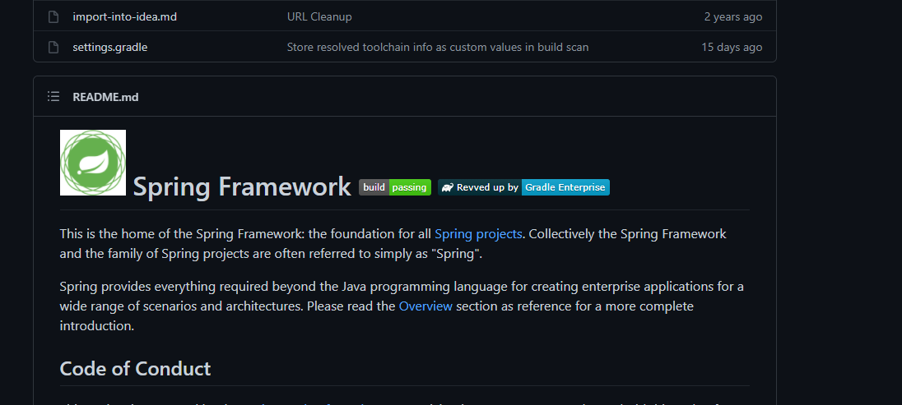
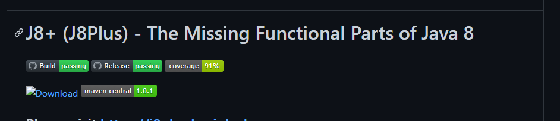
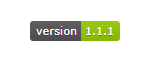

깃허브에 보면 ReadMe.md 에 여러가지 멋진 벳지가 달려있는게 궁금했다.

예를 들면 [스프링 프레임워크](https://github.com/spring-projects/spring-framework)의 경우 아래처럼 빌드가 통과되었는지에 대한 벳지가 있다.

 


나도 저런 벳지들이 주렁주렁 달린 오픈소스 프로젝트를 해보고싶단 생각이 들었다.

자주 쓰는 벳지 태그에 대해 알아보고자 한다.

케빈님이 주도하는 [j8plus](https://github.com/Kevin-Lee/j8plus) 를 보면 많은 벳지들이 있다.




이를 기준으로 알아보려 한다.

# What is github badge?

깃허브 벳지는 ShieldsIO(https://github.com/badges/shields) 에 의해 유행이 시작된 것으로 확인 된다.

image 사이즈를 실제 화면에서 테스트하기 위해 제공되던 서비스가 있었는데, URL PATH에 특정 width와 height 를 기입하면 이에 맞는 이미지를 응답해주는 서비스였다.

마찬가지로 ShiledIO 도 이와 같은 구문이다.


```

```

마크다운 ReadMe.md 에 아래 구문을 기입하면 아래와 같은 벳지가 웹페이지에 노출이 된다.

```

```



## 서비스에서 제공하는 벳지들

유행에 힘입어 아얘 서비스에서 제공해주는 벳지도 있다. ShieldIO 의 경우 사실상 정적인 리소스이기 때문에 어떠한 작업을 하고 벳지 URL을 계속 갱신해주어야 한다.

이를 자동으로 할수있도록 여러 서비스에서 벳지 기능을 제공하기도 한다.


### Travis badge

travis ci 를 통해 마지막 빌드된 아티팩트 뱃지를 노출시킬수도 있다.

이 아티클과는 조금 거리가 먼데, travis ci 로 지속적인 CI를 하는 방안에 대해서 아웃사이더님이 정리한 글이 좋아보여서 링크해둔다.

https://blog.outsider.ne.kr/1388

github tag 가 추가되면 travis ci 를 사용해서 maven central 에 지속적으로 처리할수있는 것도 있는것같다.

https://github.com/stefanbirkner/travis-deploy-to-maven-central

#### travis openjdk-latest 이슈

travis 에서는 별도의 자바 버전을 지정하지 않으면 최신 openjdk 컨테이너를 사용한다.

프로젝트가 자바8 기반인경우 간간히 이슈가 발생한다.

나의 경우 covaralls 에서 아래처럼 특정 maven-plugin 에서 최신버전에는 포함되지 않는 모듈을 호출하는 경우 이슈가 있었다.
github_badges_images/a535a330.png)

```
[INFO] BUILD FAILURE
[INFO] ------------------------------------------------------------------------
[INFO] Total time:  20.545 s
[INFO] Finished at: 2021-05-25T00:42:18Z
[INFO] ------------------------------------------------------------------------
[ERROR] Failed to execute goal org.codehaus.mojo:cobertura-maven-plugin:2.7:instrument (default-cli) on project tdd-spring-web-app: Execution default-cli of goal org.codehaus.mojo:cobertura-maven-plugin:2.7:instrument failed: Plugin org.codehaus.mojo:cobertura-maven-plugin:2.7 or one of its dependencies could not be resolved: Could not find artifact com.sun:tools:jar:0 at specified path /usr/local/lib/jvm/openjdk11/../lib/tools.jar -> [Help 1]
[ERROR] 
[ERROR] To see the full stack trace of the errors, re-run Maven with the -e switch
```


이는 아래 이슈리포트로 보고가 되었다.

https://github.com/travis-ci/travis-ci/issues/9926

이런 경우에 대해 travis [블로그를 보면](https://blog.travis-ci.com/2013-11-26-test-your-java-libraries-on-java-8) jdk 버전을 명시할수 있는 옵션에 대해 소개한다.

문제는 블로그에는 oraclejdk8 을 소개하는 데, 이 경우 bcl 라이센스에 대한 동의 떄문에 까다로워진다.

```
Expected feature release number in range of 9 to 17, but got: 8
The command "~/bin/install-jdk.sh --target "/home/travis/oraclejdk8" --workspace "/home/travis/.cache/install-jdk" --feature "8" --license "BCL"" failed and exited with 3 during .
```
github_badges_images/16bb64b4.png)

나는 아래처럼 그냥 openjdk8 을 명시해서 문제를 해결했다.

.travis.yml

```
language: java
jdk : openjdk8
```
 

### Build badge

Github 에서도 동적인 벳지를 제공한다.

```
[](https://github.com/프로젝트주소/actions?workflow=Build)
```

### Release badge

### Coverage badge


[Coverage](https://coveralls.io/) 는 테스트 커버리지를 측정해주는 서비스이다. travis ci 처럼 github 통합이 잘되어서 유명세를 탔다.

아웃사이더님의 소개가 참고가 많이 되었따.

https://blog.outsider.ne.kr/954

```
[](https://coveralls.io/r/프로젝트경로)
```


### Maven Central badge

구문 분석 
```
[](https://search.maven.org/메이븐central아티팩트경로)
```

공식 레퍼런스는 https://github.com/jirutka/maven-badges 에서 참고할수 있다.


### 기타 다양한 벳지


아래 블로그에 정리가 된게 많다.

https://www.lesstif.com/gitbook/github-project-status-badge-54952153.html