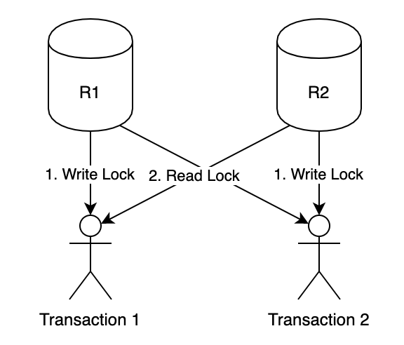

쿠폰 서비스가 있다. 말그대로 쿠폰을 입력하면 어떠한 보상을 주는 서비스이다. 회사에서 본격적인 마케팅에 들어가면서 유튜브 구독자수 적게는 20만명에서 많게는 200만명이 되는 크리에이터들에게 홍보를 맡기기 시작했다. 기존에는 쿠폰 서비스의 가용성에 문제가 없었는데, 대형 크리에이터들을 통해 수천명의 사용자가 쿠폰을 사용하면서 문제가 생겼다이슈는 유저 N명이 동시에 쿠폰을 사용하려고 든다면 이 중에 1명만 성공하고, 나머지는 쿠폰 사용이 실패하게 된다.  갑자기 생겨난 이슈는 아니고 본래 이슈가 있던 것이 사용자가 많아지면서 외부에 노출이 된 것이다. 이슈의 원인은 shared lock 의 관리떄문이었다. 이를 해결하고자 Mysql 의 공식문서를 참조해서 RDB의 ACID 에 대해 다시 공부했었고 이를 기록하여 본다.


##LOCK 의 개념

https://dev.mysql.com/doc/refman/5.7/en/innodb-locking.html

DB 는 기본적으로 여러명의 사용자가 동시에 특정 데이터에 접근하고 변경할수 있다. 같은 데이터에 여러명이 동일한 시각에 동시에 접근하면 누구에게 우선순위를 주어야하나는 개념을 말할 때 필요한 개념이다.

lock 은 RDBMS 에서 기본적으로 자동으로 적용한다. 데이터 변경의 효율성을 위해서이다. 옵션을 설정하면 수동으로 처리하게 할수 도있고, 원하는 전략으로 구성할수도 있다.

lock 은 클라이언트(db 사용자) 입장에서 쿼리를 사용할 때 명시적으로도 사용할수도 있지만, 기본적으로 트랜잭션 구문이 시작되면 트랜잭션의 격리 레벨(isolation) 특징에 따라서 LOCK 이 자동으로 적용된다.

lock 에서 대상을 잠그는 개념은 크게 2가지로 있다.   베타적 잠금(Exclusive lock) 과 공유 잠금(Shared lock) 이다.

### 공유 잠금

읽기 잠금(select lock, 또는 read lock) 이라 불린다. SELECT 쿼리에 설정이 된다.

데이터의 일관성과 무결성을 위해 필요한 잠금 개념이다. 어떤 트랜잭션이 데이터를 변경하고 있는 도중인데, 다른 외부가 그 데이터를 조회하려한다면, 데이터를 변경하기 전의 것을 보여주어야할까? 변경 예정인 것을 보여주어야할까? 

를 어떻게 할지에 대한 얘기에 해당하는 게 공유 잠금이다.

공유 잠금이 사용되면, 공유 잠금이 걸린 데이터를 조회할수 있다. 

공유 잠금은 다른 공유 잠금들과 호환이 된다. 공유 잠금끼리는 충돌되지 않는다.

그러나 베타적 잠금은 허용하지 않는다.

이 말의 의미는 외부의 다른 이가 나의 트랜잭션 안의 데이터를 들여다 볼수는 있지만, 변경하지는 못하게 한다는 것을 의미한다.

### 베타적 잠금

쓰기 잠금(write lock) 이라고 불린다. INSERT, IPDATE, DELETE 쿼리에 설정 된다.

어떤 트랜잭션에서 데이터를 변경할 때, 그 트랜잭션이 다른 외부에 방해받지 않기 위해 사용한다. 

흔히 우리가 회사에서 lock 을 두려워 하는 이유가 이 베타적 잠금 개념 때문이다.

베타적 잠금이 설정되면 다른 엑세스하는 모든 조회와 변경 등의 연결 시도는 접근할수가 없게 된다. 이 상태는 베타적 잠금을 설정한 이가 잠금 종료를 할 때까지 계속 된다.

### 죽은 잠금 (dead lock)


공유잠금과 베타적 잠금처럼 시스템에서 지원하는 것은 아니고, LOCK의 특징에 따른 장애를 말한다.

서로 다른 트랜잭션이 서로 베타적 잠금을 걸고, 베타적 잠금이 걸린곳에 서로 조회를 하려하면 발생하는 꽁트를 말한다. 아래 이미지가 적절한 예 




## lock 의 대상
lock 을 걸수 있는 대상은, 기본적으로 테이블 부터 레코드까지는 대부분 되고, 특정 RDBMS 는 컬럼과 데이터 블록(페이징) 까지 적용이 가능하다. 

Mysql 의 InnoDB는 기본적으로 행 기반의 RID 레코드락으로 동작한다.
 
 
|대상|적용 범위|
|---|---|
|RID| 레코드 한 행(row) 락, 레코드 PK를 기준으로 락을 건다. PK가 없는 테이블이라면 Mysql의 경우 내부적으로 hash 키를 만들어 PK가 있는 것처럼 동작하기에 문제가 없다.|
|KEY| 인덱스가 있을 때 한 행 (row) 락|
|PAGE| 테이블의 데이터 블록 단위 (8KB) 락|
|EXTENT| 특정 대상을 기준 중심점으로 잡고 위,아래 레코들까지 블록 단위로 보고 락|
|TABLE| 테이블 락|
|DB| DB 락|

이 외에도 DB 파일 락 여러가지가 있다.

### Record Lock

Record Lock 은 기본적으로 레코드 식별 PK 인덱스에 LOCK 을 거는 개념이다.
 
만약 PK가 존재하지 않더라도, Mysql은 레코드를 식별하기 위해 default Clustered Index 를 통해 그 행을 식별가능한 인덱스를 생성하기 때문에 결론적으로 PK 가 있는것과 동일하게 취급된다.


### Gap Lock

Gap Lock 은 트랜잭션 대상 레코드를 기준으로 이전과 이후 레코드 범위에 대한 LOCK 이다. 즉 특정 레코드에 대한 LOCK 이 아니라, 특정 레코드 주변에 대한 LOCK 이다.

쉽게 설명하면 아래와 같은 시나리오가 있을수 있다.
 
- 내가 마지막 레코드에 insert 하려는데, 추가로 insert 가 되지 않게 하고 싶은 경우.

### Next-key lock

Record Lock 과 Gap Lock 을 함께 사용하는 기능.

### table level lock

테이블의 변경을 막기 위해 상용되지만, 테이블 데이터 조회 자체도 막힌다.

select table, alter table, vacuum, refresh, index, drop, truncate 등의 모든 테이블 관련 작업에 락이 영향을 준다. 

## ISOLATION

Isolation 은 RDB의 ACID 에서 I를 담당한다. 격리 수준이라는 뜻.
 
여러 트랜잭션이 대상을 동시에 접근하고 변경할 때에 대한 성능 안정성, 일관성, 균형을 책임지는 내용이다.

https://dev.mysql.com/doc/refman/5.7/en/innodb-transaction-isolation-levels.html

isolation 은 rdbms 벤더 마다 기본값이 다르다. 필자는 mysql 과 mssql을 쓰는데 서로 다른 기본값 때문에 조금 고생을 했다.

스프링 프레임워크의 경우 트랜잭션 어노테이션 을 살펴보면 isolation 속성이 잇는데, 이에 대한 설정을 의미한다. 


#### Mysql 과 MSsql 의 기본 ISOLATION 정책이 다르다?

Mysql 을 사용 하다가 MSSQL(SQL SERVER) 를 사용 하게 되었던 일화가 있는데, Mysql 의 쿼리를 그대로 재활용하려다 보니, 팀장님 편으로 명시적으로 nolock 을 해달라는 요청을 받은 기억이 있음.

이에 대해 생각을 해보았는 데, 구글링 해보니 각 DB 벤더 마다 isolcation 기본 값이 상이하기 때문에 오는 상황에 대해 이슈가 있을까 하는 내용이었던 것.

MSSQL 은 Read Committed 가 기본형이고 ,Mysql은 Repeatable read 가 기본.

#### write skew(쓰기 왜곡)

영속상태의 객체를 dirty checking 메카니즘에 따라 변화가 있는 값만을 update 진행하게 된다. 그러나 dirty checking 을 통한 update 당시 update의 대상이 아닌 값이 변화되었다면 해당 부분에 대해 인지를 할 수 없는 상황을 가리킨다.ex) 잔액 인출, 포인트 차감
(lost update 이슈로 볼 수 도 있는데 두 차이점은 아래 참고 링크로 대신하였다.)
 해결방안
 Optimistic(낙관적) lock
 
 트랜잭션 간 lock이 발생하지 않는다는 관점이라서 낙관적 lock 이라고 한다.
 JPA에서 제공하는 @Version을 사용하며 테이블에 version 칼럼을 명시하고 update 간 해당 칼럼을 +1 씩 갱신한다.
 
 트랜잭션 간 update의 대상의 version 칼럼 데이터가 영속객체의 version 데이터와 다르다면 Exception을 발생시킨 후 보상 트랜잭션을 진행하는 등의 방식을 택한다.
 
 PESSIMISTIC(비관적) lock
 
 트랜잭션 간 lock이 발생할것이라는 관점이라서 비관적 lock 이라고 한다.
 mysql에서 ~~ for update와 같은 방식의 쿼리로 lock을 요청한다.
 
 [https://velog.io/@recordsbeat/JPA%EC%97%90%EC%84%9C-Write-Skew-%EB%B0%A9%EC%A7%80%ED%95%98%EA%B8%B0-locking-%EC%A0%84%EB%9E%B5](https://velog.io/@recordsbeat/JPA%EC%97%90%EC%84%9C-Write-Skew-%EB%B0%A9%EC%A7%80%ED%95%98%EA%B8%B0-locking-%EC%A0%84%EB%9E%B5)
 
 #### JPA 와 잠금
 
 JPA(Hibernate:하이버네이트)에 의한 잠금(Lock:락) 사용중에 생각하고 있던바와 동작이 좀 다른 부분이 있어서 전반적으로 정리해 보았습니다.
 
 잠금(Lock)의 종류
 낙관적 잠금(Optimisstic Lock)
 낙관적 잠금은 현실적으로 데이터 갱신시 경합이 발생하지 않을 것이라고 낙관적으로 보고 잠금을 거는 기법입니다. 예를 들어 회원정보에 대한 갱신은 보통 해당 회원에 의해서 이루어지므로 동시에 여러 요청이 발생할 가능성이 낮습니다. 따라서 동시에 수정이 이루어진 경우를 감지해서 예외를 발생시켜도 실제로 예외가 발생할 가능성이 낮다고 낙관적으로 보는 것입니다. 이는 엄밀한 의미에서 보면 잠금이라기 보다는 일종의 충돌감지(Conflict detection)에 가깝습니다.
 
 비관적 잠금(Pessimistic Lock)
동일한 데이터를 동시에 수정할 가능성이 높다는 비관적인 전제로 잠금을 거는 방식입니다. 예를 들어 상품의 재고는 동시에 같은 상품을 여러명이 주문할 수 있으므로 데이터 수정에 의한 경합이 발생할 가능성이 높다고 비관적으로 보는 것입니다. 이 경우 충돌감지를 통해서 잠금을 발생시키면 충돌발생에 의한 예외가 자주 발생하게 됩니다. 이럴경우 비관적 잠금을 통해서 예외를 발생시키지 않고 정합성을 보장하는 것이 가능합니다. 다만 성능적인 측면은 손실을 감수해야 합니다. 주로 데이터베이스에서 제공하는 배타잠금(Exclusive Lock)을 사용합니다.
 
 암시적 잠금(Implicit Lock)
 암시적 잠금은 프로그램 코드상에 명시적으로 지정하지 않아도 잠금이 발생하는 것을 의미합니다. JPA에서는 엔터티에 @Version이 붙은 필드가 존재하거나 @OptimisticLocking 어노테이션이 설정되어 있을 경우 자동적으로 충돌감지를 위한 잠금이 실행됩니다. 그리고 데이터베이스의 경우에는 일반적으로 사용하는 대부분의 데이터베이스가 업데이트, 삭제 쿼리 발행시에 암시적으로 해당 로우에 대한 행 배타잠금(Row Exclusive Lock)이 실행됩니다. JPA의 충돌감지가 역할을 할 수 있는 것도 이와 같은 데이터베이스의 암시적 잠금이 존재하기 때문입니다. 데이터베이스의 암시적 잠금이 없다면 충돌감지를 통과한 후 커밋(Commit)이 실행되는 사이에 틈이 생기므로 충돌감지를 하더라도 정합성을 보증할 수 없을 것입니다.
 
 명시적 잠금(Explicit Lock)
 프로그램을 통해 의도적으로 잠금을 실행하는 것이 명시적 잠금입니다. JPA에서 엔터티를 조회할 때 LockMode를 지정하거나 select for update 쿼리를 통해서 직접 잠금을 지정할 수 있습니다.
 
 낙관적 잠금 사용
 
 https://reiphiel.tistory.com/entry/understanding-jpa-lock
 
 

### isolation level

isolation 에는 기본적으로 4단계에 해당하는 격리 수준이 정의되어 있음. 각 레벨은 아래 도표를 보면 알수 있듯 각각 메카니즘이 상이함.

|level|Dirty Read|NonRepeatable Read|Phantom Read|
|----|----|----|----|
|Level 0 Read UnCommitted| O | O | O |
|Level 1 Read Committed| X | O | O|
|Level 2 Repeatable Read| X | X | O |
|Level 3 Serializable | X | X | X|


*Dirty Read*

아직 커밋 되지 않은 신뢰할수 없는 데이터를 읽는다는 걸 의미.

*NonRepeatable Read*

한 트랜잭션에서 동일한 SELECT 를 하더라도 결과가 똑같을수 없음을 의미함.

*Phantom Read*

이전의 SELECT 쿼리의 결과에 없던 ROW 가 추가 될 수 있음을 의미.


#### Level 0 Read Uncommitted

dirty read 라고도 한다. 다른 트랜잭션이 커밋하지 않은 데이터를 읽을 수 있다.

```
A > SESSION transaction isolation level READ UNCOMMITTED;
A > START TRANSACTION;
A > SELECT * FROM user; 
A > +----+---------+
A > | id | name    |
A > +----+---------+
A > | 1  | user  |
A > | 2  | user2 |
A > +----+---------+

B > START TRANSACTION;  
B > UPDATE user SET name = "updated" WHERE id = 1;  
B > INSERT INTO user (name) VALUES ("inserted");  

A > SELECT * FROM user;  
A > +----+----------+
A > | id | name     |
A > +----+----------+
A > | 1  | updated  |
A > | 2  | user2  |
A > | 3  | inserted |
A > +----+----------+

```

위 내용으로 보면 B 에서 아직 COMMIT 하지 않았고, A 가 COMMIT 하지 않은 데이터를 읽어오는 걸 알수 있다.


#### Level 1 Read Committed

mssql 과 oracle 의 기본 설정값이다.

변경 중인 데이터는 읽지 않는다. 이는 커밋이 되어야 읽을수 있다.

```

A > SET SESSION transaction isolation level READ COMMITTED;  
A > START TRANSACTION;  
A > SELECT * FROM user;  
A > +----+---------+
A > | id | name    |
A > +----+---------+
A > | 1  | user  |
A > | 2  | user2 |
A > | 3  | user3 |
A > +----+---------+

B > START TRANSACTION;  
B > UPDATE user SET name = "updated" WHERE id = 1;  
B > INSERT INTO user (name) VALUES ("inserted");


A > SELECT * FROM user;  
A > +----+---------+
A > | id | name    |
A > +----+---------+
A > | 1  | user  |
A > | 2  | user2 |
A > | 3  | user3 |
A > +----+---------+  

B > COMMIT;  

A > SELECT * FROM user;  
A > +----+----------+
A > | id | name     |
A > +----+----------+
A > | 1  | updated  |
A > | 2  | user2  |
A > | 3  | user3  |
A > | 4  | inserted |
A > +----+----------+
```

UnCommited 와 다르게 변경중인 데이터가 조회되지 않고, 변경 전의 원본 데이터를 읽는다.
커밋이 된 이후에는 변경된 데이터를 읽을수 있다.

이런 특성에 drity read 는 해소 되었으나, phantom read와 non-repatable read 는 해결하지 못한다.


#### Level 3 Repeatable Read

Mysql의 InnoDB의 isolation 기본 설정값이다. 

```
A > SET SESSION transaction isolation level REPEATABLE READ;  
A > START TRANSACTION;  
A > SELECT * FROM user;  
A > +----+---------+
A > | id | name    |
A > +----+---------+
A > | 1  | user  |
A > | 2  | user2 |
A > | 3  | user3 |
A > +----+---------+

B > START TRANSACTION;  
B > UPDATE user SET name = "updated" WHERE id = 1;  
B > INSERT INTO user (name) VALUES ("inserted"); 

A > SELECT * FROM user;  
A > +----+---------+
A > | id | name    |
A > +----+---------+
A > | 1  | user  |
A > | 2  | user2 |
A > | 3  | user3 |
A > +----+---------+

B > COMMIT;

A > SELECT * FROM user;  
A > +----+---------+
A > | id | name    |
A > +----+---------+
A > | 1  | user  |
A > | 2  | user2 |
A > | 3  | user3 |
A > +----+---------+

```

Mysql 에서는 READ COMMITTED 와 REPATABLE READ 트랜잭션에서는 LOCK 을 걸지 않고 변경사항 추적(snapshot log)에서 데이터를 읽어온다.

READ COMMITTED 에서는 select 할때마다 snapshot log 의 최신 데이터를 읽어오기 때문에, non-repatable 와 phantom read 가 발생하지만, 

repetable read 트랜잭션에서는 내가 최초로 조회했던 snapshot 에서만 select 를 하기 때문에 일관성이 보장이 된다.

재밌는 점은 LOCK 을 걸지 않는다는 특성 탓에, 조회에 대해서는 변경사항 추적(snapshot log) 에서 읽기 때문에 일관성이 보장되지만

위 예시에서 아래와 같은 쿼리를 하면 재밌는 결과를 알수가 있다.

```
... 위 예시에서 이어짐 ...

A > +----+---------+
A > | 1  | user  |
A > | 2  | user2 |
A > | 3  | user3 |
A > +----+---------+


A > UPDATE user SET name = "upserted" WHERE name = "inserted";  
A > -- Query OK, 1 row affected (0.01 sec)
A > -- Rows matched: 1  Changed: 1  Warnings: 0

A > SELECT * FROM user;  
A > +----+----------+
A > | id | name     |
A > +----+----------+
A > | 1  | updated  |
A > | 2  | user2  |
A > | 3  | user3  |
A > | 4  | upserted |
A > +----+----------+

```

재밌는 것을 이해가 됬을지 모르겠다. ``` UPDATE user SET name = "upserted" WHERE name = "inserted";  ``` 이 부분이 흥미로운데
inserted 라는 값을 가진 레코드는 select 에서 조회되지 않았지만 쿼리가 수행됨을 알수가 있다.
그리고 이후에 다시 select 를 하면 non REPEATABLE 이 발생한다. 유의해야할 사항.


#### Level 4 Serializable

동시성과 안정성의 균현 없이 무조건 안정성에 몰빵한 형태이다.

Serializable 트랜잭션을 먼저 시작한 트랜잭션이 있는 경우 이 트랜잭션이 read 만 하든 write든 하든 간에.. 어떠한 레코드에 접근을 하면, 접근한 레코드들 모두 shared lock 상태에 빠지게 된다.

이 트랜잭션으로 인해 레코드들에 shared lock 이 걸렸음으로 Commit 하기 전까지는 다른 write 트랜잭션은 대기상태에 빠지게 된다. read는 읽을수 있다.

```
A > SET SESSION transaction isolation level SERIALIZABLE;  
A > START TRANSACTION;  
A > SELECT * FROM user;  
A > +----+---------+
A > | id | name    |
A > +----+---------+
A > | 1  | user  |
A > | 2  | user2 |
A > | 3  | user3 |
A > +----+---------+

B > START TRANSACTION;  
B > SELECT * FROM user;  
B > +----+---------+
B > | id | name    |
B > +----+---------+
B > | 1  | user  |
B > | 2  | user2 |
B > | 3  | user3 |
B > +----+---------+

B > UPDATE user SET name = "updated" WHERE id = 1;
B > ERROR 1205 (HY000): Lock wait timeout exceeded; try restarting transaction  

```

A 가 serialzable 격리로 트랜잭션을 시작했기 때문에 A 가 선점한 레코드들이 shared lock 상태에 빠지게 된다.
B 입장에서 조회 자체는 가능하지만, A가 shared lock 을 commit 으로 풀기 전까지는 write 할수 없어서 결국 에러가 발생한다. 
이 에러가 나는 특징으로 인해  Repeatable Read 과 Serialzable 이 조회(read) 상태에서는 유사하지만, 변경(write) 작업에서 차이가 난다.


## Ref

https://dev.mysql.com/doc/refman/8.0/en/innodb-transaction-isolation-levels.html

---


#### spring isolation

스프링에서는 어노테이션 기반의 트랜잭션을 명시할수 있는 구성을 지원합니다. https://docs.spring.io/spring-framework/docs/current/javadoc-api/org/springframework/transaction/annotation/Transactional.html

```java

@Target({ElementType.TYPE, ElementType.METHOD})
@Retention(RetentionPolicy.RUNTIME)
@Inherited
@Documented
public @interface Transactional {
    @AliasFor("transactionManager")
    String value() default "";

    @AliasFor("value")
    String transactionManager() default "";

    Propagation propagation() default Propagation.REQUIRED;

    Isolation isolation() default Isolation.DEFAULT;

    int timeout() default -1;

    boolean readOnly() default false;

    Class<? extends Throwable>[] rollbackFor() default {};

    String[] rollbackForClassName() default {};

    Class<? extends Throwable>[] noRollbackFor() default {};

    String[] noRollbackForClassName() default {};
}

```

우리는 위 isolation() 속성에 대입되는 Isolation Enum 을 살펴봅니다.
```
public enum Isolation {
    DEFAULT(-1),
    READ_UNCOMMITTED(1),
    READ_COMMITTED(2),
    REPEATABLE_READ(4),
    SERIALIZABLE(8);

    private final int value;

    private Isolation(int value) {
        this.value = value;
    }

    public int value() {
        return this.value;
    }
}
```
어노테이션 속성 기본 값으로 DEFAULT 로 되어 있습니다. 이는 DB 의 기본값을 사용하겠다는 의미입니다. 

나머지 4개는 ISAOLTION 4대 원칙에 해당하는 내용입니다.


---


최근에 사내에 Mysql Replication 을 구성해서 사용하게 되었습니다. 기존에 Master 에 모든 CRUD 를 모두 행하던 코드들을 이제 M/S 에 맞게 CUD / R 로 나누어서 처리해주어야 합니다.

M / S 데이터소스의 분기 처리는 스프링의 abstractroutingdatasource 키워드로 접근해서 작업하면 될 것이라 생각했습니다.

문제는 @Transactional 로 선언 된 메소드 단위에서 read 는 slave 에서 읽어오고, update 구문은  master 에 처리되는 과정을 깔끔하게 처리하고 싶은데, 기초 지식이 부족해서 가늠이 안 잡혀서 공부를 시작하게 되었습니다.


원하는 구성은 아래의 구성입니다.

- 부모 트랜잭션
    - 자식 트랜잭션(select)
    - 자식 트랜잭션(update)
    - 자식 트랜잭션(select)


|속성|설명|예|
|----|----|----|
|isolation|트랜잭션의 원자성(isolation)을 처리|@Transactional(isolation=Isolation.DEFAULT)|
|propagation|트랜잭션 전파 규칙을 정의|@Transactional(propagation=Propagation.REQUIRED)|
|readOnly|트랜잭션을 읽기 전용으로 설정|@Transactional(readOnly = true)|
|rollbackFor|특정 Exception 에 대해서 rollback 할 지 설정|	@Transactional(rollbackFor=Exception.class)|
|noRollbackFor|특정 Exception 에 대해서 rollback 을 무시 할 지 설정 |	@Transactional(noRollbackFor=Exception.class)|
|timeout|지정한 시간 내에 수행이 완료되지 않은 경우 rollback|@Transactional(timeout=10)|


[스프링만의 독특한 트랜잭션 적용 비법은?](http://egloos.zum.com/springmvc/v/498979)
[스프링 트랜잭션](http://syaku.tistory.com/269)

[ref](http://whiteship.tistory.com/2143)

[트랜잭션](https://blog.outsider.ne.kr/870)


Spring에서 @Transactional (readOnly = true)

이것은 무엇을 의미 하는가 ?

다중 버전 동시 처리 제어 데이터베이스 (Oracle, Postgresql, MySQL + InnoDb)가 사용되면 읽기 전용 트랜잭션을 비표준 분리 레벨 인 READ_ONLY로 변환 할 수 있습니다.

READ_ONLY 격리 수준은 SERIALIZED 격리 수준 (더티 읽기, 반복 불가능 읽기, 팬텀 읽기 없음)과 동일한 보호를 제공하지만 업데이트를 허용하지 않습니다. 또한 잠금이 필요 없기 때문에 잠금 경합이 발생하지 않습니다 (데이터베이스는 모든 새 변경 사항을 무시하고 레코드의 이전 버전으로 되돌릴 수 있습니다).

Ms Sql 2005도 비슷한 격리 수준을 가지고 있습니다 : SNAPSHOT.

readOnly를 true로 지정 하면 현재 Hibernate Session에서 플러시 모드가 FlushMode.NEVER 로 설정되어 세션이 트랜잭션을 커밋하지 못하도록합니다.

또한 JDBC 커넥션 에서 setReadOnly (true) 가 호출됩니다. JDBC 커넥션은 기본 데이터베이스에 대한 힌트이기도합니다. 데이터베이스가 지원한다면 (대부분 가능), FlushMode.NEVER와 기본적으로 같은 효과가 있지만 수동으로 플러시 할 수 없기 때문에 더 강력합니다.

이제 트랜잭션 전파가 어떻게 작동하는지 살펴 보겠습니다.

명시 적으로 readOnly를 true로 설정하지 않으면 읽기 / 쓰기 트랜잭션을 갖게됩니다. 트랜잭션 속성 (예 : REQUIRES_NEW)에 따라 때때로 트랜잭션이 일시 중단되고 새 트랜잭션이 시작되어 결국 커밋되고 그 후 첫 번째 트랜잭션이 재개됩니다.

A의 방법 경우 읽기 / 쓰기 트랜잭션이 필요로하는 메소드를 호출 readOnly 인 트랜잭션을 달리 플러시 / 두 번째 방법의 끝에 일어날 것 커밋하기 때문에, 첫 번째는 중단되어야한다.

반대로 읽기 / 쓰기 가 필요한 readOnly 트랜잭션 내에서 메서드를 호출하면 플러시 / 커밋 할 수 없기 때문에 첫 번째 메서드가 일시 중단되고 두 번째 메서드는이를 필요로합니다.

년 에-readOnly 인 readOnly 인- 및 읽기 / 쓰기 읽기 / 쓰기 (당신은 분명, 그렇지 않으면 전파를 지정하지 않는) 외부 트랜잭션이 필요하지 않는 경우가 일시 중단합니다.

