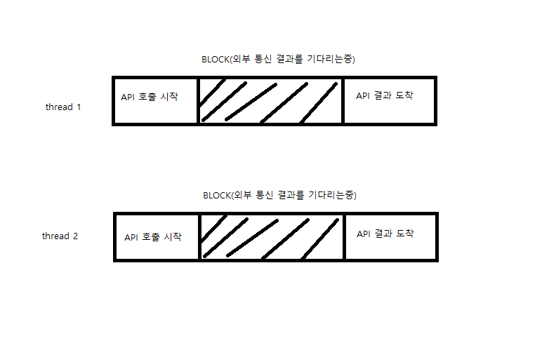

일반적으로 대부분의 JDBC 를 통한 트랜잭션 단위는 단일 연결(Local Transaction)의 트랜잭션만 지원을 한다. 이게 무슨 말이냐면, 물리적으로 하나의 Database 스토리지 안에서 논리적으로 나뉘어진 여러 Database 스키마들에 대해선 연결 한 session 안에서 이루어지기 때문에 트랜잭션이 공유되는 듯이 동작 할 수 있지만, 물리적으로 분리 된(떨어 진) 데이터베이스에는 트랜잭션을 걸 수가 없다는 이유이다. [JDBC 분산 트랜잭션 참고](https://www.ibm.com/support/knowledgecenter/ko/ssw_ibm_i_73/rzaha/distrans.htm) 


물리적으로 분리 된 트랜잭션이 필요한 것은 글로벌 트랜잭션(Global Transaction)이라고 하는 데, 여러 리소스(DB 또는 스토리지, 혹은 메세지) 사이에서 처리된다하여 분산트랜잭션(Distributed Transaction) 이라고도 한다. 이 분산을 줄여서 쓴 말이 XA 트랜잭션이라고 표현한다. [RFC2372](https://tools.ietf.org/html/rfc2372), [XA spec](http://pubs.opengroup.org/onlinepubs/009680699/toc.pdf)

예를 들어서 물리적으로 떨어진 A데이터베이스와 B데이터베이스에 원자성을 지키기 위한 글로벌 트랜잭션이 필요하다고 가정을 해보자.

나의 경우에는 PC게임와 모바일 게임 간의 쿠폰을 통한 재화 지급을 한 트랜잭션에 처리해야하는 일이 있었다. 심지어 DB 벤더(MSSQL와 Mysql)도 다르고 물리적 위치도 한없이 다른 상태. -_-;;


일반적으로 단일 트랜잭션은 1PC로 동작한다. 이는 원자성에 대한 시퀀스를 나타내는 데, 흐름은 아래와 같다.

1PC (one phase commit)

```
BEGIN(시작) --> END(종료) --> COMMIT(반영)
```

다만 글로벌트랜잭션은 2PC 로 동작한다.(상황에 따라 1PC로도 진행한다.)

2PC (two phase commit)
```
BEGIN(시작) --> END(종료) --> PREPARE(준비) --> COMMIT(반영)
```

차이점은 보면 알겠듯이, 준비 단계의 생략 여부이다. 당연하겠지만 생략 된 것이 훨씬 빠르고 안정적이다. 일반적으로 JDBC 드라이버 벤더들은 1PC와 2PC 를 모두 지원하도록 개발한다. Mysql 의 경우에는 아래의 2가지 타입의 DataSourc가 준비되어 있다.

```
- com.mysql.jdbc.jdbc2.optional.MysqlXADataSource
- com.mysql.jdbc.jdbc2.optional.MysqlDataSource

```


글로벌 트랜잭션을 위한 기술로 자바에서는 [JTA](https://www.oracle.com/technetwork/java/javaee/jta/index.html) 라는 표준 스펙이 있다. JTA 는 XA 트랜잭션을 지원하는 자바 API이다. JTA 는 JavaEE 의 스펙이기에 일반적으로 WAS 제공자(Jboss 등등)에서 대부분 지원해준다. 다만, 일반적으로 많이 사용하는 Full스펙을 지원하지 않는 서블릿 컨테이너의 경우(예: 톰캣)에는 이 JTA 기능이 빠져있다.

[XA 트랜잭션]() 은 표준 트랜잭션 스펙으로, 나의 관심사는 Mssql 과 Mysql 이었다.

- [Mssql 의 경우](https://docs.microsoft.com/ko-kr/sql/connect/jdbc/understanding-xa-transactions?view=sql-server-2017)

- [Mysql 의 경우](http://www.mysqlkorea.com/sub.html?mcode=manual&scode=01&m_no=21646&cat1=13&cat2=382&cat3=413&lang=k)

Mssql의 경우에는 물리적으로만 떨어진 DB 장비끼리의 글로벌 트랜잭션을 [Ms-DTC](https://docs.microsoft.com/ko-kr/sql/database-engine/availability-groups/windows/cluster-dtc-for-sql-server-2016-availability-groups?view=sql-server-2017) 라는 기술을 지원하고 있는 데, 다른 벤더 DB와의 트랜잭션을 위한 XA 트랜잭션의 경우 이 DTC 도 활성화되어 하고, XA 옵션도 활성화 되어야 한다.

Mysql 은 특별한 설정은 없으나, InnoDB 엔진을 사용한 스키마만 지원이 가능하다.


## 스프링의 트랜잭션

대한민국에서 스프링 프레임워크를 뺸 자바프로젝트를 찾기가 어려울 정도로 많이 쓰여진다. 그 말은 스프링 프레임워크의 종속적이란 말이고 트랜잭션 역시 스프링 프레임워크의 트랜잭션을 많이 사용한다.

명시적인 방법과 선언적인 방법이 있는 데, 나는 명시적인 방법```@Transactional()``` 을 좋아하기에 어노테이션 기반으로 설명하려 한다.

아래의 코드 흐름을 보자

```java

public class pc게임서비스{

    ...

   @Transactional(transactionManager = "pcTxm")
   public void pc쿠폰보상지급(...){
        this.쿠폰조회(..);
        this.유저조회(..);
        mobile게임서비스.쿠폰보상지급(..);
   }

   @Transactional(transactionManager = "pcTxm")
   public void 쿠폰조회(...){
       ...
   }

   
   @Transactional(transactionManager = "pcTxm")
   public void 유저조회(...){
       ...
   }

}

public class mobile게임서비스{

    ...

   @Transactional(transactionManager = "mobTxm")
   public void 쿠폰보상지급(...){

   }

```

일반적으로 이런 코드를 많이 작성했을 것이다. 이 코드는 물리적으로 같이 존재하는 동일한 타입의 데이터베이스 인 경우 트랜잭션이 잘 동작한다. 3가지의 모두 어디에서 예외처리가 나더라도 


https://github.com/glqdlt/com.glqdlt.ex.jta.git

aomikos 의 db pool 은 아래의 가이드를 참고하자

https://www.atomikos.com/Documentation/OptimizingJdbcPerformance


# 레퍼런스

- [https://swdev.tistory.com/4](https://swdev.tistory.com/4)

- https://soul0.tistory.com/282

---

MSA가 무엇이냐

MSA(Micro Service Architecture) 를 알려면 SOA(Service Oriented Architecture)를 알아야한다. SOA 에서 발생된 여러가지 이슈와 니즈를 해결하기 위해 고안된 디자인 패턴의 집합이 MSA이기 때문이다. 결국 MSA는 SOA의 확장(extend) 버전인 셈이라고도 볼수 있기 때문이다.

### What is SAO

### SOA vs MSA

SOA나 MSA 나 모두 모놀리스와 달리 N 레이어로 나누어지는 구성은 같다.

다만 SOA는 같은 성격의 모듈을 같은 레이어(또는 노드)에 물리적으로 묶어 놓은 반면에 MSA는 레이어(또는 노드)의 개념은 논리적인 그룹일 뿐이며, 모든 모듈이  독립적인 구성이다. MSA는 겉으로 보거나 서비스 플로우의 흐름상 SOA처럼 일련의 집합처럼 있는 것처럼 보일지도 모리지만, 모듈은 레이어에도 속하지 않고 완전히 독립적으로 구성되는 것이 포인트에 있다.
  


(좌 SOA , 우 MSA)


> 이런 의미로 마이크로서비스는 SOA지만 모든 SOA가 MSA 인 것은 아니다.
>
> -코틀린마이크로서비스개발 -후안 안토니오 메디나 이글레시아스 챕터 1에서


MSA 를 설계하다 보면 흔히 많이 마주 치는 실수가 있는 데, 모듈이 독립적으로 나어져야 하는 이유에 대해서 단편적인 부분만 알고 접근하는 사례가 매우매우 많다.

흔히 잘못 이해하는 오류로, 수직 확장에서 수평 확장이 용이하다고 착각하고 MSA에 접근 하는 모습을 심심치 않게 많이 보았는 데, 이는 매우 잘못되었다. 오히려 MSA 는 스케일아웃을 하는 데에 신경쓸 것이 많아진다. 이유는 모놀리스나 SOA의 경우 어떠한 그룹 단위를 통으로 스케일 아웃하면 되다 보니 네트워크 연결 작업이 복잡하지가 않다, 반면 MSA 는 모든 것이 작은 독립적인 구성이어서 A:B:C:D 의 노드가 1:1:1:1 로 구성되었 다가, B가 스케일아웃하여 3개가 늘었을 경우 1:3:1:1 의 구성이 되면서, A와 C 가 B의 스케일아웃된 노드 인스턴스를 어떻게 식별하고 연결할 지 고민이 된다. 즉 작은 독립적인 모듈들의 변화가 연결된 모든 노드에 영향이 간다. 이를 막기 위해 클라이언트사이드 디스커버리, 서버사이드 디스커버리, 라우팅 레지스터리 등의 여러 패턴 적용을 고려해보아야 한다.  

그렇다면 굳이 왜 MSA를 사용해야하는 지가 궁금해진다. MSA의 궁극적인 목표는 서비스 지속성을 보장하면서 서비스를 프로덕션 스테이지에 빠른 배포(shipping)이다. 이는 애자일과 관련 된 프로젝트 도구들이 유행을 타면서 그 근간을 이루는 익스트림 프로그래밍의 한 줄기 갈래 나온 자연스러운 현상일 뿐이다. 잦은 리팩토링(OOP와 TDD는 이를 위해 존재한다.)과 점진적인 개선(또는 확장성을 위한 준비) 그리고 신속한 배포(또는 서비스 가용성). 이것을 하기 위해 거대한 규모의 모노리스 아키텍처를 분활하여 관리하고 개선하자는 것의 목표로 나온 것이 MSA의 큰 관점이다. 위에서 모놀리스가 오히려 스케일업과 스케일아웃이 용이하다고 했지만 한 통으로 움직이는 문제로 커플링이 심해진다. 특정 모듈만 변화할수가 없다는 것을 의미한다. 즉 이러한 잦은 변경과 확장을 위해 MSA를 도입하는 것이다.

현재 머물고 있는 조직도 그 중 하나인데, 크게 실수하는 부분 중 하나가 서비스 노드를 나누는 기준을 플러그인(또는 커플링이 심한 모듈) 관점으로 접근하는 경향이 있다. 이 말이 무슨 말이냐면 물리적인 공간이 분리되었을 뿐, 서비스 흐름은 모두 동기적으로 엮어 있다는 말이다. 

에를 들어 ..

MSA 가 뜨기 전에 nginx 웹서버가 큰 화두가 되고, 자바의 전통적인 서블릿에서 netty 그리고 vert.x 와 같은 (또는 nodejs) 이벤트 드리븐 방식의 웹 서버가 인기를 끌었다. 동기식 웹서버에서 오는 성능적 한계 때문에 비동기식의 웹 서버인 nginx 가 인기를 끌게 된 것이다.

마찬가지로 MSA 의 옳바른 형태는 단순히 거대한 모노리스 어플리케이션A을  A-1,A-2,A-3 으로 나누어서 하나의 세션 flow 안에서 A-1,A-2,A-3 이 같이 서로 커플링이 심하게 커뮤니케이션하면서 처리하게 되면 안된다는 의미이다. A-1,A-2,A-3 이 아닌 A(A-1,A-2),B(B-1),C(C-1) 이런 식으로 완벽하게 서로 접점이 없는 경계로 나누어야 하며, 각 A와 B, C 는 서로 내부적으로 무엇을 하는 지, 각자의 고유 책임만 거지고 직접적인 관여를 하지 않아야 한다. 이렇게 되면 어떠한 서비스 노드에서 장애가 나더라도 서비스 지속성을 보장하며, 특정 서비스 노드의 긴급 패치를 하더라도 서비스의 장애가 이루어 지지 않는다. 각 서비스 노드의 장애나 실패는 자신 스스로가 고쳐야 하며, 특정 서비스 노드의 장애나 실패로 인해 다른 서비스 노드들에게 롤백을 요구 하거나 난감한 상황을 전이시키면 안 된다.

하지만 일이란 것이 모두 매번 능사는 아니다. 나중에 후술할 TCC 에서도 설명하겠지만, A사와 B사가 있을 때, 특정 서비스 흐름에서 서로 상호호환이 되어 커플링이 심한 작업을 한다고 하자. 작업이 단순히 A사의 데이터를 얻어와서 B 사가 그 데이터를 기반으로 작업을 하던, A사와 B사가 동시에 한 트랜잭션에서 저장이 되어야 한다던 간에 A사와 B사만의 트랜잭션 코디네이터를 할 주체를 만들고 그에 따른 핸들링을 처리해야 하는 로컬 트랜잭션의 범주를 벗어난 글로벌 트랜잭션을 관리해야할 수도 있다. 만약 A사의 작업이 성공했으나, B 사의 작업에서 롤백을 해야하는 상황이 온다면 A사에게 롤백을 하든 수정을 해라고 연락을 주어야 한다. 그것이 불가능하다면 하늘에서 신이 강림하더라도 답이 없다. 

현재 조직은 gRPC를 사용하고 있는 데, 각 RPC 통신의 단위가 매우 단순하게 접근하고 있다. 예를 들면 A와 B가 서로 있고, A는 유저 관리를 B는 게임 플레이 관리를 한다고 가정하자. A와 B는 한 트랜잭션 단위에서 똑같이 갱신되어야 하고 원자성에 의거해서 그 모두 실패하든 오직 성공하든 해야한다. 이렇다면 A와 B를 관리하는 코디테이터 C가 존재할 것인데, C가 하는 역활은 트랜잭션 전체를 관리할 뿐 특별한 일을 하지 않는다. C는 A와 B에게 할 일을 해라고 말만 할 뿐이다. 이벤트 드리븐 방식이든, 동기식의 응답을 기다리는 방식이든 A와 B의 결과가 왔을 때, C는 결과를 보고 롤백을 시킬지 커밋을 시킬지를 지시만 하면 된다. 만약 A와 B에게 롤백이나 커밋을 해라는 최종 명령을 했으나 A 쪽에서 하드웨어 장애로 의도치 않게 작업을 했다면, 그건 A의 책임이고 A에서 수습을 해야한다. A가 retry 를 계속 시도하고도 안된다면 A 가 B에게 미안한데 노가다로 직접 방금 했던 (트랜잭션ID) 에 대한 행위를 롤백해주지 않을래? 라고 사정사정해야 한다. 하지만 위에서 서술했듯이, A와 B 의 책임은 분리되어야 하며, A가 B 또는 B가 A에게 직접적인 핸들링을 하면 안 된다고 서술했다. 이런 경우가 발생하면 큰 일이 발생하는 경우 A와 B는 붙어서 AB 로 존재해야 한다. 그것이 정 어렵다면 A가 B에게 부탁하는 게 아니라 이런 예외사항을 관리하는 D 라는 존재에게 A가 D를 통해 B에게 요청을 한다던지 처리 해야한다. 왜냐면 MSA 의 서비스는 모두 stateless 하며 무중단 상태를 목표로 하기 때문이다. A의 실패로 인해서 C 의 서비스 트랜잭션이 동기되어 n시간 이상 소요된다면 그 서비스는 유저의 질타를 받게 될 것이다. 이처럼 매우 단순한 것인데, 현 조직에서는 C가 A와 B의 롤백을 직접 하려고 든다. 그래서 별에 별 창의적인 상상을 하게 되는 데, 이럴 거면 C와 A,B 가 아닌 확장성을 염두해서 C와 AB 로 구성해서 작업한 후에, 추후 C와 A,B 그리고 D를 만들어서 처리를 해야 한다.


예전 방송 프로모션 서비스 프로젝트에 참가했을 때의 일화이다.
도메인 환경은 대형 방송 송출사로 쿠폰 서버, 포인트 서버, 마일리지 서버, 유저 관리 서버 등
서비스 노드들이 나누어진 msa 구조였다

이런 msa 관계에서는 각 서비스 노드들의 연관된 업무 원자성을 위해 분산 트랜잭션에 관심이 많다.

이를 위한 방법으로

saga 페턴

tcc 패턴

이벤트 드리븐 모델

xa 2pc

등이 있다.

분산 트랜잭션(XA)에는 여러가지 방법이 있지만, 가장 유행했던 이벤트 드리븐이나 Restful API 에서 사용하는 TCC(try confirm cancel) 패턴을 많이 사용한다. (https://servicecomb.apache.org/docs/distributed_saga_3/)

당시 데이터베이스는 물리적으로 같은 장비에있는 걸 공유하기도 하고 완전히 분리된 경우나 다른 서비스 인프라 공급자를 통해 처리가 필요한 부분도 있었다

데이터베이스가 같은 장비에 논리적으로만 구분된 경우에는 단순히 처리할수있겠지만
물리적으로 떨어진 데이터베이스나 다른 인터페이스(레스트풀솨같은) 를 제공하는 인프라 공급자의 경우
같은 데이터베이스 커넥션이 아니기에 분산 트랜잭션을 묶기가 힘들다.

물리적으로 떨어진 데이터베이 스의 경우 2pc를 고민해보면 된다.
여기에 물리적으로 쩔어진데다가 벤더도 다른경ㅇ 라면 자바 기준으로 jta와 같은 기능을 구현한 글로벌 트랜잭셩 코디네이팅 프레임워크(atomics)를 사용하면 쉽게 된다.

자 그러면 이제 인터페이스가 완전히 다른 경우는 어떻게 할것인가?
지금까지는 트랜잭션 코디네이팅을 제공하는 구현체들을 하용했기에 쉬웠지만
이제는 이 구현체를 우리가 구현해허 사용해야하는 시점이 됬다.

여기서 나오는 디자인 패턴들이 saga , tcc , event driven 이 있다

## 분산 트랜잭션 시나리오

마이크로서비스에서 필요하다면 로컬 트랜잭션만을 사용하고 분산 트랜잭션을 피하는 것이 이상적인 시나리오이다. 하나의 서비스를 실행하는 마지막 단계에서 다른 마이크로서비스에 메세지를 보내는 시나리오가 있을 수 있다.


## 궁극적 일관성(eventual consistency)

궁극적(최종) 일관성이란 중간에 일관성이 맞지 않는 순간이 있을 수 있지만, 최종적으로는 모두 맞게 되어야 한다라는 것을 의미한다.

이것에 대한 예시는 이러한 예시를 둘 수 있다. 

비행기 렌탈 회사 A와 숙박 회사 B사가 있다고 가정하자, 유저는 여행 패키지 상품을 구매했고 이를 관리해주는 여행사 C사가 있다. C사는 유저가 원하는 일시에 A사의 비행기와 B사의 숙박업소를 예약해주어야 한다. 여기서 C사는 여행 준비라는 트랜잭션 코디네이터가 되고, A사와 B사는 각각 서비스를 제공하는 프로바이더가 된다. C는 A와 B에게 특정일에 어떠한 일을 해줘라고 요청한다. 이 과정에서 C가 먼저 할지 A가 먼저 수행이 될지는 알수 없고, 이는 제각각 별도의 트랜잭션에서 이루어 진다. 여기서 일관성이 일시적으로 깨지는 관계가 온다. 덧붙여서 A사는 성공했으나 B사에서 자리가 없어서 취소를 해버렸다고 연락이 왔다. 이 경우 A의 트랜잭션은 성공했고, B의 트랜잭션도 큰 관점에서 볼 때 성공했으나, 우리가 원한 결과는 아니다. 그래서 C는 B에게 다른 방이 없는 지를 물어본다(retry)던지 A에게 취소를 해달라고 연락한다던지 결국에는 최종적으로 모두 하나의 결과상태로 만들어지게 될 것이다. 이게 궁극적 일관성이다.

이런 니즈를 위해서 Nosql 의 CAP(consistency avaliability) 에서는 ACID 와는 다르게 데이터의 일관성을 느슨하게 처리해서 데이터의 변경을 시간의 흐름에 따라 여러 노드에 전파하는 방식을 지원한다. 이것이 최종 일관성이라 부르는 데 이는 지금 얘기하는 궁극적일관성가 매우 흡사하다.


# 레퍼런스

- http://chanwookpark.github.io/%EB%A7%88%EC%9D%B4%ED%81%AC%EB%A1%9C%EC%84%9C%EB%B9%84%EC%8A%A4/%EB%B2%88%EC%97%AD/%EB%A7%88%ED%8B%B4%ED%8C%8C%EC%9A%B8%EB%9F%AC/2016/01/29/microservice-trade-off/

- https://namu.wiki/w/NoSQL


---


EDD 에서의 포인트는 이벤트의 전파와 수신에 대한 반응이 포인트이다. 전파와 수신이라고 나누어 본다면 사실 수신이 전파보다 어렵다. 

이커머스에서의 가장 단순한 개념의 시나리오를 생각해보자.

유저 A가 재고가 1개 남은 상품 P를 구매하려하는 상황이다. 

- WEB GUI

    - 주문 서비스

        - 상품 서비스
        
        - 결제 서비스    

- 배송 서비스

아래의 비지니스 흐름이 있다고 가정을 해보자


보통은 재고 차감과 결제를 같이 하나의 블록킹에서 처리가 되는 경우가 많다.

재고 차감과 결제를 따로 하는 경우는 알리익스프레스가 대표적이다. 보니깐 쿠팡도 그렇다.

 


### 이벤트 추상화에 대한 단상

결제나 재고감소 등 모든 것이 정상적으로 수행 되고, 배송을 해야할 때를 가정해보자

위 기준으로 보면, 배송과 주문이 서로 식별 관계에 놓여진다.

배송은 주문에게서 발송 명령을 받게 되고,

주문은 배송에게서 성공, 실패 여부를 듣게 된다.

여기서 고민 사항이 생겼다. 메세지에 대한 추상화야 MyComp 라는 회사의 도메인 내에서 어느 정도 추상화를 할 수 있따, 예를 들면 아래와 같다.

```java
interface MyCompEvent{
    
    String getOrderId();
    
    String getForm();
    
    String[] getTo();
    
}

```

다만 주문-배송 간의 서로 간의 공유 모델은 어떻게 관리해야할까?

DDD에 나오는 준수자 관계와 같은 그런 얘기에 대한 고민이 든다.

DDD에는 이러한 공유 모델에 대한 관계에 대해 어떻게 구현할것인지에 대한 다양한 방법에 대해 리뷰를 해준다.

언어가 같을 떄에는 공유 모델(jar 또는 자바직렬화)을 사용해도 될수도 있고, 폴리포리즘을 준수해서 Protobuf 와 같은 모델 공유기를 사용해도 좋을수 있다.

기존에는 언어가 같다는 것을 생각하고, 클래스를 통해 자료 구조를 정의해서 공유하면 되었는데, MSA 에서는 서비스 간의 완벽한 독립성을 위해서는

서로가 최소한의 커플링을 갖는 공통 개념만 처리해야한다. 예를 들어서 상속 개념이 없는 언어가 나올수도 있기 떄문이다(그래서 프로토버프를 써보면 불편한 것이 많다)

모델에 구체적인 정의는 서비스 제공자가 하는 것이 맞다. 왜냐면 기능에 대해서 서비스 제공자가 알기 때문이다.

배송 접수 요청에 대해서 보면

리퀘스트입력폼(모델)에 대한 정의는 배송 서비스에서 해야한다. 주문은 해당 폼에 맞추어서 니즈를 요구해야하기 때문이다. (준수자)

당연하지않나? 주문이 리퀘스트입력폼을 제공해주는게 말이 안되지않나? 다만 아웃소싱과 같은 경우나, 같은 조직 내에서의 경우 업무 상황에 따라서 주문이 입력폼을 설계해서 줄 수도 있다. (공급자)

그게 아니라면 서로 설계를 같이 참여해서, 서로 같이 공통으로 만들어가는 개념일수도 있다.

이러한 관계의 기준을 소스 코드 관리를 누가 할것이냐? 로 방향성을 잡아보면, 에릭에반스가 분석한 표준 타입들에 대해 매칭을 할수가 있다.

이야기로 돌아가서 문득 이런 생각이 들었다.

주문 서비스 입장에서 MyComp배송 서비스와 연계를 하고 있었다.

이 때에는 아래와 같은 요청 스펙을 MyComp 에게서 전달받았다.

```java

class ShipRequestForm{
    private String targetUserName;
    private String targetUserAddress;
    private String targetUserPhone;
    
}

``` 

이렇게 잘 구성을 하다가, MyComp 배송 팀이 사업정리가 되고(말이안되지만 -_-;) 한국배송서비스와 연계를 하게 되었다고 가정하자.
사실 보통은 MyComp 배송팀의 업무가 자체 서비스개발에서 한국배송서비스의 아답터가 되는 게 맞곘지만.. 여기서는 인원 자체가 다 퇴사했다고 가정.

한국배송서비스와 연계를 할 때에는, MyComp 배송팀의 모델과 거의 유사했지만, 추가적으로 우편번호도 기재를 해달라고 한다.

기존에는 MyComp 배송팀에서 입력 주소 기반으로 우편번호를 직접 만들었는데, 이번에는 주문팀에서 이를 작업해주어야 한다.

이런 경우 과연 이를 DI에 위배가 되었다고 봐야할까? 이 경우 기존업무 처리 방식에서 우편번호를 입력해야 하는 속성이 확장된 것으로 생각할수있다.

배송이라는 개념으로 보면, 배송받을주소, 배송받을사람이름, 배송받을사람의 연락처 등 최소한의 속성이 있을 수 있다.

이런 경우에.. 배송의 표준 스펙이라는 개념이 있다면, 주문 서비스 입장에서는 해당 스펙만을 준수해서 DI로 접근하면 좋지 않을까? 란 생각이 든다.

다만 이는 배송 서비스 공급자 마다 설계된 모델이 국제적으로 표준화된 추상화가 없기 때문에, 저 마다 다른 얘기가 된다.

이런 게 있다면 참 좋을텐데.. 란 생각이 들다가도 아래와 같은 사고 실험을 생각해보면 또 안될거같기도 하다.

한국배송의 경우에는 우편번호를 기준으로 어떠한 중요한 처리를 한다고 하면 필수 속성이 될수 있다.

도메인은 워낙 복잡하고 시간이 흘러감에 따라 바뀐다. 시간이 흘러 몇 년 뒤에 우리가 거주하는 곳이 지구가 아니라 우편번호가 된다면.. 스마트폰을 안쓰고 생체연락수단이 생긴다면??

배송받을주소,배송받을사람이름,배송받을사람의연락처 가 그때도 과연있을까?

이 이야기는 MyComp 내의 서비스 를 총괄하는 총괄 설계자 관점에서 모든 것을 설계해야한다는 상황을 가정하다 보니 생겨난 의구심이었다.

myComp 안에서는 모두 자바언어를 사용한다는 가정을 하고.. 설계자가 각 서비스 간의 인터페이스(모델 포함) 도 정해주고 한다면.. API 의 바운더리가 매우 무겁고 거대해지고 설계자의 일에 부하가 올수있다는 생각이 들었다.

왜냐면 주문-배송 말고도 주문-결제, 결제-제품 등의 서비스 연관관계가 매우 많기 때문이다.

MSA는 폴리그랏을 존중한다는 것에 대한 관점으로 봤을떄, 우리가 일반적으로 보는 JSON 이나 XML 이라는 데이터를 표현하는 직렬화 포맷 역시 폴리그랏을 위배하는 게 아닐까?

애초에 TCP를 보면 그렇다. 프로토콜이라는 것은 일련의 0101010 비트 신호가 기록된 것을 특정한 기준으로 나누고, 거기 안에서 의미를 도출하는 표준 구조를 짜는 것을 말하지 않은가?

그럼 어디까지의 범주를 해야할까? 

프로토콜이라는 것도 그런것같다. 게임에서도 웹 프로토콜을 쓰면 매우 패킷 전송 관점에서 오버헤드가 심해서 느리다. 일반적으로 TCP 상에서 독자적인 프로토콜로 만드는 것이 성능적으로 매우 빠르다.

그런데 왜 게임에서 상점과 같은 컨텐츠는 대부분 웹뷰라고 하는 웹 프로토콜 기반으로 개발을 많이 할까?

그것은 익숙하고 인프라가 잘 구축되어 있기 때문이다.

상점에 접속하는 것이 게임 상의 실시간 동기화처럼 실시간 인터렉션이 필요한 경우는 아닌데다가, 상점 같은 경우는 외부 인프라와의 연동도 많이 필요하기 때문에

최근 인프라의 국제 표준격이라고 할 수 있는 웹 프로토콜로 개발을 하게 되는 거라고 생각한다. 아니 그렇다.

이 말을 다시 나의 논점으로 돌아가면 JSON , XML 에도 맞는 이야기가 된다.

더 올라가서 이 글을 쓰게 된 계기인..

공유 모델 포맷을 JSON 으로 하는 일반적인 것이 맞는가? 자바 직렬화를 하면 편하지 않나? 란 생각은..

조금 다른 것 같다. 자바 모듈의 공유나 자바 직렬화는 자바 언어에만 국한되어서 쓰일 수 있는데, JSON의 경우 요즘 왠만한 대부분의 언어는 역/직렬화를 지원한다.

그렇다면 JSON 도 구조라는 개념에서는 나름의 규칙이 있다. { key : value } 인데, TEXT 라는 개념으로 봤을 때 어떠한 경우가 좋을까?

예를 들어, 배송 접수를 시작해주세요 라는 주문이 배송에게 알리는 이벤트 메세지는 과연 어떠한 포맷으로 작성하는게 좋을까?

```javascript

{
    orderId : qwe-qweqw-qwe-,
    from : 주문,
    to : 배송,
    command : {
        type : 1,
        userName : 홍길동,
        userAddress ...
    }
}

```


```javascript
{
    orderId : qwe-qweqw-qwe-,
    from : 주문,
    to : 배송,
    message : "goShip:/홍길동"
}

```

여기서 배송 접수라는 의미의 키워드는 goShip 으로 했다, 회사마다 다르겠지만 code 나 type 이라는 개념으로 'sh001' 이라던지, '17' 일수도 있다. 즉, goShip 은 일종의 커맨드이다.

위의 케이스는 detail 이라는 객체 형태로 뽑은 것이고, 아래는 message 라는 속성에 URL 인 마냥 스킴을 섞고 목적지를 넣은 커맨드를 담았다. 

즉 지금 나는 MSA에서 나오는 단어인 '커맨드' 에 대한 설계를 어떻게 하는 것이 우하할까? 에 대한 생각이다.

위 사례에서는 command 객체의 type 을 통해 어떠한 목적을 가지는 지를 설명하고 있다. 다만 여기서 내가 일반적으로 하는 정수로 배송요청이라는 1을 나타내는 식으로 했다.

보통 문자로 할수도 있다. URL 이나 여러 프로토콜의 스킴을 보면 1://www.naver.com 이라고 하지를 않잖나? https://www.naver.com  , ssh://192.168.0.1... 등의 스킴은 명사로 정의가 된다.

7이나 ssh 라는 문자를 UTF8 로 인코딩해서 이를 2진법으로 저장한다면, 차이가 많이 날 것이다. 7은 적어도 1바이트에서 끝나지만 ssh 는.. 

URL 관점으로 봤을 때, 리소스의 식별은 결국 사람에게 공유하기 위한 주소번지이기에 컴퓨터의 2진법으로 쓰는 것이 아닌, 문자로 적는 것이 맞다.

다만 사람이 식별하는 것이 우선이 아닌, 시스템의 구동을 위한 데이터라면 얘기가 많이 다르다.

저장 사이즈가 크다는 것은 그 만큼 무수한 비트로 이루어져있다는 것이고, 사이즈가 적다는 것은 길다 짧다 관점으로 보면 짧고 이에 대한 성능이 빠르다.

선택이다.

## 쿼리와 커맨드 그리고 이벤트

기본적인 시작은 이벤트소싱의 단점을 극복해고자 CQRS 의 중요성이 대두화 되면서 나타났다. 우선 왜 중요해졌는지를 생각해보아야 한다.

이벤트는 비지니스 이벤트를 기록하는 용도로 사용된다. 이벤트를 객체의 상태를 스냅샷하는 용도로 생각을 했다. 이는 안티패턴 즉, 틀렸다고 하더라.

이벤트는 비지니스 이벤트를 리플레이하기 위한 목적으로만 저장된다. 참고로 이벤트소싱 패턴과 DDD는 별개의 패턴이다.

내가 착각했던 것이 이벤트는 각 바운디드 컨텍스트 내에서 관리되어야 하나? 싶었는데, 그게 아니었다. 비지니스 참여자 모두가 관심을 가져야 한다.

서비스 단위에서 참여하는 각 바운디드 컨텍스트들이 모두 관심을 가져야 한다. 이벤트소싱이 공유가 필요한 이유이다.

이벤트에서 기본적으로 이벤트ID, 이벤트 타입, 이벤트 버전을 생각할수 있다. 이는 비지니스를 나태낸다.

이벤트는 리플레이에서 사용되기 위해 객체 상태 스냅샷을 포함하거나 레퍼런스할수도 있다. 다만 이벤트 그 자체가 객체 상태를 표현할수는 없다, 이것이 안티패턴이다.

왜냐면 이벤트는 어떠한 변경이 일어났거나 사건이 발생했는 이벤트이다. 객체가 없을수도 있고 상태가 변하지 않을수도 있다. 

나는 이런 안티패턴 기반으로 생각하다 보니 이벤트버전(또는 릴리즈)를 객체 상태의 버전으로 생각했다. 아니었다. 단순히 비지니스 이벤트 흐름(시퀀스) 와 같은 개념이다.

객체 스냅샷에 대한 상태는 별도로 관리를 해야한다. 이벤트와 객체(애그리게잇) 상태가 1-1 관계가 아니라 1-N 일수도 있기 때문이다.

AXO 서버라는 것이 나오는데, 나는 이게 왜 필요한가 싶었는데.. 같은 목적의 비지니스 이벤트를 저장하기 위한 용도였다. 즉 카프카와 같은 메세지 브로커와는 다른 의미였다.

메세지 브로커는 이벤트를 단순히 알려주는 notification 역활을 하는 consume 할 뿐이다. 이벤트 회고(또는 롤백)라는 개념은 없다. 그냥 도구 일 뿐이다.

그래서 이벤트 오케스트레이션(이라고 나는 설명한다)를 하기 위한 주체가 필요한데, Axo Framework 에서는 이를 서버로 솔루션을 별도로 만들어놨다.

Axo Framework 는 CQRS 를 APP에 적용하기 쉽게 하기 위한 서포팅 프레임워크이다. 다음에 다루어 봐야겠다.


### 낙관적 성공

낙관적 성공은 언젠가 성공할테다 라고 기대하고 넘어갈 뿐이다. 예를 들어서 유저 캐쉬가 스냅샷데이터에는 1000이 있지만 이벤트소싱으로 봤을 때에는 1100이 있을수도 있고, 900이 있을수도 있다.


이러한 문제를 좀 더 집중해서 봐야할 필요가 있다면, 이 스냅샷이 어떠한 이벤트소싱의 스냅샷인지 기록을해야 할수도 있다.

### 쿼리 객체에 대하여

단순한 생각으로는 쿼리 객체를 아래 2가지 형태로 생각해볼 수 있을거같다.

- URL_QUERY

- JSON_String


커맨드가 매우 풍부해야 하는 리치 메세지라면 JSON String 으로 하는게 좋겠지만, 메세지 브로커에게 부담을 주게 된다. 페이로드가 커지기 때문이다. 즉 네트워크 지연을 의미한다.

반면 URL QUERY와 같이 마치 GET URL 을 주는 형태도 괜찮다고 생각한다.

아래의 경우 느낌이 선물을 주려는 모습의 쿼리같다. 다만 RestfulAPI 설계로 치면 우아하지 않다.

자세한 것은 이 RFC https://tools.ietf.org/html/rfc6570#section-3.2.1 를 보면 도움이된다.

아래의 경우는 쿼리라고 하기에는 너무 많은 것을 담고 있다.

만약 gift://eventGift 만을 입력하면 어떻게될까? 선물해야할 큐를 모두 노출할까? 

```javascript

{
    type : "query",
    command : "gift://eventGift?id=71
}

// > {id : 71 , userId = apple123 ...}
```

위 보다는 아래의 경우가 더 우아해보인다.

```javascript
{
    type : "query",
    command : "gift://eventGift/71"
}

// > {id : 71 , userId = apple123 ...}
```

위 사양에서 71번 배송해야할 데이터가 없다면 404에러로 71번 배송 데이터가 없음을 짐작할 수가 있다.

아래의 경우도 상황에 따라 사용해볼수도 있다.

```javascript
{
    type : "query",
    command : "https://gift.mycomp.abc/eventGift/71"
}

// > {id : 71 , userId = apple123 ...}
```


---

리액티브 프로그래밍과 이벤트 DRIVEN

리액티브 프로그래밍과 이벤트 드리븐은 절차지향 프로그래밍과 달리 비동기로 이루어진다는 점에서 같은 맥락을 가진다.

또한 무엇에 반응한다는 개념에서(리액티브) 이벤트 드리븐과 리액티브 프로그래밍은 같다.

거의 같아 보이는 이 개념의 결정적인 차이는 데이터의 수신 여부에서 차이가 있다. 

vs 절차지향 프로그래밍

가령 어떠한 콤보 박스가 있는 FORM 이 있다고 가정하자

```
- ios []

- aos []
```

유저가 해당 체크 박스를 클릭하여 어떠한 옵션 값을 설정하는 기능인데, 이 설정된 값을 서버로 보내는 개념으로 보자.

일반적인 명령형 프로그래밍에서는 submit 을 하는 시점에 대상의 속성을 체크하는 개념으로 코딩을 한다. 좀 더 자세히 말하면, submit 을 하는 시점에 상태를 체크하고 formData를 추가해라 라는 식의 상세한 명령이 서술된다.

submit 을 위한 formData 에 체크하는 시점에 formData가 추가가 되는 기능이 호출이 될것이다.

반면 선언형 프로그래밍 관점에서는 체크가 되는 상태를 외부에 알리는 식으로 publish() 하는 개념으로,

submit 을 위한 formData 는 클릭 되는 시점에 추가가 되는 기능이 호출한다, 라는 식의 선언을 할 뿐이다.

선언형과 명령형의 차이점은 선언은 ~하면 ~한다. 라는 식의 선언을 하는 기능(또는 역활, 또는 짧은 명령)을 선언할 뿐이고, 명령형은 ~할 때 ~하고 ~해라 라는 식의 깊은 명령 커맨드가 기입된다.

가끔 절차지향과 명령형 프로그래밍을 같은 관점에서 보기도 하는 데, 절차지향 프로그래밍은 탑-다운으로 절차적으로 수행한다는 의미에서 꼰대 언어나 스크립트 언어들에서 볼수 있는 프로그래밍이다.

탑다운으로 명령을 줄줄히 적는다고 해서, 명령형 프로그래밍이라고도 하는 데, 객체지향 언어에서도 명령형 프로그래밍으로 대부분 작성한다. 다만, 절차지향 프로그래밍에서는 모듈화에 대한 개념이 옅은 데, 객체지향 언어에서는 객체를 통한 캡슐화와 모듈화가 가능하기 때문에 절차지향==명령형 이라는 수식이 맞지 않아 진다. 단순히, 객체의 기능을 서술하는 메소드 부분에서 명령형으로 작성하기 때문이다.

여기까지 명령형과 선언형의 차이점에 대해 서술했다면, 리액티브 프로그래밍과 이벤트 방식의 차이점은 아래와 같이 설명할 수 있다.

일련의 리액티브 프로그래밍은 데이터를 넘기면서 파이프라인으로 연계 되는 개념이고, 이벤트 드리븐은 이벤트에 초점을 두고 해당 이벤트를 소비하는 데 관점을 두지, 데이터 그 자체에 초점이 있지는 않다.

위의 체크박스를 에시로 두면 아래와 같은 개념이다.

리액티브 프로그래밍 방식으로는 클릭 이벤트가 일어날 때, 이벤트가 일어난 대상 그 자체의 일어난 속성 데이터를 formData에 추가하는 함수에게 해당 이벤트가 일어난 속성 데이터 자체를 넘기는 개념이다.

이벤트 드리븐에서는 클릭 이벤트가 일어났다는 이벤트에 초점을 둔다. 어디에서 이벤트가 일어났다는 이벤트 객체를 발행(생성) 시키고, 해당 이벤트에 관심이 있는 반응 할 함수가 직접 데이터를 찾아가거나, 스냅샷 데이터를 전달 받는다.

관점에서 보면 return 이 무엇이냐로 접근할수 있지만, 조금 더 실무적인 차원으로 얘기를 하면 리액티브 프로그래밍은 작은 함수 단위가 일련의 연계되는 파이프라인으로 구성화 되는 함수 체이닝이 포인트라면, 이벤트 드리븐은 이벤트를 알리고 수신하는 데에 초점을 두기 때문에 fx(x -> void).fx(x -> void)가 될 수 있지만 리액티브 프로그래밍에서는 fx(x -> xy).fx(x ->x).fx(x ->)는 마지막 최종 연산에서나 가능한 개념이다.

즉 함수 체이닝을 위해 리액티브 프로그래밍은 input/output을 보장할 수 밖에 없는 순수 함수형과 같은 구조가 된다. 가장 일반적인 것은 리눅스 커맨드의 파이프 개념과 같다.

- 리액티브 프로그래밍

- 이벤트 드리븐


스프링 프레임워크의 EventPublisher 로 EDD 를 흉내내보려 했다.

어느 정도 가능은 하지만, 단일 이벤트에 대해서만 구독이 가능하기 때문에 답답한 감이 있다.

그래도 super type을 같이 구독해서, subType 별로 분기를 태운다던지로, 얼추 흉내는 가능하다.

```
  
    @Override
    public void onApplicationEvent(NumberEventResult event) {
        logger.info("number : {}", event.getCount());
        if(event instanceof ExtendNumberEventResult){
            logger.info("special consume..");
        }else{
            logger.info("default consume..");
        }
    }

```

다만 이 경우는 관심사를 위해서 전혀 상관없는 객체를 연결(상속) 해야하는 골때리는 상황이 발생하기에 비추.

같은 어그리게잇의 특정 이벤트를 처리하는 하위 컴포넌트들을 하나의 패키지(이를 바운더리 컨텍스트로 본다)에 놓고 할수도 있는데  클래스 파일이 매우 많아질 소재가 있기 때문에 이 경우 관리도 어려워진다.


---

# MSA 디자인패턴


이 포스트의 모든 패턴은 [microservices.io](https://microservices.io/index.html) 에서 가져온 내용이다.


- ASIS

    - [패턴 : 공유 데이터베이스](https://microservices.io/patterns/data/shared-database.html)

        - 이 패턴은 서로 상이한 도메인 컨텍스트를 가진 컴포넌트(서버 인스턴스 등)가 스키마는 나누고 물리적인 같은 DB를 사용하는 걸 말한다. 같은 DB 를사용하지만 스키마 경계가 나누어져 있고, 컴포넌트는 독립적이기에 독립적인 배포가 가능하다. 또한 RDB 인 경우 DB 내에서 로컬트랜잭션이 가능하기 때문에 글로벌 트랜잭션이나 사가, 이벤트 드리븐과 같은 복잡도가 높은 패턴 없이 쉽게 트랜잭션 오스케스트레이션이 가능하다.
        - 단점은 로컬트랜잭션으로 인해 쉽게 트랜잭션 오케스트레이션이 되지만 그만큼 커플링이 강해서 병목이슈(공유 락킹)가 생길수 있다. 또한 같은 물리적인 호스트를 사용하기에 IO 공유로 인한 병목, 장애의 전이, 메인터넌스(점검) 시 영향을 같이 받음 등이 있을 수 있다.

- TOBE
    
    - [패턴 : 서비스 당 데이터베이스](https://microservices.io/patterns/data/database-per-service.html)
    
        - 공유 데이터베이스의 커플링 문제를 해결하기 위한 근본적인 해결책이다. 즉, DB를 물리적으로 나누는 것이다.
        
        - 단점은 당연하겠지만, 로컬트랜잭션이 불가능하다. 즉 이 경우 공유 데이터베이스의 장점이었던 부분이 없어져서 복잡도가 높은 트랜잭션 오케스트레이션을 직접 구성해야한다.
        
            - 조회의 경우 [API COMPOSE 패턴](https://microservices.io/patterns/data/api-composition.html)이나 [CQRS 패턴](https://microservices.io/patterns/data/cqrs.html)을 통해 합성된 임시 뷰 테이블을 구성해서 조회를 하도록 접근해볼수 있다.
            
            - 트랜잭션의 경우 [SAGE 패턴](https://microservices.io/patterns/data/saga.html)으로 한다. 이 경우 이벤트 드리븐을 적용하기 위해 메세지 브로커가 필요해지며, [이벤트소싱](https://microservices.io/patterns/data/event-sourcing.html) 방안으로 구성되어야 하기 때문에 기존의 DB CRUD와 개념이 다르다. 모든 것은 로그(사실 로그는 아니지만) 데이터를 통해 멱등성을 지킬수 있게 유지해야하는 데, 이 부분이 매우 낯설수 있다. 
            


[패턴 : 이벤트 소싱](https://microservices.io/patterns/data/event-sourcing.html)

이벤트 소싱은 이벤트 드리븐에서 원자성을 지키는 방안에 대한 내용이다. 2PC 가 필요하지 않는 이벤트 드리븐에서 어떻게 원자성을 지킬것인가? (원자성이란 무조건 성공하거나, 그게 아니면 무조건 롤백되어야한다.) 에 대한 고민으로 모든 데이터를 기억하는 것으로 원자성을 지키도록 한다. 이벤트 소싱이란 뜻은 이벤트를 소스로 사용한다는 것이다. 즉 이벤트에 이벤트가 발생할 당시의 모든 데이터를 기록(스냅샷)하는 것을 의미한다. 이벤트가 발생당시의 상황을 기록하니 실패에 따른 롤백은 무조건 회귀할수 있게 된다. 다만 조심해야할 것은 회귀가 가능하도록 이벤트를 기록하는 방안을 고민해야 한다. 예를 들어 캐시 지급의 경우 유저 총 보유 재화를 스냅샷 하는 방향보다는 얼마를 누적시켰는지에 대한 스냅샷을 남기는 것이 회귀하는 데에 용이하다. 

총보유량 스냅샷의 경우

- {seq : 3, userId: jhun, cash : 30000}
- {seq : 2, userId: jhun, cash : 20000}
- {seq : 1, userId: jhun, cash : 10000}

누적에 대한 스냅샷

- {seq : 3,userId: jhun, updateCash: +10000}
- {seq : 2,userId: jhun, updateCash: +10000}
- {seq : 1,userId: jhun, updateCash: +10000}
 
누적에 대한 스냅샷은 현재 돈이 얼마가 있던지 간에 지급(+) 했던 캐시를 그대로 차감(-) 해버리면 된다. 만약 차감이 어떠한 사유 등에 의해 불가능하다면 1년이 지나서라도 차감시켜버리면 된다. 반면 총부유량의 스냅샷은 이전 로그와 현재 로그를 비교해야하는 문제가 생기기 때문에 롤백시키는 데에 복잡도와 어려움이 따른다.


### 메세지 브로커에 대한 의존성?

메세지 드리븐 방법론으로 접근하면 메세지를 전달하는 방법인 메세지 브로커(또는 exchanger) 에 대한 의존도가 매우 높아진다. 즉, 메세지 브로커 플랫폼에 장애가 발생하면 모두가 망하는 커플링이 강하게 생길수 있다는 걸 의미한다. 이럴 경우에 대한 해결책에 대해 고민해보았다.

만약 각 서비스 노드에서 메세지브로커로 이벤트를 알리지 못한다면, 이벤트를 발송하는 것에 대한 실패를 다시 회귀하는 방안을 고민하면 된다고 생각한다. 즉, 메세지 브로커에 대한 네트워크 접근을 못하는 상황(TIMEOUT 이 떨어진 상황)이 발생한다면 내부적으로 이를 캐시해두고, 또는 별도의 데몬이나 배치 모듈에 위임해서 어떻게든 전송할수 있게 한다. 메세지가 너무 늦게 발송이 되었다면 메세지를 수신하는 측에서 이 메세지의 유효기간을 알수있는 방법도 있다면 너무 오래되어서 무시할지를 판단할수 있다.  이 경우 아래의 시나리오를 생각해볼수 있다.

예를 들어서 4개의 서비스 (프론트(UI), 주문, 상품, 결제, 배송) 가 있다고 가정하자.

1. 프론트에서 유저의 주문 신청 이벤트를 주문 서비스에 요청한다. 참고로 유저는 이미 결제 요청을 한 상태이다.

2. 주문 서비스는 주문이 들어왔음을 상품과 결제에 이벤트를 알린다.

3. 상품은 상품의 재고를 하나 없애고, 결제는 상품에 대한 결제를 진행한다.

4. 그런데 여기서 결제는 성공했으나, 상품의 재고가 여러 유저가 동시에 구매한 탓에 재고가 0이어서 -1 이 불가능해졌다.

5. 그런데 엎친데 덮친 격으로 상품 서비스에서 메세지 브로커로 통신이 안된다. 

6. 어떻게 알리지??

위의 시나리오에서 상품 서비스가 자신의 서비스에 문제가 있음을 외부에 알려야하는 그 수단이 없어서 문제가 발생한다.

이 경우는 어떻게 해야할지를 고민했었다, 조금 고민해보니 매우 쉽게 해결할수 있겠더라. 바로 최초의 이벤트 발행 때, 이 이벤트의 최종 처리되어야할 마감시간을 같이 알려주는 것이다.

이를 적용해서 다시 시나리오를 돌이켜보자

1. 프론트에서 유저의 주문 신청 이벤트를 주문 서비스에 요청한다. 참고로 유저는 이미 결제 요청을 한 상태이다. 

2. 주문 서비스는 주문이 들어왔음을 상품과 결제에 이벤트를 알린다. 이벤트 발생시간 : 오후1시00분, 이벤트 최종 완료시간 : ~10분 

3. 상품은 상품의 재고를 하나 없애고, 결제는 상품에 대한 결제를 진행한다.

4. 그런데 여기서 결제는 성공했으나, 상품의 재고가 여러 유저가 동시에 구매한 탓에 재고가 0이어서 -1 이 불가능해졌다.

5. 그런데 엎친데 덮친 격으로 상품 서비스에서 메세지 브로커로 통신이 안된다. 

6. 주문 서비스와 결제 서비스는 ~10분이 지났는데도 최종 완료 처리가 되지 않자, 모두 각기 롤백한다.

7. 상품 서비스는 네트워크가 단절되었지만 ~10분이 이미 지났기에 아마 취소됬을거라고 알수있다. 따라서 이에 대한 로깅만하고 취소해버린다.


### 도메인 컨텍스트 해석기(번역기)

게임회사에 있을 때, 각 게임에서 자신들의 게임을 가르키는 code와 name 이라는 속성을 제각각 사용했다. 예를 들어서

모바일 게임 X라는 게임이 있다면, 게임부서는 {code :1001, name : mgame_x} 라고 표기하는 반면, 웹서포트부서는 {code : 1, name : mob_game_x} 라고 표기 했다.

이런 상황은 많은 에러를 낳았다. 당시에 리더들은 포맷을 통일화 하자고 했고, 공유 DB를 두어서 관리하도록 했다. 무리 없이 진행되는 듯 했지만, 또 다른 문제를 낳았다. DB에 대한 메인터넌스 작업 시에 (위에 공유 DB 패턴 참고) 모든 서비스가 중단되었고, 게임이 하나라도 추가되면 누가 이를 관리해야할지를 부서 간 폭탄돌리기를 하며 항상 매끄럽게 흘러가지 않았다. 

DDD 에서 이에 대한 얘기가 나오는 데, 각자 개별적으로 관리해야 하나 절대 변하지 않는 아이덴티티를 부여해서 서로 약속하기로 한다 (예를 들어 code 값은 모두 맞춘다. 관리는 따로따로 한다.) 이게 불가능하다면 어느 한쪽이 해석기를 제공해야 한다. 즉, 게임부서에서 mog_game_x 라고 얘기하는 게임을 웹서포트 부서에서는 mob_game_x 라고 해석해서 사용해야 한다 등의 이야기이다, 당연한 이야기이다. 이 경우 웹서포트 부서에서 부하를 가지게 된다. 이를 에릭에반스의 DDD에서는 오염이 되었다 등의 내용으로 설명한다.

### 이벤트 주도 개발 과 리액티브 프로그래밍과의 관계

필자는 이 2가지를 놓고 매우 유사하다고 생각을 하고 있다. 

EDD 는 이벤트에 반응해서 흐름이 지속되는 형태이고, RX 의 경우 옵저버에 의해 구독자가 반응되어 일련의 흐름이 수행되는 것이다.

아키텍처 적으로는 모델이 서로 다르지만, 어떠한 행위가 일어나면 그다음 행위가 일어난다는 형식의 비명령형 방식인 선언형 방식의 코딩 스타일을 고수하는 점이 매우 유사하다.

비슷한 형태로 ACTOR 모델도 유사하다. AKKA와 같은 프레임워크에서 채택되어 있는 액터 모델은 우편 메세지와 유사한데, 각 컴포넌트(액터라고 한다)들은 메세지를 주고 받으면서 반응하게 되는 형태이다. 메세지들은 우체통이라할수 있는 메세지 브로커에 의해 전달이 되는 형태이다. 메세지 큐 솔루션들과도 유사한 형태이다.

유사한 점은 또 있다. 선언형 프로그램이라 함은 함수지향 프로그래밍과 유사하다. 객체의 자료구조 보다는 함수의 행동 자체에 포커스를 두고 선언만 하는 형태의 코딩 스타일이기 때문이다. 객체지향 프로그래머로서 함수 프로그래밍을 접하다 보면 사이드이펙트를 제거하기 위해 객체지향 방법론의 객체 자신이 어떠한 행동을 함으로 이 객체가 여러 모듈들에 떠다니는 것이 아니라, 객체 사본을 계속 만들어냄으로써 참조 호출을 피하기 위한 일련의 무한 스냅샷 전략을 고수한다.

EDD 나 RX 그리고 ACTOR 모두 이러한 객체 스냅샷을 통해 각 컴포넌트 간의 흐름이 넘겨지게 된다. 이러한 리소스 낭비와 비효율적으로 보이는 부분은 (객체가 계속 복제됨으로) 사이드이펙트가 전혀 없이 하기 위함이고 이는 병렬 프로그래밍에서 매우 간결하고 실속적인 코딩을 가능케 할수 있다.

이러한 유사한 점을 놓고 보면 사실상 그나물에 그나물같다. 다만 RX는 EDD와 ACTOR 와 다른 차이점을 보이는 부분이 있다.
이는 RX가 탄생한 계기를 놓고 보면 좋은데, RX는 [암달의 법칙(Amdahl's law)](https://namu.wiki/w/%EC%95%94%EB%8B%AC%EC%9D%98%20%EB%B2%95%EC%B9%99)에 나오는 성능 병목 지점을 해소하고자 나타난 녀석이다.

- https://needjarvis.tistory.com/522


암달의 법칙(암달의 저주)에 따르면 병렬 컴퓨팅에서 절대 수치 100점을 가진 머신이 N대가 늘어난다고 해서 절대적으로 100*N 의 성능이 나오는 것을 아니라는 걸 얘기 한다. 효율적인 컴퓨팅을 구성하더라도 특정 구간에서 병목이 일어나면 전체에 영향을 받게 된다는 것을 말한다. 

RX 프로그래밍은 전통적인 멀티스레딩의 비효율적인 병목지점을 해소하고자 나온 것이다.

아래는 전통적인 웹 서버에서 멀티 스레딩 모델의 단편이다.

각 HTTP 요청마다 내부 로직안에서 외부 인프라와 네트워크 통신을 하는 로직이 있다면, 아래 빗금친 부분에서 스레드는 병목에 놓여지게 되고, 이후 작업은 블록킹 되어서 수행하질 못한다.



반면 RX 프로그래밍은 아래와 같은 형태로 흐름이 진행된다. 아래 설명이 조금 난해할수도 있다.


RX 프로그래밍은 병목이 오는 지점에 대해서는 별도의 큐에서 결과가 언젠간 올거라고 내버려두고, 그 시간동안 다른 일을 한다. thread1 이 하던 작업이 thread2에서 계속해서 진행이 될수도있다. 여유만 되는 스레드가 있다면 그 스레드는 즉시 어떤 이의 작업이라도 돕거나 할수가 있다. 


이번엔 좀 다른 예시를 들어보자.

A ~ G 까지의 알파벳이 있는 집합이 있는데, 각 함수를 지날때마다 이 알파벳 뒤에 숫자를 붙여주는 작업이 있다고 하자. 

반응형 프로그래밍은 반복자를 통한 작업 역시 차이가 난다. 전통적인 프로그래밍은 집합의 원수들을 순회하며 모든 원스들의 처리가 다 끝나야지 다음 함수로 넘어간다. 반면 RX 프로그래밍에서는 집합의 원수들은 각각 개별적으로 자신의 작업이 끝나면 다음 함수로 넘어가게 된다. 


이러한 구성으로 얻는 이점은 여러가지 장점이 있다, 각 원소들이 별도의 파이프라인으로 흐름이 진행되기 때문에 함수 체이닝으로 중간 연산을 별도로 구성하는 작업등도 할수 있다. 반면 전통적인 방법으로는 하나의 큰 집합에 대한 처리에 분기처리를 해야하기 때문에 코드의 복잡도가 높아진다.

서비스적인 장점도 있다. RX 프로그래밍 스타일의 아키텍처 모델이 적용된다면 아래와같은 스트리밍도 할수가 있다.

어떠한 게시판이 있다면 모든 게시판의 데이터가 서버에 로드가 되고 처리가 되어야 웹페이지로 응답이 되는 경우와 RX 모델과 유사한 아키텍처라면 게시물 건 당 로드 될때마다 웹페이지에 출력이 되는 차이를 볼수도 있다. 전자의 경우 모든 것이 처리되어야지 웹페이지에 출력이 되기 때문에 5개의 게시물이 총 5초가 걸린다고 가정하면, 후자의 경우 건 바이 건 으로 출력되기 때문에 1초 마다 화면에 갱신이 됨으로 유저 경험(UX) 에서 매우 큰 차이를 가질수 있다.

 
 
 
 
 ### 실험 
 
 이 실험은 모두 아래 저장소에 소스가 있따.
 
 https://github.com/glqdlt/ex-service-bus.git
 
 
 EDD 를 하다 보면 각 서비스들 내부의 애그리게잇의 릴리즈(또는 버전) 에 관한 얘기가 고민이 된다.
 
 모든 것이 이벤트 로그 기반으로 관리가 되지만, 회귀가 많이 일어날 경우를 대비해 별도의
  
뷰잉용 집계 테이블을 만들어서 관리하기도 한다.
 
 이 경우 집계 테이블에 대한 업데이트가 LOCK 없이 처리해야하는 경우가 있다.
 
 이 경우에 대한 이야기
 
 예를 들어서 상품 재고를 관리하는 팀이 있다고 하자.
 
 이 팀은 재고의 갯수에 대한 원자성을 보장해야 한다. 이게 무슨말이냐면
 
 |ID|이름|갯수|버전|
 |---|---|---|---|
 |1|노트북|2|1|
 
 위 와 같은 레코드가 있다고 가정을 하자. 1번 상품은 노트북이다, 갯수는 2개가 있고 버전이라는 필드에 1이 들어가 있다.
 
 참고로 버전 필드는 유니크이다. 
 
 위와 같은 경우에 어떤 사람이 물건을 1개 차감한다고 하자.
 
 차감을 할때에는 아래처럼 결과가 되어야한다.
 
 |ID|이름|갯수|버전|
  |---|---|---|---|
  |1|노트북|1|2|
  
갯수야 당연히 1이겠지만, 버전 값이 하나 증가 했다. 이게 어떠한 의미일까?

이는 ACID 에서 독립성(isolation)을 의미 한다. 

위 예시의 상황을 보면 남은 갯수는 1개이다. 이 상태에서 2명의 사람이 동시에 노트북을 사려고 했다.

이러면 2중 한명은 실패해야한다. 다만 웹 프로토콜 특성상 동시선상에서 구매 가능하다는 버튼이 노출이 될수 있따, 왜냐면 무상태이기 때문이다.

그러면 위 레코드에 대한 업데이트가 일어나야 하는데, isolation 을 위해서 레코드 락킹을 거는 방식을 생각해볼수있따.

이 경우엔 매우 위험한 퍼포먼스가 발생한다. 

그렇다면 반대로 아래와 같은 경우는 어떨까?
 
2명의 동시선상에 있떤 사람들은 모두 버전2에서 3으로 올리고, 갯수를 1로 차감할 것이다.

이렇게 된다면 아래의 내용으로 2명이 동시에 달려들 것이다.

|ID|이름|갯수|버전|
 |---|---|---|---|
 |1|노트북|0|3| 

  
  2명 중 한명은 성공하지만, 다른 1명은 버전이 유니크 컬럼이기 때문에 volation error 에러가 날것이다.
  
 이 경우에 에러의 내용을 캐치하고 다시 노트북의 상태를 select 해서 갯수 상태를 체크한다.
 
 품절이라면 구매를 더 이상할 수 없음으로, 주문 취소(롤백)해야함을 메세지 브로커에게 알려서 모두에게 전파한다.
 
 