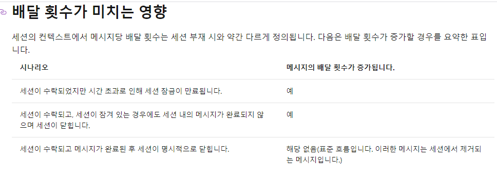
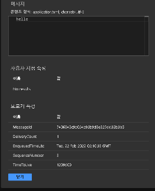
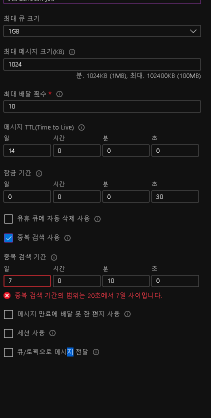
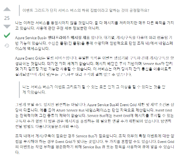
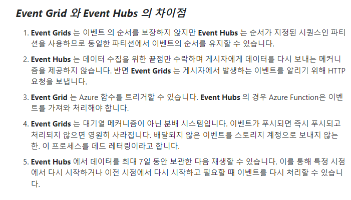

Azure 서비스 버스를 다루었던 경험을 기록한다.

## 짚고 넘어갈 점

### 용어의 정리

#### 메세징 브로커

일반적으로 아무생각없이 얘기하는 메세지 큐에 해당한다. 사실 메세지 큐만 있는 것이 아니라, 메세지 토픽도 있다. 2개의 차이는 유니캐스팅 vs 브로드캐스팅(멀티캐스팅) 차이이다.

MSA 해봤어요 라 얘기할 때, 메세지 큐를 썻습니다 ㅎㅎ 하는 사람은 경험이 없는 것이다, 메세지 브로크 시스템(플랫폼)을 써봤습니다 라 얘기해야한다.

왜냐면 토픽도 큐도 모두 둘다 사용하기 때문이다.

이유는 메세지 큐는 유니캐스트 기반의 라운드로빈 식의 스레드 풀처럼 하나의 메세지를 하나의 메세지 수신자(또는 구독자, 또는 워커)가 받아가면 메세지는 삭제되는 개념이고,

메세지 토픽은 디자인패턴의 옵저버 패턴 처럼 메세지가 수신되었을 때 감지를 위한 옵저버(또는 구독자, 또는 워커) 들에게 모두 메세지를 복사해서 던져주는 브로드캐스팅 개념이다.

아래 이미지를 참고하자

https://i.stack.imgur.com/B6H90.png


#### 큐

http://activemq.apache.org/how-does-a-queue-compare-to-a-topic.html

위에서 얘기했던 것처럼 큐의 경우는 아래의 시나리오에 사용된다.

- 특정 이벤트 (또는 작업)에 대해서 여러 인스턴스들이 순차적으로(또는 라운드로빈, 또는 랜덤) 이벤트를 처리해야하는 경우는 메세지 큐를 사용해야 한다.

#### 토픽

http://activemq.apache.org/how-does-a-queue-compare-to-a-topic.html

- 특정 이벤트를 관심있는 모든 이가 동시에(사실 거의 동시에) 이벤트를 수신해야하는 경우, 즉 브로드캐스팅이 필요한 경우

- 특정 이벤트를 위의 예시처럼 브로드캐스팅 되지만, 이벤트를 수신하고 이벤트가 관심있는 경우만 처리해야하는 경우, 즉, 멀티캐스팅으로 특정 이벤트만 필터링하고 싶은 경우


Azure 에서도 JMS 의 큐와 토픽과 같은 개념으로 설계가 되어있다. 

내 경험상 레빗엠큐와 조금 차이가 있다면, 토픽에 수신하고 싶은 구독자를 등록하는 과정이 꽤 번거롭고 복잡하다.

레빗엠큐는 특정 토픽 이름만 알면 자유롭게 구독자로 등록할 수 있다. 나는 UUID로 랜덤 문자열을 뽑아서 등록하게 했었다.

Azure 에서는 이 과정이 번거롭다. Azure Template 이라는 것을 통해 하드웨어 서버 OS 단에서 스크립트를 실행해서 등록하는 식의 과정이 있다.

파이썬의 경우에는 동적으로 등록하는 예제가 있던데, 자바의 경우는 어쩐지 모르겠다. 있을 거 같은데 좀 불편하더라.


또 특이한 부분이 토픽 리스너 클라이언트 생성자에 entrypath 를 셋업하는 문자열이 겁나 골때린다.

일반적으로 토픽/구독 이런 구성으로 접근해야하는데,

"topic/subscriptions/subs1" 과 같이 중간에 subscipriotns 키워드가 무조건 있어야한다.

뭐랄까 어트리뷰트키로 쓰려고 하는거같은데.. 저런 문자열 구성이라면 배열에 같이 섞이는 느낌인데 골때린다.

이거가지고 삽질하다가 빡쳐서 PR 날렸다, 자세한 것은 아래 내용 참고

https://github.com/Azure/azure-service-bus/pull/395

## 2번째빡침

Topic 을 리스너가 붙을 때, Topic/Subscriptions/Susb1 이런 식으로 중간에 SUbscriptions 딜리미터를 붙이는것도 짜증나는데, Subs1 이런것처럼 커넥션에 붙을 때 존재하지 않을수 있는 SUbscriptions 명을 붙여서 연결해야한다. 이게 좀 괴랄한게

Azure에서 구독 이란 개념은, 구독풀 또는 구독accessPoint 개념이 아니다. 이게 무슨 말이냐면, 

Topic/Subscriptions/Sub1 이란 곳에 3개의 서비스 인스턴스가 붙었다고 가정하자. 이 경우 Sub1로 토픽의 이벤트가 흘러들어왔을 때, 3개 모두가 브로드캐스팅 되는개념이 아니고 큐처럼 동작한다. 

즉 이 말은 3개의 인스턴스가 각 TOPIC에 붙을수있게 구독이 3개가 동적으로 만들어져야 한다. 아래 처럼 말이다.

- Topic/Subscriptions/App1(hostname)
- Topic/Subscriptions/App2(hostname)
- Topic/Subscriptions/App3(hostname)

문제는 rabbitmq 의 경우 subject(azure 에서는 topic) 의 구독이 선언된게 없으면 바로 자동으로 신규 구독이 만들어지는 데, azure 의 경우 없다고 하고 에러내고 끝이다 -_-

그렇다면 없을 경우 내가 새로이 createApi 호출해서 만들수있게 해야하는데, 그 개념이 없다.

management api 를 제공하기는 하는데 (https://docs.microsoft.com/en-us/previous-versions/azure/reference/hh780748(v=azure.100)?redirectedfrom=MSDN)

이걸 사용하려면 새로이 AD에 연결해서 토큰을 발급받는 등의 별도의 세션으로 접근해야한다.

왜 이런가해서 찾아봤더니, topic 에 붙을수있는 방법이, azure 의 서버 인스턴스가 로드되는 시점에 파워쉘과 같은 초기화 스크립트, 또는 리소스 식별 AD로 접근할수 있게 설계를 했던것이다.

이 경우 AZURE에서 관리 제공하는 PAAS나 SAAS 의 경우 쉽게 프로비저능 되는데, IAAS 또는 외부에서 연결하는 형태는 불가능하다 ㅡㅡ

com.microsoft.azure.servicebus.SubscriptionClient.class
```java
public final class SubscriptionClient extends InitializableEntity implements ISubscriptionClient {
    private static final Logger TRACE_LOGGER = LoggerFactory.getLogger(SubscriptionClient.class);
    private static final String SUBSCRIPTIONS_DELIMITER = "/subscriptions/";
}
```

2020-11-24

SDK를 까서 역공학을 해보니 ManagementClient 라는 이름의 클래스가 있어서 이를 사용해보았다.

최종적으로는 아래 createSubscription() 메소드를 만들어서 프로그래밍으로 처리가 가능함을 확인했으며, 또한 TopicClient 에서 사용하는 동일한 커넥션스트링도 사용이 되는걸 확인했다.

참고로 커넥션스트링의 스코프가 보내기,수신 외에 관리라는 스코프도 같이 있어야하는 것으로 보인다.

```

    public String createSubscription(String connectionString,
                                     String topic,
                                     String context) throws ServiceBusException, InterruptedException {
        ConnectionStringBuilder connectionStringBuilder = new ConnectionStringBuilder(connectionString);
        ManagementClient mng = new ManagementClient(connectionStringBuilder);
        String random = UUID.randomUUID().toString().split("-")[0];
        String time = LocalDateTime.now().format(DateTimeFormatter.ofPattern("yyyyMMddHHmmss"));

        final String subName = String.format("%s-%s-%s", context, time, random);

        SubscriptionDescription subscriptionDescription = new SubscriptionDescription(topic, subName);
        subscriptionDescription.setAutoDeleteOnIdle(Duration.ofDays(14));
        try {
            SubscriptionDescription aaa = mng.createSubscription(subscriptionDescription);
            return aaa.getSubscriptionName();
        } catch (MessagingEntityAlreadyExistsException e) {
            return subName;
        }
    }
    
    
```


### 메세지 속성

Java 버전의 Service Bus 는 기본적으로 IMessage 라는 클래스를 통해 메세지를 주고 받는다. 이 자료구조에는 대부분 사용할법한 기본적인 속성이 몇가지 있다. 속성에 없는 커스터마이징이 필요하다면 body에 본인이 직접 별도로 자료구조를 구성해야한다.

IMessage

-meesageId

-label

-replyTo

-replyToSessionId

-parintionKey

-deadletterSource

### 나의 무뇌함

메세지를 보내는건 단순하지만, 메세지를 수신하는 게 조금 까다롭다. 

수신 하는 방법은 기본적으로 2가지이다.

자동모드(ReceiveAndDelete) 그리고 PeekLock(명시적으로수신)

이름부터느끼겠지만, 리시브앤드딜리트는 수신하면 자동으로 수신했다는 이벤트를 브로커에 알리고 메세지가 삭제되는 개념이다.

com.microsoft.azure.servicebus.ReceiveMode
```
public enum ReceiveMode {
    /**
     * In this mode, received message is not deleted from the queue or subscription, instead it is temporarily locked to the receiver, making it invisible to other receivers. Then the service waits for one of the three events
     * <ul>
     * <li>If the receiver processes the message successfully, it calls <code>complete</code> and the message will be deleted.</li>
     * <li>If the receiver decides that it can't process the message successfully, it calls <code>abandon</code> and the message will be unlocked and made available to other receivers.</li>
     * <li>If the receiver wants to defer the processing of the message to a later point in time, it calls <code>defer</code> and the message will be deferred. A deferred can only be received by its sequence number.</li>
     * <li>If the receiver wants to dead-letter the message, it calls <code>deadLetter</code> and the message will be moved to a special sub-queue called deadletter queue.</li>
     * <li>If the receiver calls neither of these methods within a configurable period of time (by default, 60 seconds), the service assumes the receiver has failed. In this case, it behaves as if the receiver had called <code>abandon</code>, making the message available to other receivers</li>
     * </ul>
     */
    PEEKLOCK,
    /**
     * In this mode, received message is removed from the queue or subscription and immediately deleted. This option is simple, but if the receiver crashes
     * before it finishes processing the message, the message is lost. Because it's been removed from the queue, no other receiver can access it.
     */
    RECEIVEANDDELETE
}

```

PeekLock 수신했다는 이벤트를 수신했다or 실패했다 응답을 수동으로 하는 개념이다.

이것이 필요한 것은 메세지를 전달해주는 것까지만 핸들링이 가능하다. 이후에는 어떻게 잘 써먹었는지 브로커 입장에서 알턱이 없다.

기본적으로 메세지가 전달시도할때부터 메세지는 전달당할 리스너에 의해 메세지 락킹이 된다. 락킹이 되면 다른 수신자는 이 메세지의 존재를 알수가 없다.

TOPIC 이나 QUEUE 나 모두 메세지 큐를 사용하기 때문에, 이러한 개념은 공통적이다.

리마인드 차원에서 얘기하면 큐의 경우 로드밸런싱 처럼 분배작업이 가능하다. 토픽은 큐를 이용해서 발행-구독 패턴을 적용한 개념일뿐, 결국은 큐다.

즉 토픽의 구독에 여러명이 하나의 구독에 달라붙게 되면, 메세지 큐처럼 동작하게 되어 메세지 수신 락킹 선점 싸움을 하게 된다. 먼저 선점한놈이 메세지 받고 끝인거다.

결론적으로 아래 설명할 PeekLock은 메세지 선점 싸움을 다시 시킬지 말지를 브로커가 알기 위한 작업인 셈이다. 메세지를 잘 써먹었는 지를 모르는 동안은 메세지가 락킹되고,

잘 써먹었는지 실패했는지를 알게 되면 메세지 수신을 다시 경쟁할수있게 언락킹 되는 것이다.

아래는 PeekLock 에서 해주어야할 ack 개념에 대해 이야기한다.

메세지를 수신했다는 ack 를 보내주어야한다. 왜냐면 queue 입장에서 메세지가 잘 수신됬는지 판단을 해야, 다시 보내줄지 말지를 고려할수 있기 때문이다.

응답ack 로 총 3가지의 개념이 있다. complete() , abandon(), deadletter() 3가지이다.

이 모드를 처리하려면 auto commit 모드를 제거해야한다. 

예를 들면 아래처럼 일반적인 자동생성 구성으로 할 경우엔 complete(), abandom() 과 같은 상태변화를 일으키는 메서드 호출시에 에러가 발생한다.

```
2021-05-25 17:45:10.947  INFO 7396 --- [pool-1-thread-4] c.g.e.s.ServiceBusExampleApplication     : COMPLETE
2021-05-25 17:45:10.947 ERROR 7396 --- [pool-1-thread-4] c.g.e.s.ServiceBusExampleApplication     : Delivery not found on the receive link.

java.lang.IllegalArgumentException: Delivery not found on the receive link.
	at com.microsoft.azure.servicebus.primitives.CoreMessageReceiver.generateDeliveryNotFoundException(CoreMessageReceiver.java:1177) ~[azure-servicebus-3.6.3.jar:na]
```

이러한 것은 auto commit 모드

아래처럼 SessionHandlerOptions 를 인자로 받는 메소드를 통해 수동 구성을 해야 이슈가 없다.
```
   receiveClient.registerMessageHandler(new IMessageHandler() {
            @Override
            public CompletableFuture<Void> onMessageAsync(IMessage iMessage) {
             
            }

            @Override
            public void notifyException(Throwable throwable, ExceptionPhase exceptionPhase) {
             
            }
        }, new MessageHandlerOptions(1, false, Duration.ofMinutes(1)), EXECUTOR);
```

complete는 초딩도 알수있는것처럼 성공처리이다.  peek-lock 모드일지라도, abadon() 이나 deadletter() 를 명시적으로 사용하지 않거나, 별도의 에러가 발생하지 않으면 SDK 내에서 자동으로 complete() 처리를 하기도 한다. auto commit 모드가 true 일 때에는 peek-lock 모드일지라도 자동으로 커밋된다. 

abandon (거부하다)와 deadletter(죽은편지) 는 모두 실패한다는 개념인데, 무슨 차이가 있는지 경계가 조금 애매모해서 삽질을 좀 했다.

abandon은 메세지를 일시적으로 수신할수 없다는 개념이다. 즉 메세지를 다시 보내달라는 요청이다. 다시 보내달라는 요청은 제한 값이 있다, 


이 것은 abandon 은 구독을 생성할 때 있는 "최대 배달 횟수" 를 의미한다. 즉 최대 배달 횟수가 10개로 설정되어있다면 abandon() 이벤트로 다시 보내주는 메세지 최대 갯수는 10번이라는 것이다.

최대 배달 횟수에 대한 얘기는 [이 공식문서#impact-of-delivery-count](https://docs.microsoft.com/ko-kr/azure/service-bus-messaging/message-sessions#impact-of-delivery-count) 에서 알수 있다.



abandon() 이 최대 배달 횟수의 최대치에 도달하면, 원본 메세지는 dead letter 처리 된다. 한국 번역판에 배달하지 못한 메세지로 되어있어서 번역상의 괴리감 떄문에 조금 헤맸다.

abandon 은 수신한 워커에서 처리가 불가능하다고 생각하고 다시 큐에 메세지를 복원한다.

재밌는 점은 abandon 으로 거부했던 워커가 이 메세지를 다시 수신할수도 있다.


dead letter(죽은 메세지) 는 일반 메세지와는 별도의 큐에서 관리가 된다. 일반적으로 메트릭에 알람이나 통계용으로 사용되는 게 기본이며, 별도로 dead letter 를 관리하는 큐에 직접 죽은 메세지를 수신해서 다시 처리할지 말지의 로직을 본인이 직접 구현해볼수도 있다.


## 레퍼런스

Azure 의 자바 기반 SDK 에 대한 모든 개발문서에 대한 링크

- https://docs.microsoft.com/en-us/java/api/com.microsoft.azure.functions.annotation.tableinput?view=azure-java-stable

https://docs.microsoft.com/en-us/azure/service-bus-messaging/service-bus-queues-topics-subscriptions#topics-and-subscriptions

https://stackoverflow.com/questions/45872802/azure-service-bus-topics-multiple-subscribers

https://docs.microsoft.com/ko-kr/azure/service-bus-messaging/service-bus-dotnet-get-started-with-queues

https://docs.microsoft.com/ko-kr/azure/architecture/patterns/publisher-subscriber

https://docs.microsoft.com/ko-kr/azure/event-grid/compare-messaging-services

https://docs.microsoft.com/ko-kr/azure/architecture/guide/architecture-styles/event-driven

https://www.serverlessnotes.com/docs/en/publish-subscribe-with-azure-service-bus

https://www.serverlessnotes.com/docs/en/azure-service-bus-fifo-pattern


## 서비스 버스 큐

어떠한 처리주체 N개의 배열 을 큐에 등록하고, 큐 등록 이벤트 를 트리거로 받아 워커 노드에서 큐의 원소 1개씩 빼어가서 작업이 실행되는 배치 프로그램을 작업할 일이 있었다.

서비스버스를 사용하고 있기에 자연스레 서비스 버스 큐를 사용했는데, 골때리는 부분이 있어서 기록한다.

전제조건으로 골때리는 게 있었는데, N개의 배열의 원소들은 유니크하지 않다. 이 말이 무슨 말인지 JSON 표기법으로 표현하면 ```[1,2,2,4,5,5]``` 이런식으로 2와 5가 중복되는 원소들이 존재한다. 이 배열을 그대로 큐에 등록하면 1,2,2,4,5,5 로 등록이 될 것이다. 유니크하지 않기 때문에, 2라는 작업이 2번 되고, 5라는 작업이 2번 될것이다. 

이를 막기 위해서는 2가지 방법을 생각해볼 수 있다.

- 큐에 등록할 떄, 이미 등록된 큐를 조회하는 방법
- 큐에 등록될 때, 중복방지를 통해 등록자체를 막는 방법

전자의 경우 이미 등록된 큐를 다시 조회해서 유니크한 것인지 찾아보는 오버헤드가 발생한다. 서비스버스 큐를 조회하는 RestfulAPI를 사용해야하는 부담감도 있다. 서비스 버스 큐를 조회하는 RestfulAPI가 부담되면 RDB 의 테이블에 저장해두고 중복 체크를 하는 방법도 생각해볼수 있는데, 이러면 뭐하는짓인가 란 생각이 든다.

결국 후자로 접근을 하게된다. 서비스버스에서는 큐의 identity 를 보장하는 MessageId 라는 필드가 담당하고 있다. 일반적으로 이는 생략해서 보내면 Azure 내에서 UUID 와 유사한 유니크값으로 할당해서 저장한다.
 
 
 
 
 골떄리는 것이 이 MessageID 가 RDB로 치면 PK 처럼 아이덴티티를 보장하는 필드라 생각했지만, 같은 MessageID를 중복으로 등록할수 있다. 황당하지만 실제 실험을 해보았고, 같은 MessageID 가 중복으로 등록이 되는 걸 확인했다.

실제로 아래 공식문서의 해당 필드를 보면

> 메시지 식별자는 메시지 및 해당 페이로드를 고유하게 식별하는 애플리케이션 정의 값입니다. 식별자는 자유 형식 문자열이고 애플리케이션 컨텍스트에서 파생된 GUID 또는 식별자를 반영할 수 있습니다. 중복 검색 기능을 사용하도록 설정되면 같은 MessageId를 갖는 메시지의 두 번째 및 추가 전송을 식별한 후 제거합니다.

중복 검색 기능을 활성화해야지 유니크한 무결성을 보장한다고 설명되어있다. 돈독이 단단히 오른 MS라 할수있다.

https://docs.microsoft.com/ko-kr/azure/service-bus-messaging/service-bus-messages-payloads




참고로 여기 캡처에 대해 설명을 해보면

### 최대 배달 횟수

배달못한 메세지(Dead Letter) 로 빠지기 위한 조건이다. 배달 횟수는 메세지를 수신하면 deliveryCount 라는 필드의값이 1개 증가한다. 일반적으로는 AUTO 메세지 수신모드(파괴적 읽기 모드)에서는 메세지가 에러없이 잘 전달되면 큐에서 제거가 되기때문에 의미는 없다. 이와 다르게 별도로  메세지 수신 PEEK-LOCK 모드(비파괴모드라 한다)일 경우 메세지를 수신한다고 해서 큐에서 제거되지 않고 PEEK-LOCK 에서 락을 해제하는 커밋이 되어야 제거된다. 수신한사람이 메세지 LOCK 을 걸게 되는데 LOCK 을 건 사람만이 LOCK 을 해제할수 있다. 여기서 LOCK 을 허용하는 타임아웃과 같은 유효시간이 있는데 이 시간이 경과하면 자동으로 LOCK 이 풀린다. 이 때 다시 메세지를 전달 하기 위해 큐에서 대기상태에 놓이게 되는데, 이때 deliveryCount가 1개 더 증가한다. 

### 중복 검색

참고로 가장 싼 일반 티어에서는 기능 지원하지 않는다.

> Service Bus의 기본 계층에서는 중복 검색을 지원하지 않습니다. 표준 및 프리미엄 계층은 중복 검색을 지원합니다. 이러한 계층 간의 차이점은 Service Bus 가격 책정을 참조하세요.

서비스버스에서 MessageId 는 중복여부를 체크하지 않는다. 이게 가장 의문인데, 프리미엄 티어에서만 쓸수있다는 것봐서는 돈놀음하려고 이렇게 설계한것같다. 하여튼 이를 막으려면 중복 검색 기능을 사용해야한다. 

> 중복 검색을 사용하면 지정된 기간 동안 큐 또는 토픽으로 전송된 모든 메시지의 애플리케이션 제어 MessageId를 추적하는 데 도움이 됩니다. 해당 기간 중에 기록된 MessageId로 새 메시지가 전송되면 해당 메시지는 수락된 것으로 보고되고(보내기 작업 성공), 새로 보낸 메시지는 즉시 무시되고 삭제됩니다. MessageId를 제외한 메시지의 다른 부분은 고려되지 않습니다.

https://docs.microsoft.com/ko-kr/azure/service-bus-messaging/duplicate-detection


### 유휴 큐에 자동 삭제

TTL 이 넘어간 메세지는 자연히 삭제되지만, 이와는 별개로 IDLE 상태가 된 메세지를 삭제하곘다는 의미이다. IDLE 처리는 TTL과 무관하게 기본적으로 5분 동안 메세지 사용이 없이 뻘하게 존재만한다면 IDLE로 처리된다.
자세한 것은 아래를 참고

> Azure Resource Manager 잠금 수준을 CanNotDelete네임스페이스 또는 더 높은 수준으로 설정해도 엔터티 AutoDeleteOnIdle 가 삭제되는 것을 방지할 수 없습니다. 엔터티를 삭제하지 않으려면 속성을 DataTime.MaxValue.로 설정합니다AutoDeleteOnIdle.

https://docs.microsoft.com/ko-kr/azure/service-bus-messaging/message-expiration


## 서비스버스 vs 이벤트 그리드

azure 에는 여러 메세지 솔루션이 있다. 아키텍처 논의를 하다가 이벤트 그리드의 도입은 어떠하냐는 토픽이 나와서 관련해서 리서치 했었다.

기본적으로는 Azure 공식 문서를 참조할수있다.
https://docs.microsoft.com/ko-kr/azure/event-grid/compare-messaging-services

아래는 스택오버플로우에 괜찮은 글이 있어서 캡쳐



https://stackoverflow.com/questions/63030143/azure-event-grid-vs-service-bus

이벤트그리드 vs 이벤트 허브의 차이점에 대해서 나오는 얘기

https://stackoverflow.com/questions/57740782/message-bus-vs-service-bus-vs-event-hub-vs-event-grid




아래도 괜찮은 내용

https://cloudavenue.in/2021/06/22/when-to-use-event-grid-and-when-to-use-service-bus/

<table><tbody><tr><td><strong>Parameters</strong></td><td><strong>Event Grid</strong></td><td><strong>Service Bus</strong></td></tr><tr><td>Purpose</td><td>React to status changes, Event-based architecture (for example: sending an event on file uploaded in Azure Blob storage, event on a job completion)</td><td>Reliable Message processing (for example: financial transactions, ecommerce order processing etc.)</td></tr><tr><td>Throughput</td><td>Event Grid provided more throughput 5000 events /sec or 1 MB /sec (whichever is met first) per topic</td><td>Microsoft has not provided any guaranteed throughput for Service bus (older documentation used to claim it to be 2000 messages /sec)</td></tr><tr><td>At-Least-Once&nbsp; delivery guarantee</td><td>Yes <br>(based on retries. Drop or dead lettering after maximum retires).</td><td>Yes<br> (using PeekLock receive mode. It’s the default)</td></tr><tr><td>At-Most-Once&nbsp;delivery guarantee</td><td>No</td><td>Yes <br>(using ReceiveAndDelete receive mode)</td></tr><tr><td>Connection state recovery In case of disconnect can client resumes from the same state?</td><td>No</td><td>Yes</td></tr><tr><td>Communication Protocols</td><td>HTTP</td><td>AMQP, TCP/IP, HTTP</td></tr><tr><td>Maximum number of topics</td><td>Event Grid supports 100,000 topics in an event domain. &nbsp;</td><td>Service Bus supports 10,000 topics per namespace for the Basic or Standard tier. For the Premium tier, 1,000 per messaging unit (MU). Maximum limit is 4,000.</td></tr><tr><td>Maximum number of subscribers</td><td>500 subscriptions per topic</td><td>2,000 subscriptions per topic</td></tr><tr><td>Intended Consumers / Expects action?</td><td>No</td><td>Yes</td></tr><tr><td>Data/Message Content</td><td>Event Grid is used for light weight messaging (called events) with no data that has triggered the event.</td><td>Service Bus is used to deliver reliable messages, asynchronously, which are intended to serve a purpose.</td></tr><tr><td>Serverless</td><td>Yes <br>Pay only for the amount you use Event Grid (operations charges).</td><td>No <br>Base charges + operations charges.</td></tr><tr><td>Polling mechanism</td><td>Push</td><td>Pull <br>(.NET, Java, JavaScript, and Go SDKs provide push-style API)</td></tr><tr><td>Message payload encryption</td><td>No</td><td>Yes</td></tr><tr><td>In-Order Delivery (FIFO)</td><td>No</td><td>Yes</td></tr><tr><td>Duplicate Detection</td><td>No</td><td>Yes</td></tr><tr><td>Transactions Support</td><td>No</td><td>Yes</td></tr><tr><td>Messages/Events to multiple subscribers</td><td>Yes</td><td>Yes</td></tr><tr><td>Retry mechanism</td><td>Yes</td><td>Yes</td></tr><tr><td>Dead lettering</td><td>Yes</td><td>Yes</td></tr><tr><td>Multi-region data replication (storage)</td><td>No</td><td>No</td></tr><tr><td>Receive mode</td><td>Push</td><td>Peek &amp; Lock<br>Receive &amp; Delete</td></tr><tr><td>Lock duration</td><td>No Locks</td><td>30 seconds (default)<br>You can renew the message lock for the same lock duration each time manually or use the automatic lock renewal feature where the client manages lock renewal for you.</td></tr><tr><td>Batch Processing</td><td>Yes</td><td>Yes</td></tr><tr><td>Message Lifetime</td><td>No retention. Event Grid expires all events that aren’t delivered within maximum number of delivery attempts (default is 30) and the event time-to-live (default is 1440 minutes).</td><td>&gt;7 days</td></tr><tr><td>Message Size</td><td>The size of an array can be up to 1 Mb. Each event in an array is limited to 64 KB.</td><td>256 KB for Standard tier, 1 MB for Premium tier.</td></tr><tr><td>Message routing and filtering capabilities</td><td>Yes </td><td>Yes</td></tr></tbody></table>


간략하게 정리하면 스택오버플로우에 나온 것처럼, 이벤트 그리드는 푸시 메카니즘 그리고 서비스 버스는 폴링 메카니즘으로 차이가 크다. 푸시 메카니즘하고 폴링 메카니즘의 가장 큰 특징은 배압이다. 폴링은 자기가 적당히 가져갈만큼 가져가기 때문에 스스로 조절이 가능하지만, 푸시의 경우 보내는 측이 뒤져바라 하하하! 하고 보내버리면 받는쪽에서 넘쳐서 버퍼 오버플로우로 데이터를 유실할수 있다. 이렇다보니 푸시의 경우 받는 측을 신경쓰면서 보내거나, 아니면 알아서 잘받겄지 하고 보내야하는 머리 아픈 상황이 생긴다. 가장 안정적인 것은 기능이 담백하게 제거된 쪽이리라 그래서 무식해보이지만 이런 배압 문제 때문에 폴링 방식이 안정성에서는 조금 더 보장이 된다고 해서 엔터프라이즈에서 쓰니 마니 이런 얘기가 있는 것이다. 폴링 모드에서 커밋과 같은 개념(서비스버스로 치면 peek-lock)이 가능한 것도 폴 당겨가는 주체가 최종적으로 나 잘받았어 하고 '커밋' 하는 것과 푸시 메카니즘에서 보내는 측에서 계속 신경쓰면서 '야 나 커밋해도되?' 라고 물어보는 것은 당연히 전자인 폴링이 자기 스스로 잘 받았음을 감지하고 '커밋' 하는 것이 더 효율적이다.

이벤트 그리드를 리서치해보니 앞서 말헀던 전자와 후자중에서 후자에 가까워보였다. 이벤트를 잘 받곘거니 하고 이벤트를 전파하는 것에만 초점을 둔다. 서비스 버스 처럼 고수준의 dead letter 리트라이 처리나 peek-lock 모드를 지원하지 않는다. 이런 관점에서는 서비스 버스가 좋아보이지만 이건 또 상황에 따라 다르다. 서비스 버스는 폴링을 한다는 메카니즘 특징이 독이 되기도 한다. 방화벽 적인 측면에서 공개적인 서비스에서는 사용이 불가능하고, 많은 수의 클라이언트가 폴링하게 되면 잦은 호출(폴링 호출 될 때 마다 대응해줘야함으로)로 인해 푸시 메카니즘에 비해 리소스 사용량이 많아서 구독 할수있는 클라이언트 수가 푸시 메카니즘 보다 적을 수 밖에 없다.