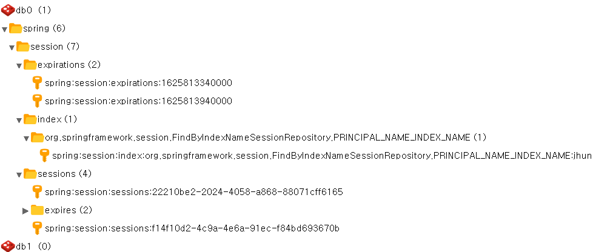

SSO 프로젝트에서 스프링 세션을 통해 WAS 클러스터링을 하고자 분석했던 내용을 기록한다.

TODO: 아마 이 글 어딘가에 있는 클래스 모델도 이곳으로 옮겨야한다.


## 스프링세션 REDIS 버킷 구조 분석

redis는 키값 유형의 nosql 이다. RDBMS 에서 테이블이라고 하는 인스턴스의 집합을 키값 nosql 에서는 버킷(bucket) 이라고 한다.

아래는 마틴파울러의 NOSQL 이란 책에서 소개된 RDB 와의 차이를 나타내는 도표이다.

RDB|KeyValue|
|---|---|
|Mysql,Oracle,SqlServer|REDIS,Memcached,Riak|
|테이블|버킷|
|레코드(row)|키-값|
|레코드ID(PK)|키|


spring-session-redis 를 사용해보면, redis에 아래처럼 저장이 된다.



크게 굵직하게 생성되는 버킷은 아래와 같다. 
- spring.session.expirations
- spring.session.index
- spring.session.sessions

키의 이름은 버킷 주소와 합쳐져 있는 것이 특징이다.


버킷 : spring.session.expirations
키 : spring:session:expirations:1625813340000

마치 자바의 패키지와 클래스의 구조와 유사함을 알수 있다.

> 리악에서는 키를 버킷에 저장하는데, 버킷은 그저 키를 나누는 방법일 뿐이다. 버킷을 키를 위한 평평한 이름공간(namespace) 이라 생각해도 무방하다. - 마틴파울러 NOSQL


특징에 대해서는 이해가 되었고, 실제 RDBMS 와 조회 관점에서의 차이를 알아보자.
설명을 위한 예시로 아래의 버킷이 있고 ,키들이 있다고 가정하자

- 버킷 
  - user.id

- 키
    - user.id.1
    - user.id.2
    - user.id.3 

예를 들어서 rdbms 에서 query 를 통해서는 user의 id 가 1번인 사용자의 데이터를 얻고 싶다면 아래처럼 쿼리된다.

'user 라는 테이블에서 id 라는 필드가 1인 레코드를 쿼리하겠다'

``` select * from user where id = 1;``` 

반면 redis 메카니즘 기반으로 검색을 하게된다면 아래처럼 된다.

'user.id.1 이라는 키가 존재하는가?'

``` find key 'user.id.1' ? ```

redis 와 같은 키 값 스토리지는 기본적으로 키가 존재함을 전제로 사용이 가능한 구성이다. 따라서 값을 기준으로 검색한다는 개념이 없고, 오로지 키를 통해서 값에 접근을 해야한다. (특정 키 값 스토리지 벤더는 사용자 편의를 위해서 값을 기준으로 검색하는 기능을 제공 할수도 있다고 한다.) 이런 메카니즘적 특성을 이점으로 빠른 검색(색인)을 보장하는 구성이다.

> 모든 키-값 저장소는 키로 조회할수 있고, 그게 전부다. 값 컬럼의 특정 속성을 사용해 조회해야 한다면 데이터베이스 기능을 활용할 수 없고, 애플리케이션에서 값을 읽어 해당 속성이 조건을 만족하는지 직접 확인해야 한다. - 마틴파울러 NOSQL 8장

이 차이를 이해해야, 스프링 세션이 redis 에 저장되는 자료구조 메카니즘을 이해할수 있다.

또한 스프링 세션에 사용되는 키들의 값은 대다수 binary 유형이고, 이 binary 는 자바의 직렬화 이진 데이터이다. 보통 Json 이나 xml 과 같은 범용적인 직렬화 메카니즘을 떠올릴수 있지만, 자바의 다양한 상속 구성을 범용적인 직렬화 메카니즘으로 표현이 어려울 때가 많기 때문에, 객체를 완벽히 복호화하기 위해 자바 직렬화를 사용한다. 애초에 스프링 프레임워크는 자바 기반의 프레임워크이니 당연하다.


### 스프링 세션 버킷

스프링 세션에서는 버킷을 아래처럼 총 4개를 사용한다.

- spring.session.expirations
- spring.session.index
- spring.session.sessions
- spring.session.sessions.expires


#### spring.session.expirations

이 버킷은 유효 시간이 지난 세션을 제거하는 스케줄러를 위한 일종의 큐와 같은 버킷이다.

키의 이름은 버킷:{만료시간} 으로 되어있다.

- (bucket) spring.session.expirations
    - (key) spring:session:expirations:1625813340000
        - (value:binary) \xAC\xED\x00\x05t\x00,expires:f14f10d2-4c9a-4e6a-91ec-f84bd693670b
    - (key) spring:session:expirations:1625813340000
        - (value:binary) \xAC\xED\x00\x05t\x00,expires:f14f10d2-4c9a-4e6a-91ec-f84bd693670b

위 데이터 중에서 spring:session:expirations:1625813340000 라는 키를 분석해보면, 1625813340000 유닉스 시간(한국 시간으로 변환하면 2021년 7월 9일 금요일 오후 3:49:00 )에 제거해야할 세션 f14f10d2-4c9a-4e6a-91ec-f84bd693670b 이 있음을 나타낸다.

#### spring.session.index

이 네임스페이스는 스프링 시큐리티에서 자격 증명의 이름으로 검색할때 세션을 찾기 위한 용도의 인덱스이다.

자격증명(principal) 은 여러가지 수단이 될수 있는 데, 사용자 계정명 이거나 사용자 실명일 수도 있으며, 또는 어떠한 해시난수 (토큰) 일 수 있다.


- (bucket) spring:session:index
    - (key) spring:session:index:org.springframework.session.FindByIndexNameSessionRepository.PRINCIPAL_NAME_INDEX_NAME:jhun    
        - (value:binary) \xAC\xED\x00\x05t\x00$f14f10d2-4c9a-4e6a-91ec-f84bd693670b
        
위 데이터를 보면 jhun 이라는 사용자 계정명을 자격증명으로 사용하고 있으며, jhun 이라는 계정명의 세션은 f14f10d2-4c9a-4e6a-91ec-f84bd693670b 임을 알수 있다.

#### spring.session.sessions

세션이라는 개념이 저장되는 공간으로 가장 중요하다, 여기서 소개하는 모든 키들은 모두 이 버킷을 참조한다고 봐도 된다.
키의 패턴은 spring:session:sessions:{세션ID} 유형으로 저장이 된다.

이 키의 값은 hash 이고, 세션에 담기는 여러가지 사용자 데이터가 담긴다. 최초 세션이 생성된 시각, 마지막 접근 시각 속성들이 포함되고, 확장성을 염두해서 세션을 사용하는 모듈들의 위한 본인들이 사용하기 위해 추가하는 속성들을 담을수 있는 속성도 있다. 

- spring:session:sessions:f14f10d2-4c9a-4e6a-91ec-f84bd693670b (value:hash)
 
    - maxInactiveInterval = \xAC\xED\x00\x05sr\x00\x11java.lang.Integer\x12\xE2\xA0\xA4\xF7\x81\x878\x02\x00\x01I\x00\x05valuexr\x00\x10java.lang.Number\x86\xAC\x95\x1D\x0B\x94\xE0\x8B\x02\x00\x00xp\x00\x00\x07\x08
        
    - creationTime = \xAC\xED\x00\x05sr\x00\x0Ejava.lang.Long;\x8B\xE4\x90\xCC\x8F#\xDF\x02\x00\x01J\x00\x05valuexr\x00\x10java.lang.Number\x86\xAC\x95\x1D\x0B\x94\xE0\x8B\x02\x00\x00xp\x00\x00\x01z\x89\xEB4\x07
        
    - lastAccessedTime = \xAC\xED\x00\x05sr\x00\x0Ejava.lang.Long;\x8B\xE4\x90\xCC\x8F#\xDF\x02\x00\x01J\x00\x05valuexr\x00\x10java.lang.Number\x86\xAC\x95\x1D\x0B\x94\xE0\x8B\x02\x00\x00xp\x00\x00\x01z\x89\xF4.M
        
    - sessionAttr:SPRING_SECURITY_CONTEXT = \xAC\xED\x00\x05sr\x00=org.springframework.security.core.context.SecurityContextImpl\x00\x00\x00\x00\x00\x00\x02\x08\x02\x00\x01L\x00\x0Eauthenticationt\x002Lorg/springframework/security/core/Authentication;xpsr\x00Oorg.springframework.security.authentication.UsernamePasswordAuthenticationToken\x00\x00\x00\x00\x00\x00\x02\x08\x02\x00\x02L\x0
        
        (..중략..)
        \x00\x08templatet\x00\x0D\xED\x83\xAC\xED\x94\x8C\xEB\xA6\xBFUSERsq\x00~\x00\x1B\x00\x00\x00\x1At\x00\x04userppsq\x00~\x00bq\x00~\x00\x16q\x00~\x002t\x00\x10MyApp1 \xEA\xB6\x8C\xED\x95\x9Csq\x00~\x00\x1B\x00\x00\x00\x1Ct\x00\x0Bmpoker_userppxq\x00~\x00\x0Dsr\x00Horg.springframework.security.web.authentication.WebAuthenticationDetails\x00\x00\x00\x00\x00\x00\x02\x08\x02\x00\x02L\x00\x0DremoteAddressq\x00~\x00\x0FL\x00\x09sessionIdq\x00~\x00\x0Fxpt\x00\x0F0:0:0:0:0:0:0:1pt\x00\x04jhunq\x00~\x00\x8B


**maxInactiveInterval**

세션을 사용할수 있는 최대허용 시간 설정 정보이다. 일반적으로 세션타임아웃이라고 하는 개념이다. 초 기준(60초, 180초 등등)으로 저장이 된다.  

**creationTime**

최초 세션이 만들어진 시간이다. 

**lastAccessedTime**

마지막으로 세션이 활성화 된 시간을 말한다. 활성화 되는 기준은 http request 가 발생해서, 서블릿에서 Session.getSession() 을 호출했을 때 lastAccessedTime 이 갱신 된다. 

> The session is considered to be accessed when a request that is part of the session is first handled by the servlet container.

**sessionAttr:{모듈명}**

sessionAttr 이란 키명은 Session Attribute 의미하며, 세션에 기본 사양 외의 추가적인 데이터를 담을 수 있는 속성이다. 
에시로 아래 데이터를 기준으로 보면, 스프링 시큐리티 모듈(SPRING_SECURITY_CONTEXT)에서 생성하고 사용하는 값임을 알수있다. 이 값은 계정의 권한 정보 등이 담겨 있다.

sessionAttr:SPRING_SECURITY_CONTEXT = \xAC\xED\x00\x05sr\x00=org.springframework.security.core.context.SecurityContextImpl\x00\x00\x00\x00\x00\x00\x02\x08\x02\x00\x01L\x00\x0Eauthenticationt\x002Lorg/springframework/security/core/Authentication;xpsr\x00Oorg.springframework.security.authentication.UsernamePasswordAuthenticationToken\x00\x00\x00\x00\x00\x00\x02\x08\x02\x00\x02L\x00\x0Bcredentialst\x00\x12Ljava/lang/Object;L\x00\x09principalq\x00~\x00\x04xr\x00Gorg.springframework.security.authentication.AbstractAuthenticationToken\xD3\xAA(~nGd\x0E\x02\x00\x03Z\x00\x0DauthenticatedL\x00\x0Bauthoritiest\x00\x16Ljava/util/Collection;L\x00\x07detailsq\x00~\x00\x04xp\x01sr\x00&java.util.Collections$UnmodifiableList\xFC\x0F%1\xB5\xEC\x8E\x10\x02\x00\x01L\x00\x04listt\x00\x10Ljava/util/List;xr\x00,java.util.Collections$UnmodifiableCollection\x00(com.mycomp.myauth.core.authority.MyCompRoleu\xAB\xE9\xDF\xD7Cfr\
        (..중략..)
        \x00\x08templatet\x00\x0D\xED\x83\xAC\xED\x94\x8C\xEB\xA6\xBFUSERsq\x00~\x00\x1B\x00\x00\x00\x1At\x00\x04userppsq\x00~\x00bq\x00~\x00\x16q\x00~\x002t\x00\x10MyApp1 \xEA\xB6\x8C\xED\x95\x9Csq\x00~\x00\x1B\x00\x00\x00\x1Ct\x00\x0Bmpoker_userppxq\x00~\x00\x0Dsr\x00Horg.springframework.security.web.authentication.WebAuthenticationDetails\x00\x00\x00\x00\x00\x00\x02\x08\x02\x00\x02L\x00\x0DremoteAddressq\x00~\x00\x0FL\x00\x09sessionIdq\x00~\x00\x0Fxpt\x00\x0F0:0:0:0:0:0:0:1pt\x00\x04jhunq\x00~\x00\x8B


#### spring.session.sessions.expires

스케줄러에 의해 세션이 관리가 되지만, 스케줄러 외의 세션에 관심사가 있는 주체가 세션이 제거되었음을 체크해야할 때 사용하는 버킷이다.

비슷한 목적을 가진 키가 여러개가 있는 것으로 보이는 것은 스케줄러와의 커플링을 제거하기 위해서이고, 
spring.session.expirations 의 키는 언제든 삭제가 될수 있기 때문이다. 

- spring:session:sessions:expires:f14f10d2-4c9a-4e6a-91ec-f84bd693670b

    - null

단순히 참고를 위한 로그 정도의 값을 가지고 있음을 알수 있다.

## Cloud 기반 Redis 에서 보여지는 스프링 이슈.

AWS나 Azure 의 REDIS 를 사용하고자 하면,  아래와 같은 에러를 볼수 있다.

```

org.springframework.beans.factory.BeanCreationException: Error creating bean with name 'enableRedisKeyspaceNotificationsInitializer' defined in class path resource [org/springframework/boot/autoconfigure/session/RedisSessionConfiguration$SpringBootRedisHttpSessionConfiguration.class]: Invocation of init method failed; nested exception is java.lang.IllegalStateException: Unable to configure Redis to keyspace notifications. See https://docs.spring.io/spring-session/docs/current/reference/html5/#api-redisindexedsessionrepository-sessiondestroyedevent
	at org.springframework.beans.factory.support.AbstractAutowireCapableBeanFactory.initializeBean(AbstractAutowireCapableBeanFactory.java:1796) ~[spring-beans-5.2.2.RELEASE.jar:5.2.2.RELEASE]
	at org.springframework.beans.factory.support.AbstractAutowireCapableBeanFactory.doCreateBean(AbstractAutowireCapableBeanFactory.java:595) ~[spring-beans-5.2.2.RELEASE.jar:5.2.2.RELEASE]
	at org.springframework.beans.factory.support.AbstractAutowireCapableBeanFactory.createBean(AbstractAutowireCapableBeanFactory.java:517) ~[spring-beans-5.2.2.RELEASE.jar:5.2.2.RELEASE]
	at org.springframework.beans.factory.support.AbstractBeanFactory.lambda$doGetBean$0(AbstractBeanFactory.java:323) ~[spring-beans-5.2.2.RELEASE.jar:5.2.2.RELEASE]
	at org.springframework.beans.factory.support.DefaultSingletonBeanRegistry.getSingleton(DefaultSingletonBeanRegistry.java:222) ~[spring-beans-5.2.2.RELEASE.jar:5.2.2.RELEASE]
	at org.springframework.beans.factory.support.AbstractBeanFactory.doGetBean(AbstractBeanFactory.java:321) ~[spring-beans-5.2.2.RELEASE.jar:5.2.2.RELEASE]
	at org.springframework.beans.factory.support.AbstractBeanFactory.getBean(AbstractBeanFactory.java:202) ~[spring-beans-5.2.2.RELEASE.jar:5.2.2.RELEASE]
	at org.springframework.beans.factory.support.DefaultListableBeanFactory.preInstantiateSingletons(DefaultListableBeanFactory.java:879) ~[spring-beans-5.2.2.RELEASE.jar:5.2.2.RELEASE]
	at org.springframework.context.support.AbstractApplicationContext.finishBeanFactoryInitialization(AbstractApplicationContext.java:878) ~[spring-context-5.2.2.RELEASE.jar:5.2.2.RELEASE]
	at org.springframework.context.support.AbstractApplicationContext.refresh(AbstractApplicationContext.java:550) ~[spring-context-5.2.2.RELEASE.jar:5.2.2.RELEASE]
	at org.springframework.boot.web.servlet.context.ServletWebServerApplicationContext.refresh(ServletWebServerApplicationContext.java:141) ~[spring-boot-2.2.2.RELEASE.jar:2.2.2.RELEASE]
	at org.springframework.boot.SpringApplication.refresh(SpringApplication.java:747) [spring-boot-2.2.2.RELEASE.jar:2.2.2.RELEASE]
	at org.springframework.boot.SpringApplication.refreshContext(SpringApplication.java:397) [spring-boot-2.2.2.RELEASE.jar:2.2.2.RELEASE]
	at org.springframework.boot.SpringApplication.run(SpringApplication.java:315) [spring-boot-2.2.2.RELEASE.jar:2.2.2.RELEASE]
	at org.springframework.boot.SpringApplication.run(SpringApplication.java:1226) [spring-boot-2.2.2.RELEASE.jar:2.2.2.RELEASE]
	at org.springframework.boot.SpringApplication.run(SpringApplication.java:1215) [spring-boot-2.2.2.RELEASE.jar:2.2.2.RELEASE]
	at com.mycomp.auth_server.AuthServerApplication.main(AuthServerApplication.java:15) [classes/:na]
	at sun.reflect.NativeMethodAccessorImpl.invoke0(Native Method) ~[na:1.8.0_292]
	at sun.reflect.NativeMethodAccessorImpl.invoke(NativeMethodAccessorImpl.java:62) ~[na:1.8.0_292]
	at sun.reflect.DelegatingMethodAccessorImpl.invoke(DelegatingMethodAccessorImpl.java:43) ~[na:1.8.0_292]
	at java.lang.reflect.Method.invoke(Method.java:498) ~[na:1.8.0_292]
	at org.springframework.boot.devtools.restart.RestartLauncher.run(RestartLauncher.java:49) [spring-boot-devtools-2.2.2.RELEASE.jar:2.2.2.RELEASE]
Caused by: java.lang.IllegalStateException: Unable to configure Redis to keyspace notifications. See https://docs.spring.io/spring-session/docs/current/reference/html5/#api-redisindexedsessionrepository-sessiondestroyedevent
	at org.springframework.session.data.redis.config.ConfigureNotifyKeyspaceEventsAction.getNotifyOptions(ConfigureNotifyKeyspaceEventsAction.java:83) ~[spring-session-data-redis-2.2.0.RELEASE.jar:2.2.0.RELEASE]
	at org.springframework.session.data.redis.config.ConfigureNotifyKeyspaceEventsAction.configure(ConfigureNotifyKeyspaceEventsAction.java:57) ~[spring-session-data-redis-2.2.0.RELEASE.jar:2.2.0.RELEASE]
	at org.springframework.session.data.redis.config.annotation.web.http.RedisHttpSessionConfiguration$EnableRedisKeyspaceNotificationsInitializer.afterPropertiesSet(RedisHttpSessionConfiguration.java:333) ~[spring-session-data-redis-2.2.0.RELEASE.jar:2.2.0.RELEASE]
	at org.springframework.beans.factory.support.AbstractAutowireCapableBeanFactory.invokeInitMethods(AbstractAutowireCapableBeanFactory.java:1855) ~[spring-beans-5.2.2.RELEASE.jar:5.2.2.RELEASE]
	at org.springframework.beans.factory.support.AbstractAutowireCapableBeanFactory.initializeBean(AbstractAutowireCapableBeanFactory.java:1792) ~[spring-beans-5.2.2.RELEASE.jar:5.2.2.RELEASE]
	... 21 common frames omitted
Caused by: org.springframework.dao.InvalidDataAccessApiUsageException: ERR unknown command `CONFIG`, with args beginning with: `get`, `notify-keyspace-events`, ; nested exception is redis.clients.jedis.exceptions.JedisDataException: ERR unknown command `CONFIG`, with args beginning with: `get`, `notify-keyspace-events`, 
	at org.springframework.data.redis.connection.jedis.JedisExceptionConverter.convert(JedisExceptionConverter.java:69) ~[spring-data-redis-2.2.3.RELEASE.jar:2.2.3.RELEASE]
	at org.springframework.data.redis.connection.jedis.JedisExceptionConverter.convert(JedisExceptionConverter.java:42) ~[spring-data-redis-2.2.3.RELEASE.jar:2.2.3.RELEASE]
	at org.springframework.data.redis.PassThroughExceptionTranslationStrategy.translate(PassThroughExceptionTranslationStrategy.java:44) ~[spring-data-redis-2.2.3.RELEASE.jar:2.2.3.RELEASE]
	at org.springframework.data.redis.FallbackExceptionTranslationStrategy.translate(FallbackExceptionTranslationStrategy.java:42) ~[spring-data-redis-2.2.3.RELEASE.jar:2.2.3.RELEASE]
```

이는 키가 삭제되면 발생하는 이벤트를 구독하려는 데, 이에 대한 기능을 할수가 없어서 발생하는 에러이다.

이에 대해서 많은 issue 재기가 발생했고, spring session 에서 공식적으로 이를 인지하고 가이드 문서(https://github.com/spring-projects/spring-session/issues/124)를 내놓았다.

가이드의 핵심적인 방법을 요약하면, 아래와 같은 설정 객체를 스프링 빈으로 올리면 해결이 된다.

```java
@Configuration
public class RedisConfig{   
   @Bean
    public static ConfigureRedisAction configureRedisAction() {
        return ConfigureRedisAction.NO_OP;
    }
}
```

이 스프링 빈은 Redis 자동구성에서 사용이 된다. REDIS 자동설정에서 스프링 빈 중에 설정 구성 객체가 NO_OP 이 있음을 알게되면, 키 삭제 이벤트 구독을 구성하지 않고 무시하게끔 처리가 된다.

```java

package org.springframework.session.data.redis.config.annotation.web.http;

@Configuration(proxyBeanMethods = false)
public class RedisHttpSessionConfiguration extends SpringHttpSessionConfiguration{
//...
	/**
	 * Ensures that Redis is configured to send keyspace notifications. This is important
	 * to ensure that expiration and deletion of sessions trigger SessionDestroyedEvents.
	 * Without the SessionDestroyedEvent resources may not get cleaned up properly. For
	 * example, the mapping of the Session to WebSocket connections may not get cleaned
	 * up.
	 */
	static class EnableRedisKeyspaceNotificationsInitializer implements InitializingBean {

		private final RedisConnectionFactory connectionFactory;

		private ConfigureRedisAction configure;

		EnableRedisKeyspaceNotificationsInitializer(RedisConnectionFactory connectionFactory,
				ConfigureRedisAction configure) {
			this.connectionFactory = connectionFactory;
			this.configure = configure;
		}

		@Override
		public void afterPropertiesSet() {
            
		    // 구성 인스턴스가 ConfigureRedisAction.NO_OP 이라면 그냥 무시. 	    
			if (this.configure == ConfigureRedisAction.NO_OP) {
				return;
			}
			
			
			RedisConnection connection = this.connectionFactory.getConnection();
			try {
				this.configure.configure(connection);
			}
			finally {
				try {
					connection.close();
				}
				catch (Exception ex) {
					LogFactory.getLog(getClass()).error("Error closing RedisConnection", ex);
				}
			}
		}

	}

}

```
