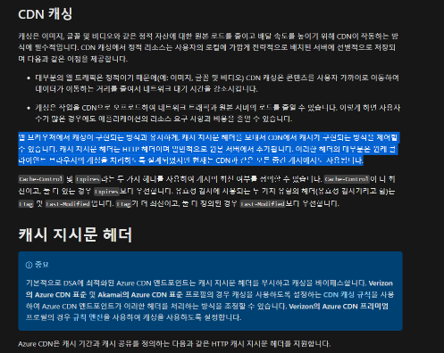
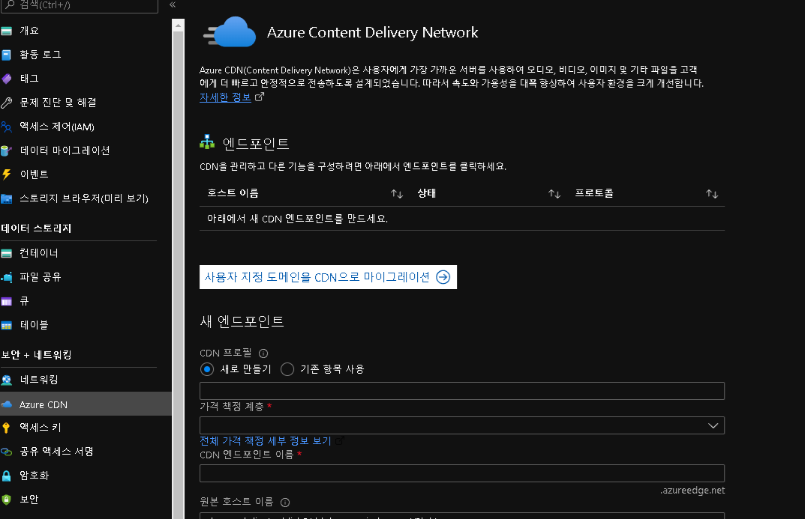
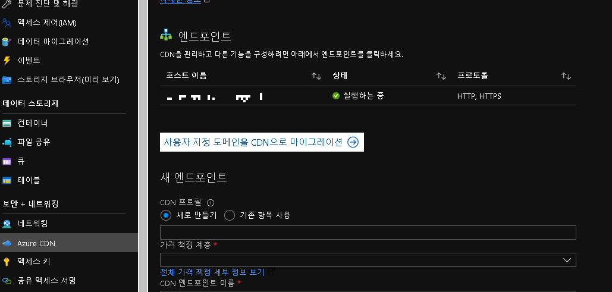
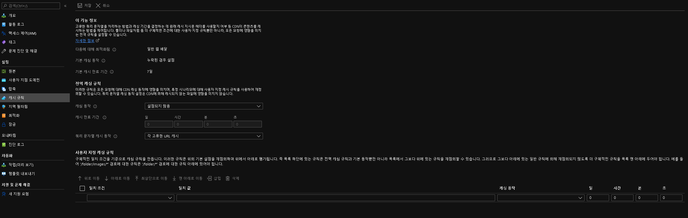
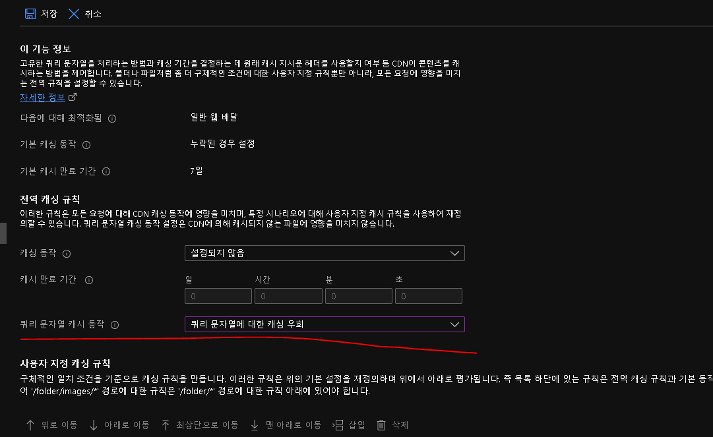

## 캐싱이란

CDN 을 쓰는 주된 이유이기도 하다. origin 이 한국에 있고, 미국, 유럽에서 접속하는 웹서비스가 있다고 가정하자. html 의 구성 리소스 중에서 가장 무거운것이 이미지와 같은 Media 유형이다 (물론 font 도)

한국에 있는 1mb 용량의 이미지를 미국이나 유럽에서 접근해서 받아가려면 바다 건너 산 건너 엄청난 험난한 여정을 거쳐서 받아야하기 때문에 레이턴시가 장난 없다.

그래서 한국에 있는 origin 서버에 있는 이미지들을 copy 해서 미국, 유럽에 복제하는 개념이 CDN이다. 

CDN의 구성 원리는 아래를 참고하면 좋다.
https://docs.microsoft.com/ko-kr/azure/cdn/cdn-how-caching-works 

AZURE CDN에는 전역 설정인 cache rule 을 azure portal 에 구성해서 주기적으로 캐싱처리하도록 하는 방법과 아래처럼 cache-control 헤더를 CDN 에 사용하는 방식으로 가능하다.

https://docs.microsoft.com/ko-kr/azure/cdn/cdn-how-caching-works

### AZURE CDN

가장 헷갈렷던 것인데, azure 에는 blob storage(한글리소스명:스토리계정) 와 cdn(한글리소스명:엔드포인트) 이 서로 다른 리소스로 나누어져 있다.

그래서 blob storage --> cdn을 의존하는 설정을 blob storage 에서 할수있는데, cdn 권한이 없으면 blob storage 에 연결된 cdn 이 노출이 안된다.

이게 참 아이러니하다. 인프라담당자와 함께 이걸 몰라서 한창 고생을 했던 기억이 있다. 권한이 부여되면 아래처럼 목록에 노출된다.

     

https://docs.microsoft.com/ko-kr/azure/cdn/cdn-how-caching-works

## Azure CDN 에서 캐싱 새로고침 방법

우선 캐싱에 대해서 얘기를 해보자.

CDN에는 컨텐츠들의 TTL(Time To Live) 에 따라서 언제까지 캐싱해둘지 정의가 된다.   (https://docs.microsoft.com/ko-kr/azure/cdn/cdn-purge-endpoint)

참고로 azure cdn은 java client sdk 를 쓰든, azure storage explorer 와 같은 툴을 쓰든 컨텐츠를 업로드할 때 TTL 을 설명하는 헤더(cache-control) 또는 옵션 없이 단순하게 업로드하면 기본적으로 7일의 TTL 설정이 된다.

즉 업로드된 파일은 7일동안 캐싱되고, 8일이 되는 날 캐싱새로고침(re-cache) 하게 된다.

캐싱의 이점도 있지만, 이를 처음에 사용하면 당황스러울 수 있따.

예를 들어서 https://mycomp.cdn.com/mycontents/app.js  란 cdn에 캐싱된 자바스크립트 파일이 있다고 하자.

azure blob storage에 app.js 의 소스를 변경하여 업로드한다. blob storage에는 파일이 변경된것이 확인되지만 cdn 에는 캐싱이 변경되기 전의 소스를 캐싱하고 있기 때문에 반영이 되지 않는다.

이를 관리하는 방법이 여러가지가 있다.

1. 캐싱 주기 설정(스케줄링) azure 에서는 캐시 규칙이라 하여서 특정 path 에 있는 리소스나, 특정 확장자의 리소스를 주기적으로 캐싱하게 하는 개념이 있다. 

2. 캐싱 전역 설정에서 CDN URL 끝점에 파라미터를 호출해서 URL 호출이 되면 캐싱을 업데이트 하는 방법이 있다. 예를 들어 https://mycomp.cdn.com/mycontents/app.js?version=1 이라는 의미 없는 쿼리(version=1) 
   이라고 날리게 되면 cdn 에서는 이 쿼리를 분석 및 조회하는 메카니즘에 따라서 캐싱을 갱신하게 된다. 이는 캐싱 전역 설정이 필요하다. standard 요금과 프리미엄 요금에 따라서 조금 차이가 있다. 
   
   https://docs.microsoft.com/ko-kr/azure/cdn/cdn-query-string
   

3. 정석적인 방법 cache-control 이라는 캐시 처리 헤더를 통해 TTL 을 설정하게 하는 방법이다. 이에 관해서는(https://docs.microsoft.com/ko-kr/azure/cdn/cdn-how-caching-works#cdn-caching) 에 자세히 나와있다.

## Azure CDN 에서 캐싱 새로고침 방법

우선 캐싱에 대해서 얘기를 해보자.

CDN에는 컨텐츠들의 TTL(Time To Live) 에 따라서 언제까지 캐싱해둘지 정의가 된다.   (https://docs.microsoft.com/ko-kr/azure/cdn/cdn-purge-endpoint)

참고로 azure cdn은 java client sdk 를 쓰든, azure storage explorer 와 같은 툴을 쓰든 컨텐츠를 업로드할 때 TTL 을 설명하는 헤더(cache-control) 또는 옵션 없이 단순하게 업로드하면 기본적으로 7일의 TTL 설정이 된다.

즉 업로드된 파일은 7일동안 캐싱되고, 8일이 되는 날 캐싱새로고침(re-cache) 하게 된다.

캐싱의 이점도 있지만, 이를 처음에 사용하면 당황스러울 수 있따.

예를 들어서 https://mycomp.cdn.com/mycontents/app.js  란 cdn에 캐싱된 자바스크립트 파일이 있다고 하자.

azure blob storage에 app.js 의 소스를 변경하여 업로드한다. blob storage에는 파일이 변경된것이 확인되지만 cdn 에는 캐싱이 변경되기 전의 소스를 캐싱하고 있기 때문에 반영이 되지 않는다.

이를 관리하는 방법이 여러가지가 있다.

1. 캐싱 주기 설정(blob에 업로드할떄 azure에서 캐싱 설정 헤더를 override 하는 개념) azure 에서는 캐시 규칙이라 하여서 특정 path 에 있는 리소스나, 특정 확장자의 리소스를 주기적으로 캐싱하게 하는 개념이 있다. 

2. 캐싱 전역 설정에서 CDN URL 끝점에 파라미터를 호출해서 URL 호출이 되면 캐싱을 업데이트 하는 방법이 있다. 예를 들어 https://mycomp.cdn.com/mycontents/app.js?version=1 이라는 의미 없는 쿼리(version=1) 
   이라고 날리게 되면 cdn 에서는 이 쿼리를 분석 및 조회하는 메카니즘에 따라서 캐싱을 갱신하게 된다. 이는 캐싱 전역 설정이 필요하다. standard 요금과 프리미엄 요금에 따라서 조금 차이가 있다. 
   
   https://docs.microsoft.com/ko-kr/azure/cdn/cdn-query-string
   

3. 정석적인 방법 cache-control 이라는 캐시 처리 헤더를 통해 TTL 을 설정하게 하는 방법이다. 이에 관해서는(https://docs.microsoft.com/ko-kr/azure/cdn/cdn-how-caching-works#cdn-caching) 에 자세히 나와있다.

### AZURE CDN 미리 로드

https://docs.microsoft.com/ko-kr/azure/cdn/cdn-preload-endpoint

https://docs.microsoft.com/ko-kr/rest/api/cdn/endpoints/load-content

