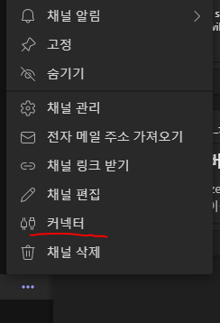
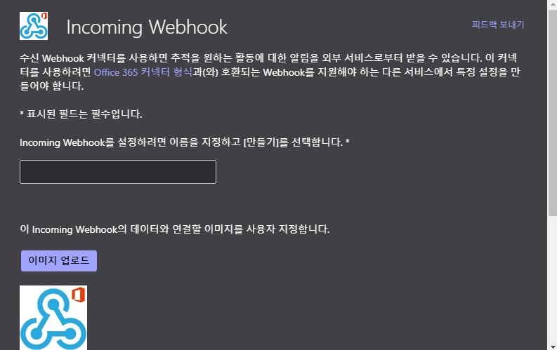
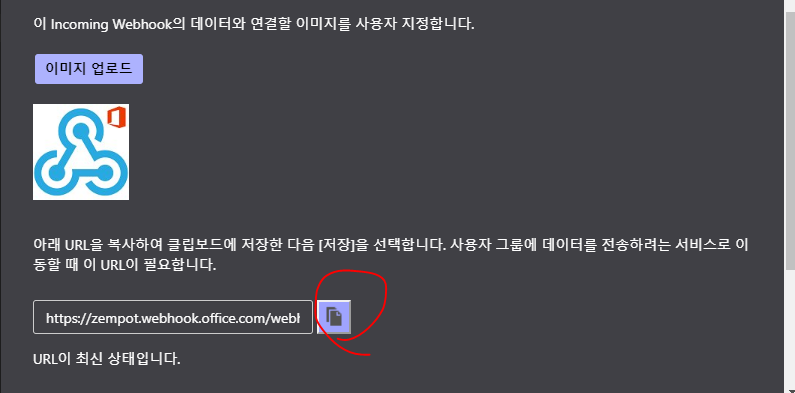

# 팀즈


### incoming webhook 으로 채널에 메세지 게시

추가하고자 하는 채널에서 [...] 버튼을 눌러 커넥터 설정으로 진입한다.


incoming webhook 을 선택해서 이 채널에 웹훅 커넥터를 구성할 수 있게 한다.



webhook의 이름은 한글영문 다 된다, 이 이름을 통해 채널에 메세지 작성자로 노출이 됨으로 고려해서 작성을 한다.



커넥터 설정이 완료되면, API URL 을 얻을 수 있다, 이 URL을 통해 나의 앱에서 incoming webhook으로 메세지 전송을 할수 있게 된다.
이 API 에 토큰 정보가 모두 포함되어있음으로 보안적으로 잘 관리해야한다.

이 URL은 POST 메소드를 통해 메세지를 전송할수 있다.

Spring 프레임워크 기반의 단순한 자바 구현은 아래와 같다.

```java

    @Test
    public void submitTeamsChannelMessage() throws URISyntaxException {
        final URI webHookApi = new URI("https://zempot.webhook.office.com/webhookb2/토큰정보..");

        final HashMap<String, String> payload = new HashMap<>();
        payload.put("@type", "MessageCard");
        payload.put("@conteext", "https://schema.org/extensions");
        payload.put("title", "API 서버1 장애 발생.");
        payload.put("text", "@jhun@zempot.com 2020-07-12 API 서버1 에서 하트비트가 10초 이상 수신이 되지 않습니다.");
        payload.put("temeColor", "0072C6");

        RequestEntity req = RequestEntity.post(webHookApi)
                .header("Content-Type", "Application/JSON; charset=utf-8")
                .body(payload);
        RestTemplate restTemplate = new RestTemplate();
        restTemplate.exchange(req, String.class)

    }

```

코드를 보면 알겠지만 REQUEST 패이로드에 MessageCard 라는 구문이 보일것이다. 이는 팀즈 메세지는 일종의 메세지 템플릿이기 때문에 어떠한 템플릿 유형을 사용할지에 대한 설정이다.

위 예시에서는 가장 기본적인 형태로 진행했다.

자세한 것은 [공식 레퍼런스](https://docs.microsoft.com/en-us/microsoftteams/platform/webhooks-and-connectors/how-to/connectors-using) 를 참고하자.


#### 레퍼런스

- https://docs.microsoft.com/en-us/microsoftteams/platform/webhooks-and-connectors/how-to/connectors-using

