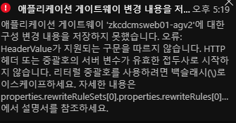
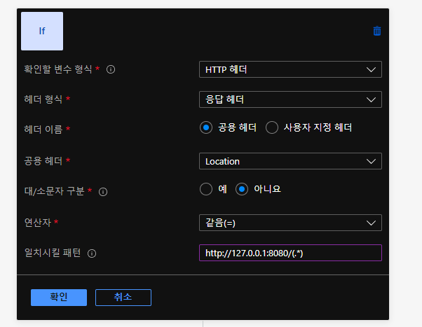
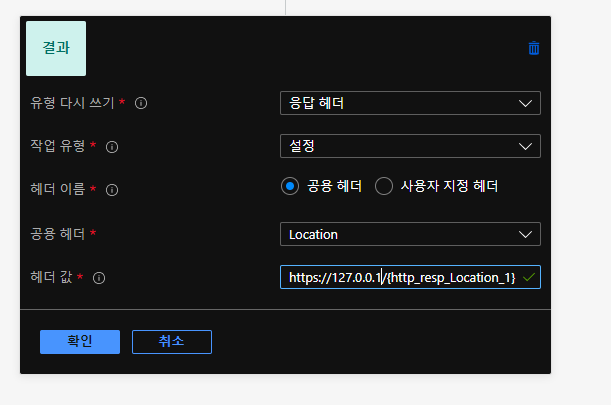
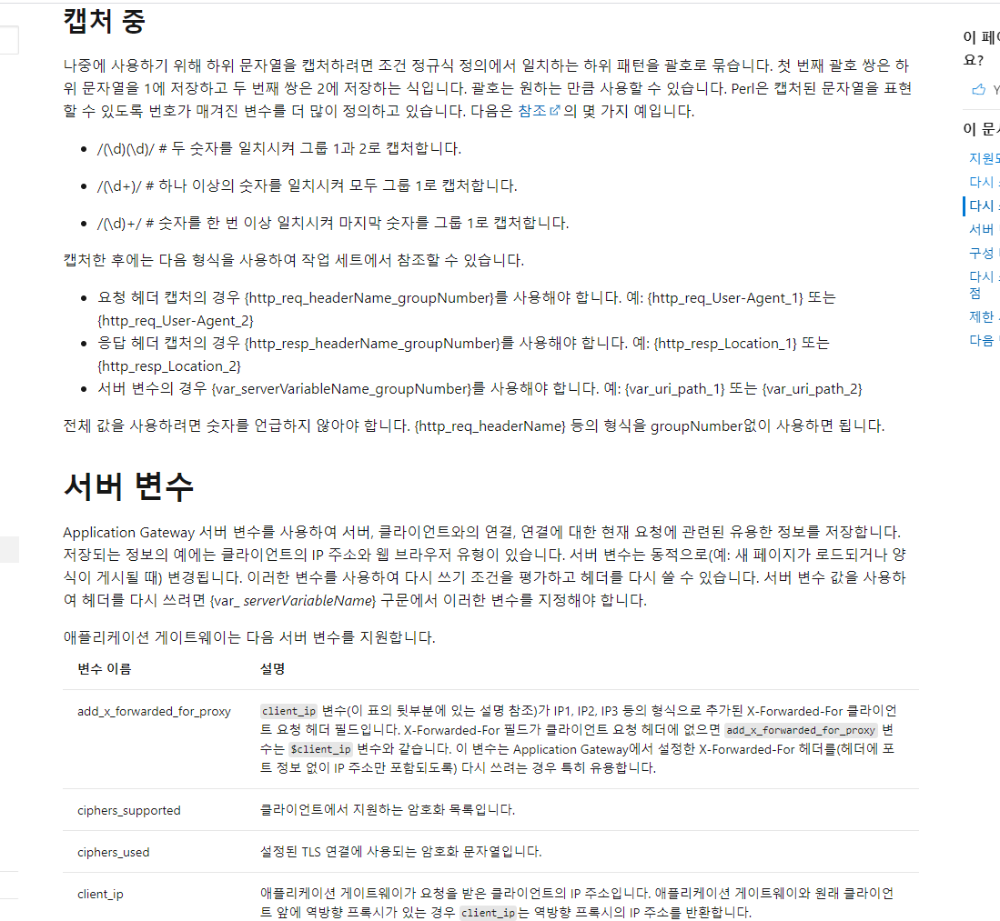

참고 문서

https://docs.microsoft.com/ko-kr/azure/application-gateway/rewrite-http-headers-url#rewrite-types-supported


주의할점은 아래와 같다.


### 1) 매개변수 패턴이 모호함.

https://docs.microsoft.com/ko-kr/azure/application-gateway/rewrite-http-headers-url#rewrite-actions

AG에서는 서버에 이미 저장해두고 쓸수 있는 매개변수와 함수들이 있고, 이를 문자열 치환 값에 작성하면 AG에서 값을 매핑하여 준다.

예를 들어서 request_uri 라는 서버 매개변수를 헤더의 값으로 치환하고 싶다면 아래와 같이 쓸수 있다.

```http://localhost/{request_uri}```

이렇게 작성하면 아래와 같은 에러를 만난다.



이는 잘못된 에러로 나온다. 이 에러를 고치려면 아래처럼 등록해야한다.

```http://localhost/{var_request_uri}```

설명을 보면 나오는 데, 서버변수를 사용할 때와 HTTP 요청에서 추출하는 등의 prefix 가 다르다.

서버 변수의 경우 {var_서버변수명} 를 붙이는 패턴이고, HTTP 요청의 경우 {http_req_헤더명} 이다.

재밌는 건 재작성 조건문에서 정규식으로 캡처링한 것을 메모리에 임시로 들고 있는다. 아래와 같은 조건문이 있다면 


 
/path 에 해당하는 부분이 /(.*) 으로 캡처링 되어있기 때문에 아래처럼 치환하도록 설정할수 있다.



{http_resp_Location_1} 의 구문 인데, http_resp 는 조건문이 응답 헤더일 때를 의미하는 것이고, Location 은 헤더 이름이 Location 일 때, 마지막 1 은 Location 일 때 매칭하는 패턴의 첫번째 캡처를 말한다.

가장 난해하다고 생각되는 것은, 딜리미터를 _로 쓰고 있는데.. http_resp 와 http_req 의 경우 띄어쓰기에 대한 문자열이라서 이 경계가 모호하다.

{http_resp:Location:1} 이런 식이나 {httpResponse_Location_1} 으로 하는 식으로 디자인을 해야하지 않나 하는 생각이다.

#### 서버 변수
서버 변수들 목록은 https://docs.microsoft.com/ko-kr/azure/application-gateway/rewrite-http-headers-url#server-variables 에서 찾을수 있다.
 
서버 변수를 지정하려면 {var_ serverVariable} 구문을 사용해야 합니다.

#### 요청 헤더 
요청 헤더를 지정하려면 {http_req_ headerName} 구문을 사용해야 합니다.
 
#### 응답 헤더 
응답 헤더를 지정하려면 {http_resp_ headerName} 구문을 사용해야 합니다.

### 2) 

https://docs.microsoft.com/ko-kr/azure/application-gateway/rewrite-http-headers-url#capturing

