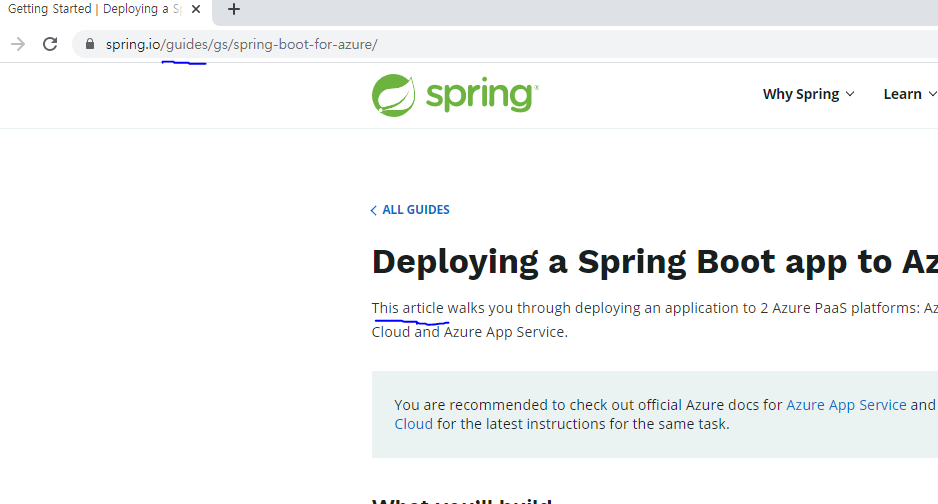

블로그를 쓰거나 기술 블로그를 참조 하다보면 '이 글은~' 이라는 의미가 글의 성격에 따라서 여러 단어로 사용되는 경우가 있다. 
 
대표적으로 글의 머릿말에 아래의 유형으로 시작하는 멘트를 심심치 않게 볼수 있다.

- 이 아티클은 ~
- 이 포스트는 ~
- 이 가이드는 ~

이 글이라는 의미가 어떨 때에는 아티클, 어느 곳에서는 포스트라 해서 혼선이 오더라.

나의 블로그에도 아티클이라고 했다가 포스트로 했다가 우왕좌왕 하는 모습을 볼 수 있다.

아래는 궁금해서 찾아본 내용을 정리한 도표이다.

## post vs article

포스트는 자유로운 글을 의미한다. 우리가 일반적인 인터넷에 쓰는 글(게시글)이라는 것은 post 이다. 블로그에 쓰는 글도 post 이다. 
아티클은 공신력 있는 문서를 말한다. 사실을 바탕으로 해야하고, 객관적이고 담백해야 한다.

|-|POST|Article|
|---|---|---|
|사용처|블로그, 게시판|뉴스, 논문|
|객관성|자유로운 자신의 의견을 서술이 가능.| 개인의 의견 보다는 객관적인 내용을 담백하게 서술.|
|참조| 근거가 명확하지 않아도 됨|사실적인 근거와 공신력 있는 내용을 바탕으로 참조|
|문서 길이| 자유로움| 300단어 이상|
|문법 스타일| 자유로운 스타일| 표준을 준수하고 담백한 문법|
|관리감독| 외부에서 관여가 없음| 책임자, 검토자 또는 관리자가 있을 수 있음|

## essay

에세이(essay)란 수필을 뜻한다. 그때그때 떠오르는 느낌이라 생각을 적은 자유로운 글이다. 나는 에세이라고 하면 대부분 포토에쎄이를 떠올리고 한다.

그런데 에세이라는 것을 검색해보니 학술적인 관점에서 소논문의 유형으로 불리운다는 결과가 나오길래 이 때문에 혼선이 있었다.

이는 아카데미 에세이(Academic essay) 또는 소논문이라고 부르는 경우인데, 이 경우 자유로운 수필의 느낌은 없어지고 서론-본론-결론의 구성을 따르게 된다.

외부 자료를 인용할 때에는 ~~에서 봤다 로 끝나서는 안 되고, 논문의 인용 패턴처럼 xx년도에 작성된 xx에서 xx를 참조한다고 정확히 명시하여야 한다. 

이 외에도 입시 에세이(admission essay) 라 해서 대학입시에서 쓰이는 자소서 유형의 에세이도 있다. 소논문과 유사하게 서론-본론-결론으로 구성이 된다.

## tutorial, guide

공식 기술문서를 보면 튜토리얼(tutorial)이나 가이드(guide)라는 용어를 심심치 않게 볼수있다. 재밌는 것은 여러 공식글을 보면 아티클의 범주의 하위에 가이드와 튜토리얼이 존재하는 것을 볼수 있다.

> https://spring.io/guides/gs/spring-boot-for-azure/

가이드는 어떠한 목적 달성을 위한 문서를 의미한다. 목적에 대한 이해를 돕는 배경이나 설계, 용어 정리 등이 서술되고 목적 달성을 위한 구체적인 방법을 서술한다.

튜토리얼은 가이드에서 목적 달성을 위한 구체적인 방법을 중점으로 둔 글을 의미한다.

 

## Ref

https://www.makealivingwriting.com/writing-an-article-vs-writing-blog-post-differences/