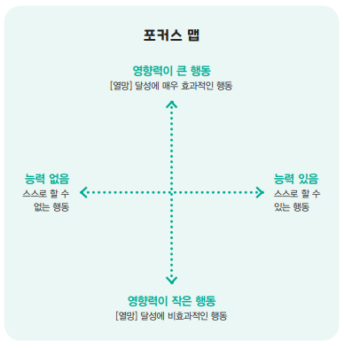

습관의 디테일

BJ 포그

---

'동기보다 능력, 능력 보다는 자극' 이라는 챕터의 내용이 참 공감이 많이 되었다. 얼마나 감탄헀으면, 침대에서 책을 읽다가 벌떡 일어나서 북리뷰 써야겠다고 엄청난 동기가 생김녀서 컴퓨터를 켜서 지금 북리뷰를 쓰고 있을 정도였다.

이 챕터의 내용은 타인의 습관도 고칠수 있는 방법을 제시한다. 2가지 사례를 예시로 드는 데, 첫째는 회의시간에 지각하는 팀원을 어떻게 지각 하지 않게할까? 와 자신의 딸아이에게 심부름을 부탁했는 데, 실패한 사례에 대한 이야기이다.

첫번째 회의 지각에 대한 사례로 보면, 일반적으로 지각을 자주 하는 직원에게 회의를 지각하면 안되는 동기유발을 강하게 거는 방법으로 접근을 한다. 책에는 이 방법의 예시가 안 적혀 있지만, 읽으면서 내 머릿속에 떠오른 생각은 '지각 한 번 더 하면 월급 삭감일세' 라던지 '지각 1회당 벌금으로 커피를 사야한다' 라는 아침드라마에서 흔히 나오던 장면이 떠올랐다. 

두번째 사례에서 딸 아이에게 종이를 사오라는 심부름을 시켰는 데, 딸 아이가 그날도 그 다음날도 지키지 않은 사례가 있다. 이 경우 일반적으로 왜 심부름을 수행하지 않았냐며 딸아이에게 윽박지를 수 있다는 생각이 들것이다.

이 챕터에서 핵심은 동기를 추구하는 것은 가장 마지막 단계에 이루어져야할 처방이란 것이다. 책에서  제안하는 방법은 아래의 순서이다. 

1. 자극을 주어라

2. 능력을 부여해라

3. 동기를 유발하라

자극을 주어라는 것은 행동을 할수 있는 어떠한 트리거, 발현 등의 자극을 말한다. 첫번째 회의 사례에서는 지각하는 팀원에게 회의시간에 대한 캘린더를 등록하고 알람 설정했느냐? 라고 물어보라고 한다. 캘린더에서 특정 시간이 되면 알람이 울리면서 행동하도록 자극을 주어라는 내용이다. 두번째 사례에서는 딸 아이에게 왜 안하는지를 물어보니, 해야한다고 기억했었는데 까먹었다고 한다. 이에 대해서 저자는 딸아이에게 메모를 해보는 것이 어떨지 제안을 해보았다. 캘린더 앱과 같은 것보다는 다소 약하지만 아이에게 메모를 하게 함으로서 심부름을 해야함을 인지하고 예약하게 하는 걸 도모한다. 이후 딸아이는 순간적으로 심부름을 해야하는 것을 잊더라도 메모를 통해 다시 기억해내어서 심부름을 해왔다는 긍정적인 이야기로 끝난다.
반면, 첫번째 사례에서는 아쉽게도 이미 팀원들은 캘린더앱에 회의 스케줄을 알람등록 했었다. 그렇다면 다음 방법인 능력을 부여해라로 전략을 바꾸어야 하는데, 캘린더 앱에 알람을 등록했는데도 왜 늦었는지, 어떠한 사유나 제약이 있었냐고 물어보았다. 팀원이 말하길 이전의 회의를 끝내고 바로 달려왔는데도 늦었다고 말했다. 여기서 회의가 연속으로 잡힘에 따라 물리적으로 능력이 부족해질 수 밖에 없음을 캐치하게 된다. 즉 동기의 문제 이전에 애초에 수행할수 없는 회의 스케줄이었던 것이다.

이것을 보면서 최근 여자친구와의 연애 관계에서 문제가 있는 개인적인 고민이 겹쳤다. 여자친구는 연애를 많이 해보지 못한 경험을 가지고 있고, 공대를 나온 IT 직장인이다. 사귄지는 현재 시점에서 2년이 되어가고 얘기를 나누다보면 다소 나의 개인적인 상식과 거리가 먼 사람 임을 느끼곤 하는 데, 이러한 것이 원인이 되서 트러블로 발전하고 다투어서 헤어지고 다시 사귄 것을 반복중이었다.

여자친구에게는 나에게 상처를 주는 몇가지 습관이 있다. 평소의 여자친구의 자연스러운 행동이 나에게 불편함을 주거나 불안함을 느끼게 하는 것들이다. 내가 이러한 부정적인 감정을 느끼는 것을 싸움을 통해, 헤어짐을 통해 여자친구는 많이 느끼고 개선을 하려고 한다. 다만 잘 되지 않는 모습을 항상 느끼곤 하는 데, 이 챕터의 단계별 전략을 통해서 긍정적으로 해결할 수 있도록 하고 싶다는 생각이 들었다.

---
(잡생각)
챔피언의 마인드 라는 책은 추진력과 끈기를 얻는 방법에 대해서 얘기하는 것 같다. 

습관의 디테일은 지속력에 대해서 얘기하는 책이라 생각한다.

---

### 챕터2 동기

2장 동기 챕터에서는 동기를 통한 행동 전략을 어떻게 전략을 짜야할지의 방법론을 알려준다. 저자는 동기라는 단어보다 열망이라는 단어로 바꿔서 생각해보자고 하는데, 열망이라는 뜻 자체가 긍정적으로 무언가를 해보고 싶다는 욕구에 충족되는 것이기 때문이 아닌가 싶다. 동기라는 것은 외부의 요인이나 환경에 의해서도 생길수 있기 때문인데, 예를 들어 '세금을 내야한다. 안내면 국가에서 추징을 당한다' 국가라는 외부의 요인에 의해 세금을 납부해야하는 동기가 생기는 것을 볼수 있다.

열망을 선정하고, 이 열망을 어떻게 효과적으로 할수있을지에 대한 행동 전략을 세우는 법을 알려준다. 이것이 중요한 것이 열망(또는 동기)는 불나방같은 성격이라서, 갑작스레 흥을 잃고 지속력이 떨어지거나 하는 특징이 있기 때문에 어떻게 이를 계속 지속시킬수 있을지에 대한 구체적인 방법을 생각해보아야 한다. 책에는 '500달러 모우기' vs '하루에 5달러씩 저축하기' 2개를 놓고 어떠한 문장이 더 500달러를 모우기 쉽곗냐고 물어본다. 이처럼 구체적이고 쉬워야지 열망을 실현할 가능성이 높아진다. 저자는 열망을 이루기 위한 방법들을 우선 낙관적으로 마구잡이로 생각해보고 일렬로 정렬해서 아래 포커스맵이라는 그래프에 대입을 해서 추려내는 방법을 제안한다. 
 
 포커스 맵이라는 것을 알려주는 데 아래의 이미지 같은 그래프이다.

책에서는 '스트레스 줄이고 싶다' 라는 열망을 주제로, 어떻게 하면 스트레스를 줄일수있냐? 는 자신에 대한 질문을 한 후, 여러 가지 방법들을 예시로 든다. 참고로 여기서는 무엇이든 할수 있다는 낙관적인 생각으로 해야한다. (책에서는 내 손에 지금 알라의 요술봉 이 쥐에저 있고 무엇이든 이룰수 있다고 생각해보자 라 한다.)

여러개의 방법을 고려하다 보면 방법들을 크게 3분류의 특징으로 나타난다.

- 1회성 방법
- 기존의 습관을 버리거나 바꾸는 것
- 새로운 습관을 추가하려는 것

여러개의 방법 중에서 '매일 기타를 5분씩 처보기', '15분 일찍 퇴근하기' 2가지의 방법을 위 포커스 맵에 대입해본다.

첫째로 매일 기타를 5분씩 처보기에 대해서 보자. 기타를 5분씩 처보기는 기타를 치면 기분이 좋으니 스트레스를 줄인다는 목적에 효과적이다. 그리고 스스로 할 수 있는 행동이다. 즉 영향력이 크고, 능력이 있는 방법이다.

둘째로 15분 일찍 퇴근하기는 어떠할까? 일찍 퇴근하면 당연히 기분이 좋으니 영향력이 크다. 다만 스스로할수 있으나 외부의 요인에서 행할수 없을 수 있다. 만약 스스로할 수 있더라도 일찍 퇴근을 해서 회사의 업무에 지장이 가서 상사의 구박을 받거나, 프로젝트 결과가 좋지 않게 나오거나 하면 새로운 스트레스를 야기한다. 결국 이는 영향력이 클수도 있고 작을수 있으며 내 개인의 능력으로는 쉽게 행할수 없는 행동이기에 비합리적인 방법이다. 

이런 식으로 정리를 해가면서 자신의 열망에 맞는 황금 행동을 추려낸다.

간단하게 나의 경우는 '재택근무로 인해 살찐 내 몸을 다이어트하고 싶다' 로 꼽았다. 책에서는 열망은 최대한 비구체적이고 낙관적이게 잡고 방법론에서 구체적으로 잡는것이 좋다고 한다. 생각해보면 재택근무로는 기준을 정하게 됨으로 재택근무가 끝나면 안해도 되는 열망인가 싶단 생각이 들었다. 그래서 '다이어트 하고 싶다. 몸짱이 되고 싶다.' 로 바꾸었다.

다이어트를 해야하는 동기는 아래와 같다.

- 바지의 치수가 맞지 않다.
- 연애와 결혼에 대한 메리트
    - 성욕 

일단 가장 큰 동기는 '성욕'이다. 나는 최근에 '당신의 생각을 정리해드립니다 -복주환' 이라는 책에서 마인드맵이라는 것을 배웠다. 그래서 알마인드로 위에 대한 내용을 정리해보고, 최종적으로 어떠한 관점의 습관이 합리적인지를 생각해보았다.

(프라이빗한 마인드맵 캡처.png)

이 마인드맵을 바탕으로 규칙을 정했다.

65kg 감량에 유지를 목표로 한다. 매월 1일에 평가를 주기적으로 한다. 

- 운동
    - 운동 전에 몸무게를 재고 기록한다.
    - 하루에 1번 모바일게임을 하며 40분 이상 실내 자전거를 탄다.
    - 턱걸이 1분동안 버티기, 5회
    - 운동 후에 몸무게를 재고 기록한다.

- 칼로리 제한
    - 하루에 1번 800칼로리 자유식으로 먹을수 있다. 800칼로리 미만.
        - 오전에 자유식으로 먹는게 철칙이지만, 약속이 생기면 그 약속을 위해 오전도 저칼로리로 먹는다.
    - 오전에 자유식으로 먹는다. 8시~9시 사이에 먹는다.
    - 점심은 1시~2시. 닭가슴살 1개, 방울토마토 5개를 먹는다.
    - 점심2는 4시~5시 소화가 잘되는 우유와 시리얼 1개를 먹는다.
    - 저녁은 7시~8시, 닭가슴살 1개, 방울토마토 5개를 꼭 먹는다.
    - 무언가를 먹고나면 꼭 기록한다.
    
- 방해하는 습관 제거
    - 금주. 혼자서 술을 절대 먹지 않는다.

        
### 챕터3 능력

3장 능력 챕터이다. 가장 쉽게 읽히고 이해가 쉬운 챕터였다. 이 챕터의 핵심은 '작게 아주 작게 시작하라' 라는 챕터명에 모든 것이 담겨있다. 원하는 것이 크던 작던 모든 것은 작은 것에서 시작한다 라는 작가의 말처럼 습관을 아주 작은 단위의 방법에서 시작하라는 내용을 담고 있다. 챕터1에서 인스타그램의 창업자가 작가의 제자라고 언급된 적이 있는데, 인스타그램이 대박이 난 이유도 살짝 나온다. 사진의 공유라는 개념으로 대박났는데, 접근성과 쉬운 사용성으로 대박이 났다고 주장을 하는데, 살짝 어거지로 끼워놓은 것 같긴 하다. 창업 성공에는 여러가지 요소들이 있기 때문인데, 그래도 어느정도 동의하는 바이다.

팔굽혀펴기 20개 하기와 서서 벽에 팔굽혀 펴기 2개 하기 중에 어떠한 것이 쉽냐는 질문이 있다면 대부분 사람들은 후자를 얘기하리라 본다. 어렵고 원대한 방법은 쉽게 포기하고 지칠수 있는데 반면 작고 쉬운 방법은 꾸준히하는 기회를 얻을수 있다. 작가는 자신의 '치실 사용' 이라는 사례를 통해 이 주장을 보충한다. 작가는 치실의 사용이 부실해서 결국 치과에 갔다는 경험담에 어떻게 하면 치실을 잘 사용할지에 대해 자신에게 물어본다. 치실이라는 행위 자체는 어려운 일은 아니지만 습관으로 잘 이어지지 않는 것에 대해 작가는 이빨 1개만 치실해보기를 시작해서 점진적으로 모든 이빨에 치실을 하는 습관을 이루었다.

이 과정에서 작가는 능력 체인을 통해 작게 나누는 전략을 소개한다. 능력 체인이란 어떠한 목적에 이르는 습관 방법에 대해 잘 되지 않는다면 능력 체인이라는 것이 결여되었기 때문이기에 이 능력체인 목록에 어떠한 부분이 부실한지 물어보라는 내용이다.

(능력체인 5요소)
1. (시간) 그 행동을 할 시간이 충분한가?
2. (돈) 그 행동을 할 돈이 충분히 있는가?
3. (신체적 노력) 그 행동을 할 신체적 능력이 되는가?
4. (정신적 노력) 그 행동에는 창의력 또는 정신적 에너지가 필요한가?
5. (일상 or 환경) 그 행동은 일상생활에 맞는가? 조절이 필요한가?

치실에 비유하면 1번 시간에 대한 것은 괜찮다. 2번 역시 치실이란 도구는 그렇게 비싸지 않다. 3번은 사람마다 다를수있는데 작가의 경우 치열이 너무 좋지 않아서 치실을 이빨에 끼우는 행위 자체가 어려웠다고 한다. 4번은 치실을 하는 데에 창의성이 요구되거나 고도의 학습이 필요하지 않다. 5번은 장소와 환경에 대한 물음인데, 치실 사용은 일반적으로 언제 어디서든 가능하다.

필자는 3번 신체적 조건 때문에 치실 사용을 꺼려하는 걸 인지하고, 자신의 못생긴 치열에 잘 들어갈 얇은 치실을 구매하였고, 이빨 1개씩 치실 해보기를 시작으로 습관을 점진적으로 모든 이빨에 치실사용하기로 확장해갔다.

능력체인을 대입해볼 예시를 개인적으로 하나 생각해봤다.
예를 들어서 턱걸이를 하고싶다는 동기에 따른 행동 전략을 짜는 걸 생각해보자.
- 턱걸이를 잘 하고 싶다
    - a) 턱걸이 봉을 사서 20회 산다.
    - b) 턱걸이 머신을 사서 20회 한다.
    - c) 근처 학교 운동장에 철봉에서 20회 한다.
    
a 와 b는 금전적인 지출이 발생한다. a의 경우 2만원 정도면 웹마켓에서 문틀에 끼울수 있는 철봉을 살수 있다. b의 경우 몇 십만원의 큰 비용이 발생해서 개인적으로는 부담스럽다. c의 경우에는 비용이 발생하지 않지만, 5번째 일상생활에 맞는가? 라는 환경적인 부분에서 근처 학교 운동장에 가야한다는 문제가 발생하는데, 집에서 운동장까지는 걸어서 15분 거리에 있어서 귀찮다. 결국 a,b,c 만 놓고보면 a가 가장 합당해 보인다. 그런데 턱걸이를 1개도 못하는 내가 20회를 한다는 것은 3 신체적 능력에 맞지 않는다. 턱걸이를 하는 가장 기초적인 것으로 매달리기 부터 해도 효과가 상당하다고 유튜브에서 나오더라, 시간적인 부분도 출,퇴근 시간을 고려하면 운동할수 있는 시간은 아침이나 저녁 뿐이다. 저녁에 할까 했는데, 운동을 하면 땀이 웃옷을 젖게 할수 있기 때문에 샤워 전에 하면 좋을 것 같다.  그렇기 때문에 a를 수정해서 최종적으로 '저녁에 샤워하기 전에 턱걸이 봉을 사서 매달리기를 1분동안 해본다.' 로 수정을 했다.

- 턱걸이를 잘 하고 싶다.
    - 턱걸이 봉을 사서 저녁에 샤워하기 전에 매달리기를 1분 동안 해본다
     
    
