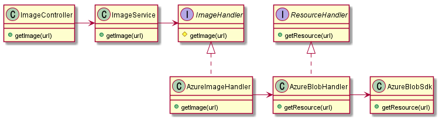
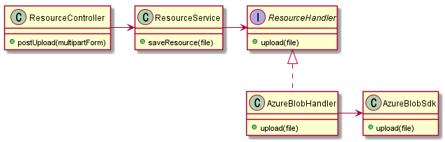

## 무조건 추상화를 해도 안 좋은 경우

자사에서는 Azure 클라우드 기반의 인프라를 가지고 있고 Azure 상의 리소스를 사용하고 있다.

아래는 어떠한 관리툴에서 Azure 클라우드에 이미지를 업로드 하는 로직 중의 일부를 담당하는 클래스의 연간관계를 그려본 것이다.

아래의 경우는 어떨까? 이미지만 사용이 아닌 모든 리소스를 처리하는 광범위한 

