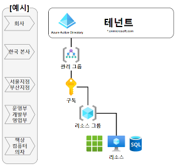

Azure 의 인증은 모두 Azure Active Directory 라는 리소스에 의해 관리가 된다.

AAD(이하 Azure Active Directory) 가 엑세스 토큰을 발급하고 OpenId도 제공하기 때문.

우리가 만드는 자바웹앱, 파이썬웹앱 등에서 Azure 의 클라우드 서비스 (Resource) 를 사용하기 위해서는 기본적으로 AAD의 엑세스 토큰이 필요하다. 사실 엑세스 토큰 말고도 Virtual Machine 에 Azure 내부에서 인증을 미리 부여해서 하는 방법이 있다. 이 방법의 장점은 엑세스토큰과 같은 토큰발급 개념이 필요없기 때문에 무인증 시스템처럼 사용할수 있어 편리하다. (하지만 모든 가이드 문서가 엑세스 토큰 기반으로 설명이 되기 때문에 오히려 더 불편할수도있다.)

AAD 에서 사용자란 추상적인 개념이고, 실제 사용자_인간(홍길동, 김개똥 등)이 될수도 있고, 어플리케이션이 될 수도 있으며, Virtual Machine 이 될수도 있고, 우리가 만드는 어플리케이션도 될 수 있다. 

우리가 만드는 애플리케이션은 AAD 에서 알수 없는 사용자이기 때문에, 이 애플리케이션이 존재한다는 것을 AAD 에 알려(등록)주어야 한다. 이러한 개념은 azure service principal(https://docs.microsoft.com/ko-kr/azure/active-directory/develop/app-objects-and-service-principals) 이라고 하며, 애플리케이션 등록은 서비스 자격증명(service principal) 의 여러 방법 중 하나이다.

https://docs.microsoft.com/ko-kr/azure/active-directory/develop/app-objects-and-service-principals

를 보면 어플리케이션 등록이 있다. 아래 캡처처럼 AAD 에 우리가 만드는 어플리케이션을 등록하는 개념이 있다.

사실 애플리케이션을 등록한다는 개념은, AAD에 신규 애플리케이션을 추가한다고 미리 만들어두고, 이 추가된 신규 애플리케이션의 ID(클라이언트ID)와 PW(시크릿키) 를 우리가 만든 어플리케이션에 내장하는 개념이다. 애플리케이션을 추가한다고 해서 제가 만든 것은 자바 이구요, 리눅스에 설치되어 있구요.. 하는 이런 설정은 필요없다느 ㄴ얘기이다

AAD에 추가 된 우리의 애플리케이션이 있다 예를 들면 아래 캡처의 AuthTest 라는 어플리케이션이 추가되었다고 하자. 그러면 이제 우리는 이 AuthTest 를 AAD에 사용자로 등록만했을 뿐이다. 

만약 CDN 에 Purge 를 하거나, Blob storage 에 접근하고 싶다거나 하는 Azure 에서 제공하는 서비스(Resource 라고 한다)들을 사용하려면 이 서비스에 AAD에서 우리가 등록한 애플리케이션 (예제에는 AuthTest)에 권한을 부여해야 한다. 권한 부여는 해당 리소스의 설정 GUI를 보면 엑세스 제어(IAM) 이라는 메뉴가 있고 이곳에서 부여할수가 있다. 

## 테넌트, 디렉토리 등의 개념에 대해서

개체ID : entity identity 로 보면 된다. 어떠한 객체의 고유 식별값이다.

테넌트: 사전적인 의미로는 세입자, 조직을 의미한다. 클라우드에서 보편적으로 쓰이는 개념인데, 클라우드는 일반적으로 기업에서 자신만의 공간(cloud space) 를 대여해서 쓰는 개념이다. 그래서 세입자라는 용어인 테넌자가 이 기업을 가르키는 용어가 됬다.

개인적으로 Azure 에서 테넌트를 나는 회사라는 개념으로 생각하고 있다. 개인계정으로 만들어서 나의 테넌트가 생겨도 나라는 인간의 회사의 space 라고 생각하고 있다.

기본적으로 Azure 에서 테넌트는 AAD 에 무조건적으로 만들어진다. 사실 AAD가 동작하려면 테넌트라는 격리된 개념이 필요하기 때문에 당연할테지만

구독 : 리소스의 ROOT 가 되는 논리적인 그룹이다. 리소스를 생성하려면 기본적으로 구독이 필요하다. 구독이 만들어진 계기는 요금 정책 때문에 만들어졌다. 1개의 테넌트에는 여러개의 구독을 만들수 있다. 요금 정책 기준으로 생각해보면, 부서별로 구독을 만들어서 사용하도록 디자인 되었음을 알수있다. 예를 들어, A서비스본부, B서비스본부 이런식으로.. 리소스에 구독이 필요한 것은 사실 MS에서 요금을 잘 뜯어먹기 위해 필요한 것이니 당연할지도.

리소스 그룹: 리소스를 자유롭게 논리적으로 묶기 위한 그룹이다. 구독과는 개념이 비슷하지만 다르다. 구독 안에는 여러개의 리소스그룹이 만들어질수 있다. 리소스 그룹은 가장 마지막에 만들어졌는데, 구독 안에 수많은 리소스가 있다면 이 많은 리소스를 특정 그룹으로 묶어서 엑세스 제어를 하거나 일괄 삭제를 하는 등의 일괄 작업처리를 시스템적으로 할수있게 하기위해 만들어진 개념이다. 

아래 잘 정리된 도식도가 있어서 퍼와본다.

출처(https://support.bespinglobal.com/support/solutions/articles/16000040869--azure-azure-)

