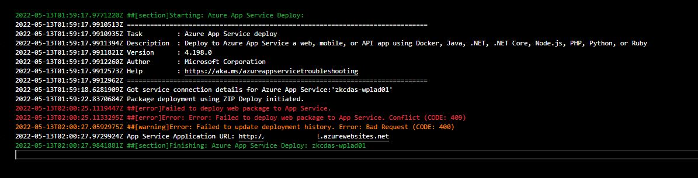
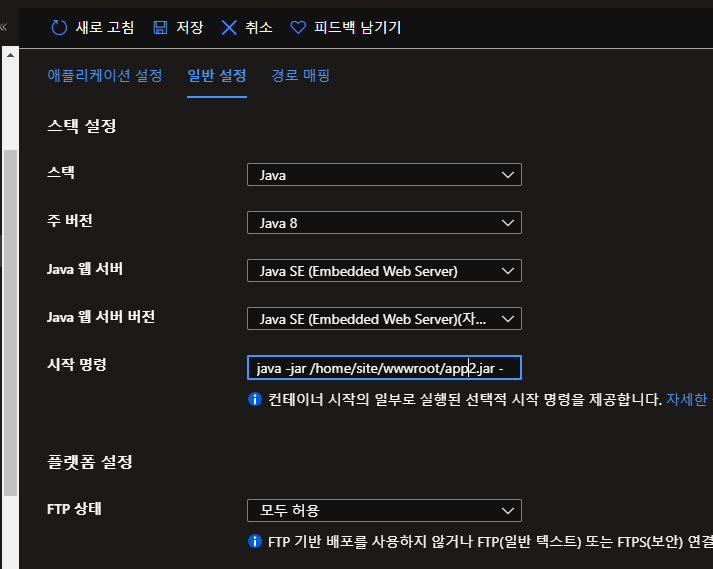

PAAS 도입은 이번이 처음은 아니다. 2020년에 동아시아 프로젝트를 진행할 때에도 시도했었기 때문에 2년이 지나서 다시 시도 하게 되었다.

당시 PAAS 를 도입하려던 목적은 서비스 무중단 배포 때문이었다. 예전이나 지금이나 조직에서는 전통적인 방안(VM 기반, IAAS)으로 서비스 운영 중에 있는 데, 서비스 배포 과정에서 서버가 재부팅 되다 보니 서비스 가용성에 문제가 있다. 가용성 측면을 위해서 웹서버 앞단에 로드밸런서 역활을 하는 Azure App Gateway (AG) 가 있기는 하다. 다만 배포 과정에서는 라우팅되는 백엔드 풀의 모든 서버가 모두 재시작하기 때문에 의미가 없었다.  로드밸런서는 예상치 못한 서버의 사망에 대비한 것일 뿐, CD 에는 접점이 없다는 이야기이다.

 AG 에 BG 배포처럼 배포 시에는 라우팅 경로를 수정하는 식으로도 고민해봤으나, 사람이 직접 GUI 에서 핸들링 해야 하는 방안만 알고 있던 터라 어려웠다. 직접 AG 를 제어하는 Restful API 를 사용해서 라우팅을 제어하는 시스템 개발도 고민도 했었다. 개발이야 시간이 필요할 뿐 어떻게든 하겠지만, 시스템과 CD 와 연계 방법이 잘 떠오르지 않아서 포기했다.

그래서 시도한 것이 PAAS 의 도입이었다. Azure 홈페이지를 보면 PAAS 는 만능이며 전지전능한 신이다. PAAS의 장점을 읽다 보면 고민을 한 내가 바보 같단 느낌마저 든다. 


 

PAAS 에 대해서는 생소하지 않았다. 2018년도에 도커를 다루어 봤던 경험이 있던 까닭이다. 2019년에는 이곳에 입사하자마자 가장 먼저 한 일이, 도커 기반으로 Maven Nexus Repository 구축을 했었다.

 

PAAS 에서는 기본적으로 container image 가 필요하다. 마케팅의 측면으로 아얘 대놓고 CAAS(Container As A Service) 라는 이름으로도 얘기 되는 곳도 있다. Azure 에서는 추상적으로 container image 얘기 되는 데, 사실 도커 이미지를 사용한다. 이런 까닭에 Azure WebApp 에서 CD 를 구성하려고 보면, 종종 image registry 라는 것이 필요하다며 사람을 피곤하게 한다.

image registry 는 container image 저장소이다. container image 는 linux conatiner (대표적으로 도커) 에서 실행할 이미지를 말하는 것인데, 우리 만들고 배포할 어플리케이션이라고 이해해도 무관하다. 리눅스로 치면 yum이나 apt 처럼 운영 될 호스트 서버에서 실행에 필요한 container image를 다운로드 받아 실행하는 형태이기 때문에 필요하다. 

일반적으로 PAAS 기반의 웹 서비스 운영에서는 CI 단계에서 java 소스를 container image 를 빌드하고 image registry 에 업로드한다. 이후 CD 단계에서는 배포될 운영 호스트에서 직접 image registry 에서 이미지를 다운로드(다운로드가 아닌 pull 당겨간다고도 표현한다) 받아 스스로 실행하는 것이 보편적인 PAAS의 CI/CD 구성이다.

container image 를 빌드 하는 것은 구글링을 해보면 다양한 레퍼런스 문서를 쉽게 찾을 수 있고, 메이븐 플러그인도 잘 만들어져 있기에 어렵지 않게 할 수 있다. 문제는 image registry 의 구축인데 이를 구축하는 것이 조금 까다롭다. 더군다나 자사의 까다로운 보안 규정에 맞는 인프라 구성을 해야하는 이슈도 있어 쉽지 않다.

이런 이유로 2020년에 PAAS 도입을 실패했었다. (사실 꼭 CD 문제로 도입이 실패된 건 아니다. 당시에 PAAS webapp 과 IAAS Mysql 간의 통신 단절 문제도 있었고, 여러가지 이유가 더 있기는 했다) 

 

2년 동안 image registry 없이 paas 구성을 할 수 있을 지를 고민했었다. 2년 내내 고민한 것은 절대 아니고, 언젠가는 해야지 해야지 벼루고만 있었다. 어느 날 (글을 쓰는 지금)  문득 Azure Devops 를 살펴보고 있었는 데,  azure devops 에 에이전트가 늘어난 것을 확인했다. 이 중에 나의 고민을 해결해줄 법한 녀석들도 보여서 2가지 아이디어를 떠올렸다.

azure webapp deploy 라는 에이전트가 있다. 이 녀석은 devops에서 jar, war 아티팩트만 준비되면 webapp 에 direct deploy 하는 에이전트이다. 다만 이 경우 배포할 webapp 의 service pirincipal 발급이 필요하다. (아마 direct deploy 하는 과정에서 webapp management 권한이 필요해서 일 것이다.)

ftp upload 에이전트가 있다. ftp 로 webapp 에 직접 업로드 하고, 스크립트로 실행하는 식이다.

 

첫번째 방안은 service principal 발급 방안이 오래 걸리기 때문에, service principal 발급을 신청하고 그 동안 후자를 먼저 진행했다.

 


업로드 위치는 아무곳이나 해도 된다.  톰캣이 아닌 java se 를 런타임으로 하는 경우 실행 스크립트를 별도로 설정해줘야하기 때문에 상관이없기 때문이다.(https://docs.microsoft.com/ko-kr/troubleshoot/azure/general/faqs-app-service-linux#built-in-images)


문제는 ftp 업로드에서 기존에 실행중이던 아티팩트 삭제가 불가능하다 기존 아티팩트 를 엎어치려하면 550 에러를 내뱉는데, 다른 프로세스가 해당 파일에 lock 을 걸었다는 의미이다. lock 을 건 녀석은 컨테이너 인스턴스로 추정된다.


Loki 프록시 서버도 이와 비슷한 맥락으로 재부팅이 필요하다는 거였나 싶기도 하다.


azure principal 기반으로 하니 고민되었던 부분 모두 해결되었다.

jar, war 아티팩트만 빌드하여 cd 하면 됨으로 image registry 구축 필요 없음.

무중단 배포도 지원함

0.1초마다 http request 를 호출하여 테스트 하여봄.

테스트 웹어플리케이션은, 앱 초기화에 30초 걸리는 웹어플리케이션을 배포하게함

결과는 0.1초마다 호출하여도 이슈가없이 BG 배포가됨


런타임 환경변수를 관리할수있는 방안만 찾아보면 이슈없을듯


보안적인 문제

azure paas는 무조건 공개망 구성임. 격리된 웹앱은 최고 비싼 레벨의 티어를 구매하면 구축이 가능.

무조건 공개망이기에 내부에서 사용만 하는 경우 이슈가 되는 경우를 고민하고 해소방법을 찾아봄

외부에서 접근

pass 내에 허용할 ip를 화이트리스트 기반으로 설정이 가능

현재 인프라팀에서 이를 인지하고 pass 생성시에 기본 설정해줌

내부<-> 내부 서버간의 통신시 바다 건너 산 건너 공개망으로 돌아가게 되는건아닌가?

내부 iaas → paas 로 통신시에 공개망을 경유해서 같은 내부망인데도 멀리 바다 건너 돌아오는게 아닌가 싶었음

마치 구로에서 광명에 택배보내고 싶은데, 저 멀리 대전까지 택배가 다녀오는걸 말하는거임

 azure 내에서 같은 instance (korea central 을 말하는건지, zempot cloud 내를 말하는건진 모르겠음. 추상적임) 에 위치한 서버 끼리는 다이렉트 통신이 됨

이슈 없음


배포 도중에 구성> 환경변수 설정을 하였다. 환경변수 설정을 바꾸면 자동으로 웹앱이 다시시작된다고 경고가 나왔다. 뭐 그러려니하고 예를 눌러 설정을 바꾸었다. 다시시작이 되었겠지.

문제는 배포 하고 있던 devops 의 cd agent 가 마지막 단계인 도커 이미지 swap 하는 로그에서 행아웃 걸리는게 아닌가? 보통 1분 내에 처리되던 배포가 5분 동안 행아웃에 걸려 있길래 조금 놀랬다.

취소하고 다시 배포를 하니 아래처럼 409 에러가나왔다

```
2022-05-13T01:59:17.9771220Z ##[section]Starting: Azure App Service Deploy: zkcdas-wplad01
2022-05-13T01:59:17.9910513Z ==============================================================================
2022-05-13T01:59:17.9910935Z Task         : Azure App Service deploy
2022-05-13T01:59:17.9911394Z Description  : Deploy to Azure App Service a web, mobile, or API app using Docker, Java, .NET, .NET Core, Node.js, PHP, Python, or Ruby
2022-05-13T01:59:17.9911821Z Version      : 4.198.0
2022-05-13T01:59:17.9912260Z Author       : Microsoft Corporation
2022-05-13T01:59:17.9912573Z Help         : https://aka.ms/azureappservicetroubleshooting
2022-05-13T01:59:17.9912962Z ==============================================================================
2022-05-13T01:59:18.6281909Z Got service connection details for Azure App Service:'zkcdas-wplad01'
2022-05-13T01:59:22.8370684Z Package deployment using ZIP Deploy initiated.
2022-05-13T02:00:25.1119447Z ##[error]Failed to deploy web package to App Service.
2022-05-13T02:00:25.1133295Z ##[error]Error: Error: Failed to deploy web package to App Service. Conflict (CODE: 409)
2022-05-13T02:00:27.0592975Z ##[warning]Error: Failed to update deployment history. Error: Bad Request (CODE: 400)
2022-05-13T02:00:27.9729924Z App Service Application URL: http://zkcdas-wplad01.azurewebsites.net
2022-05-13T02:00:27.9841881Z ##[section]Finishing: Azure App Service Deploy: zkcdas-wplad01
```




code 409 는 중복 엔티티 에러로 가이드된다. 아마 위에서 취소했던 도커 이미지가  존재해서 그런거같다.

내 예상이 맞았다, 이 관련한 레퍼런스를 찾아보니 비슷한 케이스가 매우매우 많았다. azure 골떄린다

https://github.com/projectkudu/kudu/issues/3042 


이후로 계속 devops 는 같은 409 에러로 실패하게된다. 이게 머여


2가지 해결방안을 생각해보았다.

azure webpp 다시시작

안된다.

프로젝트 소스코드를 바꾸어서 재빌드 하여 cd ( 소스코드를 바꾸는것은 도커 이미지 hash 를 바꾸기 위해서임)

처리됨

어플리케이션 환경변수는 


구성 > 애플리케이션 설정에서 바꿀수있따. 


값을 바꾸고 저장 버튼을 누르면 되는데, 웹앱이 다시시작된다고 경고가 나온다.

paas 가 통으로 셧다운되는게 아니라, 도커 인스턴스가 swap 되면서 다시시작된다. 즉 bg 배포로 되기 때문에 걱정안해도된다.


run.sh start.sh 스크립트와 같은 역활을 하는 커맨드는 아래 시작 명령 필드에 커맨드를 입력하여 할수있다.


여기서 궁금해진게, 앞서 말한 환경변수 설정과 이 시작명령에서 똑같이 spring.profile.active 인자를 서로 다르게 하면 어떤게 우선순위가 될지 궁금해졌다.

결과: 일반설정> 커맨드의 인자가 더 우선시 된다.


로그는 App Service 로그에서 로그 스트림에출력되는 로그를 저장하는 옵션을 킬수있다.

로그는 다운로드는 ftp 를 통해 다운받는다.


이 외에도 Application Insights 설정도 쉽다. 사용으로 누르면 끝이다. 별도의 JavaAgent 를 설치할 필요도 없다.


우리의 전통적인 로그파일을 남기는 식으로 하고 싶으면, 

설정> 구성 > 경로매핑에서

azure blob storage 를 마치 네트워크 드라이브처럼 추가시켜서 할수있따


CD devops 구성


Agent job  중에서 Azure App Service Deploy 라는 에이전트 플러그인이 있다. 이를 사용한다. 아래는 테스트용으로 구성했던 CD 설정이다.


Bash Script 는 배포할 아티팩트 이름을 바꾸기 위해서 간단히 작성한 스크립트 이다. paas webapp 에서 run 커맨드를 지정해야하는데, 아티팩트 이름이 복잡하면 번거롭기 때문에 이름을 바꿀 필요가 있다.

아래는 이름을 바꾸던 스크립트이다. 


아래는 app service deploy 설정이다.


로그 스트림으로 CD가 되는 과정의 실시간 로그를 보았다.  참고로 스케일아웃 2대로 설정했다.

```
2022-05-13 08:26:39.986  WARN 132 --- [main] o.s.b.a.f.FreeMarkerAutoConfiguration    : Cannot find template location(s): [classpath:/templates/] (please add some templates, check your FreeMarker configuration, or set spring.freemarker.checkTemplateLocation=false)
2022-05-13 08:26:40.843  INFO 132 --- [main] o.s.b.w.embedded.tomcat.TomcatWebServer  : Tomcat started on port(s): 80 (http) with context path ''
2022-05-13 08:26:40.856  INFO 132 --- [main] c.z.p.wpl.WplPromotionApplication        : Started WplPromotionApplication in 100.318 seconds (JVM running for 150.402)
2022-05-13 08:26:42.154  INFO 132 --- [http-nio-80-exec-1] o.a.c.c.C.[Tomcat].[localhost].[/]       : Initializing Spring DispatcherServlet 'dispatcherServlet'
2022-05-13 08:26:42.174  INFO 132 --- [http-nio-80-exec-1] o.s.web.servlet.DispatcherServlet        : Initializing Servlet 'dispatcherServlet'
2022-05-13 08:26:42.336  INFO 132 --- [http-nio-80-exec-1] o.s.web.servlet.DispatcherServlet        : Completed initialization in 153 ms
Ending Log Tail of existing logs ---
Starting Live Log Stream ---
2022-05-13T08:29:13  No new trace in the past 1 min(s).
2022-05-13T08:29:46.549Z INFO  - Pulling image: mcr.microsoft.com/azure-app-service/java:8-jre8_210819211055
2022-05-13T08:29:46.826Z INFO  - 8-jre8_210819211055 Pulling from azure-app-service/java
2022-05-13T08:29:46.827Z INFO  -  Digest: sha256:da5ded1238c426b2c0806c3bc874899cb60527ea7dafa6c9c4e717743c048ffc
2022-05-13T08:29:46.828Z INFO  -  Status: Image is up to date for mcr.microsoft.com/azure-app-service/java:8-jre8_210819211055
2022-05-13T08:29:46.833Z INFO  - Pull Image successful, Time taken: 0 Minutes and 0 Seconds
2022-05-13T08:29:46.909Z INFO  - Starting container for site
2022-05-13T08:29:46.914Z INFO  - docker run -d -p 80:80 --name zkcdas-wplad01_13_09afc44b -e WEBSITE_SITE_NAME=zkcdas-wplad01 -e WEBSITE_AUTH_ENABLED=False -e PORT=80 -e WEBSITE_ROLE_INSTANCE_ID=0 -e WEBSITE_HOSTNAME=zkcdas-wplad01.azurewebsites.net -e WEBSITE_INSTANCE_ID=fec4d939f30049bff6f938c61645390e2e68b0974922682d1cbb5a8acfa80f72 -e HTTP_LOGGING_ENABLED=1 -e JAVA_TOOL_OPTIONS=-javaagent:/agents/java/applicationinsights-agent-codeless.jar mcr.microsoft.com/azure-app-service/java:8-jre8_210819211055 java -jar /home/site/wwwroot/app.jar --server.port=80
2022-05-13T08:29:52.543Z INFO  - Initiating warmup request to container zkcdas-wplad01_13_09afc44b for site zkcdas-wplad01
2022-05-13T08:29:53.848Z INFO  - Pulling image: mcr.microsoft.com/azure-app-service/java:8-jre8_210819211055
2022-05-13T08:29:54.915Z INFO  - 8-jre8_210819211055 Pulling from azure-app-service/java
2022-05-13T08:29:54.916Z INFO  -  Digest: sha256:da5ded1238c426b2c0806c3bc874899cb60527ea7dafa6c9c4e717743c048ffc
2022-05-13T08:29:54.916Z INFO  -  Status: Image is up to date for mcr.microsoft.com/azure-app-service/java:8-jre8_210819211055
2022-05-13T08:29:54.919Z INFO  - Pull Image successful, Time taken: 0 Minutes and 1 Seconds
2022-05-13T08:29:55.164Z INFO  - Starting container for site
2022-05-13T08:29:55.170Z INFO  - docker run -d -p 80:80 --name zkcdas-wplad01_5_ccfa1edc -e WEBSITE_SITE_NAME=zkcdas-wplad01 -e WEBSITE_AUTH_ENABLED=False -e PORT=80 -e WEBSITE_ROLE_INSTANCE_ID=0 -e WEBSITE_HOSTNAME=zkcdas-wplad01.azurewebsites.net -e WEBSITE_INSTANCE_ID=b16dbd0f4ecb87f19b5f9dd2b74042a780906524ce7e27ba3b75bd5b4611e035 -e HTTP_LOGGING_ENABLED=1 -e JAVA_TOOL_OPTIONS=-javaagent:/agents/java/applicationinsights-agent-codeless.jar mcr.microsoft.com/azure-app-service/java:8-jre8_210819211055 java -jar /home/site/wwwroot/app.jar --server.port=80
2022-05-13T08:30:08.444Z INFO  - Initiating warmup request to container zkcdas-wplad01_5_ccfa1edc for site zkcdas-wplad01
2022-05-13T08:30:08.853Z INFO  - Waiting for response to warmup request for container zkcdas-wplad01_13_09afc44b. Elapsed time = 16.3095016 sec
2022-05-13T08:30:25.989Z INFO  - Waiting for response to warmup request for container zkcdas-wplad01_13_09afc44b. Elapsed time = 33.4453054 sec
2022-05-13T08:30:24.451Z INFO  - Waiting for response to warmup request for container zkcdas-wplad01_5_ccfa1edc. Elapsed time = 16.0070737 sec
2022-05-13T08:30:40.142Z INFO  - Waiting for response to warmup request for container zkcdas-wplad01_5_ccfa1edc. Elapsed time = 31.6986409 sec
2022-05-13T08:30:43.298Z INFO  - Waiting for response to warmup request for container zkcdas-wplad01_13_09afc44b. Elapsed time = 50.7549518 sec
2022-05-13T08:30:55.853Z INFO  - Waiting for response to warmup request for container zkcdas-wplad01_5_ccfa1edc. Elapsed time = 47.4015567 sec
2022-05-13T08:31:02.121Z INFO  - Waiting for response to warmup request for container zkcdas-wplad01_13_09afc44b. Elapsed time = 69.5776938 sec
2022-05-13T08:31:11.582Z INFO  - Waiting for response to warmup request for container zkcdas-wplad01_5_ccfa1edc. Elapsed time = 63.1384907 sec
2022-05-13 08:31:12.963  INFO 132 --- [main] c.z.p.wpl.WplPromotionApplication        : Starting WplPromotionApplication v1.0-SNAPSHOT on 4bfd4c44bd98 with PID 132 (/home/site/wwwroot/app.jar started by root in /)
2022-05-13 08:31:13.125  INFO 132 --- [main] c.z.p.wpl.WplPromotionApplication        : The following profiles are active: dev
2022-05-13 08:31:15.028  INFO 132 --- [main] c.z.p.wpl.WplPromotionApplication        : Starting WplPromotionApplication v1.0-SNAPSHOT on d8aacf757dc8 with PID 132 (/home/site/wwwroot/app.jar started by root in /)
2022-05-13 08:31:15.393  INFO 132 --- [main] c.z.p.wpl.WplPromotionApplication        : The following profiles are active: dev
```

로그를 보면 기존에 운영중이던 이미지는 stop 하지 않는다. 중간에 pull image 로 새로이 배포되는 image 를 당겨와서 도커에서 인스턴스를 run 시킨다. 그리고 이 run 시킨 인스턴스가 올라올때까지 wating for 하면서 상태 체크를 한다. 정상적으로 인스턴스가 올라오면 앞단의 라우터에서 신규 인스턴스로 http request 가 가도록 swap 한다


공유 데이터(단일접근 제한이 안 되는 경우, 예 rdb 에 스케줄링)에 접근해서 처리하는 기능이 있는 경우, 이러한 swap 때문에 이슈가 될 수 있다. swap 되는 동안 똑같은버전의 인스턴스는 2개가  올라가기 때문에 1번 처리되어야할 작업이 2번 될수 있다.


앞서 보았지만 CD 에서 Azure App service Deploy 에이전트로 배포 시에 StartupCommand 라는 필드가 있다. 이 필드가 하는 일은 Azure Web App 의 구성에서 시작 명령 의 항목을 update 치는 역할을 한다. (보통 CD 에서만 사용되는 휘발성 커맨드로 생각하는게 상식적인데 그게 아니다!)



실제로 CD 과정의 로그를 모니터링하다보면 update command 라는 구문을 볼 수 있다


