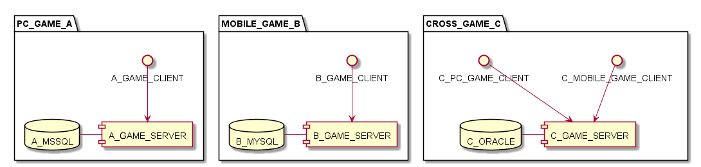
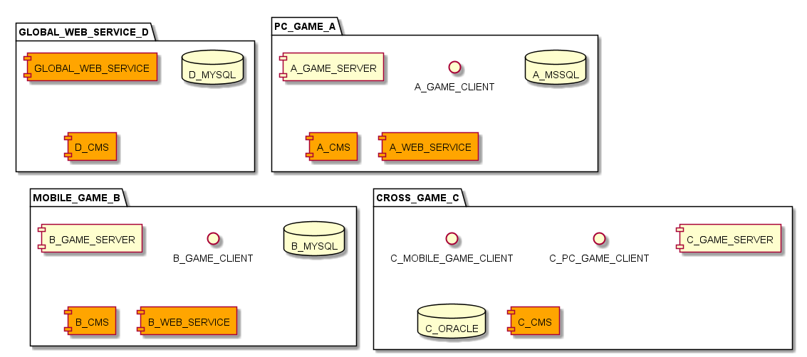
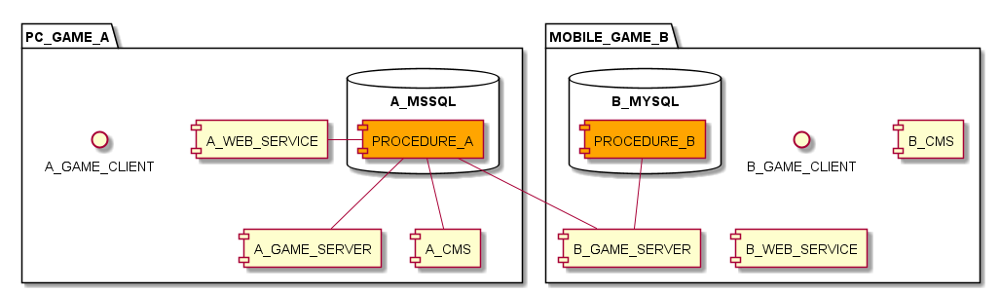

# MSA 전환 

어느덧 게임 회사에 입사한지도 3년이란 시간이 흘렀는데, 재직하면서 겪었던 경험을 하나의 큰 골자로 정리해보아야곘다는 생각이 들었다.

크게 멀리서 생각해보면 대부분의 업무나 니즈들이 모놀리스 아키텍처 MSA 로 전환을 향해갔던 과정들이었단 생각이 들었다.

모놀리스 아키텍처에서 MSA로 전환했던 니즈, 그리고 과정과 이점에 대해서 기록하고자 한다.

참고로 공개 가능한 범위 내에서의 기술적인 경험담 임으로 생략된 부분이나, 모호한 부분이 있을수도 있다.

## 배경

현재 회사에서 서비스 하는 게임들은 10년이상 된 게임도 있고 암튼 오래된 장수 게임인데, 큰 틀로 보면 PC게임과 모바일게임으로 나누어진다. 유저 플랫폼 별로 나누었다고 봐도 무관한데, 최근에는 게임에 따라서 같은 하나의 계정으로 PC 및 모바일 게임도 출시를 했다.

도식화 해보면 아래와 같다.

C 게임은 애초에 플랫폼 연동을 컨셉으로 만들어진 게임으로 하나의 계정으로 Pc와 모바일 게임 모두를 할수있다. 즉 서버는 같고 클라이언트만 다른 개념이다.  
 
반면 A라는 게임은 PC 게임이고, B라는 게임은 모바일게임이며 각기 운영이 된다.

나는 여기서 각 게임 운영 조직의 운영 어플리케이션(CMS 등) 개발이나 웹 서비스 개발을 개발하는 업무를 진행했었다.

내가 담당했던 파트를 위 도식화에 추가해 보면 아래와 같다. 특별하게 주황색으로 표시하였다.

D 라는 이름의 노드가 추가되었는데, 전반적인 자사 모든 게임의 웹서비스를 책임지는 플랫폼이라고 보면 된다. 그리고 각 게임의 운영 CMS 가 존재하고, 특정 게임에는 게임 내부 독자적인 웹서비스들에 대한 개발 지원도 담당했었다.

## 상황

니즈와 원인 그리고 해결을 어떻게 했는지 이다. 위의 배경에서 이슈가 발생했던 부분만 다루기 때문에 조금 이해가 안되거나 흐름이 부자연스러울수도 있다.

### 1. DB 프로시저를 통한 비지니스 로직 공유 이슈

입사한지 얼마안됬을 때에는 대부분의 서비스 코어 비지니스 로직을 DB프로시저를 기반으로 하고 있었다. 프로시저로 처리하지 못하는 복잡한 로직의 경우 어플리케이션에서 처리하는 형태였다. 이는 회사에 정착된 게임 개발 프로세스가 LOW레벨의 언어 사용과 레거시 개발환경에 익숙했던 탓도 한몫했던 것 같다. 도식화 하면 아래와 같다.

 

업무에 있어서 각 개발 파트 간의 공유 API 라는 개념은 프로시저의 공유가 되었다. 즉 게임 서버, CMS, 웹서비스 모두 같은 프로시저를 사용하는 형태였다. 심지어 이벤트처럼 게임 들끼리 콜라보레이션을 하는 형태라면 다른 조직의 프로시저를 사용하기도 했다. 

장점은 같은 지점에서의 관리가 된다는 점이 있지만 장점보다 많은 문제점이 발생했었다. 문제는 아래와 같다, 대부분 관리 차원에서의 이슈였다.

- 프로시저의 생성 및 사용 권한 관리가 어렵다.

- 프로시저 테스트 및 버전 릴리즈 관리가 어렵다.

- 분산 DB 인 경우 프로시저 형상이 다른 경우도 발생했다.

- 프로시저 관리 및 책임에 대한 경계가 없다.

- DB 성능에 의존하게 된다.

- 다른 벤더의 DB와 트랜잭션이 불가능하다.

- 사용 주체가 모두 같은 파라미터를 사용해야한다.

