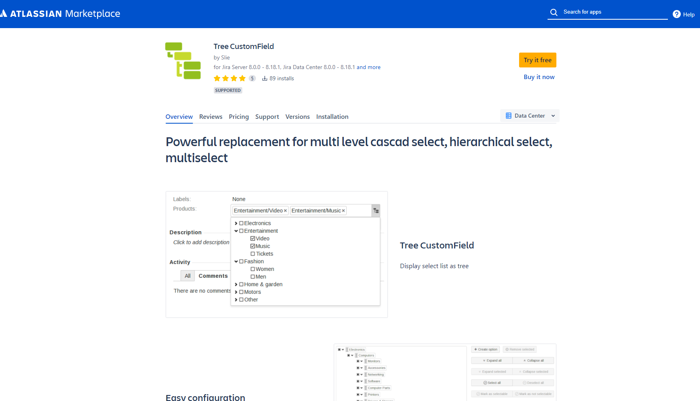
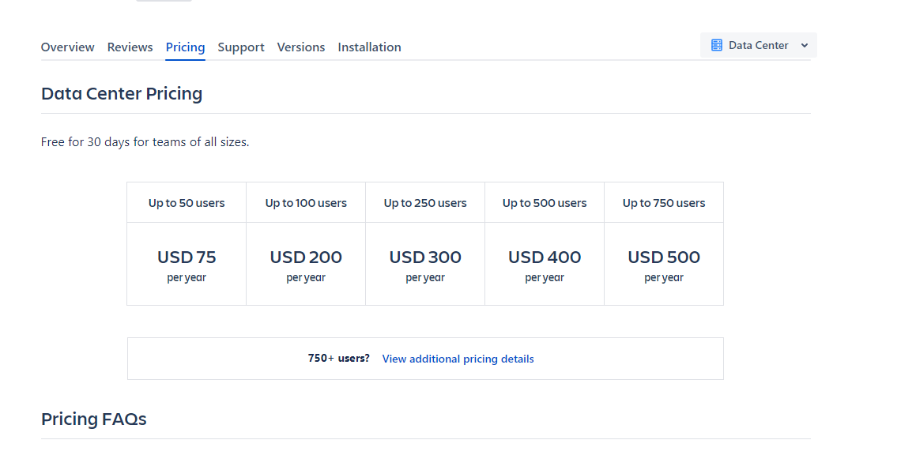
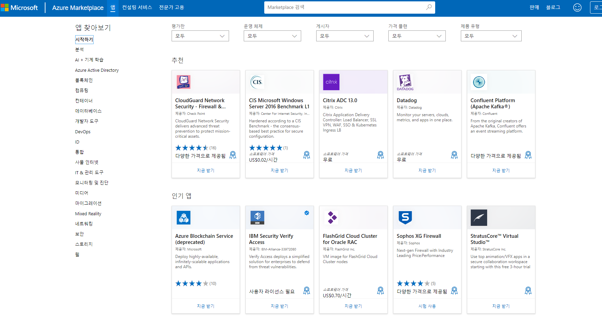
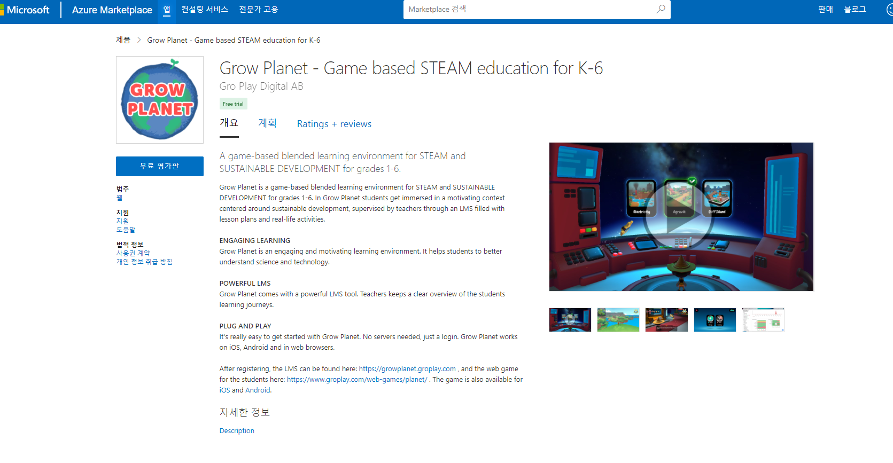
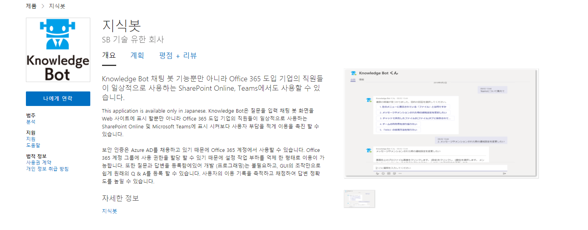

제주도의 이효리 이상순 부부는 벌어놓은 재산도 많지만, 불로소득도 대단하다. 이상순 작곡가의 저작권료는 공개되지는 않았는데, 방송에서 나온 모습으로는 매달 밥은 먹을수 있다고 하니, 최소 50만원 정도로 잡으면 될듯하다. 

벚꽃엔딩으로 유명한 버스커버스커(장범준) 은 2018년 기준 온라인 뮤직 스트리밍 (예: 멜론) 을 통해 년간 1억원 정도의 저작권료를 얻었다고 한다.

## saas 에서 수익내기

IT 기업에서는 프로젝트 관리를 위한 도구들을 많이 쓴다. 버그나 이슈를 위해 관리하기 위한 툴로 ITS(이슈트랙킹시스템)가 있고, 필자의 신입시절에는 mantis(https://www.mantisbt.org/)를 썼고,   PMS(프로젝트 관리시스템)  라 해서 프로젝트 일정을 관리하고 검색, 여러 보충 자료(위키 나 첨부파일)들을 연결하는 프로젝트 관리 툴로는 Redmine(https://www.redmine.org/)을 썼었다.

최근에는 대부분의 회사들이 PMS와 ITS가 접목되고, 애자일 프로젝트 업무 스타일을 구현한 Atlassian의 JIRA (https://www.atlassian.com/ko) 를 많이 사용한다. 나 역시 현재 3년 넘게 JIRA 를 사용하고 있다.

지라를 3년넘게 쓰면서 지라에도 메이저 업데이트가 꽤 있었다. 그 중에서 프로젝트 유형이 '클래식 소프트웨어', '차세대 소프트웨어' 로 레거시와 최신 기능이 접목된 프로젝트로 나뉘게 되었는 데, 차세대 소프트웨어 프로젝트에서는 이슈의 UX 구성을 바꾸거나, 새로운 필드를 넣는 등의 커스텀한 기능을 대폭 확대했다. 

개인적으로 클래식 소프트웨어는 개발할 때 이미 골자가 다 만들어진 곳 위에서 사용하는 느낌이라, 자바와 같은 정적 언어를 다루는 느낌이었고, 차세대 소프트웨어는 자바스크립트와 같은 동적 언어의 인상을 많이 받았다.

추가할 수 있는 커스텀 필드는 여러가지가 있는데, 그중 많이 사용하는 것이 셀렉트 박스 유형의 필드를 많이 썼다. 이유는 공통 기술 지원 본부에서 서비스개발 업무를 담당하고 있었는데, 관리하는 서비스들이 많아서 어떠한 서비스의 이슈인지를 관리하고 싶었다. 일반적으로 서비스나 프로젝트 별로 지라 프로젝트를 만들어서 관리를 하게 되는데, 기반 기술 이나 조직 지원 부서의 경우 이러한 유형이 어렵기에, 조직별로 프로젝트를 만들어서 사용했었다.

일반적으로 아래와 같겠지만,

프로젝트1 > 버그,개발

아래와 같은 뎁스로 지라를 운영했다.

지원부서1> 서비스A > 버그,개발

커스텀 필드는 셀렉트박스를 자주 쓴다고 했었는데, 단일 뎁스만 지원한다. 하지만 위에서 설명했든 하위 뎁스가 존재하는 업무 스타일 탓에, 트리 구조의 커스텀 필드가 필요헀었다.

지라에서는 귀찮았는지 어떤지 모르겠지만, 이에 대한 기능 지원이 없었다.

사실 1뎁스의 기본적인 셀렉트박스를 여러개 구성해서 만들수 있다. 문제는 이 경우에 어떠한 유형이 공통된 포맷일 때 가능한 것이다. 예를 들어서 모두다 3뎁스로 표현할수 있다면 괜찮지만, 특정 엔티티는 1뎁스만 필요로하고, 다른 엔티티는 4뎁스가 필요하다면, 1뎁스만 필요한 엔티티를 선택하려면 남은 항목들을 다 null로 넣어야한다.

그래서 단순하게 1뎁스짜리 셀렉트박스에 아래처럼 연결문자로 하나의 문자열로 뽑아서 등록을 했는데, 양이 너무 많더라.

- 한국/서비스A/서버1/DEV
- 한국/서비스A/서버1/QA
- 한국/서비스A/서버1/PRODUCTION
- 한국/서비스A/서버1/PRODUCTION-MIRROR
- 북미/서비스A/서버1/DEV
- 북미/서비스A/서버1/QA
- 북미/서비스A/서버1/PRODUCTION
- 중국/서비스A/서버1/PRODUCTION
- ....

조금 다른 이야기이지만, 한가지 얘기하고 싶은 것이 일반적으로 아래처럼 서비스가 ROOT 가 되고 한국이냐 북미냐 로 생각할수 있다. 예전에 패키지 설계에서도 얘기햇듯이 비지니스 목표가 항상 상위가 되어야 한다. 비지니스 목표는 항상 시대에 따라서 바뀌는 정말 예측불가능한 곳이기 때문이다. 한국과 북미는 같은 민주주의 국가이지만, 중국의 경우 공산주의이다. 선호하는 컬러도 다르고, 중국의 경우 강경한 국가 정책이 시도때도 없이 생기기 때문에 서비스 보다 더 상위에 있어야 한다.  

https://marketplace.atlassian.com/apps/1219011/tree-customfield

서론이 길었는데 지라에는 플러그인을 사고 팔수있는 앱마켓이 있다. 당연히 위에서 말한 필요한 기능을 지원해주는 플러그인을 찾아봤는데,  가격이 저렇게 비싸더라.

이걸 보면서 든 생각이, 엔터프라이즈 성공을 위해 기업들 입장에서는 여러 도구 사용을 마다하지 않는데, 규모가 크면 클수록 관리가 잘안되서 무의미하게 나가는 경우도 많다.
이런 점을 보면 이런 엔터프라이즈 클라우드 이너 마켓에 앱을 만들어 파는것도 괜찮겠다는 생각이 들었다. 마치 작곡가들의 저작권 수수료처럼 말이다.

지라 마켓플레이스는 지라 내의 솔루션들에 대한 플러그인 개념이다. 뭐랄까 jira saas 에 확장 플러그인이라 용도가 명확하다 

재밋는 것으로 azure 는 paas 를 기반으로 내가 saas 제품을 팔수도있다. 그리고 teams bot 처럼 특정 saas 의 플러그인도 판매가 가능하다.

https://azuremarketplace.microsoft.com/ko-kr/marketplace/apps?page=1

아래처럼 교육용 앱도 등록이 가능하다. https://azuremarketplace.microsoft.com/ko-kr/marketplace/apps/groplaydigitalab1612451076151.growplanet_list?tab=Overview

 
 

봇들도 꽤 있다. 아래와 같은 건 재미있다. 질의 응답 키워드를 미리 등록하고, 봇이 답변해주는 개념이다.

팀즈 봇은 아래와 같은 게 있으면 좋을것같다.

- 사내 인사이트(헬프데스크)

    - 각 서비스, 장애 담당 연락 확인
    
        - 예시)
        
            Q. 서비스A 개발자 명단
            
            A. 홍길동,김길동,박길동
            
            Q. 서비스A 장애나면 누구한테 연락해?
            
            A. 홍길동(10시~17시), 김길동(17시~19시)
            
            Q. 우리회사 백오피스 주소들 알려줘
            
            A. - CMS_A (http://~~~)  - CMS_B (http://)  - BACK_OFFICE_A (aaaa)
            
            Q. 회사 법인카드 사용가능 식당 알려줘
            
            A. xx식당, xx식당
            
            Q. 뭘 물어봐야할지 모르겠어 (help)
            
            A. 사내 인사이트 주소, http://회사내부
        
            
        
- 단순 메세지 웹훅 봇

    - 외부 서버가 봇을 통해 특정 유저에게 메세지 전달
    
        - 예시) FROM 시스템 TO 홍길동님 계정 가입이 완료되었습니다.
        
        - 예시) FROM CMS_A TO 홍길동님, 오전 10시에 입력한 일괄 배치 처리가 완료되었습니다.
