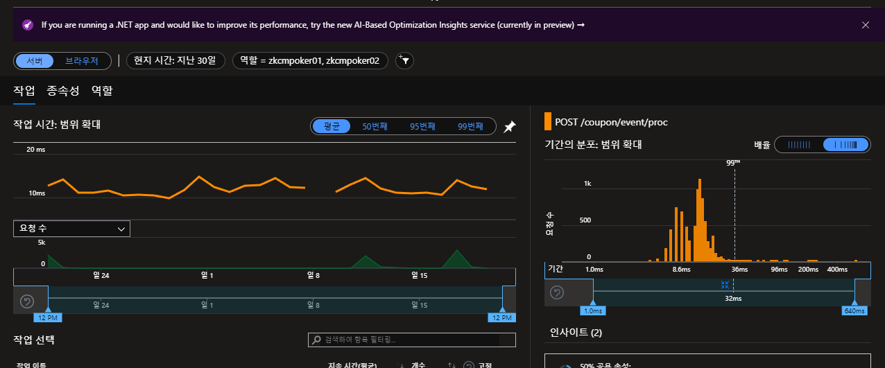

(우리는 성능 모니터링을 Azure Insight 를 사용하고 있다.)
 
이 쿠폰 서비스는 4월20일~5월20일 약 1달간 1만번의 쿠폰 사용 access log 가 있었다. 쿠폰 서비스의 MAU 는 약 1만이라고 볼 수 있다. 실제로 쿠폰이 1만개가 발급된 것은 아니고 단순히 쿠폰 사용 시도가 1만번이었다는 얘기이다. 쿠폰 발급요청에서 응답까지의 시간은 평균 TPMS (트랜잭션 per 마이크로 세컨드) 는 12.6ms 였고, 가장 느렸을 때는 100ms 까지 튄 적이 있다. 100ms 로 튀었을 때에는 오후 8시~오후9시 였고, 이 시각 최대 순간 동시 요청 수는 약 2850 건이었다. 이 시간은 크리에이터들의 방송시간하고 맞물렸다.

광고 무료충전서버도 운영 하는데, 4월20일~5월20일 월 누적 이용자수 MAU 는 110만명(1.08M) 정도된다. TPMS 는 25.7ms 이다.  최대 동시요청수는 3500개였다. 게임마다 별개로 운영중에 있고, 조금씩 상이하나 평균 150만명 정도, TPMS 는 15ms 이다.