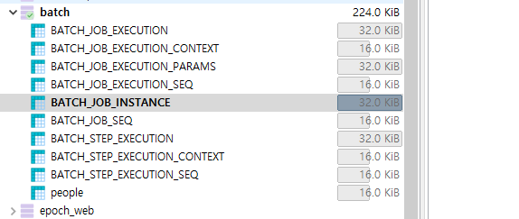

이 아티클에 설명되는 소스는 https://github.com/glqdlt/ex-spring-batch.git 여기에 업로드 되어있습니다.

## JOB_EXECUTION

JOB 실행이력은 기본적으로 유니크해야 한다. 기본 환경구성에서는 Long 값으로 RDB의 Auto Increment와 유사한 값을 파라미터로 넘겨서 식별하고 있다.


### 웹MVC 프로젝트로 HTTP 트리거 하기

기본적으로 스프링 배치 부트 스타터로 구성을 하면 ```@EnableBatchProcessing``` 어노테이션을 통해 쉽게 구성을 할수 있다.

다만 이 경우 기본적으로 어플리케이션이 RUN 되는 시점에 배치를 단 1번 수행을 하는 구성이기 때문에, 엔터프라이즈 환경에서는 사용성이 빈약할수 있다.

이러한 자동 스타트는 스프링 환경변수에서 spring.batch.job.enabled 라는 속성을 false 로 바꾸어서 제거할수가 있다.

application.properties
```
spring.batch.job.enabled=false
```

그리고 이름에 걸맞는 JobLauncher 라는 녀석을 통해 Job 을 실행시키게 하는 코드를 아래처럼 구성해볼수 있다. 

SimpleController.class
```java

@RestController
public class SimpleController {

    @Autowired
    private JobLauncher jobLauncher;

    @Autowired
    private Job job;

    @GetMapping
    public void getStartJob() throws JobParametersInvalidException, JobExecutionAlreadyRunningException, JobRestartException, JobInstanceAlreadyCompleteException {

        jobLauncher.run(job, new JobParameters());
    }

}

```

위 소스를 기반으로 하면 브라우저에서 위 컨트롤러에 매핑되는 PATH 를 호출하면 (예: http://localhost:8080/) JOB이 실행되는 것을 볼수가 있다.

문제는 이 다음이다. 한번 더 호출하면 이슈가 발생한다.
 
```
2021-06-01 15:29:20.197  INFO 17672 --- [nio-8080-exec-9] o.s.b.c.l.support.SimpleJobLauncher      : Job: [FlowJob: [name=importUserJob]] launched with the following parameters: [{}]
2021-06-01 15:29:20.282  INFO 17672 --- [nio-8080-exec-9] o.s.batch.core.job.SimpleStepHandler     : Step already complete or not restartable, so no action to execute: StepExecution: id=3, version=503, name=step1, status=COMPLETED, exitStatus=COMPLETED, readCount=1000, filterCount=0, writeCount=1000 readSkipCount=0, writeSkipCount=0, processSkipCount=0, commitCount=501, rollbackCount=0, exitDescription=
2021-06-01 15:29:20.282  INFO 17672 --- [nio-8080-exec-9] .g.e.s.JobCompletionNotificationListener : !!! JOB FINISHED! Time to verify the results
```

직역하면 이미 실행했던 JOB을 다시 실행하려고 한다는 이야기이다. 왜이럴까?

BATCH JOB 에 대한 실행 기록은 JobRepository 클래스에 의해 관리가 된다. 기본적으로는 RDB에 BATCH_* 라는 접두어로 시작하는 테이블에 의해서 관리가 된다.



그 중에서 BATCH_JOB_EXECUTION 테이블에는 JOB 실행이력의 로그가 담겨 있는 테이블이다.

BATCH_JOB_EXECUTION 테이블
```
"JOB_EXECUTION_ID"	"VERSION"	"JOB_INSTANCE_ID"	"CREATE_TIME"	"START_TIME"	"END_TIME"	"STATUS"	"EXIT_CODE"	"EXIT_MESSAGE"	"LAST_UPDATED"	"JOB_CONFIGURATION_LOCATION"
"1"	"2"	"1"	"2021-06-01 15:11:41.522000"	"2021-06-01 15:11:41.625000"	"2021-06-01 15:12:11.309000"	"COMPLETED"	"COMPLETED"	""	"2021-06-01 15:12:11.345000"	\N
"2"	"2"	"2"	"2021-06-01 15:13:00.767000"	"2021-06-01 15:13:00.871000"	"2021-06-01 15:13:30.322000"	"COMPLETED"	"COMPLETED"	""	"2021-06-01 15:13:30.423000"	\N
"3"	"2"	"3"	"2021-06-01 15:28:01.193000"	"2021-06-01 15:28:01.494000"	"2021-06-01 15:28:45.692000"	"COMPLETED"	"COMPLETED"	""	"2021-06-01 15:28:45.840000"	\N
"4"	"2"	"3"	"2021-06-01 15:28:56.530000"	"2021-06-01 15:28:56.593000"	"2021-06-01 15:28:56.677000"	"COMPLETED"	"NOOP"	"All steps already completed or no steps configured for this job."	"2021-06-01 15:28:56.806000"	\N

```
BATCH_JOB_EXECUTION_PARAMS
```
"JOB_EXECUTION_ID"	"TYPE_CD"	"KEY_NAME"	"STRING_VAL"	"DATE_VAL"	"LONG_VAL"	"DOUBLE_VAL"	"IDENTIFYING"
"1"	"LONG"	"run.id"	""	"1970-01-01 09:00:00.000000"	"1"	"0"	"Y"
"2"	"LONG"	"run.id"	""	"1970-01-01 09:00:00.000000"	"2"	"0"	"Y"

```

위 에러 내용에서 봤듯 JOB_EXECUTION_ID가 3번인 녀석이 말썽이었던 것 같다.
기본적으로 JOB 은 고유하게 구별이 되어야 하는데, JobParams 클래스에 고유식별값을 담아서 넘겨주어야 하는데, 아까 위에서 만든 Controller 에는 그러한 행위가 없었기 때문이다.
JOB_EXECUTION_ID와 JOB_INSTANCE_ID 포인트이다. JOB_EXECUTION_ID 은 말그대로 실행한 시퀀스를 말한다. 그래서 고유의 정수형을 갖게 되는 형태이고,
문제는 JOB_INSTANCE_ID 이다. 이 인스턴스라는 단어처럼 JOB 의 고유한 엔티티를 의미한다. 그런데 보면 3번이라는 이전의 로그와 동일하다. 

그래서 3번 ID 에 대해서는 Params 가 없다.


## Fail Over

https://www.baeldung.com/spring-batch-retry-logic

