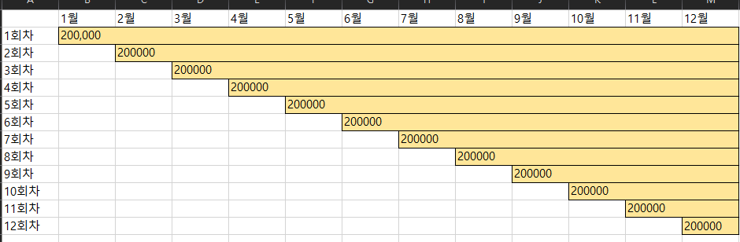
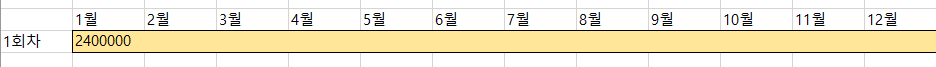

# 적금 vs 예금

같은 목돈 이백사십만원(2,400,000) 을 가지고 적금이나 예금 상품을 계약할 수 있는 상황이라고 해보자.

예금은 금리 1.1%이고, 적금은 금리 2% 를 제공하는 상품이 있다면, 어떤 것을 가입하는 것이 이득일까?

금리 수치로 보면 1보다는 2라는 숫자의 적금 2% 짜리가 더 매력적으로 보인다. 하지만 실제로 이자 지급시에는 1.1%의 예금이 더 이자를 많이 받게 된다.

이는 은행에서 돈을 예치하게 되는 기간이 다르기 때문에, 일어나는 차이로 발생한다.
적금의 경우 은행에서 실제 목돈을 제어할수 있는 기간이 짧다, 이런 특징으로 이자를 제어할수 없는 기간 만큼 차감하기 때문에 예금에 비해 실제 지급 되는 이자가 적다.  
아래에는 두 상품 간의 은행에 맡겨지는 실제 기간을 시각화 한 자료이다, 이를 보면 쉽게 이해할 수 있다. 

## 적금

매월 이십만원(200,000) 을(1년이면 이백사십만원) 금리 2%의 1년 적금을 계약(예치)한 경우. 

이 경우에 은행에서 실제 계약한 금액을 사용할수 있는 기간을 보면 아래와 같다.
최초 1회차에는 1월~12월 1년 동안 은행이 돈을 사용할 수 있지만, 12회차를 보면 12월 단 1개월 간만 은행이 돈을 사용할 수 있게 됨으로 은행입장에서는 12회차의 경우 1회차에 비해 이자를 적게 줄수 밖에 없다.

|회차|1개월 이자| 은행에 맡긴 개월 수| 실제 은행에서 지급 이자|
|---|---|---|---|
|1회차|333|12|3996|
|2회차|333|11|3663|
|3회차|333|10|3330|
|4회차|333|9|2997|
|5회차|333|8|2664|
|6회차|333|7|2331|
|7회차|333|6|1998|
|8회차|333|5|1665|
|9회차|333|4|1332|
|10회차|333|3|999|
|11회차|333|2|666|
|12회차|333|1|333|

총 이자 : 25974

## 예금

목돈 이백사십만원(2,400,000) 을 1.1% 금리의 1년 예금을 진행한 경우.

이 경우에 은행에서 실제 계약한 금액을 사용할수 있는 기간을 보면 아래와 같다.
예금의 경우 처음부터 목돈을 계약 기간인 1년동안 자유롭게 사용할수 있기 때문에 계산이 단순해진다.

|회차|1개월 이자| 은행에 맡긴 개월 수| 실제 은행에서 지급 이자|
|---|---|---|---|
|1회차|2200|12|26400|

총 이자 : 26400

# 단리와 복리

단리는 이자를 지급하는 계산식에 목돈만 적용하나, 복리의 경우 목돈에다가 이자까지 더해서 이자를 다시 계산한다.
당연히 복리가 최종적으로 실제 이자가 좋다.

이해하기 쉽게 예금의 경우 비교를 해보면, 아래와 같다.

## 단리

이백사십만원(2,400,000)을 1년 계약 금리 1.1% 단리 예금에 계약

|회차|목돈|1개월 이자|누적 이자|
|---|---|---|---|
|1회차	|2400000	|2200	|2200|
|2회차	|2400000	|2200	|4400|
|3회차	|2400000	|2200	|6600|
|4회차	|2400000	|2200	|8800|
|5회차	|2400000	|2200	|11000|
|6회차	|2400000	|2200	|13200|
|7회차	|2400000	|2200	|15400|
|8회차	|2400000	|2200	|17600|
|9회차	|2400000	|2200	|19800|
|10회차	|2400000	|2200	|22000|
|11회차	|2400000	|2200	|24200|
|12회차	|2400000	|2200	|26400|

총 이자 : 26400

## 복리

이백사십만원(2,400,000)을 1년 계약 금리 1.1% 복리 예금에 계약

|회차|목돈|1개월 이자|누적 이자|
|---|---|---|---|
|1회차	|2400000	|2200	|2200|
|2회차	|2402200	|2202.016667	|4402.016667|
|3회차	|2404402.017	|2204.035182	|6606.051849|
|4회차	|2406606.052	|2206.055548	|8812.107396|
|5회차	|2408812.107	|2208.077765	|11020.18516|
|6회차	|2411020.185	|2210.101836	|13230.287|
|7회차	|2413230.287	|2212.127763	|15442.41476|
|8회차	|2415442.415	|2214.155547	|17656.57031|
|9회차	|2417656.57	|2216.185189	|19872.7555|
|10회차	|2419872.755	|2218.216693	|22090.97219|
|11회차	|2422090.972	|2220.250058	|24311.22225|
|12회차	|2424311.222	|2222.285287	|26533.50753|

총 이자 : 26533

결론적으로 복리가 단리보다 533원이라는 더 이득을 취하게 된다. 목돈이 작고, 예금 금리가 1.1%라는 저금리 라는 특징 때문에 차이가 도드라보이지 않지만, 만약 목돈이 2억(200,000,000)이고 금리가 5%라고 가정을 하면 엄청난 차이가 나게 된다.
단리의 경우 이자가 1000만원이고, 복리의 경우는 1023만원이다. 무려 23만원의 차이가 발생하기 때문이다.

