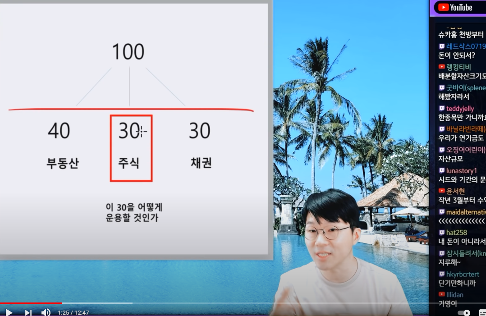

# 자산 포트폴리오

https://www.youtube.com/watch?v=qhzcjT7uF18

슈카월드에서 자산 포트폴리오라는 개념을 알게 되었다. 여기서 부동산이 무엇인가가 이해가 안되었다. 왜냐면 모든 이들이 집을 가지고 있다고 생각하는건가? 라는 생각이 지배적이었기 때문이다. 최근 부동산 가격이 적게는 30% 많게는 200% 까지 뛰는 모습을 보면서 이에 대해 집착을 한것인데, 소형 주택 임대 월세를 말하는 것이었다.

위 캡처의 내용은 목돈(놀고 있는 재산)을 100%로 기준을 잡고, 임대사업에 40%, 주식에 30%, 채권에 30%로 자산을 분배하는 전략을 의미한다. 

예를 들면 내가 현금을 1억 보유하고 있다치면, 부동산에 4천만원, 주식에 3천만원, 채권에 3천만원으로 자산을 분배하는 걸 말한다. 4천만원 짜리 소형 아파트를 구매하여 월세를 받아 먹는 전략을 말하는 것이고, 주식은 심플하게 주식을 사는 걸 말하고, 채권 역시 채권을 사는 것을 말한다.

김승호 회장의 돈의 속성이나, 돈의 흐름, 돈의 속성 등의 여러 유명한 재태크 책을 보면 공통적으로 나오는 절대 기준이 있다.
절대 남의 돈을 빌려서 재산 투자를 하는 짓을 하지 말아라 이다. 이에 대해서는 공부를 하면 할수록 동의하는 바인데, 대출을 받아서 투자를 하는 걸 일반적으로 레버리지(지렛대) 전략이라는 단어를 자주 사용한다. 2% 대출 금리로 에상 수익 5% 주식에 투자를 성공했다면, 주식이라는 리스크를 안고 3% 수익을 얻었다고 볼수 있다. 왜냐면 남의 돈을 빌려서 이자를 내면서 투자한 것이기 때문에 수익율에서 대출 이자만큼 차감이 되는 셈이다. 예금이나 채권, 또는 배당주와 같은 안전 투자의 경우 보통 1~3%에서 수익율이 왔다갔다 하는 거에 비해, 리스크를 안고 3% 수익을 얻는 셈이다. 
아무리 봐도 확실하게 성공할 투자가 보이는 데 수중에 목돈이 백만원 정도 밖에 없어서 1억의 대출을 받아서 한다고 할수도 있다. 금액이 크면 클수록 이득은 크기 떄문이다. 개인적으로는 확신을 할 수 있다면 점쟁이를 해야한다고 생각한다. 대표적인 사례로 코로나19 사태처럼 전혀 예상치 못한 천재지변이 일어날수도 있다. 일본 도쿄 올림픽이 대표적인 사례라 생각하는 데, 2020년에 개최해야할 도쿄 올림픽이 코로나19 확산으로 인해 2021년 연기되면서 일본 올림픽 위원회에서 천문학적인 손해를 입었고, 2021년에 개최할 때도 코로나 백신이 나왔는 데도 불구하고, 델타 변이라는 변종 코로나 때문에 상상도 못할 피해를 입었다.  
 
 요즘처럼 제로금리에 가까운 저금리의 경우에는 부동산의 가치가 높아질 것을 예상하고, 나의 주거환경을 더욱 증진시키자는 의미로 부동산(대형 아파트) 에 주택담보대출을 통해 투자하는 것도 괜찮은 생각이라는 것도 든다. 
 
 
 
 ## 부동산 소형 아파트 임대 투자
 
 아래는 2021년 08월 07일에 찾아본 물건이다.

 공시지가는 8천만원 정도이고, 거래금액은 16년도 부터 계속 1억을 유지하고 있다. 소형 주택의 경우 토지가 작아서 이미 용적률을 최대한 활용하고 있기 때문에 재개발이 잘 일어나지는 않는다. 
 
 
 
 
 
 
 
 
 다가구에 대한 세금 정책이 심화되면서 많은 갭투자를 하던 물건들이 사방팔방 나오고 있다.
 
 주택을 소요하나 무주택자로 인정되는 경우 53조
  
 
 
 
 
 
 
 
 

## 장점 
 
- 청약에 제한되지 않는다. 청약에 제한하기에는 너무 작은 평수이기 때문에, 전용 4평,5평은 나라에서 조차 주택이라기 보다는 청년층을 위한 임대로 봐서인지 법규상 무주택자로 처리해준다.

- 가격적인 메리트가 있다. 1억이라는 돈이 시대가 흘러가면 갈수록 작게 느껴지는 금액이다. 2016년에는 최저임금이 6천원 가량이었지만, 현재 2021년은 8700원, 2022년은 9160원으로 인상 예정이다. 

- 저금리 시대에 예금으로 생각하고 싸게 월세를 놓아서 예금 처럼 접근하면 나쁘지 않다. 1억을 보통 월세로 할경우, 1000에 5만원으로 접근하는 경향이 있다. 위 건물의 경우 2000/50 으로 보통 놓고 있는 데, 1억2천만원인 셈이다. 1000/50이나 2000/45 로 조정을 해서 놓을수도 있다. 같은 건물의 임대사업자 가 내놓은 월세는 1000 / 47 짜리를 본적이 있다.  1억에 대한 예금 금리를 4%로 잡으면, 월세 40만원과 비슷한 효과를 볼수있다. (재산세와 같은 여러 세금을 퉁쳐서 생각한 게 4%다) 저성장 저금리 시대에 수익율 4% 정도라면 나쁘지 않다는 생각이다. 

## 단점

- 건물 노후화가 진행 되었다. 2021년 기준 10년이나 나이를 먹은 건물이다. 2~4년 정도 보유하고 판매할 경우, 구매헀던 비용에서 손해 없이 판매가 가능할지 가늠해보아야 한다.

 
 