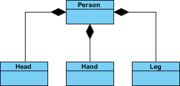
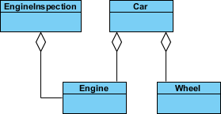

그간 업무를 진행하며 다루었던 디자인패턴의 내용들을 정리하는 아티클이다.

GOF 책의 서두에도 나오듯이 디자인 패턴이라는 게 사실 어떠한 목적에 필요한 도구일 뿐이기에, 일일히 다 외우거나 사용할 필요는 없다. 도메인 환경에 맞게 패턴을 조금 꼬아서 사용할 수도 있고, 같은 성격의 패턴이어서 경험이나 이해도가 높은 패턴 아무거나 사용할수도 있다. 패턴은 긍정적인 효과를 낳기 위한 장치일 뿐이기에 꼭 완벽한 틀은 없다.

사실 이 모든 것은 핑계 일뿐이고, 어떠한 지식이든 많이 알아두면 나중에 써먹기 마련이다. 에릭 감마의 GOF의 디자인 패턴 책에 나오는 모든 패턴을 기준으로 정리해고자 한다. 자주 사용하지 못한 생소한 녀석은 설명이 빈약할수도 있다.

# 디자인 패턴


앞에서 얘기 햇듯 디자인 패턴을 보다 보면, 성격이 비슷하거나 구현 방식이 유사한 패턴 들을 많이 볼수도 있다. 또한 A패턴과 B패턴을 교묘히 섞어서 사용하는 패턴들도 간혹 보게 된다. 패턴이라는 것이 말 그대로 어떠한 작업이 반복 되면서 발전해 개념이 확립된 것이다 보니, 반복되는 과정 또는 필요 니즈가 같았던 친구들이 생기기 마련이어서 이런 현상이 생긴다.

이런 부분들을 에릭 감마는 패턴들의 유사함을 정리하여 아래의 키워드로 정리했는데 크게 3가지의 카테고리가 있다. 

에릭 감사는 패턴을 분류한 기준으로 목적(purpose) 기준으로 정리를 하였다. 객체를 생성해야하거나 객체의 구조를 확장하거나 합성해야 할때, 마지막으로 객체의 기능을 풍부하게 상호작용시켜야할 때로 나누었다.

추가적으로 어디에 적용을 해야하는지에 대한 범위(scope) 기준으로도 나눌 수 있다. 범위란 디자인패턴이 정적인 개념의 패턴인지 동적으로 작용이 가능한 패턴인지의 적용 범위를 나타낸다. 쉽게 애기 하면 정적이란 결국 클래스에 적용 해야하는 지, 동적은 객체에 적용 할수 있는지 로 어디에 적용이 되냐에 따른 이야기이다.   

# 객체지향 프로그래밍에 대하여

이 책은 디자인 패턴의 책이지만 디자인 패턴은 결국 객제지향 프로그래밍안에서의 패턴이기에 객체지향 프로그래밍의 근간에 대해서도 다룬다. 그래서 관련 핵심 지식이 책 내용 중간중간에 좋은 내용이 많다. 

## 클래스 vs 인터페이스

클래스와 인터페이스를 구분하는 기준을 에릭감마는 아래와 같이 얘기한다.

클래스는 객체가 어떻게 구현되느냐를 정의한다. 객체의 내부 상태와 객체의 연산에 대한 구현 방법을 정의한다.

인터페이스는 객체의 타입을 정의한다. 타입이라는 말에서 객체의 시그니쳐(원형)를 떠올릴 수 있는 데, 클래스의 시그니쳐와 개념이 같다, 다만 여기서는 분류라는 개념으로 말한다. 인터페이스는 이 유형의 객체가 어떻게 상호작용할 수 있는지에 대해 정의하는 걸 말한다. 클래스도 메소드를 통해 객체의 상호작용을 정의하는 데, 결론적으로 클래스는 인터페이스를 정의하는 것을 내재하고 있다는 것이다.

> 클래스와 타입(인터페이스) 간에는 밀접한 관련이 있습니다. 클래스도 객체가 수행할 수 있는 연산을 정의하므로, 객체의 타입을 정의하는 것이기도 합니다.

## 상속(extends) 과 합성(composition)

객체지향 프로그래밍에서 기능의 재사용을 하는 방법으로 상속과 합성이 있다. 상속은 슈퍼타입의 기능을 서브타입에서  시그니쳐를 소유하게 되는 개념이고, 합성은 자신의 기능이 아닌 다른 타입의 기능을 자신의 기능 안에 연결해서 사용하는 개념이다. 이런 특징에 책에서는 상속을 슈퍼타입의 구현을 서브타입이 받아올 수 있다 해서, 화이트 박스 재사용(white-box-reuse) 즉 클-린하게 투명하게 볼수 있다는 의미로 말하고, 객체 합성(composition) 은 블랙박스 재사용(black-box reuse) 라고 한다. 그도 그럴것이 객체 합성은 타인의 기능을 내가 빌려 쓰는 것이니 기능의 구현 자체를 알 도리가 없다. 상위 타입의 기능을 받아온다 해서 기능을 정의한다는 개념의 클래스 특징을 덧대어 책에서는 상속을 클래스의 합성(class composition)이라 하고, 합성을 객체의 합성(object composition)이라는 표현을 쓰기도 한다.
이 말은 상속은 정적인 개념이고, 합성은 동적인 개념으로 컴파일 시점에 결정되냐, 런타임 시점에 바꿀 수 있냐로 나뉘기도 한다.

자바 언어를 비롯해서 많은 프로그래밍 언어에서는 다중 상속을 지원하지 않는다. 상속이란 화이트박스 재사용이란 말처럼 슈퍼타입의 기능을 소유하게 되는 개념인데, 만약 다중 상속이 된다면 상속 해줄수 있는 슈퍼타입들 중에 같은 이름의 기능이 존재한다면 이를 상속받는 서브타입 입장에서는 어떠한 것을 받아야할지 결정을 짓기가 참 어렵다. 이렇다 보니 인터페이스 처럼 추상 메소드를 가진 즉, 기능의 구현이 되어 있지 않은 인터페이스를 통해 다중 구현에 대해서는 지원을 하고 있다.  이런 단점으로 합성(객체 합성)이 상속(클래스 합성) 보다 더 나은 방법이라고 에릭 감마는 얘기한다.

다만 여기서의 포인트는 기능의 재사용 기법의 목적하에 합성이 더 나은 점을 얘기하고 있다. 이게 어떠한 이야기인지를 생각해보면 method 라고 하는 기능 관점하의 이야기만 하는 것이고, 객체의 속성(상태, 필드, 멤버변수라 하는)에 대해서는 객체 합성을 통해서 하는 것은 말이 안된다고 볼수 있다. 나 자신의 고유한 속성을 타인이 들고 있는 다는 것은 말이 안되고, 설사 타인이 나의 고유한 속성을 가지더라도 이를 제어하는 것은 자기 자신이 아니기에 번거롭고 문제 소지가 생길수 있다. 

## 위임(deligation) vs 합성(compostion)

UML 을 공부하다 보면 객체 합성을 의미하는 개념에서 검은색 선(Composition)과 하얀색 선(Aggregation)으로 나뉘는 걸 볼 수 있다. 

GOF 책에서 합성의 경우에는 같은 영어인 (Composition) 을 사용하되, Aggregation 은 위임(deligation) 이라는 용어를 사용한다. 미묘한 차이가 있겠지만 난 개인적으로 deligation 이나 Aggregation 이나 책에서 설명하는 바는 같다고 생각한다.

합성이나 위임이나, 상대의 기능을 나의 일부로 사용한다는 개념에서는 의미가 같다. 다만 합성의 경우는 상대의 기능이 내 안에서만 존재하고, 위임은 상대에게서 존재한다. 이 말은 사용하려는 기능의 인스턴스가 누구에게 소유권이 있느냐를 의미한다. 즉 라이프사이클에 어떻게 영향을 받느냐에 대한 것으로 나뉜다. 아래에서 코드와 다이어그램으로 설명한 것을 보면 이해가 쉽다.

두 개념의 차이에 대해 아주 잘 설명한 내용이 있어서 이를 첨부하려고 한다 https://www.visual-paradigm.com/guide/uml-unified-modeling-language/uml-aggregation-vs-composition/


### Composition

합성은 아래와 같다. 사람이라는 개념은 머리와 손, 발로 구성되어 있다는 의미가 그려진 다이어그램이다.

여기서 사람이 죽으면 그 사람의 머리와 손 발 모두 같이 죽게 된다.
 



```java

class Person{
    
    private Head head = new PersonHead(); 
    private Hand hand = new PersonHand(); 
    private Leg leg= new PersonLeg();
    
    public void 손들기(){
        this.hand.손들기();
    }
    
    public void 머리흔들기(){
        this.head.머리흔들기();
    }
    
    public void 걷기(){
        this.leg.움직이기();
    }
    
}

```

다만 위 예시에서는 합성과 집약의 차이점을 설명하기 위한 포커스의 예제이고, 실제 모델링 설계관점으로는 조금 애매하다.
머리와 손 그리고 발은 Person 의 속성의 상태를 바꾸는 행위이기도 해서 합성보다는 상속으로 접근하는 게 옳지 않을까 하는 생각이다.


### Aggregation

아래는 집약(위임)을 의미하는 개념이다. 아래 다이어그램에서 자동차는 엔진과 바퀴로 구성되어 있는데, 자동차가 박살이 나거나 자동차 회사가 부도가 나더라도 엔진과 바퀴에는 영향이 없다. 



```java

class Car{
    
    private Engine engine;
    private Wheel wheel;
    
    public Car(Engine e, Wheel w){
        this.engien = e;
        this.wheel = w;
    }
    
}

```


# 디자인 패턴

## 생성패턴(Cretional Patterns)


## 구조 패턴 (Structural Patters)

## 행동 패턴 ( Behavioral Patterns)


### 브릿지 패턴

### 탬플릿 메소드 패턴

### 팩토리얼 패턴

### 정적 생성 메소드 패턴 (또는 정적 팩토리 메소드 패턴)

### 데코레이터 패턴

### 프록시 패턴

### 전략 패턴

### 방문자 패턴 (또는 비지터 패턴)

### 관찰자 패턴 (또는 옵저버 패턴)

#### 방문자 vs 관찰자 패턴의 차이

방문자 패턴과 관찰자 패턴이 비슷한 것처럼 느껴질 수 있다. 어떠한 배열을 순회하며 무엇을 하는 모습이 겉보기에는 큰 차이가 없어 보인다. 하지만 두 패턴에는 큰 차이가 있다. 관찰자 패턴은 순회 아이템을 단순 호출만 하며 소모 하는 반면 방문자 패턴은 순회 아이템의 로직 결과에 관심이 많은 차이가 있다. 관찰자 패턴은 어떠한 이벤트를 알리는 용도로 사용되며, 방문자 패턴은 로직의 일부로 소비가 된다. 이게 무슨 말이냐면 관찰자 패턴은 순회 하며 이벤트를 알려주고 결과에 대해서는 관심이 없다. 반면 관찰자 패턴은 결과값에 대한 기대치를 가지며, 순회 아이템의 결과를 연결하여 어떠한 의미 있는 결과 값을 만들어 내는 데에 목적을 둔다. 관찰자 패턴은 브라우저의 클릭 이벤트를 예시로 둘 수가 있다. addEventListner() 의 구동원리를 생각해보면 된다. 방문자 패턴은 Filter 나 interceptor 로 생각하면 된다. 등록된 필터나 인터셉터의 갯수만큼 요청은 해당 필터를 통과하며 어떠한 목적지를 도달하기 위한 파이프라인을 가진다. 도중에 exception 이라도 떨어진다면, 이 파이프라인은 즉시 종료가 된다. 이런 특징 탓에 관찰자 패턴은 결과에 대해 관심이 없기 때문에 대부분 비동기로 구현하는 경우가 대다수이며, 관찰자 패턴은 상황에 따라 다르지만 일련의 순회 아이템을 메소드 체이닝으로 연결하여 동기식으로 구현을 많이 한다.


## 실전 고급 예제

### 브릿지 패턴과 템플릿 패턴 그리고 전략 패턴을 섞은 경우

자사에서 운영 되는 게임을 관리하는 통합 CMS에서 주로 사용했던 패턴이다.

각 게임들이 각기 다른 Dababase 에 유저 정보를 가지고 있고, CMS 는 이를 조회할수 있어야 했다.

실무에서 다룬 게임들은 매우 많았지만, 이 예제에서는 2가지의 게임 GameA와 GameB가 있다고 가정해보자.


# 레퍼런스

- GOF의 디자인패턴, 에릭감마

- 이펙티브 자바, 조슈아 블로흐

