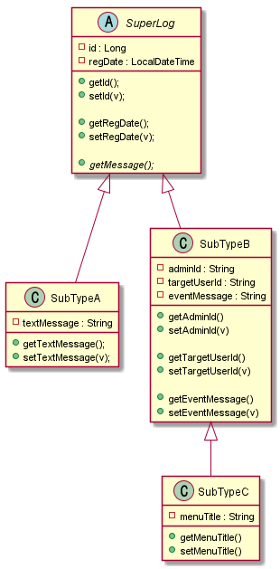

# 문서기반 NOSQL (몽고DB) 도입기

## 들어가며

유행은 이미 10년전에 신입사원 시절 때부터 MEAN (몽고DB, 엘라스틱서치, 앵귤러, NODEJS) 스택이라 하면서 거창하게 유행한 적이 있었다.

그래서 현시점에 이를 도입하는 것은 유행과 같은 흐름 보다도 필요하에 도입을 하려는 것이다.

현재 처한 곳에서는 대부분의 업무를 RDB 기반 환경에서 처리를 하고 있다.

RDB의 용이함은 구조화된 자료형의 저장, 그리고 원자성 즉.. 트랜잭션 에 대한 이점이 있다.

RDB의 원자성은 네임스페이스로 구분된 데이터라도 같은 DB안에만 존재한다면 트랜잭션을 걸수있다.

네임스페이스를 DB명.테이블명으로 본다면.. 아래와 같은 경우 접근 권한만 있다면 트랜잭션을 걸수있다.

- game1db.some_table_a
- game2db.some_table_b

심지어 같은 벤더 의 DB라면 원격 트랜잭션도 지원을 한다. 놀랍다.

### RDB의 한계


RDB는 자료 구조를 확장하는 데에 한계가 있다. 단순하게 자바 vs 자바스크립트 의 유연함으로 이해해도 좋다.

예를 들어서 아래처럼 어떠한 상속 관계를 가지는 모델이 있다고 가정하자.


RDB 에서는 위 상속 관계를 표현하려면 아래처럼 2가지 방법 중에 하나를 선택 해야한다.

case 1) 싱글 테이블인 경우

super_log_table

|id|regDate|type|textMessage|adminId|targetUserId|eventMessage|
|---|---|---|---|---|---|---|
|2 | 2018-01-01... | a| hello| null | null | null| 
|1 | 2018-01-02... | b| null| admin| userabc | submit message |

SuperLog 의 모든 집합을 쿼리
```sql
select * from super_log_table as t;
```

case 2) 정규화인 경우

super_log_table

|id|regDate|type|
|---|---|---|
|2|2018-01-01...|a|
|1|2018-01-02...|b|

sub_type_a_table

|id|textMessage|
|---|---|
|2|hello|


sub_type_b_table

|id|adminId|targetUserId|eventMessage|
|---|---|---|---|
|1|admin|userabc|submit message|

SuperLog 의 모든 집합을 쿼리
```sql
select * from super_log_table as t 
    join sub_type_a_table as t2 on t.id == t2.id 
    join sub_type_b_table as t3 on t.id == t3.id;
```

이렇게 하면 얼추 흉내는 가능하지만, 필드를 포함하고 있지 않지만 RDB의 표현의 한계 때문에 null 이 도배되는 모양새가 된다.
또한 아래의 경우처럼 중첩 확장(중첩 상속)은 표현할수가 없다.


자 SubTypeB <|-- SubTypeC 관계를 어떻게 표현할것인가?

만약 단순하게 생각해서 아래처럼 서브타입을 구분하는 Type 컬럼에 추가적으로 c를 등록해보자

super_log_table

|id|regDate|type|textMessage|adminId|targetUserId|eventMessage|menuTitle|
|---|---|---|---|---|---|---|---|
|3 | 2018-01-03... | c| null| admin| userabc2| submit message 2|  menu001|
|2 | 2018-01-01... | a| hello| null | null | null|  null|
|1 | 2018-01-02... | b| null| admin| userabc | submit message | null|

그러면 아래처럼 결과가 나올것인데, 자 여기서 SubTypeB의 해당하는 타입을 모두 골라라고 쿼리를 하려면 어떻게 해야하는가? 방법이 없다.. where type == 'b' and type =='c' 이렇게 한단말인가?

결국 위 RDB 테이블을 모델링으로 표현하면 아래와 같은 결과인 것이다.


그러나 그래도 어떻게든 헤쳐나갈수 있다. 아래처럼 type 을 더 쪼개는 type 필드를 만들고 이는 type =='b' 인 경우에만 사용하는 식으로 말이다. 
이 경우 SubTypeB 인지 SubTypeC 인지에 대한 참조를 확인하기 위해서는 별도의 flag 를 나타내는 필드(컬럼)을 추가로 만들어야 한다.

super_log_table

|id|regDate|type|textMessage|adminId|targetUserId|eventMessage|subTypeFlag|sub_type_c_id|
|---|---|---|---|---|---|---|---|---|
|3 | 2018-01-03... | c| null| admin| userabc2| submit message 2| true | 1|
|2 | 2018-01-01... | a| hello| null | null | null|  null|null|
|1 | 2018-01-02... | b| null| admin| userabc | submit message |false | null|

sub_type_c_table

|id|menuTitle|
|---|---|
|1 | menu001|


결과를 보면 RDB의 한계 때문에 어플리케이션의 모델링이 자유롭지  못하고 RDB의 한계에 영향을 받게 된다.
즉, 단순 상속관계를 흉내낼 수 있지, 풍부하게 객체 모델링을 그대로 영속화 할수 있는 것이 아닌 것이다.
다만 위는 집약 관계를 통한 확장을 표현하는 방식이기 때문에 나쁘다는 내용은 아니다, 다만 자연스런 다중확장이 필요한 경우에는 보편적인 표현을 RDB에서는 자연스럽게 표현할 수가 없다는 이야기를 하고 싶다.

ps
혹시나 union 으로 풀었는데요 하는 사람이 있을 수도 있다. union 은 전혀 다른 타입의 엔티티들을 단순히 결합하는 개념이다.
SuperLog 의 하위 타입들의 모든 집합을 쿼리하고 싶다라고 한다면 불가능하다.  왜냐면 정규화처럼 하위타입이 슈퍼타입의 PK를 참조하지 않기 때문이다.

## 그렇다면 nosql 로 한다면?


문서 기반의 NOSQL 인 몽고 DB를 처리하면 아래처럼 깔끔하게 표현 할 수 있다.
다만 JSON 기반이기에 자바의 타입을 구분하는 개념을 표현하려면 어떠한 서브타입인지를 구분하기 위한 타입 필드가 있어야 하는 것은 동일하다.
참고로 자바는 기본적으로 객체(클래스가 인스턴스화 될 떄) 가 생성될 때, 타입 원형 정보(클래스 정보)를 같이 가지고 있기 때문에 불필요하지만, JSON 에서는 이러한 타입 데이터가 없기 때문에 필요하다.



```
[
  {
    "id": 1,
    "textMessage": "hello",
    "message": "hello",
    "type": "a",
    "regDate": "2021-02-03 17:59:07"
  },
  {
    "id": 2,
    "adminId": "admin",
    "targetUserId": "userabc",
    "eventMessage": "submit message",
    "message": "admin 가 userabc 에게 submit message .",
    "type": "b",
    "subTypeFlag": false,
    "regDate": "2021-02-03 17:59:07"
  },
  {
    "id": 3,
    "adminId": "admin",
    "targetUserId": "usbabc2",
    "eventMessage": "submit message2",
    "menutitle": "menu001",
    "message": "admin 가 usbabc2 에게 submit message2 ., 연관된 메뉴 타이틀은 menu001",
    "subTypeFlag": true,
    "type": "b",
    "regDate": "2021-02-03 17:59:07"
  }
]
```

### NOSQL을 도입하려니깐 반대를 한다 왜?


우선 사건의 시발점은 도입하려는 데이터의 정의 때문이었다.

어플리케이션의 이벤트 로그를 저장하려한다고 컨셉을 정의했더니, 인프라 관리 조직에서 통합 로그 저장소로 저장하면 어떻냐고 물어봤다.

통합 로그 저장소는 비표준 데이터를 다 저장해주는 데이터 웨어하우스의 개념이다. 정형화된 표준 데이터를 주면 추후에 가공하는 데에 용이할 뿐 말 그대로 text/plain 을 저장한다.

이 경우는 우리가 원하는 특정 데이터만을 위한 쿼리가 어렵고, 인덱스를 지원하지 않아 조회 성능이 따라주지 않는다.

또한 샤딩이라고 하는 수평 파티션을 지원하지 않는다. 

이벤트 로그의 성격상, 최신 데이터의 접근 빈도 수가 높고 과거 데이터의 경우 대부분 의존도가 낮다.

이렇다 보니 RDB 에서는 클러스터링 인덱스를 지원한다면 단순 순차 저장 정수 필드(컬럼)이나, 레코드 저장 시각을 의미하는 필드(컬럼)에 내림차순으로 정렬하도록 구성을 했다.

다만 특정 시점에 과거 데이터를 조회해야 하는 시점과 최근 시점을 조회하는 시점이 겹친다면 성능 병목이 생겼다.

mysql 기준으로 수평 파티션을 도입해서 어느정도 해소는 했지만, 디스크 병목이 심해지는 구간에서는 다시 원점으로 성능 이슈가 생겼다.

이러한 니즈를 한번 맛 보았던 탓인지, 원격 샤딩에 대한 관심도가 높아지게 되었다.

NOSQL 은 원격 샤딩에 대해서도 고려를 하고 있다.

물론 모든 타입의 NOSQL 에서 지원하는 것은 아니다. 여기서 타입은 벤더가 아닌 문서기반 or 키벨류 기반 의 타입을 말한다.

사용하려는 몽고 DB는 이러한 니즈의 모든 것을 지원했다. 

- JSON 형식의 데이터 셋을 저장할 수 있기 때문에, 데이터 확장이 용이하다.
- 콜레이션 간의 트랜잭션은 어렵지만, 콜레이션 안에서의 CRUD 에 대해서는 트랜잭션을 지원한다.
- 콜레이션 간의 참조 구성을 할수 있다. (RDB로 치면 FK) 이는 데이터의 파편화를 막기 위한 패턴을 의미한다.
- 각 필드에는 인덱스를 걸수가 있다.
- 원격 샤딩을 지원한다.


RDB mysql 을 로그 테이블로 사용했을 때 얻는 이점은 하나도 없다.

RDB 는 스케일업만 가능한데, 예를 들어서 로그의 경우 

로그시퀀스나 로그 생성시각 기준으로 수평 파티셔닝(샤딩)을 잡아야 하는데 데이터 볼륨을 나누는것일 뿐이어서 같은 DISK IO 가 발생하면 느리다.

이게 무슨 말이냐면, 월 별로 파티셔닝을 했다고 가정을 해보자.

1월 2월 3월 로 나누었고, 3월이 가장 최근 월이다.

보통 운영자들은 최근 로그 기준으로 뒤져보지만, 어떠한 사건(어뷰징이나 환불) 등으로 과거(1월,2월)에 대한 로그를 빡세게 분석 하는 경우가 있다.

이러면 로컬 파티셔닝은 결국 같은 디스크를 뒤져보는 것이기 때문에 1월2월 을 뒤지는 무리와 3월을 뒤지는 무리가 동시에 사용될 경우 디스크 부하가 같이 떨어지면서 성능 병목이 발생한다.

결국 로컬 파니셔닝은 1~3월 데이터가 포함된 폴더를, 1월 2월 3월로 나누는 거랑 같은 개념이다. 알겠음?

반면, 문서형 기반  NOSQL 은 샤딩을 위해 태어났다고 봐도 된 녀석이라 원격 샤딩이 쉽게 구성을 할수 있다.

원격 샤딩을 하면 1월이 담긴 서버, 2월이 담긴 서버, 로 별도의 물리적으로 격리가 되기 때문에 성능 병목이 없다.

즉 원격 샤딩을 통한 로그 조회 성능 강화를 할수 있다.

여기에 문서형기반 nosql의 경우엔 자료구조를 별도로 정의하지 않아도 되기 때문에

같은 성격의 로그에 대한 확장이나 상속 개념 구조를 표현할수 있어서 용이하다. rdb 의 경우에는 테이블이라는 자료구조를 꼭 정의해야하기 떄문에 

정규화를 하던 안하던 간에 확장(상속) 개념을 표현하려면 매우 불편하다. 

2번장점 데이터 자료구조를 자유롭게 확장할수 있다.

3번장점 로그는 저장만 되면 되기 떄문에 트랜잭션으로 묶일 필요가 없다. 또한 자료 확장이 쉽기 때문에 원본 엔티티를 포함해서 저장해도 된다. 즉 참조개념인 조인이 아니라 스냅샷으로 당시 상태를 그대로 저장할수 있기 때문에 로그의 성격으로 처리를 할수가 있다.


## 샘플

https://github.com/glqdlt/example-mongo

샘플 클래스 다이어그램


```
package com.example.mmongo.mmongoexample; 
import org.springframework.data.mongodb.core.mapping.Document; 
import java.time.LocalDateTime; 
import java.util.UUID; 
@Document(collection = "summary_log") 
public abstract class SomeLog { 
    private String id = UUID.randomUUID().toString(); 
    private LocalDateTime regDate = LocalDateTime.now(); 
    public abstract String getType(); 
    public String getId() { 
        return id; 
    } 
    public void setId(String id) { 
        this.id = id; 
    } 
    public LocalDateTime getRegDate() { 
        return regDate; 
    } 
    public void setRegDate(LocalDateTime regDate) { 
        this.regDate = regDate; 
    } 
}


package com.example.mmongo.mmongoexample; 
public class SomeLogSub extends SomeLog { 
    private String columnd1; 
    public String getColumnd1() { 
        return columnd1; 
    } 
    public void setColumnd1(String columnd1) { 
        this.columnd1 = columnd1; 
    } 
    @Override 
    public String getType() { 
        return "1"; 
    } 
}


package com.example.mmongo.mmongoexample; 
public class SomeLogSub2 extends SomeLog { 
    @Override 
    public String getType() { 
        return "2"; 
    } 
    private String testField; 
    public String getTestField() { 
        return testField; 
    } 
    public void setTestField(String testField) { 
        this.testField = testField; 
    } 
}
```


REPOSITORY

```
public interface SomeLogRepo extends MongoRepository<SomeLog, String> { 
    List<SomeLog> findAllByRegDateBetween(LocalDateTime from, LocalDateTime to); 
    List<SomeLog> findTop1000ByOrderByRegDateDesc(); 
}
```

저장은 아래처럼 쉽게 처리가 된다.
매핑 정보를 _class 필드에 담아서 저장이 되고, 이를 읽을때에는 묵음 처리한다.


RDB 기반의 JPA 에 비해 상속 구조 표현이 매우 쉬워진다.

다만 예외사항이 있다

- 추상 클래스인 SomeLog  를 저장하고 싶다면 저장은 되지만, 저장되고 난 이후에는 익명클래스타입으로 저장이 되며, 추상 메소드를 어떻게 매핑해야할지 모르기 때문에 에러가 발생한다. 


- 
- 
- 
```
2021-02-01 17:18:29.382 ERROR 16912 --- [nio-8080-exec-4] o.a.c.c.C.[.[.[/].[dispatcherServlet]    : Servlet.service() for servlet [dispatcherServlet] in context with path [] threw exception [Request processing failed; nested exception is org.springframework.data.mapping.MappingException: No property this$0 found on entity class com.example.mmongo.mmongoexample.SomeController$1 to bind constructor parameter to!] with root cause 
org.springframework.data.mapping.MappingException: No property this$0 found on entity class com.example.mmongo.mmongoexample.SomeController$1 to bind constructor parameter to!
```

- _class 에 저장되는 클래스정보가 실제 컴파일 클래스와 매칭이되지 않는다면(클래스명이 변하는 등) 매핑 에러가 발생한다.
```
2021-02-01 17:16:04.593 ERROR 11728 --- [nio-8080-exec-1] o.a.c.c.C.[.[.[/].[dispatcherServlet]    : Servlet.service() for servlet [dispatcherServlet] in context with path [] threw exception [Handler dispatch failed; nested exception is java.lang.InstantiationError: com.example.mmongo.mmongoexample.SomeLog] with root cause 
java.lang.InstantiationError: com.example.mmongo.mmongoexample.SomeLog 
	at com.example.mmongo.mmongoexample.SomeLog_Instantiator_v611k8.newInstance(Unknown Source) ~[classes/:na] 
	at org.springframework.data.mapping.model.ClassGeneratingEntityInstantiator$EntityInstantiatorAdapter.createInstance(ClassGeneratingEntityInstantiator.java:238) ~[spring-data-commons-2.4.3.jar:2.4.3] 
	at org.springframework.data.mapping.model.ClassGeneratingEntityInstantiator.createInstance(ClassGeneratingEntityInstantiator.java:87) ~[spring-data-commons-2.4.3.jar:2.4.3] 
	at org.springframework.data.mongodb.core.convert.MappingMongoConverter.read(MappingMongoConverter.java:344) ~[spring-data-mongodb-3.1.3.jar:3.1.3] 
	at org.springframework.data.mongodb.core.convert.MappingMongoConverter.read(MappingMongoConverter.java:317) ~[spring-data-mongodb-3.1.3.jar:3.1.3] 
	at org.springframework.data.mongodb.core.convert.MappingMongoConverter.read(MappingMongoConverter.java:250) ~[spring-data-mongodb-3.1.3.jar:3.1.3] 
	at org.springframework.data.mongodb.core.convert.MappingMongoConverter.read(MappingMongoConverter.java:246) ~[spring-data-mongodb-3.1.3.jar:3.1.3] 
	at org.springframework.data.mongodb.core.convert.MappingMongoConverter.read(MappingMongoConverter.java:98) ~[spring-data-mongodb-3.1.3.jar:3.1.3] 
	at org.springframework.data.mongodb.core.MongoTemplate$ProjectingReadCallback.doWith(MongoTemplate.java:3214) ~[spring-data-mongodb-3.1.3.jar:3.1.3] 
	at org.springframework.data.mongodb.core.MongoTemplate.executeFindMultiInternal(MongoTemplate.java:2796) ~[spring-data-mongodb-3.1.3.jar:3.1.3] 
	at org.springframework.data.mongodb.core.MongoTemplate.doFind(MongoTemplate.java:2550) ~[spring-data-mongodb-3.1.3.jar:3.1.3] 
	at org.springframework.data.mongodb.core.ExecutableFindOperationSupport$ExecutableFindSupport.doFind(ExecutableFindOperationSupport.java:220) ~[spring-data-mongodb-3.1.3.jar:3.1.3] 
	at org.springframework.data.mongodb.core.ExecutableFindOperationSupport$ExecutableFindSupport.all(ExecutableFindOperationSupport.java:163) ~[spring-data-mongodb-3.1.3.jar:3.1.3] 
	at org.springframework.data.mongodb.repository.query.AbstractMongoQuery.lambda$getExecution$1(AbstractMongoQuery.java:148) ~[spring-data-mongodb-3.1.3.jar:3.1.3] 
	at org.springframework.data.mongodb.repository.query.AbstractMongoQuery.doExecute(AbstractMongoQuery.java:132) ~[spring-data-mongodb-3.1.3.jar:3.1.3] 
	at org.springframework.data.mongodb.repository.query.AbstractMongoQuery.execute(AbstractMongoQuery.java:107) ~[spring-data-mongodb-3.1.3.jar:3.1.3] 
	at org.springframework.data.repository.core.support.RepositoryMethodInvoker.doInvoke(RepositoryMethodInvoker.java:137) ~[spring-data-commons-2.4.3.jar:2.4.3] 
	at org.springframework.data.repository.core.support.RepositoryMethodInvoker.invoke(RepositoryMethodInvoker.java:121) ~[spring-data-commons-2.4.3.jar:2.4.3] 
	at org.springframework.data.repository.core.support.QueryExecutorMethodInterceptor.doInvoke(QueryExecutorMethodInterceptor.java:152) ~[spring-data-commons-2.4.3.jar:2.4.3] 
	at org.springframework.data.repository.core.support.QueryExecutorMethodInterceptor.invoke(QueryExecutorMethodInterceptor.java:131) ~[spring-data-commons-2.4.3.jar:2.4.3] 
	at org.springframework.aop.framework.ReflectiveMethodInvocation.proceed(ReflectiveMethodInvocation.java:186) ~[spring-aop-5.3.3.jar:5.3.3] 
	at org.springframework.data.projection.DefaultMethodInvokingMethodInterceptor.invoke(DefaultMethodInvokingMethodInterceptor.java:80) ~[spring-data-commons-2.4.3.jar:2.4.3] 
	at org.springframework.aop.framework.ReflectiveMethodInvocation.proceed(ReflectiveMethodInvocation.java:186) ~[spring-aop-5.3.3.jar:5.3.3] 
	at org.springframework.aop.interceptor.ExposeInvocationInterceptor.invoke(ExposeInvocationInterceptor.java:97) ~[spring-aop-5.3.3.jar:5.3.3] 
	at org.springframework.aop.framework.ReflectiveMethodInvocation.proceed(ReflectiveMethodInvocation.java:186) ~[spring-aop-5.3.3.jar:5.3.3] 
	at org.springframework.aop.framework.JdkDynamicAopProxy.invoke(JdkDynamicAopProxy.java:215) ~[spring-aop-5.3.3.jar:5.3.3] 
	at com.sun.proxy.$Proxy59.findTop1000ByOrderByRegDateDesc(Unknown Source) ~[na:na] 
	at com.example.mmongo.mmongoexample.SomeController.aa(SomeController.java:34) ~[classes/:na] 
	at sun.reflect.NativeMethodAccessorImpl.invoke0(Native Method) ~[na:1.8.0_275] 
	at sun.reflect.NativeMethodAccessorImpl.invoke(NativeMethodAccessorImpl.java:62) ~[na:1.8.0_275] 
```


위 이슈를 해결하기 위해서는 타입 매핑 처리를 별도로 해주어야한다. 
https://docs.spring.io/spring-data/data-mongodb/docs/current/reference/html/#mongo-template.type-mapping

@TypeAlias 를 통해 _class 필드에 들어갈 값을 별도로 정의해도 된다.

만약 _class 필드 이름조차 바꾸고 싶다면, DefaultMongoTypeMapper 를 구현해서 특정 필드값에 따른 서브타입을 매핑할수있도록 정의해주어야한다.

아래는 타입알리아스 어노테이션 기반 처리 방법이다. 추상메소드 #getType() 에  @TypeAlias 하고 똑같이 되는 게 아닌 점을 주의하자.

```
@TypeAlias("1") 
public class SomeLogSub extends SomeLog { 
    private String columnd1; 
    public String getColumnd1() { 
        return columnd1; 
    } 
    public void setColumnd1(String columnd1) { 
        this.columnd1 = columnd1; 
    } 
    @Override 
    public String getType() { 
        return "1"; 
    } 
}
```


만약에 동적으로 처리해야하는 경우가 있다면
아래처럼 처리해야한다, id 라는 문서의 식별값이 꼭 있어야 하는 데이터 구조가 mongodb 의 제약사항임으로 Map자체를 저장할수는 없다.
또한 Map의 키는 항상 string 이어야한다. 이는 json 의 규약이다.

```
@TypeAlias("3")
public class SomeLogSubDynamicField extends SomeLog {

    private HashMap dynamicField = new HashMap();

    public HashMap getDynamicField() {
        return dynamicField;
    }

    public void setDynamicField(HashMap dynamicField) {
        this.dynamicField = dynamicField;
    }

    @Override
    public String getType() {
        return "3";
    }
}

```


참고로 캡처 상의 결과에서 regDate 값이 다르다고 느껴질 것이다.  눈치 빠른 독자들은 알겠지만 몽고Db가 설치된 도커 환경에는 UTC로 타임존이 설정되어있다. 반면, 자바 웹앱은 나의 개발 PC 기준으로 KST (+09:00)로 처리가 되기 때문에, 2개의 시간이 다르게 보여지는 것처럼 보일 뿐이다.


타입매핑을 하는 필드이름이 _class 인 것 때문에 마음에 안들 수도 있다.


아래처럼 진행하면 가능은 하되, 이 경우 다른 문제가 생긴다.
```
@Configuration 
public class MongoSetup { 
    @Autowired 
    public void mappingMongoConverter(MappingMongoConverter mongoConverter) { 
        mongoConverter.setTypeMapper(new DefaultMongoTypeMapper("type")); 
    } 
}
```


- @typeAlias 어노테이션으로 타입 매핑이 불가능하게 된다. 위 캡처처럼 기본형인 클래스 네임스페이스가 저장이 된다.

원래 setTypemapper(); 메소드 내용을 보면 힌트를 얻을 수 있다.
```
public void setTypeMapper(@Nullable MongoTypeMapper typeMapper) { 
		this.typeMapper = typeMapper == null 
				? new DefaultMongoTypeMapper(DefaultMongoTypeMapper.DEFAULT_TYPE_KEY, mappingContext) 
				: typeMapper; 
	}
```

포인트는 매퍼가 없다면 new DefaultMongoTypeMapper(DefaultMongoTypeMapper.DEFAULT_TYPE_KEY, mappingContext) 생성자를 호출해서 기본형을 넣는데,  MappingContext 라고 하는 매핑을 어떻게 해야할지가 정의된 컨텍스트를 넣어주지 않았기 때문이다.
아마도 어노테이션 기반의 처리 해석기가 스프링 부트 자동 설정 상에서 등록이 되는 것으로 보여지는데, 만약 내가 커스텀하게 한다면 이를 메뉴얼로 다 연결을 해주어야 한다.

- type 필드는 도메인 상에서의 공통 된 규약 언어이기 때문에,  단순 정수나, 단어 또는 문장이 될수 있으며 자바 언어에서는 이를 처리할수도 없을수 있다.
	- 이를 자바 언어 상에서 해석하려면 해석기를 다 만들어주어야 한다.
	- 이를 곰곰히 생각해보면 결국 맨 처음에 예시안 처럼 type 필드를 별도로 두어서 도메인 공통 언어에 해석할수있도록 별도 저장하고 _class 필드는 자바 언어 해석기를 보유한 시스템만 이를 사용하도록 하게 한다. 다행히 _id 처럼 private 접근이라는 개념의 접두어가 있음으로 이 규약은 한눈에 파악이 된다.


원래는 #getType() 처럼 추상메소드로 +setType()은 없이 처리하고자 했는데, 

type 필드가 저장이안되어서 여러가지 실험을 했다.

- private 멤버 변수는 저장이 된다.
- get set 이 있는 pojo 의 속성은 저장이 된다.

결국은 type 키워드를 강제화 하기 위해서 아래처럼 생성자를 두었다, 참고로 JPA에서는 이게 안되지만 mongodb 는 되더라 (jpa 는 #get() 추상메소드는 되지만 반대의 상황)
```

@Document(collection = "summary_log")
public abstract class SomeLog {
    private String id = UUID.randomUUID().toString();
    private LocalDateTime regDate = LocalDateTime.now();
    private String type;

    public void setType(String type) {
        this.type = type;
    }

    public SomeLog(String type) {
        this.type = type;
    }

    public String getType() {
        return type;
    }

    public String getId() {
        return id;
    }

    public void setId(String id) {
        this.id = id;
    }

    public LocalDateTime getRegDate() {
        return regDate;
    }

    public void setRegDate(LocalDateTime regDate) {
        this.regDate = regDate;
    }
}

```


