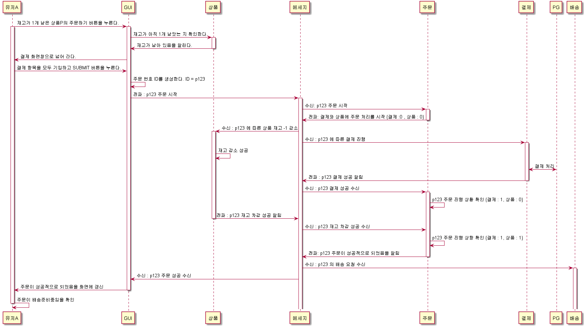

EDD 에서의 포인트는 이벤트의 전파와 수신에 대한 반응이 포인트이다. 전파와 수신이라고 나누어 본다면 사실 수신이 전파보다 어렵다. 

이커머스에서의 가장 단순한 개념의 시나리오를 생각해보자.

유저 A가 재고가 1개 남은 상품 P를 구매하려하는 상황이다. 

- WEB GUI

    - 주문 서비스

        - 상품 서비스
        
        - 결제 서비스    

- 배송 서비스

아래의 비지니스 흐름이 있다고 가정을 해보자



보통은 재고 차감과 결제를 같이 하나의 블록킹에서 처리가 되는 경우가 많다.

재고 차감과 결제를 따로 하는 경우는 알리익스프레스가 대표적이다. 


### 이벤트 추상화에 대한 단상

결제나 재고감소 등 모든 것이 정상적으로 수행 되고, 배송을 해야할 때를 가정해보자

위 기준으로 보면, 배송과 주문이 서로 식별 관계에 놓여진다.

배송은 주문에게서 발송 명령을 받게 되고,

주문은 배송에게서 성공, 실패 여부를 듣게 된다.

여기서 고민 사항이 생겼다. 메세지에 대한 추상화야 MyComp 라는 회사의 도메인 내에서 어느 정도 추상화를 할 수 있따, 예를 들면 아래와 같다.

```java
interface MyCompEvent{
    
    String getOrderId();
    
    String getForm();
    
    String[] getTo();
    
}

```

다만 주문-배송 간의 서로 간의 공유 모델은 어떻게 관리해야할까?

DDD에 나오는 준수자 관계와 같은 그런 얘기에 대한 고민이 든다.

DDD에는 이러한 공유 모델에 대한 관계에 대해 어떻게 구현할것인지에 대한 다양한 방법에 대해 리뷰를 해준다.

언어가 같을 떄에는 공유 모델(jar 또는 자바직렬화)을 사용해도 될수도 있고, 폴리포리즘을 준수해서 Protobuf 와 같은 모델 공유기를 사용해도 좋을수 있다.

기존에는 언어가 같다는 것을 생각하고, 클래스를 통해 자료 구조를 정의해서 공유하면 되었는데, MSA 에서는 서비스 간의 완벽한 독립성을 위해서는

서로가 최소한의 커플링을 갖는 공통 개념만 처리해야한다. 예를 들어서 상속 개념이 없는 언어가 나올수도 있기 떄문이다(그래서 프로토버프를 써보면 불편한 것이 많다)

모델에 구체적인 정의는 서비스 제공자가 하는 것이 맞다. 왜냐면 기능에 대해서 서비스 제공자가 알기 때문이다.

배송 접수 요청에 대해서 보면

리퀘스트입력폼(모델)에 대한 정의는 배송 서비스에서 해야한다. 주문은 해당 폼에 맞추어서 니즈를 요구해야하기 때문이다. (준수자)

당연하지않나? 주문이 리퀘스트입력폼을 제공해주는게 말이 안되지않나? 다만 아웃소싱과 같은 경우나, 같은 조직 내에서의 경우 업무 상황에 따라서 주문이 입력폼을 설계해서 줄 수도 있다. (공급자)

그게 아니라면 서로 설계를 같이 참여해서, 서로 같이 공통으로 만들어가는 개념일수도 있다.

이러한 관계의 기준을 소스 코드 관리를 누가 할것이냐? 로 방향성을 잡아보면, 에릭에반스가 분석한 표준 타입들에 대해 매칭을 할수가 있다.

이야기로 돌아가서 문득 이런 생각이 들었다.

주문 서비스 입장에서 MyComp배송 서비스와 연계를 하고 있었다.

이 때에는 아래와 같은 요청 스펙을 MyComp 에게서 전달받았다.

```java

class ShipRequestForm{
    private String targetUserName;
    private String targetUserAddress;
    private String targetUserPhone;
    
}

``` 

이렇게 잘 구성을 하다가, MyComp 배송 팀이 사업정리가 되고(말이안되지만 -_-;) 한국배송서비스와 연계를 하게 되었다고 가정하자.
사실 보통은 MyComp 배송팀의 업무가 자체 서비스개발에서 한국배송서비스의 아답터가 되는 게 맞곘지만.. 여기서는 인원 자체가 다 퇴사했다고 가정.

한국배송서비스와 연계를 할 때에는, MyComp 배송팀의 모델과 거의 유사했지만, 추가적으로 우편번호도 기재를 해달라고 한다.

기존에는 MyComp 배송팀에서 입력 주소 기반으로 우편번호를 직접 만들었는데, 이번에는 주문팀에서 이를 작업해주어야 한다.

이런 경우 과연 이를 DI에 위배가 되었다고 봐야할까? 이 경우 기존업무 처리 방식에서 우편번호를 입력해야 하는 속성이 확장된 것으로 생각할수있다.

배송이라는 개념으로 보면, 배송받을주소, 배송받을사람이름, 배송받을사람의 연락처 등 최소한의 속성이 있을 수 있다.

이런 경우에.. 배송의 표준 스펙이라는 개념이 있다면, 주문 서비스 입장에서는 해당 스펙만을 준수해서 DI로 접근하면 좋지 않을까? 란 생각이 든다.

다만 이는 배송 서비스 공급자 마다 설계된 모델이 국제적으로 표준화된 추상화가 없기 때문에, 저 마다 다른 얘기가 된다.

이런 게 있다면 참 좋을텐데.. 란 생각이 들다가도 아래와 같은 사고 실험을 생각해보면 또 안될거같기도 하다.

한국배송의 경우에는 우편번호를 기준으로 어떠한 중요한 처리를 한다고 하면 필수 속성이 될수 있다.

도메인은 워낙 복잡하고 시간이 흘러감에 따라 바뀐다. 시간이 흘러 몇 년 뒤에 우리가 거주하는 곳이 지구가 아니라 우편번호가 된다면.. 스마트폰을 안쓰고 생체연락수단이 생긴다면??

배송받을주소,배송받을사람이름,배송받을사람의연락처 가 그때도 과연있을까?

이 이야기는 MyComp 내의 서비스 를 총괄하는 총괄 설계자 관점에서 모든 것을 설계해야한다는 상황을 가정하다 보니 생겨난 의구심이었다.

myComp 안에서는 모두 자바언어를 사용한다는 가정을 하고.. 설계자가 각 서비스 간의 인터페이스(모델 포함) 도 정해주고 한다면.. API 의 바운더리가 매우 무겁고 거대해지고 설계자의 일에 부하가 올수있다는 생각이 들었다.

왜냐면 주문-배송 말고도 주문-결제, 결제-제품 등의 서비스 연관관계가 매우 많기 때문이다.

MSA는 폴리그랏을 존중한다는 것에 대한 관점으로 봤을떄, 우리가 일반적으로 보는 JSON 이나 XML 이라는 데이터를 표현하는 직렬화 포맷 역시 폴리그랏을 위배하는 게 아닐까?

애초에 TCP를 보면 그렇다. 프로토콜이라는 것은 일련의 0101010 비트 신호가 기록된 것을 특정한 기준으로 나누고, 거기 안에서 의미를 도출하는 표준 구조를 짜는 것을 말하지 않은가?

그럼 어디까지의 범주를 해야할까? 

프로토콜이라는 것도 그런것같다. 게임에서도 웹 프로토콜을 쓰면 매우 패킷 전송 관점에서 오버헤드가 심해서 느리다. 일반적으로 TCP 상에서 독자적인 프로토콜로 만드는 것이 성능적으로 매우 빠르다.

그런데 왜 게임에서 상점과 같은 컨텐츠는 대부분 웹뷰라고 하는 웹 프로토콜 기반으로 개발을 많이 할까?

그것은 익숙하고 인프라가 잘 구축되어 있기 때문이다.

상점에 접속하는 것이 게임 상의 실시간 동기화처럼 실시간 인터렉션이 필요한 경우는 아닌데다가, 상점 같은 경우는 외부 인프라와의 연동도 많이 필요하기 때문에

최근 인프라의 국제 표준격이라고 할 수 있는 웹 프로토콜로 개발을 하게 되는 거라고 생각한다. 아니 그렇다.

이 말을 다시 나의 논점으로 돌아가면 JSON , XML 에도 맞는 이야기가 된다.

더 올라가서 이 글을 쓰게 된 계기인..

공유 모델 포맷을 JSON 으로 하는 일반적인 것이 맞는가? 자바 직렬화를 하면 편하지 않나? 란 생각은..

조금 다른 것 같다. 자바 모듈의 공유나 자바 직렬화는 자바 언어에만 국한되어서 쓰일 수 있는데, JSON의 경우 요즘 왠만한 대부분의 언어는 역/직렬화를 지원한다.

그렇다면 JSON 도 구조라는 개념에서는 나름의 규칙이 있다. { key : value } 인데, TEXT 라는 개념으로 봤을 때 어떠한 경우가 좋을까?

예를 들어, 배송 접수를 시작해주세요 라는 주문이 배송에게 알리는 이벤트 메세지는 과연 어떠한 포맷으로 작성하는게 좋을까?

```javascript

{
    orderId : qwe-qweqw-qwe-,
    from : 주문,
    to : 배송,
    command : {
        type : 1,
        userName : 홍길동,
        userAddress ...
    }
}

```


```javascript
{
    orderId : qwe-qweqw-qwe-,
    from : 주문,
    to : 배송,
    message : "goShip:/홍길동"
}

```

여기서 배송 접수라는 의미의 키워드는 goShip 으로 했다, 회사마다 다르겠지만 code 나 type 이라는 개념으로 'sh001' 이라던지, '17' 일수도 있다. 즉, goShip 은 일종의 커맨드이다.

위의 케이스는 detail 이라는 객체 형태로 뽑은 것이고, 아래는 message 라는 속성에 URL 인 마냥 스킴을 섞고 목적지를 넣은 커맨드를 담았다. 

즉 지금 나는 MSA에서 나오는 단어인 '커맨드' 에 대한 설계를 어떻게 하는 것이 우하할까? 에 대한 생각이다.

위 사례에서는 command 객체의 type 을 통해 어떠한 목적을 가지는 지를 설명하고 있다. 다만 여기서 내가 일반적으로 하는 정수로 배송요청이라는 1을 나타내는 식으로 했다.

보통 문자로 할수도 있다. URL 이나 여러 프로토콜의 스킴을 보면 1://www.naver.com 이라고 하지를 않잖나? https://www.naver.com  , ssh://192.168.0.1... 등의 스킴은 명사로 정의가 된다.

7이나 ssh 라는 문자를 UTF8 로 인코딩해서 이를 2진법으로 저장한다면, 차이가 많이 날 것이다. 7은 적어도 1바이트에서 끝나지만 ssh 는.. 

URL 관점으로 봤을 때, 리소스의 식별은 결국 사람에게 공유하기 위한 주소번지이기에 컴퓨터의 2진법으로 쓰는 것이 아닌, 문자로 적는 것이 맞다.

다만 사람이 식별하는 것이 우선이 아닌, 시스템의 구동을 위한 데이터라면 얘기가 많이 다르다.

저장 사이즈가 크다는 것은 그 만큼 무수한 비트로 이루어져있다는 것이고, 사이즈가 적다는 것은 길다 짧다 관점으로 보면 짧고 이에 대한 성능이 빠르다.

선택이다.
