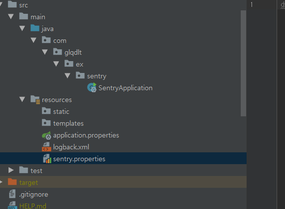
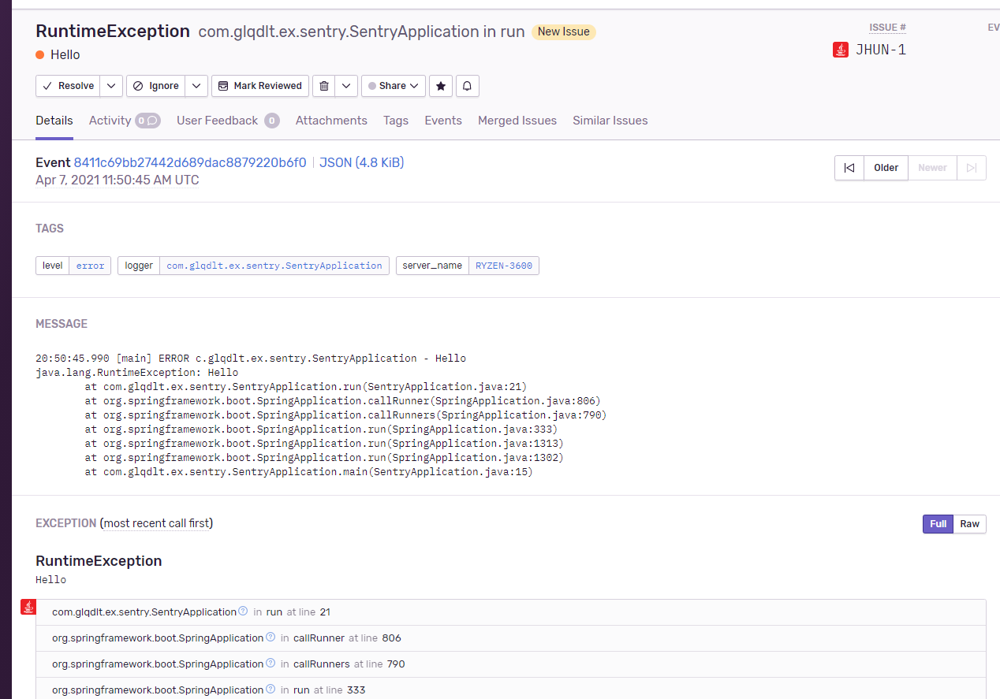

# Sentry

[Sentry](https://sentry.io/welcome/) 는 이슈 전파 알람 솔루션입니다. 앱 에서 에러 발생시에 해당 에러 trace를 notification 해주는 솔루션입니다.

게임 웹서비스에는 실시간 대응이 필요하기 때문에 장애 알람에 대해 관심이 많았습니다. sentry 는 자바 기반의 여러가지 플러그인을 지원함으로 지원하는 플러그인을 선택하여 모두 사용을 쉽게 할수 있습니다.

참고로 스프링 부트 스타터를 지원하기 때문에 손쉽게 구성할수도 있습니다.

여기서는 spring loback 기반의 appender 를 플러그인하는 방법과 센트리 클라우드 서버에서의 설정 방법을 설명합니다.


센트리는 기본적으로 특정 로거에 대해서 센트리 서버로 수신이 되고, 센트리 서버에서 설정해둔 웹훅 (또는 메일)로 메세지를 전달해주는 역활을 합니다. 참고로 센트리 서버는 직접 설치형으로 구성할수도 있고, 센트리 중앙 서버를 클라우드처럼 사용할수도 있습니다.
 

### application setup


간단합니다. pomx.dml 에 dependency 를 정의해서 로그백 플러그인을 구성하게 합니다.

```xml

     <dependency>
            <groupId>io.sentry</groupId>
            <artifactId>sentry-logback</artifactId>
            <version>1.7.30</version>
        </dependency>

```

프로젝트 구성은 아래와 같습니다.

 

센트리를 로그백에 플러그인하도록 합니다.

logback.xml
```xml

<configuration>
    <!-- Configure the Console appender -->
    <appender name="Console" class="ch.qos.logback.core.ConsoleAppender">
        <encoder>
            <pattern>%d{HH:mm:ss.SSS} [%thread] %-5level %logger{36} - %msg%n</pattern>
        </encoder>
    </appender>

    <!-- Configure the Sentry appender, overriding the logging threshold to the WARN level -->
    <appender name="Sentry" class="io.sentry.logback.SentryAppender">
        <filter class="ch.qos.logback.classic.filter.ThresholdFilter">
            <level>WARN</level>
        </filter>
        <!-- Optionally add an encoder -->
        <encoder>
            <pattern>%d{HH:mm:ss.SSS} [%thread] %-5level %logger{36} - %msg%n</pattern>
        </encoder>
    </appender>

    <!-- Enable the Console and Sentry appenders, Console is provided as an example
 of a non-Sentry logger that is set to a different logging threshold -->
    <root level="INFO">
        <appender-ref ref="Console" />
        <appender-ref ref="Sentry" />
    </root>
</configuration>

```

마지막으로 센트리 설정 프로퍼티를 셋업합니다.

sentry.properties
```properties
dsn=https://examplePublicKey@o0.ingest.sentry.io/0
```


간단한 테스트를 위해 APP 이 실행하자마자 에러를 내도록 합니다.

```java

@SpringBootApplication
public class SentryApplication implements CommandLineRunner
{
    private static final Logger LOGGER = LoggerFactory.getLogger(SentryApplication.class);

    public static void main(String[] args) {
        SpringApplication.run(SentryApplication.class, args);
    }

    @Override
    public void run(String... args) throws Exception {
        try {
            throw new RuntimeException("Hello");
        }catch (RuntimeException e) {
            LOGGER.error(e.getMessage(),e);
        }
    }
}

```

센트리 대시보드에서 에러를 확인할수있습니다.



## ref

https://docs.sentry.io/platforms/java/legacy/configuration/#setting-the-dsn

https://docs.sentry.io/platforms/java/legacy/logback/