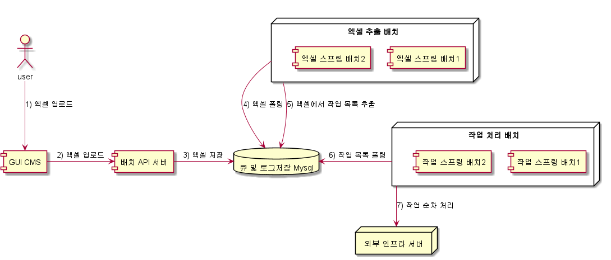
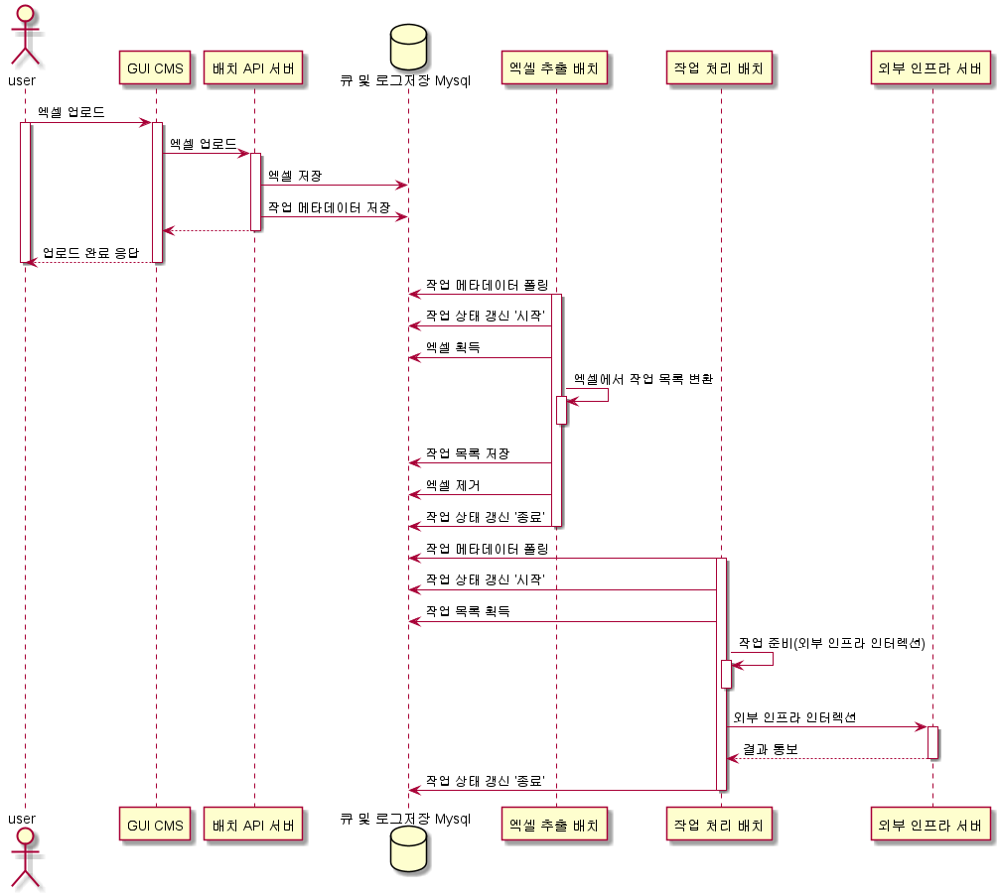
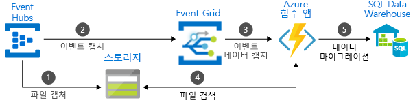
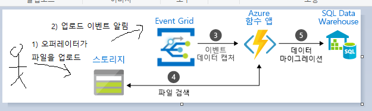
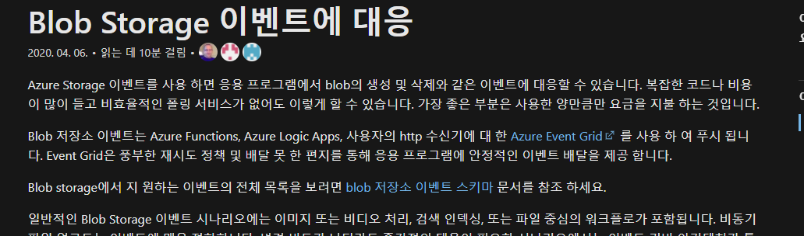
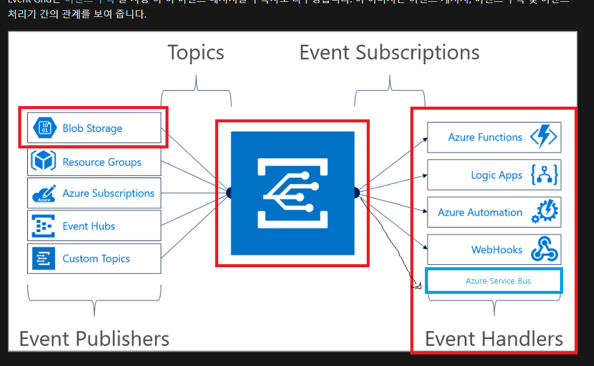
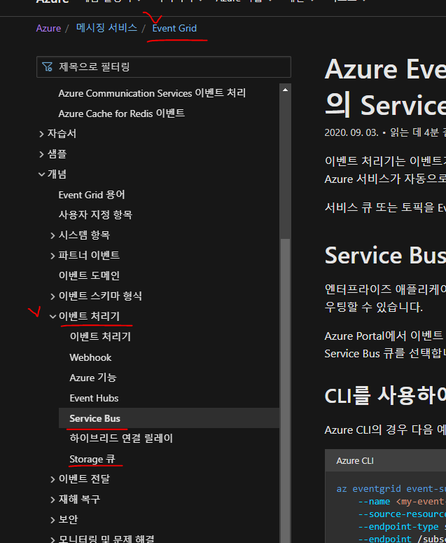

대용량 엑셀 처리

일반적으로 이커머스에서 정산이나, 매출 집계와 같은 여러가지 배치 유형의 프로그램을 많이 만든다. 게임 업계도 마찬가지로, 매출 집계와 결제 처리 등의 배치 유형을 만드는데, 이 부분은 빅데이터 팀에서 담당하고 있고, 서비스개발 조직에서는 조금 다른 유형의 처리를 지원하는 업무를 하고 있다.

일반적으로 게임 오퍼레이터라 불리우는 운영조직에서 악성유저 제한, 버그로 인한 재화 복구 등의 대량의 게임 비지니스 내에서 처리가 이루어져야 하는 업무 처리를 지원한다.
기본적으로 악성유저 제한에 대한 것은 반복적으로 나타나는 패턴 유형을 탬플릿으로 도출하고, 이를 기반으로 한 시스템들을 몇 만들게 되었는데, 이에 대한 이야기이다.

일반적으로 오퍼레이터는 1만건 이상의 데이터를 처리하길 원한다. 게임 회사에서 이벤트성으로 1회참여만 해도 재화를 주거나, 신규 가입을 하였을시에 기본으로 셋업되는 재화 같은 걸 특정 계정으로 몰아버리는 유형의 어뷰징이 있었다. 신규 가입 재화를 몰아주기 위해 시간당 1천개 이상의 계정을 만드는 경우가 있었는데, PC 모바일 에뮬레이터(nox 같은거)와 마우스 오토매크로를 통해 한 것으로 생각하고 있다. 특정 개인만 한 것은 아니고, 여러 국가 IP가 동시다발적으로 발생한 것으로 보아서 '작업장' 이라고 말하는 규모에서 어뷰징을 한 것으로 추정하고 있다. 어쨋든 이런 비정상적이고 다발적인 이슈로 대규모 처리를 한 적이 있다.

보통 오퍼레이터는 엑셀 이라는 문서 포맷으로 처리하길 원한다. 이유는 여러가지 원천 데이터를 얻어서 정보로 도출할 때, 엑셀이란 도구를 통해서 많이들 하기 때문이다. 
엑셀에는 1만건이상의 어떠한 행위를 해주어야하는 유저 명단이 있고, 이에 따른 행위를 처리해주어야 한다.

# 필요한 업무의 큰 틀은 아래와 같다

- 대량의 배치 처리를 하는 주체

- 배치 처리 주체의 작업 로그를 뷰잉

https://docs.microsoft.com/ko-kr/azure/azure-monitor/overview

Azure 에는 모든 리소스들의 로그들은 Azure Monitor 라는 솔루션을 통해서 프레젠테이션할수 있다. 포인트는 Azure 의 리소스들은 로그를 무조건 찍고 (console.out) 있는데, 이를 어떠한 수집 방법으로 로그를 저장하고, 로그들을 어떻게 뷰잉할지에 대한 전략을 구성해야 한다.

원시 로그 데이터를 사용치 않고, 로그의 데이터 포맷에 대한 처리를 요구하는 (리소스와 리소스 간의 데이터 유형이 많이 차이나는 경우) 데이터를 재가공해야하는 경우(함수의 map) 로그를 찍은 시점에서 다소 5분에서 많게는 10분까지 로그가 뷰잉되지 않을수 있다.  

## 1차 db 폴링 방식

처음에는 아래의 구성으로 서비스를 운영하였다

rdb mysql 을 사용했는데 이유는 아래와 같다

- 인메모리 큐를 구할 리소스 여건이 없었다.
    - 인메모리 큐를 구하더라도, 로그를 저장하고 fail over를 위한 영구 저장소가 필요했다.
- 놀고 있는 mysql 이 있었다
    - rdb 를 폴링해도 무난한 사용 빈도였다.
    

## 문제점

- 유저 풀이 늘어서, 배치 노드의 사이즈(실제 일을 하는 VM머신 갯수)가 커지니 DB 부하가 심화되었다.

- 취소 요청을 할 경우, 현재 모델에서는 DB에 앞으로 작업을 하지마세요 란 개념이기 때문에, 실제 작업이 진행되고 VM머신에게까지 작업 취소 요청을 전파할수가 없었다.

- 실제 작업을 하는 VM 머신이 작업이 에러가 났음을 외부로 알리기가 용이하지 않았다.

- 로그 조회 역시 폴링하는 개념이기 때문에, 실시간 조회가 어려웠다.

## pull vs push

위 방법에서 현재 시점에서는 경험과 지식이 한단계 더 진화했기 때문에 이 부분에 대해서 다소 거부감이 들거나 낡았다고 생각할수 있다.

폴링 방식은 불필요할때도 주기적으로 폴링할수 있기 때문에 비용이 비싼것이다. 즉, 이 방식에는 db 부하만 없으면 이슈가 없는 셈이기 때문에 규모가 작다면 오히려 괜찮다.

참고로 kafka 와 rabbitmq 의 차이는 래빗엠큐는 푸시 방식이고, 카프카는 폴링 방식이다. 전체 메카니즘이 그런 것은 하지만 핵심 개념 자체는 차이가 난다. 폴링 방식의 장점은 배압(버퍼 또는 쩡크 라고도 얘기함)을 소비가 직접 스스로 조절할수 있다. 반면 푸시 방법은 배압의 제어권이 공급자에게 있어 배압처리 관리가 어렵다. 이런 연유로 kafka 에서는 사용자가 직접 데이터 처리를 선택할수있기 때문에, 메세지 사이즈를 거의 무한대로도 처리할수 있어서 빅데이터 파이프라인으로 많이 사용 되었다. 이렇게 보면 폴링 방식이 능사같아보이지만, 폴링 방식에도 단점이 있다. 폴링 대상이 가지게 되는 부하와 부담이 커진다. 메세지 공급자는 언제 메세지를 다 지워도 될지를 알수가 없다. 왜냐면 소비자가 아직도 처리가 안되어서 폴링중일수도 있기 때문이다. 푸시 방식에서는 공급자 입장에서 부담이 없고 편하다. 그냥 공급자 편한데로 보내버리고 잘 도착했으면 그냥 지워버리면 되기 때문이다. 즉 공급자가 전달해주어야 할 메세지 관리를 스스로 주도적으로 할수 있다. 이는 함수형 프로그래밍을 배워보거나, RX (리액티브) 프로그래밍을 하다 보면 마주할수도 있다. 어떠한 게 잘났다 못났다를 말하기에는 어디에서 사용되냐의 관점에서 다르다. 부카티나 페라리와 같은 스포츠카가 비싸고 누구나 다 탐내는 차는 맞지만, 도심주행을 할때는 불편하다. 방지턱을 지날때 그 어떤 누구보다 아기 피부 위를 거닐듯이 조심히 다닌다. 왜냐면 스피드를 위해서 차고가 매우 낮기 때문에 차체 하부에 고장이 나거나 운전자에 충격이 올 가능성이 높기 때문이다. 비슷한 맥락으로 험비와 같은 덤프 트럭과 같은 바퀴가 큰 차들은 도심주행은 답이 없지만, 산악지형이나 사막과 같은 험난한 곳에서는 최고다.

### pull

폴 방식은 데이터 소비자가 소비할 데이터가 있는지 주기적으로 데이터 제공자에게 문의를 하는 방식이다. 대표적으로 ajax 와 같은 화면 표현을 갱신해야할지의 여부를 판단할 때 흔히들 써온 기법이다.

### push

푸시 방식은 데이터 제공자가 데이터 소비자에게 처리할 데이터가 있음을 알려주는 방식이다. 일반적으로 휴대폰 sms 알람 등록이나, 모바일 앱의 푸시메세지 같은 행위에서 주로 보여지는 방법이다.

## 인프라

우리는 azure cloud 기반에서 모든 시스템들이 구성이 되어있다. 필자는 2년 넘게 azure 에서 설계를 했었다. (그리고 ms에 주식을 몰빵했다)

### 이벤트 vs 메세징

엑셀이 업로드가 되었다는 것을 공유 스토리지(azure blob storage) 에서 이벤트를 외부로 전파해줄수 있다. 이때 사용할수 있는 것들이 'Azure Event Grid', 'Azure Service Bus'  , 'Azure Event Hubs' 가 있다. 이벤트 그리드와 이벤트 허브는 이벤트 전달을 목적으로 하고, 서비스 버스는 메세지 전달을 목적으로 한다.

이벤트와 메세지에 차이를 두고 있는 데, 이유는 이러하다. 이벤트라는 데이터 유형은 빅데이터라 보기 어려운 유형이다. 보통 이벤트라 함은 'aaa에서 bbb행동을 하였음! ccc들은 확인바람!' 과 같이 어떠한 이벤트에 대해 알려주는 용도로 aaa = 주체가, bbb = 행동과 목적, ccc= 수신자 의 데이터 구조를 따르는 작은 데이터 인 경우가 많다.

반면 메세지는 자유롭다. 메세지를 이메일이나, 실제 우편으로 생각해도 좋다. 이메일이나 우편에는 별첨이라는 개념이 있는데, 우편으로 치면 현금이나, 간단한 악세사리 귀금속일 수도 있고, 이메일이라면 사진,동영상과 같은 미디어 또는 원시 바이너리 데이터일 수 있다. 

즉, 이벤트는 구조가 정해진 문자열을 말하고, 메세지는 바이너리 데이터가 포함될수 있는 걸 의미한다. 

이런 경유로 Azure 에서는 이벤트와 메세지라는 범주를 나누어 솔루션을 설계 했다.

3개의 솔루션에 대한 차이에 대해서는 Azure 문서에도 잘 정리가 되어있다.
https://docs.microsoft.com/ko-kr/azure/event-grid/compare-messaging-services

Azure 공식문서에서 이벤트를 기반으로 한 엑셀 업로드에 대한 심플한 제안은 아래와 같다.

나의 경우는 이벤트 허브를 굳이 쓸만큼 빅데이터 연산 스트리밍이 필요한 것이 아니기에 아래처럼 고민을 했다.

스토리지(Azure Blob Storage)에서는 파일이 업로드, 제거가 되었음을 이벤트로 알릴수 있는 기능이 있다. 

> Azure Storage 이벤트를 사용 하면 응용 프로그램에서 blob의 생성 및 삭제와 같은 이벤트에 대응할 수 있습니다. 복잡한 코드나 비용이 많이 들고 비효율적인 폴링 서비스가 없어도 이렇게 할 수 있습니다. 가장 좋은 부분은 사용한 양만큼만 요금을 지불 하는 것입니다. - https://docs.microsoft.com/ko-kr/azure/storage/blobs/storage-blob-event-overview

아래는 소개 문서에 있는 EventGrid 를 주체로 이벤트의 전달 소스와 전달 가능한 곳을 말하는이미지이다. Azure Service Bus 에도 이벤트를 전달할수 있는 게 없길래 조금 편집해보았다.

아래는 서비스버스에도 이벤트를 전달할수있음을 시사하는 증거이다. (https://docs.microsoft.com/ko-kr/azure/event-grid/handler-service-bus)

이벤트는 blob storage 에 파일이 생성되거나 삭제될 때의 유형 2개를 기본적으로 지원한다. (https://docs.microsoft.com/ko-kr/azure/event-grid/event-schema-blob-storage?toc=%2Fazure%2Fstorage%2Fblobs%2Ftoc.json&tabs=event-grid-event-schema#available-event-types)

|이벤트|설명|
|---|---|
|Microsoft.Storage.BlobCreated|Blob 생성 또는 교체 시 트리거됩니다.|
|Microsoft.Storage.BlobDeleted|Blob 삭제 시 트리거됩니다.|
