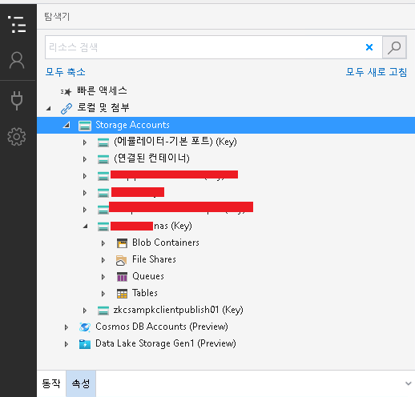
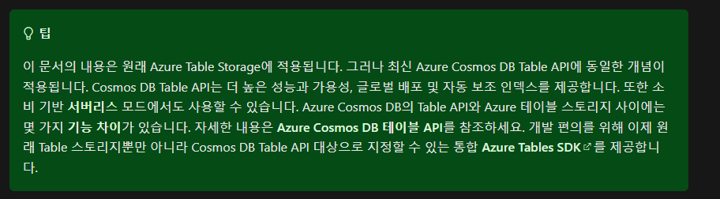

azure 의 storage 솔루션들을 정리해본다.

회사에서는 Azure Blob Storage 를 실무에서 가장 많이 사용하고, Azure Files, Azure Queus, Tables 는 테스트용으로 사용해보았다.

Azure Blob Storage 를 nas 처럼 쓰는 풍토도 있었는데, 이 부분이 의아해서 Azure Files 와의 비교를 하게 된 것이 아티클을 쓰게 된 계기이다.

### 우리 회사에서는 NAS 용으로 Azure Blob 을 쓴다. Files 를 왜 안쓸까?

아래에서 서술하겠지만 Azure Files 는 SMB 삼바 프로토콜도 지원하기 때문에, OS에 네트워크 드라이브로 마운트해서 사용할수 있다. 그리고 Blob Storage 처럼 계층형 보관을 하지 않아도 되기 때문에 빈 폴더도 만들수있어  NAS용으로 사용하기에 적합하다. 그런데 웃긴건 Azure Files 가 blob storage 보다 비용이 더 비싸다. --;  [공식 MS Q&A](https://docs.microsoft.com/en-us/answers/questions/450306/azure-blob-vs-fileshare-storage.html) 에 올라온 글을 보면 확인할수 있다. 이 글을 계기로 직접 가격비교를 해보니 핫 스토리지 기준 Azure Files는 GB 당 $0.0255 , Azure Blob 은 GB 당 $0.018 으로 거의 2배 가까운 가격 차이를 보였다. Blob 에는 Archive 모드의 보관 전용 스토리지 가격도 있는데, 이 경우에는 GB당 $0.00099 으로 Azure Files 보다 훨씬 저렴하다. Files 가 비싼 것은 디스크 마운트와 같은 고급 UX 기능을 비롯해서, 트랜잭션 모드 등의 기능이 추가되면서 비싼 것으로 생각된다. 
 
 Azure Blob 도 네트워크 드라이브로 마운트할수 있는 것이 최근 추가되었다. NFS 3.0 프로토콜을 추가했다고 한다 (https://docs.microsoft.com/en-us/azure/storage/blobs/network-file-system-protocol-support-how-to?tabs=azure-powershell) 단 이 경우 리눅스에서만 마운트할수있다.

Azure 에는 Storage Accounts(스토리지 계정, 이하 SA) 를 할당받아 스토리지 솔루션(서비스) 를 사용할수 있다.

아래는 회사에서 사용중인 나의 SA 로 Microsoft Azure Storage Explorer 를 사용한 모습이다.

계층으로 표현하면 아래와 같고, 이 아티클에서 살펴볼 대상들이다.

- Stroage Account([Azure Storage](https://docs.microsoft.com/ko-kr/azure/storage/common/storage-introduction))
    - Container
        - Blob Container([Azure Blob Storage](https://docs.microsoft.com/ko-kr/azure/storage/blobs/storage-blobs-introduction))
        - File Shares ([Azure Files](https://docs.microsoft.com/ko-kr/azure/storage/files/storage-files-introduction))
        - Queues([Azure Queue Storage](https://docs.microsoft.com/ko-kr/azure/storage/queues/storage-queues-introduction))
        - Tables([Azure Table Storage](https://docs.microsoft.com/ko-kr/azure/storage/tables/table-storage-overview))
        
각 서비스마다의 특색은 아래와 같다. (https://docs.microsoft.com/ko-kr/azure/storage/common/storage-introduction#sample-scenarios-for-azure-storage-services)

### Azure Table Storage

MS에서는 Table Storage 보다 Cosmos DB 를 더 팔기 원하는 모양새이다. 

아래는 차이이점이다. (https://docs.microsoft.com/ko-kr/azure/cosmos-db/table/introduction)

### Azure Queue

사내에서 주로 서비스 버스를 메세지 교환소 로 쓰고 있다. Azure Queue Storage 와 차이점이 궁금해서 찾아보았다. [관련 문서](https://docs.microsoft.com/ko-kr/azure/service-bus-messaging/service-bus-azure-and-service-bus-queues-compared-contrasted)

|항목|서비스버스|큐 스토리지|
|---|---|---|
|MS 관리 인프라, 또는 제품 카테고리|Azure 메세지| Azure 스토리지|
|메세지 크기|64KB ~ 256KB (프리미엄 100MB )| 최대 64KB|
|순서정렬보장| FIFO | FIFO 이지만 완전하진 않음|
|Pub/Sub 지원| o | x|
|메세지전달횟수| N번| 1번|
|AMQP 프로토콜 지원| O | x|
|중복 메세지 구별 지원| O | x|
|큐 스토리지 크기| 80GB미만 | 80Gb 초과|
|용도| | 애플리케이션은 80GB보다 많은 메시지는 큐에 저장해야 합니다.    애플리케이션에서 큐 내부의 메시지 처리 진행률을 추적하려는 경우. 이는 작업자가 메시지 충돌을 처리하는 경우에 유용합니다. 그러면 다른 작업자가 해당 정보를 사용하여 이전 작업자가 중단한 부분부터 작업을 계속할 수 있습니다.    큐에 대해 실행된 모든 트랜잭션의 서버 측 로그가 필요합니다. |

   