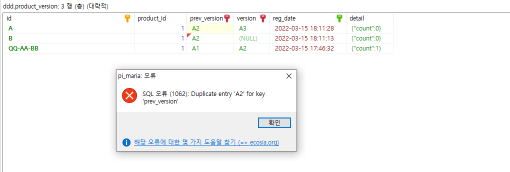

# Domain Driven Dev

DDD 관련해서 작성 했던 토막글을 정리.

### 에그리게이트 상태, 버전 관리에 대하여

일반적으로 사용되는 에그리게이트의 버전 관리는 아래와 같다.

detail 컬럼은 에그리게이트의 스냅샷 이다. 테스트 구성이어서 JSON 문자열로 저장하는 식으로 해두었는데, 관계형 데이터베이스로 풀면 복잡도(서브 도메인 모델의 버전 관리 고려)가 높아져서 이렇게 구성했다. 

DDD가 커플링을 배제를 목적으로 낙관적 잠금을 사용하게 되는데, 이런 탓에 자연스레 NOSQL 이 땡겨진다.

하고 싶은 얘기는 위에서 version 컬럼이 순차 증가 정수 타입인 것을 얘기하고 싶다. rdb 의 auto increment 기능이 버전을 관리하는 주체가 되어서 별도로 신경쓰지 않아도 좋다. 하지만 INT 형이라면 결국 32비트 정수 최대인 20억 쯤 도달하면 정수를 더 증가시킬 수 없게 된다. unsigned 타입으로 하던, bigint 를 쓰던 간에 결국 끝이 있다. 그래서 일 단위로 초기화할수 있게 하는 date 라는 컬럼을 추가하고 date 와 version 컬럼이 결합된 복합 유니크 키로 구성 했다.

version 컬럼을 순차 증가 정수타입으로 사용 된 이유는 단순한데, 모든 컴포넌트들이 사용할수 있는 단순하고 정확한 알고리즘이기 때문이다. 조회했을 당시의 얻어진 version 값에서 +1 만 하면 되니깐 말이다. 별도의 알고리즘 모듈을 탑재하거나, version 필드를 관리하는 서버를 경유하지 않아도 자체적으로 version 값을 생성할수 있다.

그런데 쉬우면 항상 문제가 생기더라. 위 예시로 보면 2022-03-15에서 2022-03-16으로 넘어가는 시점에 문제가 발생한다.  예를 들어 아래와 같은 시나리오가 있다고 생각해보자. 

1. 레코드 마지막은 date 는 2022-03-15 , version 99 인 상태에서,   
2. 2022-03-15 23:59:59 에 접근한 A와, 2022-03-16 00:00:00 에 접근한 B가 있다고 가정.
3. 둘다 모두 2022-03-15,version99 를 가져 왔지만, A는 15일에 접근했기에 version 100 으로 올리기만 하고 B는 다음날에 접근했기 때문에 version 을 1로 초기화하게 된다. 아래의 그림처럼 처리 된다. 
 

   
   
이런 불상사를 해결하고자 단순하게 접근하면 커밋을 하는 시점이 23시에서 24시 사이라면 무조건 다음 날자로 버전업을 한다 로 변경해볼수 있는데, 22시에서 23시로 넘어가는 시점에 똑같은 문제가 발생한다.

결국 이런 version 을 관리하는 주체(알고리즘 생성 모듈, 또는 version 값 관리 서버)가 필요해지는 문제가 된다. 

단순히 date+version 이 아니라, sequence 라는 개념의 bigint 컬럼을 잡고 단순히 정수를 증가시키는 auto increment 컬럼으로 파더라도, 1달에 한번 누군가는 이 auto increment 를 1 값으로 초기화 시켜주어야 한다.

그런데 가만 또 생각해보니, 이전버전 + 새로운버전 이라는 개념의 복합키라면 이러한 문제가 해결되리라 생각되었다.

아래의 그림을 보자

 
 
이전 버전(prev_version 컬럼)과 현재 버전(version 컬럼)을 각각 독립적인 유니크키로 만든다. 즉 위 캡쳐에선 유니크컬럼이 2개있다.

이렇게 하면 A와 B 모두 조회 당시의 버전은 A2로 같은 버전을 참조하고, 이 A2를 가지고 prev_version 에 insert 를 동시에 하려 하게된다. insert 를 동시에 하더라도 prev_version 컬럼은 유니크하기 때문에 먼저 등록한 A의 처리가 등록이 되고, B는 중복 에러로 인해 실패하게 되었다.

version 값을 생성하는 알고리즘은 UUID 와 같은 것으로 해도 되고, insert 시간으로 해도 무난하다. 어떠한 알고리즘을 쓰더라도 좋다. A와 B가 서로 다른 알고리즘을 써도 괜찮다. 서로 다른 알고리즘을 쓰더라도 prev_version 은 서로 같은 값을 쓰게 되기 때문에 문제 없다.