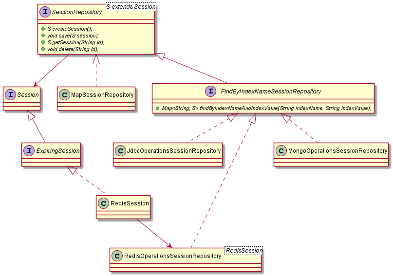
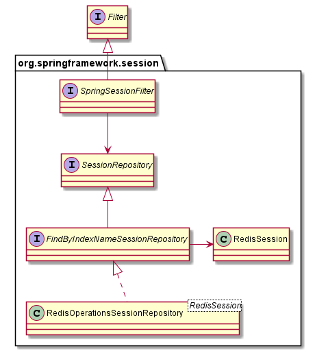
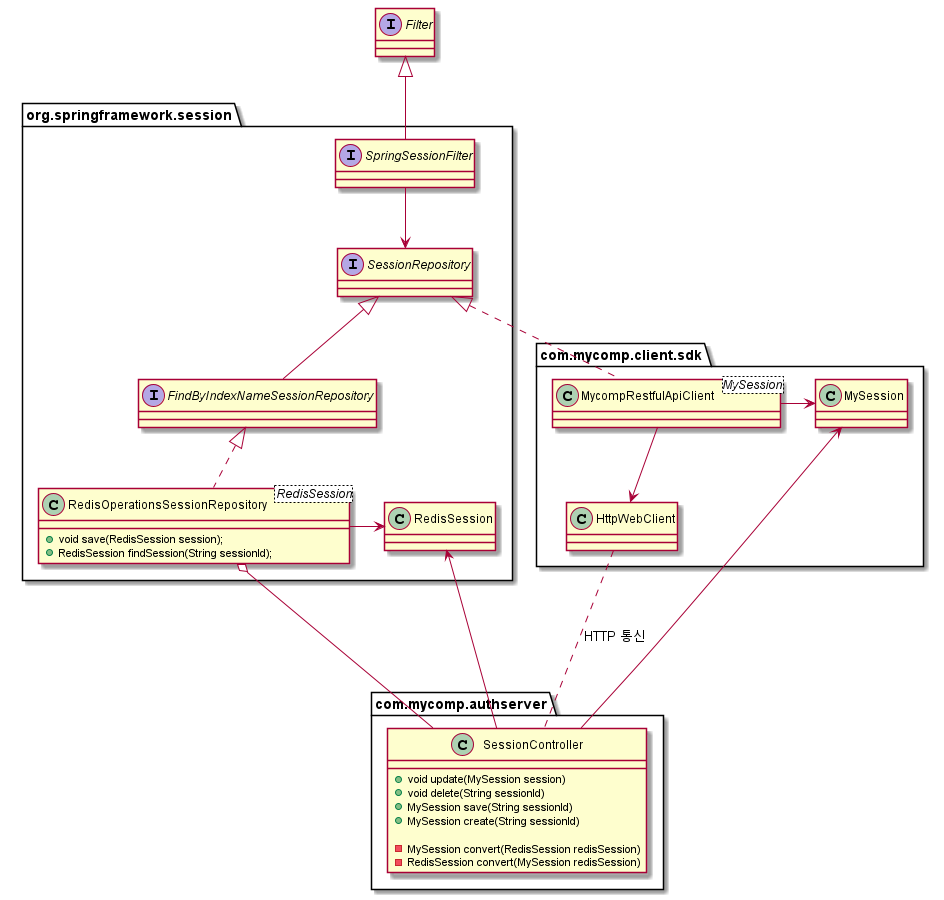
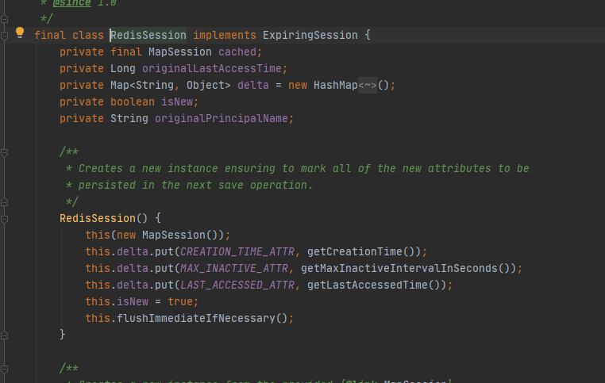
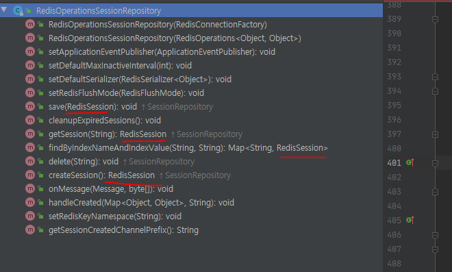
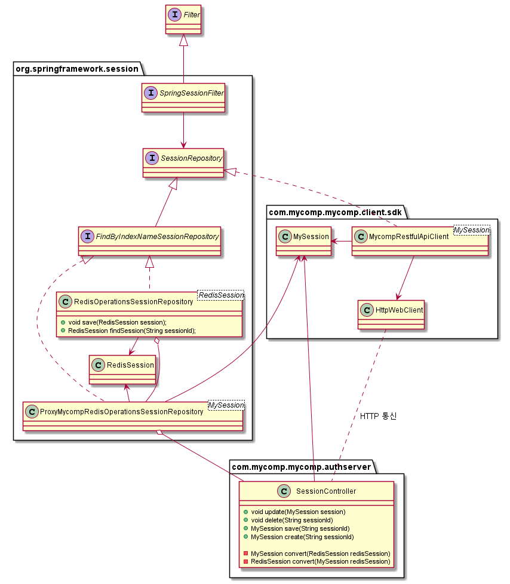

## 스프링 세션 REDIS 를 고치지 않고 처리

스프링 세션 프로젝트는 스프링 프레임워크에서 세션 파트를 담당하는 모듈 프로젝트 이다.

스프링 세션 프로젝트는 기본적으로 Session Repository 라는 추상화를 통해 다양한 세션 구현체들을 제공한다.

큰 관점으로는 아래의 구현체들을 제공한다.

Session Repository

simple local hashmap repository

jdbc repository

redis repository

…

아래는 스프링 세션 프로젝트 구성을 뽑은 클래스 다이어그램이다.



현재 하고 있는 프로젝트 에서는 세션 저장소로 인메모리 DB인 Redis 를 사용하려 했기에, 위 구현체중에 RedisOperationsSessionRepository 를 사용하려고 계획 중에 있었다.

스프링 세션은 세션 필터라는 것을 통해 세션 레포지토리와 커뮤니케이션 하는 구조이다. 아래를 참고



다만 사내 보안 권고사항으로 각 웹앱에서는 직접적으로 REDIS 에 접근하면 안되는 정책이 생겼되었다. 이에 따라 REDIS 에 접근할수 있는 특정 웹서버를 경유해서 접근하는 식으로 서비스 스트럭처를 바꾸게 되었다.

따라서 아래처럼, MyCompRestfulApiSessionClient 라는 것을 구현하여 RestfulApi 통신을 하는 컴포넌트를 정의하여 리를 통해 처리하기로 했다. 그리고 MyCompRestfulApiSessionClient  과 통신하는 authserver에 실제 세션 관리를 처리하는 SessionController를 만들고 이 친구가 RedisOperationsSessionRepository  를 감싸서 Redis 세션 관리를 호출하게 하는 식으로 업무 공수를 줄이기로 하였다. 즉 redis 에 직접 처리하면 안되는 규칙만 준수하고, 실제 처리는 스프링 redis 구현체를 그대로 사용하는 것이다. 일종의 프록시 역활을 하게 하고자 의도했다.



SessionController 의 역활은 RedisOperationSessionRepository 와 MycompRestfulApiClient 를 네트워크 상에 연결해주고, 서로 다른 Session 타입을 컨버팅 하는 역활을 수행한다.

그런데 문제는 RedisSession 클래스에서 발생했다. RedisSession 클래스는 접근지시어가 public 이 아니라 default 레벨로 되어있어서, 같은 패키지인 ‘spring.session’ 의 클래스들만이 해당 클래스에 접근이 가능하다.




또한 이 Redis Session 핵심 CRUD 메소드에서 모두 사용하고 있다.



따라서 위에서 원래 계획했던 구성이 불가능하다.


RedisOperationSessionRepository 를 사용하지 못하게 됨에 따라 이 클래스에서 제공이 되었던 기능들을 직접 개발해야 하는 이슈에 직면하게 된다.

- Redis 세션 스키마 설계
- Redis CRUD 핸들링
- 세션 라이프 사이클 관리

이런 상황속에서 팀장님이 아이디어를 하나 제안 주셨는데 아이디어는 패키지명을 스프링프레임워크와 맞추어서 RedisSession 클래스에 접근해보자는 것이었다.
 
스프링 프레임워크 redis 모듈 패키지와 패키지명만 똑같은 모듈을 별도로 만들어서 RedisSession 에 접근하는 프록시 역활을 하는 클래스를 만드는 것이다.

이를 표현하면 아래와 같이 된다.




ProxyMyCompRedisOperationsSessionRepository 란 클래스는 MySession 과 RedisSession 을 변환하는 아답터의 기능을 수행함과 동시에, 핵심 기능인 REDIS CRUD  는 프레임워크 구현체인 RedisOperationsSessionRepository 에 흐름을 전달하는 프록시 역활을 하게 된다.

이 아이디어 접근 방법은 자바의 패키지는 단순히 디렉토리 개념이기 때문에, 클래스로더가 로드될 때 같은 패키지명만 같다면 같은 클래스 패키지로 로드가 되는 구조적인 문제를 이용한 트릭이다.  

이 방법의 단점은 자바의 패키지 구조가 대대적으로 바뀐 자바9 부터는 사용할 수가 없다. 

따라서 자바9버전으로 버전업이 된다면 이슈가 발생할수 있다. 다만 이러한 이슈는 아래의 이유로 어느정도 완충이 가능해서 프로젝트를 진행했다. 

- 첫째로 자바9이상의 버전업을 요구하는 프로젝트가 현재로서는 전무하다.
 
- 두번째로 설사 자바9 로 버전업이 되더라도 ProxyMyCompRedisOperationsSessionRepository  를 사용하는 프로젝트는 특정 서버 하나이며, 이 서버에만 자바8로 환경구성을 하여 서비스를 하면 되기에 큰 이슈가 되지 않는다.
 
 

## 쉘스크립트

IAAS 로 구성된 리눅스 VM에 설치된 웹앱들의 소유 계정을 변경해야하는 이슈가 있었다. 문제는 VM의 대수가 워낙 많아서 사람이 일일히 하려면 꽤나 골때리는 일이다.

간단히 쉘스크립트를 짜서 조금이라도 공수를 줄이고자 했다. 오랜만에 스크립트를 짯더니 기억이 가물가물하던지라 매우 허접하다.

스크립트의 로직은 크게 아래와 같다.

1. 변경할 서비스 계정을 아규먼트로 받아 변수에 할당

2. 기 설치된 3rd 프로그램 제거

3. 3rd 프로그램 재설치

4. 웹앱 폴더 소유 변경


```shell script
#/bin/bash

param1=$1

if [ -z "${param1}" ]; then
        echo "param is null"
        exit 1
fi

echo "you typed param, $param1"

agent_path="/opt/third_party_daemon"
app_path="/opt/myAppPath"

if [ ! -d $agent_path ]; then
        echo "not found azure agent directory"
        exit 1
fi

if [ ! -d $app_path ]; then
        echo "not found app directory"
        exit 1
fi

echo "remove third_party_daemon"
chown -Rf userA:userA $agent_path
su - userA -c "cd /opt/third_party_daemon; sudo sh daemon_install.sh stop; sudo sh daemon_install.sh uninstall"
echo "done"

echo "start agent change.. work"
chown -Rf $param1:$param1 $agent_path
chmod -Rf 774 $agent_path
echo "done"

echo "start app_path.. work"
chown -Rf $param1:$param1 $app_path
chmod -Rf 774 $app_path
echo "done"

echo "start agent"
cd $agent_path
sh daemon_install.sh install
sh daemon_install.sh start
echo "done"
```