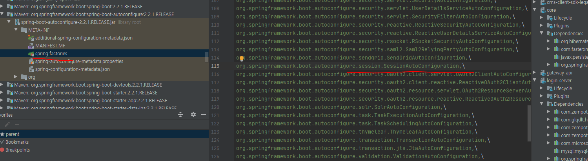
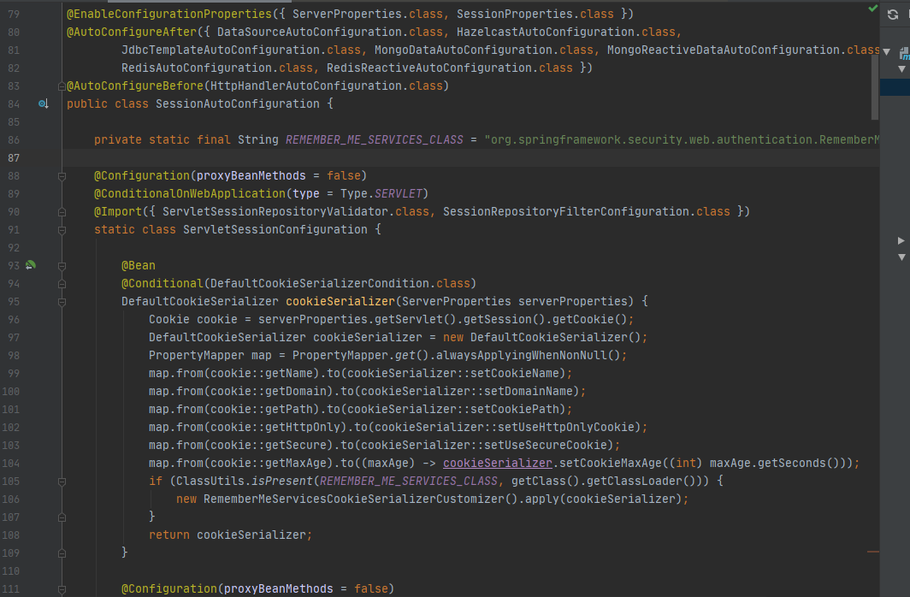
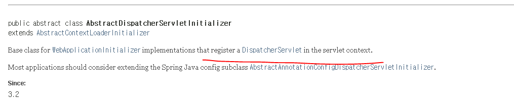

## 세션 클러스터링 기반의 레거시 웹앱과 스프링 부트 웹앱의 구성 시의 트러블슈팅

이슈는 레거시 웹앱을 인증서버의 세션과 클러스터링 될 수 있도록 하는 작업을 하고 있었다.

세션 클러스터링은 스프링세션 모듈 프로젝트를 썼는데, 레거시 웹앱에서 동작하질 않았다.


아래는 스프링 부트 기반의 웹앱이다.


아래는 레거시 웹앱


두 웹앱의 필터 구성에서 차이가 나는 것은 갯수도 있겠지만, 가장 중요한 것은 springSessionRepositoryFilter 라는 필터가 등록되어 있지 않다.

이 필터가 하는 역활을 스프링프레임워크에 httpSession 이 처리될 필터가 동작하기 이전에, 서블릿 컨테이너에서 만들어진 세션을 한번 감싸서 스프링 프레임워크에 최적화된 자체 세션 객체로 wrapping 하는 역할을 한다.

wrapping 은 SessionRepositoryRequestWrapper.class 와 SessionRepositoryResponseWrapper.class 라는 클래스로 감싸진다.  

감싸진 request와 response 는 아래 소스코드를 보면 알겠지만 필터체인을 통해 다음 필터에 감싸진 request와 response 를 전달하게 된다.
  
```java
public class SessionRepositoryFilter<S extends Session> extends OncePerRequestFilter {
    
//...

	@Override
	protected void doFilterInternal(HttpServletRequest request, HttpServletResponse response, FilterChain filterChain)
			throws ServletException, IOException {
		request.setAttribute(SESSION_REPOSITORY_ATTR, this.sessionRepository);

		SessionRepositoryRequestWrapper wrappedRequest = new SessionRepositoryRequestWrapper(request, response);
		SessionRepositoryRequestWrapper wrappedResponse = new SessionRepositoryResponseWrapper(wrappedRequest,
				response);

		try {
			filterChain.doFilter(wrappedRequest, wrappedResponse);
		}
		finally {
			wrappedRequest.commitSession();
		}
	}
}
```
  
즉 이 필터를 도달한 이후의 필터들은 모두 오리지날 Request, Response 가 아닌  SessionRepositoryRequestWrapper 와 SessionRepositoryRequestWrapper 로 상호작용하게 되는 것이다.

SessionRepositoryRequestWrapper 와 SessionRepositoryRequestWrapper 는 오리지날 request와 response 를 감싼다는 것 외에도 몇 가지 기능적인 측면을 제공한다. 

이러한 부분이 가장 도드라지는 클래스는 SessionRepositoryRequestWrapper 이다.

SessionRepositoryRequestWrapper.class 이 클래스는 getSession() 이 호출 될때 SessionRepository.class 를 사용하여 세션을 가져온다.

```java
private final class SessionRepositoryRequestWrapper extends HttpServletRequestWrapper {
        public HttpSessionWrapper getSession(boolean create) {

			HttpSessionWrapper currentSession = getCurrentSession();
			if (currentSession != null) {
				return currentSession;
			}
			S requestedSession = getRequestedSession();
			if (requestedSession != null) {
				if (getAttribute(INVALID_SESSION_ID_ATTR) == null) {
					requestedSession.setLastAccessedTime(Instant.now());
					this.requestedSessionIdValid = true;
					currentSession = new HttpSessionWrapper(requestedSession, getServletContext());
					currentSession.markNotNew();
					setCurrentSession(currentSession);
					return currentSession;
				}
			}
			else {
				// This is an invalid session id. No need to ask again if
				// request.getSession is invoked for the duration of this request
				if (SESSION_LOGGER.isDebugEnabled()) {
					SESSION_LOGGER.debug(
							"No session found by id: Caching result for getSession(false) for this HttpServletRequest.");
				}
				setAttribute(INVALID_SESSION_ID_ATTR, "true");
			}
			if (!create) {
				return null;
			}
			if (SessionRepositoryFilter.this.httpSessionIdResolver instanceof CookieHttpSessionIdResolver
					&& this.response.isCommitted()) {
				throw new IllegalStateException("Cannot create a session after the response has been committed");
			}
			if (SESSION_LOGGER.isDebugEnabled()) {
				SESSION_LOGGER.debug(
						"A new session was created. To help you troubleshoot where the session was created we provided a StackTrace (this is not an error). You can prevent this from appearing by disabling DEBUG logging for "
								+ SESSION_LOGGER_NAME,
						new RuntimeException("For debugging purposes only (not an error)"));
			}
			S session = SessionRepositoryFilter.this.sessionRepository.createSession();
			session.setLastAccessedTime(Instant.now());
			currentSession = new HttpSessionWrapper(session, getServletContext());
			setCurrentSession(currentSession);
			return currentSession;
		}
}

```

SessionRepository 는 세션을 저장하고 조회할수 있는 영속성에 대한 컴포넌트이다. Redis, Jdbc, InMemory 등 여러가지 저장방법을 제공한다. 

다시 스프링 부트 기반의 정상적인 필터 구성으로 돌아가보자


필터의 순서를 보면 springSecurityFilterChain 이라는 필터보다 springSessionRepositoryFilter 가 먼저 동작하게 되어 있는 것을 알수 있다.

springSecurityFilterChain 는 스프링시큐리티에서 사용하는 필터이다. 즉 스프링세션에 의해 wrapping 된 request와 response 를 스프링시큐리티에서 사용하게 된다.

이것이 스프링세션과 스프링시큐리티가 상호작용할 수 있는 메카니즘이다.

### 레거시에서 SpringSessionRepositoryFilter 가 등록되지 않음.

스프링 세션은 기본적으로 ```@EnableHttpSession``` 이라는 어노테이션을 통해 SpringHttpSessionConfiguration.class 가 스프링 세션에 필요한 구성 컴포넌트들을 어플리케이션 컨텍스트에 등록하면서 사용할수 있게 된다.

레거시 웹앱에 이 어노테이션을 달았는 데 동작을 하지 않아 디버깅해보니 아래 캡처처럼 필터가 등록이 되지 않았다.


본래 기존 잘 동작하던 스프링 부트 웹앱을 살펴보니, 

스프링 부트에서는 아래처럼 SpringSession 모듈의 설정을 자동으로 구성하는 AutoConfiguration 이 등록되어 있었다. 



SessionAutoConfiguration.class 는 쿠키 생성 방법과 SpringSessionRepositoryFilter 를 서블릿 컨테이너에 등록하는 역할을 하는 설정 클래스였다. 



레거시 웹앱에서는 스프링 부트 자동설정이 동작되지 않기 때문에 SessionAutoConfiguration.class 에서 담당하던 기능을 직접 수동으로 처리해주어야 했다.

## 서블릿컨테이너에 필터를 등록하는 방법

서블릿컨테이너에 필터를 등록하는 방법은 3개가 있다.

가장 단순하게 서블릿 컨테이너에 직접 필터를 등록하는 방법이다. 서블릿에 대한 명세를 작성하는 web.xml 이나 WebApplicationInitializer.class 를 통해 필터를 등록할 수 있다. 

다만 이 방법에는 스프링 프레임워크의 다양한 장점을 사용하지 못하는 단점이 있다. 왜냐면 필터가 등록되는 시점은 서블릿이 완전 초기화 되기 이전에 동작하기 때문이다.

이러한 문제를 해결하기 위해서는 스프링에서 제공하는 DelegatingFilterProxy.class 필터를 등록해서 해결이 가능하다.  

스프링 부트에서는 [FilterRegistrationBean.class](https://docs.spring.io/spring-boot/docs/current/api/org/springframework/boot/web/servlet/FilterRegistrationBean.html) 를 빈으로 생성해서 등록하면 이 클래스가 참조하는 필터를 서블릿 컨테이너에 필터를 AddOn 할 수 있다.


### DelegatingFilterProxy.class

Delegate 란 위임하다는 의미이다. 즉 이 필터는 다른 필터 구현체에게 필터 자신이 해야할일을 전달하는 기능을 수행한다. 이 필터는 기본적으로 서블릿컨테이너에 사용하기 위해 만들어졌다.

서블릿 컨테이너에 필터가 설정이 되면 ApplicationFilterConfig 라는 WAS 의 필터저장소에 저장이 된다. 그리고 책임연쇄 패턴으로 각 필터들이 호출이 되면서 처리가 가능한 필터가 request 를 처리하는 구성이다.

SpringSecurity 와 SpringSession 에서 이 필터를 사용한다.

이 필터를 사용하는 이유는 스프링 프레임워크의 강력한 DI 와 IoC 기능을 사용할수 있는 필터이기 때문이다. 서블릿 컨테이너에 등록되는 필털들은 필터 등록 시점 상 스프링프레임워크와 상호작용할 수 없다.

하지만 이 DelegatingFilterProxy 를 사용하면 이러한 부분을 해결할수있다. 이 필터는 Delegate 되는 대상 스프링 빈이 등록이 되있을 것이라고 가정을 하고 느슨하게 연결되기 때문이다.

### WebApplicationInitializer.class

기본적으로 JavaEE 아키텍처상 서블릿 컨테이너는 운영해야할 서블릿에 대한 정보를 WEB-INF 폴더에 web.xml 을 읽어들이면서 서블릿을 구성하게 된다.

이후 Servlet 3.0 스펙으로 업데이트 되면서 기존 xml 기반의 설정의 구성을 확장해 Java 기반의 설정 방식을 하도록  ServletContainerInitializer.class 를 통해 자바 기반의 설정을 할 수 있게 되었다.

스프링에서는 ServletContainerInitializer.class 를 상속한 SpringServletContainerInitializer.class 를 통해 스프링 웹 MVC 가 서블릿에 등록될수 있을수 있게 지원한다.
 
SpringServletContainerInitializer.class 는  WebApplicationInitializer.class 인터페이스를 구현한 클래스를 프로젝트 소스 내에서 감지하여 연결할수 있도록 하는 역활을 한다.

아래는 WebApplicationInitializer 를 감지해서 서블릿 컨테이너에 등록하는 로직이다.
```java
@HandlesTypes(WebApplicationInitializer.class)
public class SpringServletContainerInitializer implements ServletContainerInitializer {

	@Override
	public void onStartup(@Nullable Set<Class<?>> webAppInitializerClasses, ServletContext servletContext)
			throws ServletException {

		List<WebApplicationInitializer> initializers = new LinkedList<>();

		if (webAppInitializerClasses != null) {
			for (Class<?> waiClass : webAppInitializerClasses) {
				// Be defensive: Some servlet containers provide us with invalid classes,
				// no matter what @HandlesTypes says...
				if (!waiClass.isInterface() && !Modifier.isAbstract(waiClass.getModifiers()) &&
						WebApplicationInitializer.class.isAssignableFrom(waiClass)) {
					try {
						initializers.add((WebApplicationInitializer)
								ReflectionUtils.accessibleConstructor(waiClass).newInstance());
					}
					catch (Throwable ex) {
						throw new ServletException("Failed to instantiate WebApplicationInitializer class", ex);
					}
				}
			}
		}

		if (initializers.isEmpty()) {
			servletContext.log("No Spring WebApplicationInitializer types detected on classpath");
			return;
		}

		servletContext.log(initializers.size() + " Spring WebApplicationInitializers detected on classpath");
		AnnotationAwareOrderComparator.sort(initializers);
		for (WebApplicationInitializer initializer : initializers) {
			initializer.onStartup(servletContext);
		}
	}

}

```

WebApplicationInitializer 인터페이스 구현체 중에서 대표적으로  사용되는 것은 AbstractAnnotationConfigDispatcherServletInitializer 와 SpringBootServletInitializer 2가지이다.

AbstractAnnotationConfigDispatcherServletInitializer 은 서블릿 컨테이너 전역에 설정할 구성 방법과, 서블릿 컨텍스트에 대한 설정, 그리고 서블릿을 매핑하는 방법에 대해서만 다룰수 있도록 해준다.

SpringBootServletInitializer 은 스프링 부트 임베디드 톰캣처럼 내장형 톰캣을 .war 로 배포하여 설치형 was 에 구성하고 싶을 때 사용되는 구현체이다.
 
### dispatcher-servlet

https://docs.spring.io/spring-framework/docs/3.0.0.M4/spring-framework-reference/html/ch15s02.html

dispatcher servlet 이란 개념은 전통적인 서블릿 프로그래밍에는 없는 개념이다.  이 개념이 나타난 이유 부터 알아야 하는 데, 전통적인 서블릿 프로그래밍으로 개발을 하면,  호출이 되는 URL에 대한 처리 접점을 모두 개별적으로 서블릿 컨테이너에 각기 등록을 해줘야 한다.

스프링은 이러한 문제점을 보완하고자 서블릿 컨테이너에 모든 요청을 DispatcherServlet 에 전달하도록 구성하고, DispatcherServlet 내에서 url 패턴에 맞는 적당한 처리가능한자 (HandlerMapping) 에게 위임하는 역할을 한다.

 
 
 
그러면 앞서 말한 WebApplicationIinitalizer 에 의해서 서블릿 컨테이너에 서블릿을 등록한다고 했는데, DispatcherServlet 은 어는 시점에 등록이 될까?

WebApplicationIinitalizer <-- [AbstractDispatcherServletInitializer.class](https://docs.spring.io/spring-framework/docs/current/javadoc-api/org/springframework/web/servlet/support/AbstractDispatcherServletInitializer.html) 란 구현체가  DispatcherServlet 을 생성하고 서블릿 컨테이너와 연결하는 역할을 한다.



