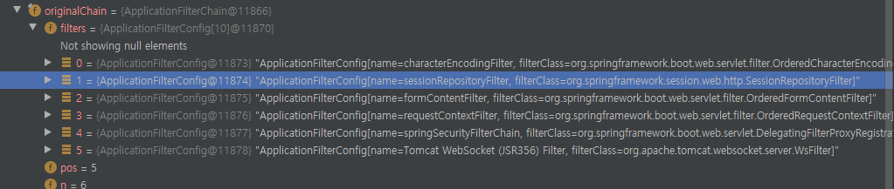
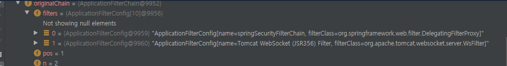

## DelegatingFilterProxy.class

Delegate 란 위임하다는 의미이다. 즉 이 필터는 다른 필터 구현체에게 필터 자신이 해야할일을 전달하는 기능을 수행한다. 이 필터는 기본적으로 서블릿컨테이너에 사용하기 위해 만들어졌다.

서블릿 컨테이너에 필터가 설정이 되면 ApplicationFilterConfig 라는 WAS 의 필터저장소에 저장이 된다. 그리고 책임연쇄 패턴으로 각 필터들이 호출이 되면서 처리가 가능한 필터가 request 를 처리하는 구성이다.

SpringSecurity 와 SpringSession 에서 이 필터를 사용한다.

이슈는 레거시 웹앱을 인증서버의 세션과 클러스터링 될 수 있도록 하는 작업을 하고 있었다.

세션 클러스터링은 스프링세션 모듈 프로젝트를 썼는데, 레거시 웹앱에서 동작하질 않았다.


아래는 스프링 부트 기반의 웹앱이다.



아래는 레거시 웹앱



두 웹앱의 필터 구성에서 차이가 나는 것은 갯수도 있겠지만, 가장 중요한 것은 springSessionRepositoryFilter 라는 필터가 등록되어 있지 않다.

이 필터가 하는 역활을 스프링프레임워크에 httpSession 이 처리될 필터가 동작하기 이전에, 서블릿 컨테이너에서 만들어진 세션을 한번 감싸서 스프링 프레임워크에 최적화된 자체 세션 객체로 wrapping 하는 역할을 한다.

wrapping 은 SessionRepositoryRequestWrapper.class 와 SessionRepositoryResponseWrapper.class 라는 클래스로 감싸진다.  

감싸진 request와 response 는 아래 소스코드를 보면 알겠지만 필터체인을 통해 다음 필터에 감싸진 request와 response 를 전달하게 된다.
  
```java
public class SessionRepositoryFilter<S extends Session> extends OncePerRequestFilter {
    
//...

	@Override
	protected void doFilterInternal(HttpServletRequest request, HttpServletResponse response, FilterChain filterChain)
			throws ServletException, IOException {
		request.setAttribute(SESSION_REPOSITORY_ATTR, this.sessionRepository);

		SessionRepositoryRequestWrapper wrappedRequest = new SessionRepositoryRequestWrapper(request, response);
		SessionRepositoryRequestWrapper wrappedResponse = new SessionRepositoryResponseWrapper(wrappedRequest,
				response);

		try {
			filterChain.doFilter(wrappedRequest, wrappedResponse);
		}
		finally {
			wrappedRequest.commitSession();
		}
	}
}
```
  
즉 이 필터를 도달한 이후의 필터들은 모두 오리지날 Request, Response 가 아닌  SessionRepositoryRequestWrapper 와 SessionRepositoryRequestWrapper 로 상호작용하게 되는 것이다.

SessionRepositoryRequestWrapper 와 SessionRepositoryRequestWrapper 는 오리지날 request와 response 를 감싼다는 것 외에도 몇 가지 기능적인 측면을 제공한다. 

이러한 부분이 가장 도드라지는 클래스는 SessionRepositoryRequestWrapper 이다.

SessionRepositoryRequestWrapper.class 이 클래스는 getSession() 이 호출 될때 SessionRepository.class 를 사용하여 세션을 가져온다.

```java
private final class SessionRepositoryRequestWrapper extends HttpServletRequestWrapper {
        public HttpSessionWrapper getSession(boolean create) {

			HttpSessionWrapper currentSession = getCurrentSession();
			if (currentSession != null) {
				return currentSession;
			}
			S requestedSession = getRequestedSession();
			if (requestedSession != null) {
				if (getAttribute(INVALID_SESSION_ID_ATTR) == null) {
					requestedSession.setLastAccessedTime(Instant.now());
					this.requestedSessionIdValid = true;
					currentSession = new HttpSessionWrapper(requestedSession, getServletContext());
					currentSession.markNotNew();
					setCurrentSession(currentSession);
					return currentSession;
				}
			}
			else {
				// This is an invalid session id. No need to ask again if
				// request.getSession is invoked for the duration of this request
				if (SESSION_LOGGER.isDebugEnabled()) {
					SESSION_LOGGER.debug(
							"No session found by id: Caching result for getSession(false) for this HttpServletRequest.");
				}
				setAttribute(INVALID_SESSION_ID_ATTR, "true");
			}
			if (!create) {
				return null;
			}
			if (SessionRepositoryFilter.this.httpSessionIdResolver instanceof CookieHttpSessionIdResolver
					&& this.response.isCommitted()) {
				throw new IllegalStateException("Cannot create a session after the response has been committed");
			}
			if (SESSION_LOGGER.isDebugEnabled()) {
				SESSION_LOGGER.debug(
						"A new session was created. To help you troubleshoot where the session was created we provided a StackTrace (this is not an error). You can prevent this from appearing by disabling DEBUG logging for "
								+ SESSION_LOGGER_NAME,
						new RuntimeException("For debugging purposes only (not an error)"));
			}
			S session = SessionRepositoryFilter.this.sessionRepository.createSession();
			session.setLastAccessedTime(Instant.now());
			currentSession = new HttpSessionWrapper(session, getServletContext());
			setCurrentSession(currentSession);
			return currentSession;
		}
}

```

SessionRepository 는 세션을 저장하고 조회할수 있는 영속성에 대한 컴포넌트이다. Redis, Jdbc, InMemory 등 여러가지 저장방법을 제공한다. 

다시 스프링 부트 기반의 정상적인 필터 구성으로 돌아가보자


필터의 순서를 보면 springSecurityFilterChain 이라는 필터보다 springSessionRepositoryFilter 가 먼저 동작하게 되어 있는 것을 알수 있다.

springSecurityFilterChain 는 스프링시큐리티에서 사용하는 필터이다. 즉 스프링세션에 의해 wrapping 된 request와 response 를 스프링시큐리티에서 사용하게 된다.

이것이 스프링세션과 스프링시큐리티가 상호작용할 수 있는 메카니즘이다.