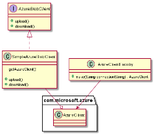
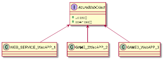
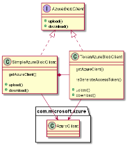

# blob 인증 변경 이슈

우리 회사는 Azure 클라우드에서 개발을 하고 있고, 우리팀의 업무 중 많은 부분에서 Azure Blob Storage 를 사용하고 있다.

마소는 Azure Blob Storage Java SDK 를 제공하고 있는데, 관리가 엉망이라 (문서가 갱신안된다던지, 자바 다른 모듈간의 호환성이슈 라던지 ) 

자체적으로 Azure Blob 을 제어하는 클라이언트 모듈을 만들어서 사용하고 있다.

이 클라이언트는 단순하게 업로드와 다운로드 기능을 제공한다. 

본래는 커넥션 스트링이라 하여 Azure Blob Storage 리소스에 엑세스할수 있는 엑세스 키를 사용해서 처리하는 모듈을 만들어서 오랫동안 잘 사용해왔었다.

문제는 최근 ISMS 인증 심사를 준비하면서, 커넥션 스트링이 각 조직별로 나누어서 사용할수 없이 단 2개만 존재하는 키라서 보안적합성에서 이슈가 되었다.

그래서 서비스 자격증명(Service Principal) 이라고 하는, Azure 리소스를 사용하는 클라이언트를 나타내는 계정에 이 Azure Blob Storage 를 사용할수 있도록 보안 가이드가 내려졌다.

당연하겠지만 서비스 자격증명은 일종의 계정을 만들고 이 계정에 자격부여 권한을 넣는 개념이기에 각 팀 별로 계정을 만들어서 사용하게 되었다.

서비스자격증명이 Oauth2 에서 Client 개념과 같다고 보면 되는데, 실제로 Azure AD 에서 엑세스 토큰을 발급받아서 Azure 리소스에 접근하는 Oauth2 인증 흐름을 사용한다.

배경은 이러이러 한데, 문제는 엑세스 토큰에서 발생했다.

Azure AD 에서 엑세스 토큰을 받는 것까지야 뭐 문제 없었는데, 이 엑세스 토큰이 1시간짜리 휘발성용으로 발행이 되는 것이 이슈였다. 

1시간이 지나면 사용할수 없는 것이다. 기존 클라이언트는 스프링 빈에 등록해두고 갱신 없이 전역적으로 사용하는 형태였는데, 1시간 이후에는 문제가 발생할 소지가 있었다.

아래는 기존 모듈의 구성이다.

 
 
 
이 문제에 대해서 스프링 빈에 등록해서 전역적으로 사용하지말고 사용이 필요할때마다 메소드 내에서 클라이언트를 생성해서 써도 되지 않냐는 단순한 얘기도 나왔었는데, 이 경우 아래의 문제에 봉착한다.

 
 - Http Request 당 AD 토큰을 발급받는 것이 상식적인 행위인가? 최악의 경우 몇 천건의 토큰이 무의미하게 만들어질수 있다.
 
 - 운영중인 서비스들의 코드를 모두 바꾸어야 한다.
 
그래서 기존 모듈의 버전을 업데이트 하는 식으로 접근을 하기로 했다.

 
 엑세스 토큰에는 리프레시 토큰도 없었고, 엑세스 토큰을 연장하는 최장 시간이 9시간 뿐이었다.

1회성 휘발토큰으로 발급되는 것으로 생각되는데, 인프라 구성과 인증 메카니즘 파악에는 시간이 많이 걸리는 상황이어서 머리가 아팠다.

우선 간단하게는 DB커넥션풀 과 같은 메카니즘으로 접근을 했다. 컨셉은 1시간이 되기 전, 음.. 예를 들어 50분마다 AD토큰을 미리 발급받아서, 클라이언트를 교체하는 개념이다.

이 아이디어는 기존 구현체인 SimpleAzureBlobClient  에서 getAzureClient() 메소드를 사용하는 것을 포커스로 두고 진행했다. 모든 upload 와 download 로직에서 getAzureClient() 메소드를 사용하고 있다.

그래서 이 getAzureClient() 메소드에서 50분마다 갱신된 AD토큰이 만들어진 AzureClient 를 반환할수만 있다면 만사 OK인것이다. 

 
TokenAzureBlobClient 이라는 구현체를 새로이 만들었고, AD토큰을 갱신하는  TokenAzureBlobClient#reGenerateAccessToken() 메소드를 만들었다.

그리고 upload와 download는 기존 SimpleAzureBlobClient 의 메소드를 그대로 사용하도록 했다.

모든 것은 getAzureClient() 와 reGenerateAccessToken() 를 연결하는 용도로만 한 것이다. 

바뀐 것이라고는 인증 체계가 바뀌었으니 이런 문제가 생겼으니 똑같이 인증체계만 바꿀수있게 했다.
 
 