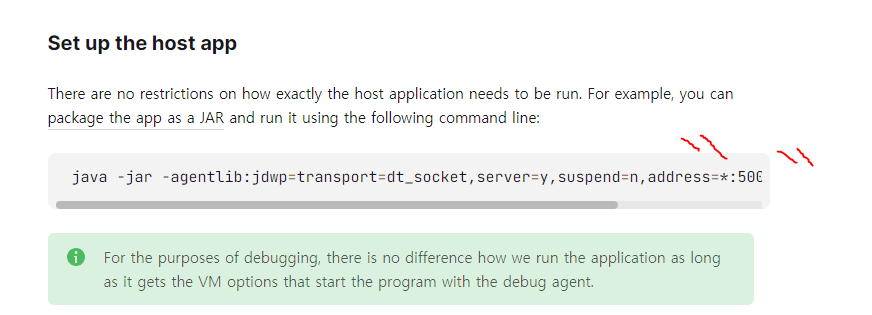
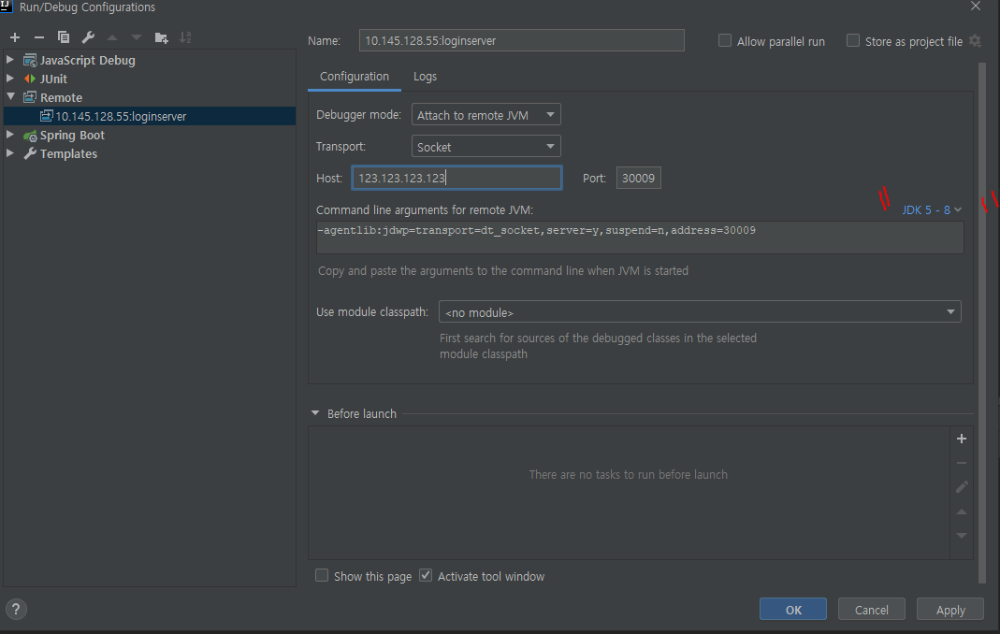

## 자바 웹앱 원격 디버깅

세션 클러스터링 된 웹앱들에서 로그인 세션이 풀리는 현상이 있었다.

웃긴 것은 다른 환경에서는 정상적이지만, 특정 stage 의 환경에 배포된 웹앱들에서만 이슈가 발생했다.

제어가 가능한 부분에 debug 로그를 심어서 모니터링을 해보고자 했는데, 한계가 있었다.

확인해보고 싶은 부분은 스프링 시큐리티 필터 쪽에 디버그를 하고 싶은데, debug 로그를 심을수가 없기 때문이었다.

이런 이슈를 팀 내에 공유를 했더니, 생각치도 못하게 다른 팀원 분이 원격 디버깅이란 아이디어를 애기해주었다.

이것을 힌트 삼아 알아보니 인텔리J에서 원격 디버깅이 가능한 방법이 있엇다.

https://www.jetbrains.com/help/idea/tutorial-remote-debug.html#bc3b4bca

위 문서를 참고 해서 시도하면 된다. 주의할 것은 위 가이드에서는 JDK9 이상 버전의 syntax 로 설정 방법이 가이드 되어 있어서 고생을 했다.

이슈가 있는 서버에는 JDK8 기반으로 구성이 되어있기 때문.



JDK 9 기반은 아래와 같다.

```
java -jar -agentlib:jdwp=transport=dt_socket,server=y,suspend=n,address=*:5005 remote-debug.jar
```

JDK 8 기반에서는 address 속성에 * 와일드 카드를 지원하지 않는다.

```
java -jar -agentlib:jdwp=transport=dt_socket,server=y,suspend=n,address=5005 remote-debug.jar
``` 

이것 때문에 고생을 좀 했다.

재밌는 것은 인텔리J에서 원격 디버깅할 호스트에 대한 설정을 하는 메뉴에서, 원격 디버깅 호스트에 설정해야할 스크립트도 만들어준다.

아래 캡처를 보면 그냥 복,붙을 하면 된다. 심지어 JDK9 인지, JDK8 기반인지에 따라 스크립트 생성이 바뀐다.



